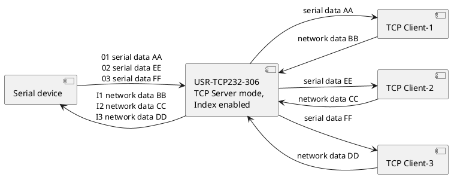
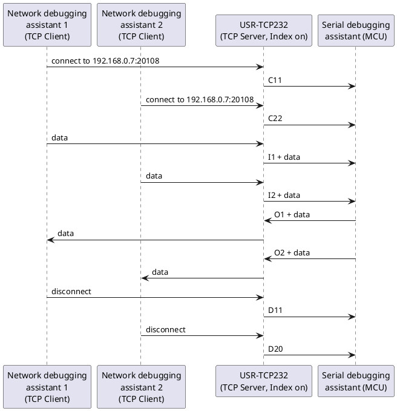
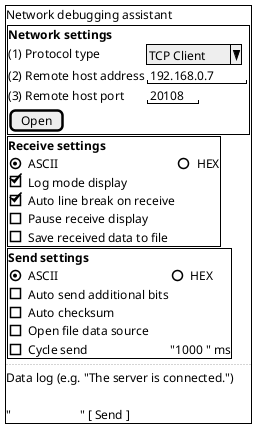

# Index Function Example

## 1. Software to Download

- User manual: <https://www.usr.cn/Download/920.html>
- Setup software: <http://www.usr.cn/Download/257.html>
- Test software: <http://www.usr.cn/Download/27.html>
- Virtual serial port software: <http://www.usr.cn/Download/31.html>

## 2. Default Device Parameters

Table 1

| Item | Content |
| --- | --- |
| User name | admin |
| Password | admin |
| Module IP address | 192.168.0.7 |
| Module subnet mask | 255.255.255.0 |
| Module default gateway | 192.168.0.1 |
| Work mode | TCP Client |
| Local port | 20108 |
| Target IP | 192.168.0.201 |
| Serial baud rate | 115200 |
| Serial parameters | None/8/1 |
| Target port | 8234 |

## 3. Functional Block Diagram

The USR-TCP232-306 is shown in TCP Server mode with Index enabled. The serial device exchanges `I`/`O` framed data with the module over the serial port, and the module exchanges plain data with up to three TCP clients over the network port.



## 4. Setup Steps

1. Connect the 302 (short for USR-TCP232-302) to the computer with a serial cable (or a USB-to-RS232 serial cable), and connect the 302's Ethernet port to the PC's Ethernet port with a network cable. After checking that the hardware connections are correct, connect the 5 V power adapter to power the 302. Check that the 302's Ethernet port indicators are normal: the green light is steady on and the yellow light flashes.

2. Following the path Control Panel -- Network and Internet -- Network and Sharing Center, find the "Windows Firewall" and "Change adapter settings" options. Turn off the firewall and disable network adapters not used in this test. Also turn off the computer's antivirus software.

    ```plantuml
    @startsalt
    {+
      Customize Settings
      Windows Defender Firewall > Customize Settings
      { File(F) | Edit(E) | View(V) | Tools(T) }
      ..
      <b>Customize settings for each type of network
      You can modify the firewall settings for each type of network that you use.
      ..
      <b>Private network settings
      ( ) Turn on Windows Defender Firewall
      [ ] Block all incoming connections, including those in the list of allowed apps
      [ ] Notify me when Windows Defender Firewall blocks a new app
      (X) Turn off Windows Defender Firewall (not recommended)
      ..
      <b>Public network settings
      ( ) Turn on Windows Defender Firewall
      [ ] Block all incoming connections, including those in the list of allowed apps
      [ ] Notify me when Windows Defender Firewall blocks a new app
      (X) Turn off Windows Defender Firewall (not recommended)
      .
      { [OK] | [Cancel] }
    }
    @endsalt
    ```

3. Set a static IP on the computer in the same network segment as the 302's IP (see Table 1 for the 302's default parameters).

    ```plantuml
    @startsalt
    {+
      Internet Protocol Version 4 (TCP/IPv4) Properties
      {/ <b>General }
      You can get IP settings assigned automatically if your network supports this capability. Otherwise, you need to ask your network administrator for the appropriate IP settings.
      ( ) Obtain an IP address automatically
      (X) Use the following IP address:
      {
        IP address: | "192 . 168 . 0 . 201 "
        Subnet mask: | "255 . 255 . 255 . 0 "
        Default gateway: | "192 . 168 . 0 . 1 "
      }
      ( ) Obtain DNS server address automatically
      (X) Use the following DNS server addresses:
      {
        Preferred DNS server: | "192 . 168 . 0 . 1 "
        Alternate DNS server: | "   .   .   .   "
      }
      [ ] Validate settings upon exit | [Advanced...]
      { [OK] | [Cancel] }
    }
    @endsalt
    ```

    (In the original screenshot, the path to this dialog is: Local Area Connection → Properties → Internet Protocol Version 4 (TCP/IPv4) → Properties.)

4. Download the newer M0 setup software, V2.2.6.0, from the official website.

    Click "Search devices". When the 302 appears in the search list, click the discovered device. After setting the serial parameters, select the work mode **TCP Server**, set the port to **20108**, enable the **Index** function, and open up the number of connections. After setting all parameters, click Save parameters.

    ```plantuml
    @startsalt
    {+
      USR-M0 V2.2.6.0
      { File | Language | Help }
      ..
      {
        {/ <b>Operate via network | Operate via serial port }
        {#
          Device IP | Device name | MAC address | Version
          192.168.0.7 | USR-TCP232-306 | D4 AD 20 47 45 C1 | 4300
        }
        [ Search devices ]
        ..
        {+
          Operation log
          Data sent
          Data sent
          Click a discovered device to read its parameters; right-click the device list for more functions
          Read [ Mac : D4 AD 20 47 45 C1 ]
          Data sent
          Read complete
        }
        ==
        {+
          <b>Basic settings (items without ★ are normally left at default)
          {
            IP address type ★ | ^Static IP^ | HTTP server port | "80 "
            Module static IP ★ | "192.168.0.7 " | User name | "admin "
            Subnet mask ★ | "255.255.255.0 " | Password | "admin "
            Gateway ★ | "192.168.0.1 " | Device name | "USR-TCP23 "
            DNS address | "208.67.222.222 " | [X] Index  <&arrow-left> <b>Enable Index
            Timeout restart time (s) | "3600 " | [ ] Reset
            [ ] Clear cached data | [ ] Serial port settings | [X] Link
            . | . | [X] RFC2217
          }
        }
        {+
          <b>Port settings
          {
            Parity/Data/Stop | ^NONE^ ^8^ ^1^ | Serial baud rate | ^115200^
            Module work mode | ^TCP Server^ | Local port | "20108 "
            Target IP/domain | "192.168.0.201 " (disabled) | Remote port | "8234 "
            Short connection time | "3 " | TCP Server connection count | ^4^  <&arrow-left> <b>Open connection count
            Serial packing timeout | "0 " | Serial packing length | "400 "
            [ ] Enable short connection
            [X] TCP Server - kick old connection
            [ ] UDP data source check
          }
        }
        [ Save parameters ] | [ Data debug ]
      }
    }
    @endsalt
    ```

5. Open two network debugging assistants. In each, select TCP Client, enter 192.168.0.7 and port 20108, and open the connection, to simulate two clients connecting to the 302.

    Establish the clients one at a time and remember the order in which the connections were made. The serial port then receives:

    - `C11`: "C" means connected, the first "1" means client No. 1, and the second "1" means 1 client is now connected.
    - `C22`: "C" means connected, the first "2" means client No. 2, and the second "2" means 2 clients are now connected.

6. Send data from each of the two clients.

    The letter "I" means input (received).

    - `I1` means the data came from client No. 1.
    - `I2` means the data came from client No. 2.

    (After the server receives data, it outputs `'I' 'N' data……` to the user's MCU through the server's serial port. "I" means received, and N indicates which Index the data came from. N ranges from hexadecimal "31" to "40".)

7. Data can be sent from the serial side to a specific client.

    The letter "O" means output to a specified client.

    - `O1` sends data to client No. 1.
    - `O2` sends data to client No. 2. (The original reads "client 21", which appears to be a typo.)

    (The user's MCU writes `'O' 'N' data……` through the server's serial port. "O" means output, and N indicates which Index to send the data with. The 304 server passes the data received on the serial port to the network client. Note that O means the ASCII character 'O' and N also means a character, such as '1' or '2'.)

8. After client No. 1 is disconnected, the serial port receives `D11`; after client No. 2 is then disconnected, the serial port receives `D20`.

    The letter "D" means disconnected.

    - `D11`: "D1" means client No. 1 disconnected, and the second "1" means 1 client is still connected.
    - `D20`: "D2" means client No. 2 disconnected, and the "0" means 0 clients are still connected.

### Message sequence summary

The original shows screenshots of one serial debugging assistant and two network debugging assistants for steps 5 to 8. The screenshot text is too small to read reliably, so this sequence diagram summarizes the messages described in the text.



The window layout of the network debugging assistant shown in the screenshots:



## 5. Troubleshooting

### Attachment 1

**What if the 304 device is connected directly to the computer and the M0 software cannot find it?**

1. After connecting the network cable, check whether the Ethernet port indicators are normal. If not, try replacing the network cable or the power supply.
2. Check that the device's power supply is stable. You can measure the supply voltage with a multimeter.
3. Check that the computer's firewall, antivirus software, and extra network adapters are all turned off.
4. Check that the IP set on the computer is in the same network segment as the 304 device. You can use ping to check whether the device responds: press WIN+R, then ping the 304's IP (here 192.168.0.7). If the ping fails, check the network cable and the computer's network segment configuration.

### Attachment 2

**What if the 304 is connected to the computer through RS485-to-USB and data cannot be transferred on the computer?**

1. On the 304's RS485 interface, A is positive and B is negative. Check that the wiring order is correct, and use a multimeter to test continuity.
2. In Device Manager, check under Ports whether a COM port has been created and whether the computer has a serial port driver. If an exclamation mark appears, download a driver utility (such as Driver Wizard or Driver Genius) to repair it yourself.
3. Check whether the RS485 cable is broken, and use a multimeter to test the wire for continuity.
4. RS485 transmits data in one direction at a time. Simultaneous two-way transmission is not allowed.
5. The 304's serial parameters must match the serial parameters opened in the serial debugging assistant, including baud rate, data bits, stop bits, and parity.

### Attachment 3

**What if the 304 cannot establish a TCP connection with the network-side debugging assistant?**

1. When the 304 works as a TCP server, turn off the computer's firewall and disable other network adapters.
2. When the 304 works as a TCP server, set its local port to 1-65535. In the computer software, set TCP client, enter the 304 device's own IP address as the remote server address, and enter the 304's local port number as the remote port number.
3. When the 304 works as a TCP client, enter the computer's own IP as the remote server address/domain and the local port number set in the computer software as the remote port number. Set the computer software to TCP server with a local port number of 1-65535.
4. Try a different network-side debugging assistant. For example, you can search for and download the "Yehuo (野火) debugging assistant" to test.

---

Author: Shi Wei
