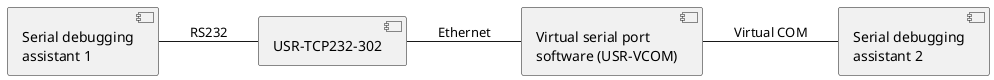
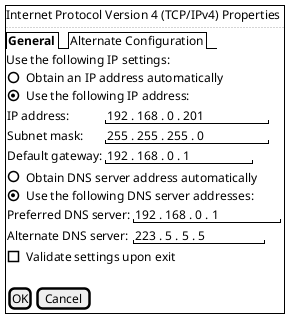
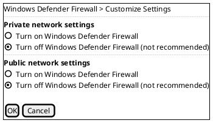
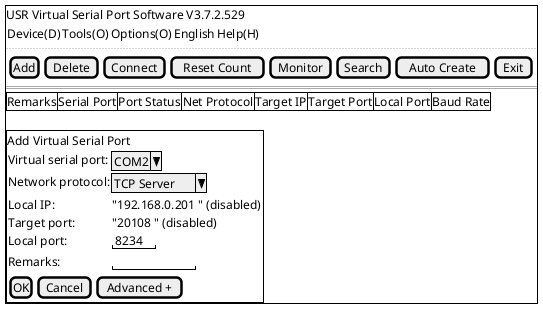
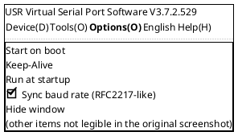
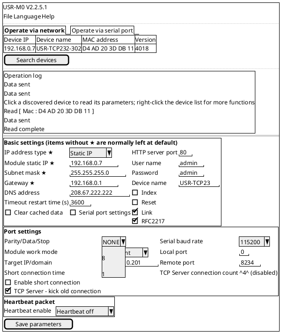
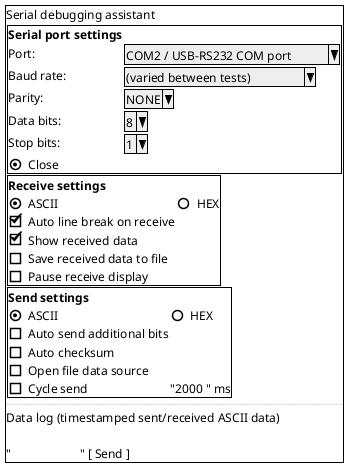

# RFC2217-like Function Example

## 1. Downloads

- USR-TCP232-302/304/306 user manual: <https://www.usr.cn/Download/920.html>
- USR-TCP232-302/304/306 specification: <https://www.usr.cn/Download/405.html>
- USR-TCP232-302/304/306 AT command set: <https://www.usr.cn/Download/1255.html>
- M0 series setup software: <https://www.usr.cn/Download/257.html>
- Combined network / serial debugging assistant: <https://www.usr.cn/Download/27.html>
- USR virtual serial port software V3.7.2.529: <https://www.usr.cn/Download/31.html>
- USR virtual serial port software V5.0.1: <https://www.usr.cn/Download/924.html>

## 2. Hardware Connection

### 2.1 Required Items

- USR-TCP232-302 × 1
- 5 V power adapter × 1
- USB-RS232 serial cable × 1
- CAT5e Ethernet cable × 1
- Laptop × 1

### 2.2 Hardware Connection

Connect the RS232 port of the USR-TCP232-302 to a USB port on the computer using the USB-RS232 serial cable. Connect the Ethernet port directly to the computer with the Ethernet cable, then power the product with the 5 V power adapter.

Diagram:

## 3. Product Parameter Settings

### 3.1 Computer Environment Settings

Open the Control Panel, keep only the local area connection network adapter enabled and disable all other adapters. Right-click the local area connection, open Properties, find IPv4 and set a static IP: IP address 192.168.0.201, subnet mask 255.255.255.0, gateway 192.168.0.1. (The factory default IP of the USR-TCP232-304 is 192.168.0.7; the computer must be on the same subnet as the device when configuring it.)

Turn off the computer's firewall and antivirus software.

### 3.2 Virtual Serial Port Settings

Open virtual serial port software V3.

Create a virtual serial port COM2 with network protocol TCP Server and local port 8234, then click OK. The software begins listening on the network.

Enable the sync baud rate (RFC2217-like) option in the virtual serial port software's Options menu.

### 3.3 USR-TCP232-302 Parameter Settings

Open the M0 software on the computer and click Search. After the device is found, double-click its MAC address; the USR-TCP232-302 parameters appear on the right.

Keep the USR-TCP232-302 IP at the factory default of 192.168.0.7. Set the module work mode to TCP Client, local port to 0, target IP/domain to 192.168.0.201, and remote port to 8234. Disable short connection and enable the RFC2217-like function. Save the parameters.

> **Note:** RFC2217-like is a simplified version of the RFC2217 protocol. Used together with the virtual serial port software, it lets the serial parameters of the 30X (baud rate, data bits, parity, etc.) be changed dynamically, so the 30X can communicate with devices whose serial parameters change. After this function is enabled, also enable the RFC2217-like function in the USR-VCOM virtual serial port software. The serial baud rate of the application software on the computer and the serial baud rate of the 30X then automatically match each other, with no need to pay attention to the serial baud rate setting!!!

## 4. Function Debugging

### 4.1 Function Debugging

Open two serial debugging assistants, one using the virtual serial port COM2 and the other using the COM port of the USB-to-RS232 converter. Change the baud rate in the serial debugging assistants to different values and send data to each other as a test; data is exchanged successfully.

### 4.2 Debugging Screenshots

The original shows four screenshots of the two serial debugging assistant windows (pairs of windows at different baud rates) exchanging data. The text in them is too small to read reliably; the layout common to every window is shown below.

---

Author: Yin Congxin  Written: 2024-04-26
Reviewer: Yin Congxin  Reviewed: 2024-04-28
Revision: V1.0  Revision notes: First draft
