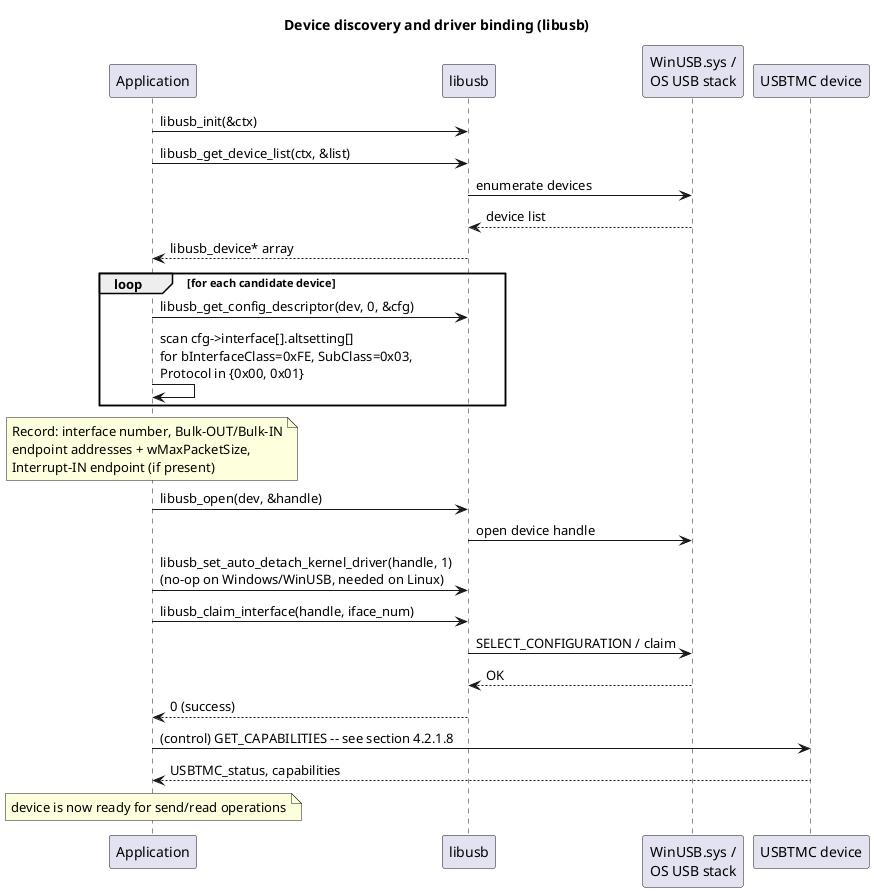
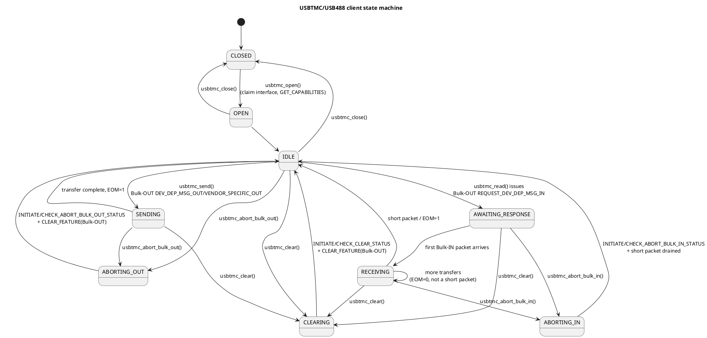
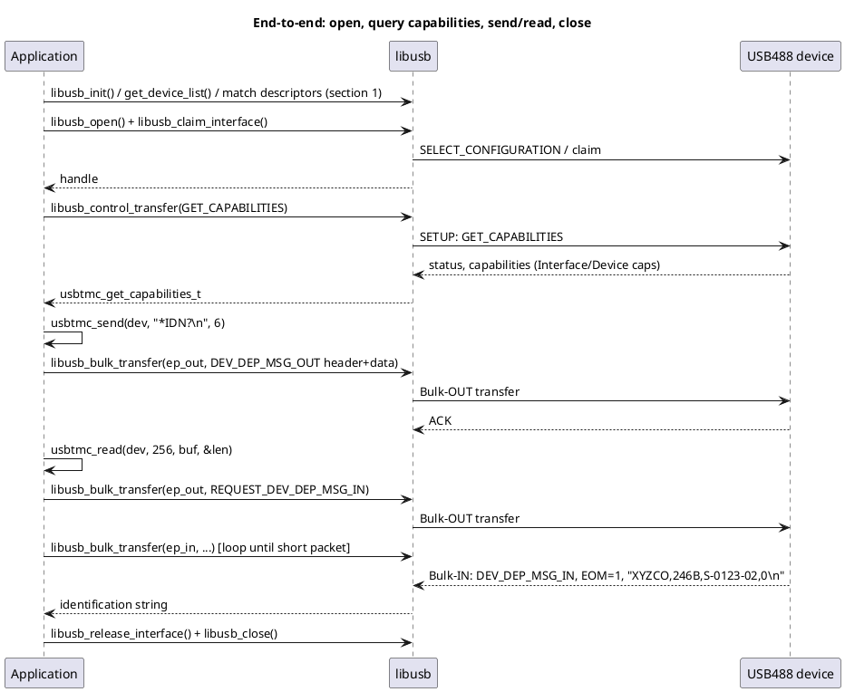

<a id="usbtmc-usbtmc-usb488-implementation-guide-libusb-winusb"></a>
# USBTMC / USBTMC-USB488 Implementation Guide — libusb + WinUSB

This guide turns the normative content in [`USBTMC_1_00.md`](USBTMC_1_00.md) and [`USBTMC_usb488_subclass_1_00.md`](USBTMC_usb488_subclass_1_00.md) into an implementation-ready reference: how to find and bind a USBTMC device with **libusb** (using **WinUSB.sys** as the Windows kernel-mode backend), the exact wire structures, a consolidated control-request table, and a client state machine with pseudocode for every defined operation.

> **Relationship between libusb and WinUSB.** On Windows, libusb 1.0 talks to devices through one of a few kernel drivers; the recommended one for a vendor/class device like USBTMC is **WinUSB.sys**. So "libusb + WinUSB" is not two separate stacks — libusb is the cross-platform API your application calls, and WinUSB is the driver libusb loads underneath it on Windows (on Linux/macOS libusb talks directly to usbfs/IOKit). Everything below is written against the libusb 1.0 API; a short appendix maps each call to the raw `WinUsb_*` API for anyone who wants to skip libusb on Windows and call WinUSB directly.

<a id="table-of-contents"></a>
## Table of Contents

- [1 Device discovery and driver binding](#1-device-discovery-and-driver-binding)
  - [1.1 Descriptor matching rules](#1-1-descriptor-matching-rules)
  - [1.2 WinUSB driver binding on Windows](#1-2-winusb-driver-binding-on-windows)
  - [1.3 libusb open/claim sequence](#1-3-libusb-open-claim-sequence)
- [2 Endpoint role summary](#2-endpoint-role-summary)
- [3 Wire formats (C structs)](#3-wire-formats-c-structs)
- [4 Control request quick reference](#4-control-request-quick-reference)
- [5 libusb ⇄ WinUSB API cheat sheet](#5-libusb-winusb-api-cheat-sheet)
- [6 Client state machine](#6-client-state-machine)
- [7 Core operations — pseudocode](#7-core-operations-pseudocode)
  - [7.1 Open / capabilities / close](#7-1-open-capabilities-close)
  - [7.2 Send a device-dependent command message](#7-2-send-a-device-dependent-command-message)
  - [7.3 Request and read a response](#7-3-request-and-read-a-response)
  - [7.4 Abort Bulk-OUT / Bulk-IN](#7-4-abort-bulk-out-bulk-in)
  - [7.5 Clear (INITIATE_CLEAR / CHECK_CLEAR_STATUS)](#7-5-clear-initiate-clear-check-clear-status)
  - [7.6 USB488: status byte, trigger, local/remote](#7-6-usb488-status-byte-trigger-local-remote)
  - [7.7 SRQ listener (async Interrupt-IN)](#7-7-srq-listener-async-interrupt-in)
- [8 bTag management and concurrency rules](#8-btag-management-and-concurrency-rules)
- [9 Buffer sizing, alignment, and timeouts](#9-buffer-sizing-alignment-and-timeouts)
- [10 Error recovery cheat sheet](#10-error-recovery-cheat-sheet)
- [11 End-to-end worked example](#11-end-to-end-worked-example)

## Table of Figures

1. [Device discovery and driver binding (libusb)](#fig-1)
2. [USBTMC/USB488 client state machine](#fig-2)
3. [End-to-end: open, query capabilities, send/read, close](#fig-3)

---

<a id="1-device-discovery-and-driver-binding"></a>
## 1 Device discovery and driver binding

<a id="1-1-descriptor-matching-rules"></a>
### 1.1 Descriptor matching rules

A USBTMC interface is identified purely from its **interface descriptor** (USBTMC spec §5.5, Table 43/44) — never bind based on VID/PID class fields at the device level (`bDeviceClass` is required to be `0x00`, see USBTMC Table 40):

| Field | Value | Meaning |
|---|---|---|
| `bInterfaceClass` | `0xFE` | "Application Specific" class |
| `bInterfaceSubClass` | `0x03` | Test and Measurement |
| `bInterfaceProtocol` | `0x00` | Plain USBTMC (no subclass) |
| `bInterfaceProtocol` | `0x01` | USBTMC-USB488 (implement §4.3 subclass requests too) |

Required endpoints per USBTMC §5.6 / USB488 §5.1.1–5.1.2:

- Exactly one Bulk-OUT endpoint.
- Exactly one Bulk-IN endpoint, `wMaxPacketSize` bits 10…0 a multiple of 4.
- At most one Interrupt-IN endpoint for `bInterfaceProtocol=0x00`; **required** for `bInterfaceProtocol=0x01` if the device is SR1-capable or a 488.2 USB488 interface (GET_CAPABILITIES `USB488DeviceCapabilities.D2`).

<a id="1-2-winusb-driver-binding-on-windows"></a>
### 1.2 WinUSB driver binding on Windows

WinUSB.sys will only bind to the device if Windows is told to use it. Two options, both compatible with libusb:

1. **Microsoft OS 2.0 / WCID descriptors (recommended for new firmware).** The device exposes a Microsoft OS String Descriptor (index 0xEE) plus an OS Feature descriptor declaring the compatible ID `"WINUSB"`. Windows 8+ then binds WinUSB.sys automatically with no INF install — this is what most modern USBTMC instruments and libusb-based tools (e.g. Zadig-free flows) use.
2. **A signed INF associating the device's VID/PID (and optionally interface number) with WinUSB.sys.** Needed for older firmware or when the device also exposes other interfaces (e.g. a composite device with a CDC debug interface) that must keep their own driver. Tools like Zadig generate this INF for development; production installers should ship a proper WDF co-installer/INF instead.

Either way, once WinUSB.sys owns the interface, libusb's Windows backend (`windows_winusb.c`) talks to it transparently — `libusb_open()`/`libusb_claim_interface()` work exactly as on Linux/macOS.

<a id="1-3-libusb-open-claim-sequence"></a>
### 1.3 libusb open/claim sequence

<a id="fig-1"></a>


---

<a id="2-endpoint-role-summary"></a>
## 2 Endpoint role summary

| Endpoint | Direction | Transfer type | Role | libusb call |
|---|---|---|---|---|
| Endpoint 0 (control) | bidirectional | Control | Standard requests, USBTMC class requests (§4.2), USB488 subclass requests (§4.3) | `libusb_control_transfer()` |
| Bulk-OUT | Host→device | Bulk | USBTMC command messages: `DEV_DEP_MSG_OUT`, `REQUEST_DEV_DEP_MSG_IN`, `VENDOR_SPECIFIC_OUT`, `REQUEST_VENDOR_SPECIFIC_IN`, USB488 `TRIGGER` | `libusb_bulk_transfer()` |
| Bulk-IN | Device→Host | Bulk | USBTMC response messages: `DEV_DEP_MSG_IN`, `VENDOR_SPECIFIC_IN` | `libusb_bulk_transfer()` |
| Interrupt-IN (optional/required) | Device→Host | Interrupt | Notifications; for USB488, the Status Byte (SRQ push or `READ_STATUS_BYTE` echo) | `libusb_interrupt_transfer()` (polling) or async `libusb_fill_interrupt_transfer()` + `libusb_submit_transfer()` |

Only Bulk-OUT and Bulk-IN carry USBTMC message framing (the 12-byte headers in section 3). The control endpoint carries raw class-request setup packets and fixed-size response structs — no USBTMC/Bulk-IN header framing there.

---

<a id="3-wire-formats-c-structs"></a>
## 3 Wire formats (C structs)

All multi-byte integer fields in USBTMC/USB488 are **little-endian on the wire** (matches x86/x64 and ARM little-endian hosts directly; byte-swap explicitly on big-endian hosts). All structs below are the exact 12-byte headers or fixed-size control responses defined in the two specs — pack them with no padding.

```c
#include <stdint.h>

#pragma pack(push, 1)

/* ---- MsgID values (USBTMC Table 2, USB488 Table 1) ---- */
enum usbtmc_msgid {
    USBTMC_MSGID_DEV_DEP_MSG_OUT            = 1,   /* OUT */
    USBTMC_MSGID_REQUEST_DEV_DEP_MSG_IN     = 2,   /* OUT */
    USBTMC_MSGID_DEV_DEP_MSG_IN             = 2,   /* IN  */
    USBTMC_MSGID_VENDOR_SPECIFIC_OUT        = 126, /* OUT */
    USBTMC_MSGID_REQUEST_VENDOR_SPECIFIC_IN = 127, /* OUT */
    USBTMC_MSGID_VENDOR_SPECIFIC_IN         = 127, /* IN  */
    USB488_MSGID_TRIGGER                    = 128, /* OUT, USB488 only */
};

/* ---- USBTMC_status values (USBTMC Table 16, USB488 Table 10) ---- */
enum usbtmc_status {
    USBTMC_STATUS_SUCCESS                  = 0x01,
    USBTMC_STATUS_PENDING                  = 0x02,
    USBTMC_STATUS_FAILED                   = 0x80,
    USBTMC_STATUS_TRANSFER_NOT_IN_PROGRESS = 0x81,
    USBTMC_STATUS_SPLIT_NOT_IN_PROGRESS    = 0x82,
    USBTMC_STATUS_SPLIT_IN_PROGRESS        = 0x83,
    USB488_STATUS_INTERRUPT_IN_BUSY        = 0x20,
};

/* ---- Bulk-OUT Header, 12 bytes (USBTMC Table 1) ---- */
typedef struct {
    uint8_t MsgID;
    uint8_t bTag;             /* 1..255, must differ from the previous bTag */
    uint8_t bTagInverse;      /* one's complement of bTag */
    uint8_t Reserved0;        /* must be 0x00 */
    uint8_t CommandSpecific[8];
} usbtmc_bulk_out_header_t;

/* CommandSpecific for DEV_DEP_MSG_OUT / VENDOR_SPECIFIC_OUT (Table 3 / Table 5) */
typedef struct {
    uint32_t TransferSize;         /* little-endian, > 0 */
    uint8_t  bmTransferAttributes; /* bit0 = EOM (DEV_DEP_MSG_OUT only; ignored/0 for VENDOR_SPECIFIC_OUT) */
    uint8_t  Reserved[3];
} usbtmc_out_body_t;

/* CommandSpecific for REQUEST_DEV_DEP_MSG_IN / REQUEST_VENDOR_SPECIFIC_IN (Table 4 / Table 6) */
typedef struct {
    uint32_t TransferSize;         /* max response bytes requested, > 0 */
    uint8_t  bmTransferAttributes; /* bit1 = TermCharEnabled (DEV_DEP only) */
    uint8_t  TermChar;
    uint8_t  Reserved[2];
} usbtmc_request_in_body_t;

/* CommandSpecific for USB488 TRIGGER (Table 2 of USB488 spec): Reserved[8] = 0x00 */

/* ---- Bulk-IN Header, 12 bytes (USBTMC Table 8) ---- */
typedef struct {
    uint8_t MsgID;
    uint8_t bTag;              /* must match the bTag that requested this response */
    uint8_t bTagInverse;
    uint8_t Reserved0;
    uint8_t ResponseSpecific[8];
} usbtmc_bulk_in_header_t;

/* ResponseSpecific for DEV_DEP_MSG_IN / VENDOR_SPECIFIC_IN (Table 9 / Table 10) */
typedef struct {
    uint32_t TransferSize;
    uint8_t  bmTransferAttributes; /* bit0=EOM, bit1=TermChar matched (DEV_DEP_MSG_IN only) */
    uint8_t  Reserved[3];
} usbtmc_in_body_t;

/* ---- GET_CAPABILITIES response, 24 bytes (USBTMC Table 37 + USB488 Table 8 extension) ---- */
typedef struct {
    uint8_t  USBTMC_status;
    uint8_t  Reserved0;
    uint16_t bcdUSBTMC;
    uint8_t  USBTMCInterfaceCapabilities; /* D2=IndicatorPulse D1=talk-only D0=listen-only */
    uint8_t  USBTMCDeviceCapabilities;    /* D0=TermChar supported */
    uint8_t  Reserved1[6];
    /* --- USB488 extension begins at offset 12 when bInterfaceProtocol=0x01 --- */
    uint16_t bcdUSB488;
    uint8_t  USB488InterfaceCapabilities; /* D2=488.2 D1=REN/GTL/LLO D0=TRIGGER */
    uint8_t  USB488DeviceCapabilities;    /* D3=SCPI D2=SR1 D1=RL1 D0=DT1 */
    uint8_t  Reserved2[8];
} usbtmc_get_capabilities_t;

/* ---- Interrupt-IN notification, 2+ bytes (USBTMC Table 13 / USB488 Table 6/7) ---- */
typedef struct {
    uint8_t bNotify1; /* D7=1, D6..D0 = bTag (USB488 status-byte notifications) */
    uint8_t bNotify2; /* IEEE 488 Status Byte for USB488; vendor/subclass defined otherwise */
} usbtmc_interrupt_in_t;

#pragma pack(pop)
```

---

<a id="4-control-request-quick-reference"></a>
## 4 Control request quick reference

All USBTMC/USB488 class requests are **IN**-direction control transfers (`bmRequestType` bit 7 = 1): the device always returns at least a 1-byte `USBTMC_status`. `CLEAR_FEATURE` is the one **standard** (not class) request you need, used for endpoint-Halt recovery.

| Request | bmRequestType | bRequest | wValue | wIndex | wLength | Response layout | Spec §/Table |
|---|---|---|---|---|---|---|---|
| `CLEAR_FEATURE` (ENDPOINT_HALT) | `0x02` (OUT, Standard, Endpoint) | `0x01` | `0x0000` | endpoint address | `0` | (no data stage) | USBTMC §4.1.1 |
| `INITIATE_ABORT_BULK_OUT` | `0xA2` (IN, Class, Endpoint) | `1` | bTag to abort (D7..0) | Bulk-OUT endpoint | `2` | `status, bTag` | USBTMC §4.2.1.2, Table 18/19 |
| `CHECK_ABORT_BULK_OUT_STATUS` | `0xA2` | `2` | `0x0000` | Bulk-OUT endpoint | `8` | `status, reserved[3], NBYTES_RXD(u32)` | USBTMC §4.2.1.3, Table 21/22 |
| `INITIATE_ABORT_BULK_IN` | `0xA2` (IN, Class, Endpoint) | `3` | bTag to abort | Bulk-IN endpoint | `2` | `status, bTag` | USBTMC §4.2.1.4, Table 24/25 |
| `CHECK_ABORT_BULK_IN_STATUS` | `0xA2` | `4` | `0x0000` | Bulk-IN endpoint | `8` | `status, bmAbortBulkIn, reserved[2], NBYTES_TXD(u32)` | USBTMC §4.2.1.5, Table 27/28 |
| `INITIATE_CLEAR` | `0xA1` (IN, Class, Interface) | `5` | `0x0000` | interface | `1` | `status` | USBTMC §4.2.1.6, Table 30/31 |
| `CHECK_CLEAR_STATUS` | `0xA1` | `6` | `0x0000` | interface | `2` | `status, bmClear` | USBTMC §4.2.1.7, Table 33/34 |
| `GET_CAPABILITIES` | `0xA1` | `7` | `0x0000` | interface | `0x18` (24) | see `usbtmc_get_capabilities_t` | USBTMC §4.2.1.8, Table 36/37; USB488 §4.2.2, Table 8 |
| `INDICATOR_PULSE` (optional) | `0xA1` | `64` (`0x40`) | `0x0000` | interface | `1` | `status` | USBTMC §4.2.1.9, Table 38/39 |
| `READ_STATUS_BYTE` (USB488) | `0xA1` | `128` (`0x80`) | bTag, `2<=bTag<=127` (D6..0) | interface | `3` | `status, bTag, StatusByte` (no Interrupt-IN) or `status, bTag, 0x00` (Interrupt-IN present — Status Byte delivered there instead) | USB488 §4.3.1, Table 11/12/13 |
| `REN_CONTROL` (USB488, optional) | `0xA1` | `160` (`0xA0`) | `1`=assert REN, `0`=de-assert | interface | `1` | `status` | USB488 §4.3.2, Table 15/16 |
| `GO_TO_LOCAL` (USB488, optional) | `0xA1` | `161` (`0xA1`) | `0x0000` | interface | `1` | `status` | USB488 §4.3.3, Table 17/18 |
| `LOCAL_LOCKOUT` (USB488, optional) | `0xA1` | `162` (`0xA2`) | `0x0000` | interface | `1` | `status` | USB488 §4.3.4, Table 19/20 |

Requests marked "split" (`INITIATE_*` / `CHECK_*_STATUS` pairs) follow the generic split-transaction sequence documented in `USBTMC_1_00.md` §4.2.1.1 — poll `CHECK_*_STATUS` while the response's `USBTMC_status == STATUS_PENDING`.

---

<a id="5-libusb-winusb-api-cheat-sheet"></a>
## 5 libusb ⇄ WinUSB API cheat sheet

| Operation | libusb 1.0 | Raw WinUSB (if bypassing libusb) |
|---|---|---|
| Enumerate devices | `libusb_get_device_list()` | `SetupDiGetClassDevs()` + `SetupDiEnumDeviceInterfaces()` |
| Open device | `libusb_open()` | `CreateFile()` on the device interface path |
| Bind USB interface | `libusb_claim_interface()` | `WinUsb_Initialize()` (+ `WinUsb_GetAssociatedInterface()` for additional interfaces) |
| Read config/interface/endpoint descriptors | `libusb_get_config_descriptor()` | `WinUsb_QueryInterfaceSettings()` + `WinUsb_QueryPipe()` |
| Class control transfer | `libusb_control_transfer(handle, bmRequestType, bRequest, wValue, wIndex, buf, wLength, timeout_ms)` | `WinUsb_ControlTransfer(handle, WINUSB_SETUP_PACKET{...}, buf, len, &transferred, NULL)` |
| Bulk-OUT write | `libusb_bulk_transfer(handle, ep_out, buf, len, &transferred, timeout_ms)` | `WinUsb_WritePipe(handle, ep_out, buf, len, &transferred, NULL)` |
| Bulk-IN read | `libusb_bulk_transfer(handle, ep_in \| LIBUSB_ENDPOINT_IN, buf, len, &transferred, timeout_ms)` | `WinUsb_ReadPipe(handle, ep_in, buf, len, &transferred, NULL)` |
| Interrupt-IN read (poll) | `libusb_interrupt_transfer(...)` | `WinUsb_ReadPipe()` on the interrupt endpoint |
| Interrupt-IN read (async / SRQ listener) | `libusb_fill_interrupt_transfer()` + `libusb_submit_transfer()` + `libusb_handle_events()` loop | `WinUsb_ReadPipe()` with `OVERLAPPED` + `GetOverlappedResult()`, or a dedicated polling thread |
| Clear a Halted endpoint (`CLEAR_FEATURE`/`ENDPOINT_HALT`) | `libusb_clear_halt(handle, endpoint)` | `WinUsb_ResetPipe(handle, endpoint)` |
| Abort in-flight transfers on an endpoint | `libusb_cancel_transfer()` on outstanding `libusb_transfer`s | `WinUsb_AbortPipe(handle, endpoint)` |
| Release / close | `libusb_release_interface()` + `libusb_close()` | `WinUsb_Free()` + `CloseHandle()` |

`libusb_clear_halt()` both sends the `CLEAR_FEATURE(ENDPOINT_HALT)` request *and* resets libusb's local toggle/halt bookkeeping — always prefer it over hand-building that control transfer, and call it exactly where the spec's Halt/recovery sequences (see `USBTMC_1_00.md` §3.2.2.4 / §3.3.2.4) call for `CLEAR_FEATURE`.

---

<a id="6-client-state-machine"></a>
## 6 Client state machine

This is the recommended internal state machine for a USBTMC client/driver object. It composes the per-request sequence diagrams in the two spec documents into one coherent lifecycle a real implementation has to track (in particular: USBTMC allows independent Bulk-OUT/Bulk-IN traffic, but **USB488 §3.2 forces half-duplex** — no new `DEV_DEP_MSG_OUT`/`TRIGGER` while a Bulk-IN transfer is outstanding).

<a id="fig-2"></a>


Notes:

- `SENDING`/`AWAITING_RESPONSE`/`RECEIVING` are **mutually exclusive** for a USB488 interface (§3.2 rule) — enforce this with a mutex/state guard in the client, don't rely on the device to reject overlapping requests.
- The control endpoint (GET_CAPABILITIES, READ_STATUS_BYTE, REN/GTL/LLO) is orthogonal to this state machine — it can be issued from any state, matching "a device must be ready to receive X at any time" language throughout both specs.
- The Interrupt-IN SRQ listener (USB488 §3.4.1) runs as an independent async transfer for the life of the connection; it is not part of this state machine.

---

<a id="7-core-operations-pseudocode"></a>
## 7 Core operations — pseudocode

All examples use libusb 1.0 (`#include <libusb.h>`) and assume a `usbtmc_device_t` struct holding `libusb_device_handle *handle`, `iface`, `ep_out`, `ep_in`, `ep_int` (0 if absent), `ep_out_max_packet`, `ep_in_max_packet`, `next_btag` (uint8_t, starts at 1), and `timeout_ms`.

<a id="7-1-open-capabilities-close"></a>
### 7.1 Open / capabilities / close

```c
int usbtmc_open(usbtmc_device_t *dev, libusb_device *usbdev, int iface_num) {
    int rc = libusb_open(usbdev, &dev->handle);
    if (rc) return rc;

    libusb_set_auto_detach_kernel_driver(dev->handle, 1); /* harmless on Windows/WinUSB */
    rc = libusb_claim_interface(dev->handle, iface_num);
    if (rc) { libusb_close(dev->handle); return rc; }

    dev->iface = iface_num;
    dev->next_btag = 1;
    /* populate ep_out/ep_in/ep_int + max packet sizes from the config descriptor here */
    return 0;
}

int usbtmc_get_capabilities(usbtmc_device_t *dev, usbtmc_get_capabilities_t *caps) {
    uint8_t buf[24] = {0};
    int rc = libusb_control_transfer(dev->handle,
        0xA1 /* IN, Class, Interface */, 7 /* GET_CAPABILITIES */,
        0x0000, dev->iface, buf, sizeof(buf), dev->timeout_ms);
    if (rc < 0) return rc;
    memcpy(caps, buf, sizeof(*caps));
    return (buf[0] == USBTMC_STATUS_SUCCESS) ? 0 : -1;
}

void usbtmc_close(usbtmc_device_t *dev) {
    libusb_release_interface(dev->handle, dev->iface);
    libusb_close(dev->handle);
}
```

<a id="7-2-send-a-device-dependent-command-message"></a>
### 7.2 Send a device-dependent command message

Handles both the common single-transfer case and the multi-transfer case (USBTMC Figure 3) for messages larger than what the caller wants to buffer in one shot.

```c
static uint8_t usbtmc_next_btag(usbtmc_device_t *dev) {
    dev->next_btag = (dev->next_btag % 255) + 1; /* rolls 1..255, never 0 */
    return dev->next_btag;
}

int usbtmc_send(usbtmc_device_t *dev, const uint8_t *data, uint32_t len) {
    uint8_t bTag = usbtmc_next_btag(dev);
    uint8_t hdr[12] = {0};
    hdr[0] = USBTMC_MSGID_DEV_DEP_MSG_OUT;
    hdr[1] = bTag;
    hdr[2] = (uint8_t)~bTag;
    /* hdr[3] Reserved = 0 */
    hdr[4] = (uint8_t)(len);       hdr[5] = (uint8_t)(len >> 8);
    hdr[6] = (uint8_t)(len >> 16); hdr[7] = (uint8_t)(len >> 24);
    hdr[8] = 0x01; /* EOM=1: whole message sent in this single transfer */

    uint32_t pad = (4 - ((12 + len) % 4)) % 4;
    uint32_t total = 12 + len + pad;
    uint8_t *buf = malloc(total);
    memcpy(buf, hdr, 12);
    memcpy(buf + 12, data, len);
    memset(buf + 12 + len, 0, pad);

    int transferred = 0;
    int rc = libusb_bulk_transfer(dev->handle, dev->ep_out, buf, total,
                                   &transferred, dev->timeout_ms);
    free(buf);
    return rc; /* rc==0 && transferred==total on success */
}
```

To split a large payload across multiple transfers instead (Figure 3): send the header with the *total* `TransferSize` and `EOM=0` on all but the final chunk, `EOM=1` on the last — each intermediate chunk after the first omits the 12-byte header entirely (raw message-data bytes only), matching USBTMC §3.2.1.1 rule 1 and Figure 3.

<a id="7-3-request-and-read-a-response"></a>
### 7.3 Request and read a response

```c
int usbtmc_read(usbtmc_device_t *dev, uint32_t max_len, uint8_t *out, uint32_t *out_len) {
    uint8_t bTag = usbtmc_next_btag(dev);
    uint8_t req[12] = {0};
    req[0] = USBTMC_MSGID_REQUEST_DEV_DEP_MSG_IN;
    req[1] = bTag;
    req[2] = (uint8_t)~bTag;
    req[4] = (uint8_t)(max_len);       req[5] = (uint8_t)(max_len >> 8);
    req[6] = (uint8_t)(max_len >> 16); req[7] = (uint8_t)(max_len >> 24);
    /* req[8] bmTransferAttributes: set bit1 + req[9]=TermChar to enable TermChar */

    int transferred = 0;
    int rc = libusb_bulk_transfer(dev->handle, dev->ep_out, req, sizeof(req),
                                   &transferred, dev->timeout_ms);
    if (rc) return rc;

    uint32_t received = 0;
    for (;;) {
        uint8_t chunk[4096];
        int n = 0;
        rc = libusb_bulk_transfer(dev->handle, dev->ep_in | LIBUSB_ENDPOINT_IN,
                                   chunk, sizeof(chunk), &n, dev->timeout_ms);
        if (rc) return rc;

        const uint8_t *payload = chunk;
        int payload_len = n;
        if (received == 0) {
            /* first packet of the transfer: strip the 12-byte Bulk-IN Header */
            if ((uint8_t)chunk[1] != bTag) return -1; /* bTag mismatch -> Table 11 */
            payload = chunk + 12;
            payload_len = n - 12;
        }
        memcpy(out + received, payload, payload_len);
        received += payload_len;

        int short_packet = (n < dev->ep_in_max_packet);
        if (short_packet) break; /* USBTMC always terminates a Bulk-IN transfer this way */
    }
    *out_len = received;
    return 0;
}
```

If more data remains after a short-packet-terminated transfer than the caller's buffer held, the device sent fewer bytes than `TransferSize` allowed — issue another `REQUEST_DEV_DEP_MSG_IN` to continue reading, per USBTMC §3.3 rule 9.

<a id="7-4-abort-bulk-out-bulk-in"></a>
### 7.4 Abort Bulk-OUT / Bulk-IN

```c
int usbtmc_abort_bulk_out(usbtmc_device_t *dev, uint8_t bTag) {
    uint8_t resp[2];
    int rc = libusb_control_transfer(dev->handle, 0xA2, 1 /* INITIATE_ABORT_BULK_OUT */,
        bTag, dev->ep_out, resp, sizeof(resp), dev->timeout_ms);
    if (rc < 0 || resp[0] != USBTMC_STATUS_SUCCESS) return -1;

    uint8_t status[8];
    do {
        rc = libusb_control_transfer(dev->handle, 0xA2, 2 /* CHECK_ABORT_BULK_OUT_STATUS */,
            0, dev->ep_out, status, sizeof(status), dev->timeout_ms);
        if (rc < 0) return rc;
    } while (status[0] == USBTMC_STATUS_PENDING);

    return libusb_clear_halt(dev->handle, dev->ep_out);
}

int usbtmc_abort_bulk_in(usbtmc_device_t *dev, uint8_t bTag) {
    uint8_t resp[2];
    int rc = libusb_control_transfer(dev->handle, 0xA2, 3 /* INITIATE_ABORT_BULK_IN */,
        bTag, dev->ep_in, resp, sizeof(resp), dev->timeout_ms);
    if (rc < 0 || resp[0] != USBTMC_STATUS_SUCCESS) return -1;

    /* drain Bulk-IN until a short packet, per USBTMC Table 26 Host behavior */
    uint8_t chunk[4096]; int n;
    do {
        rc = libusb_bulk_transfer(dev->handle, dev->ep_in | LIBUSB_ENDPOINT_IN,
                                   chunk, sizeof(chunk), &n, dev->timeout_ms);
        if (rc) break;
    } while (n == dev->ep_in_max_packet);

    uint8_t status[8];
    do {
        rc = libusb_control_transfer(dev->handle, 0xA2, 4 /* CHECK_ABORT_BULK_IN_STATUS */,
            0, dev->ep_in, status, sizeof(status), dev->timeout_ms);
        if (rc < 0) return rc;
    } while (status[0] == USBTMC_STATUS_PENDING);

    return 0; /* no CLEAR_FEATURE needed here -- Bulk-IN was never Halted */
}
```

<a id="7-5-clear-initiate-clear-check-clear-status"></a>
### 7.5 Clear (INITIATE_CLEAR / CHECK_CLEAR_STATUS)

```c
int usbtmc_clear(usbtmc_device_t *dev) {
    uint8_t status;
    int rc = libusb_control_transfer(dev->handle, 0xA1, 5 /* INITIATE_CLEAR */,
        0, dev->iface, &status, 1, dev->timeout_ms);
    if (rc < 0 || status != USBTMC_STATUS_SUCCESS) return -1;

    uint8_t resp[2];
    do {
        rc = libusb_control_transfer(dev->handle, 0xA1, 6 /* CHECK_CLEAR_STATUS */,
            0, dev->iface, resp, sizeof(resp), dev->timeout_ms);
        if (rc < 0) return rc;
        if (resp[1] & 0x01) { /* bmClear.D0: Bulk-IN FIFO not empty -- drain it */
            uint8_t chunk[4096]; int n;
            libusb_bulk_transfer(dev->handle, dev->ep_in | LIBUSB_ENDPOINT_IN,
                                  chunk, sizeof(chunk), &n, dev->timeout_ms);
        }
    } while (resp[0] == USBTMC_STATUS_PENDING);

    return libusb_clear_halt(dev->handle, dev->ep_out);
}
```

<a id="7-6-usb488-status-byte-trigger-local-remote"></a>
### 7.6 USB488: status byte, trigger, local/remote

```c
int usb488_read_status_byte(usbtmc_device_t *dev, uint8_t bTag /* 2..127 */, uint8_t *status_byte) {
    uint8_t resp[3];
    int rc = libusb_control_transfer(dev->handle, 0xA1, 128 /* READ_STATUS_BYTE */,
        bTag, dev->iface, resp, sizeof(resp), dev->timeout_ms);
    if (rc < 0 || resp[0] != USBTMC_STATUS_SUCCESS) return -1;

    if (dev->ep_int == 0) {
        *status_byte = resp[2]; /* delivered directly, no Interrupt-IN endpoint */
    } else {
        /* Status Byte arrives asynchronously on the Interrupt-IN endpoint
           carrying bNotify1.D6..D0 == bTag -- match it up in the SRQ listener. */
    }
    return 0;
}

int usb488_trigger(usbtmc_device_t *dev) {
    uint8_t bTag = usbtmc_next_btag(dev);
    uint8_t hdr[12] = {0};
    hdr[0] = USB488_MSGID_TRIGGER;
    hdr[1] = bTag;
    hdr[2] = (uint8_t)~bTag;
    int n;
    return libusb_bulk_transfer(dev->handle, dev->ep_out, hdr, sizeof(hdr), &n, dev->timeout_ms);
}

int usb488_ren_control(usbtmc_device_t *dev, int assert) {
    uint8_t status;
    return libusb_control_transfer(dev->handle, 0xA1, 160 /* REN_CONTROL */,
        assert ? 1 : 0, dev->iface, &status, 1, dev->timeout_ms) < 0 ? -1 : 0;
}

int usb488_go_to_local(usbtmc_device_t *dev) {
    uint8_t status;
    return libusb_control_transfer(dev->handle, 0xA1, 161 /* GO_TO_LOCAL */,
        0, dev->iface, &status, 1, dev->timeout_ms) < 0 ? -1 : 0;
}

int usb488_local_lockout(usbtmc_device_t *dev) {
    uint8_t status;
    return libusb_control_transfer(dev->handle, 0xA1, 162 /* LOCAL_LOCKOUT */,
        0, dev->iface, &status, 1, dev->timeout_ms) < 0 ? -1 : 0;
}
```

<a id="7-7-srq-listener-async-interrupt-in"></a>
### 7.7 SRQ listener (async Interrupt-IN)

```c
static void LIBUSB_CALL on_interrupt_in(struct libusb_transfer *xfer) {
    usbtmc_device_t *dev = xfer->user_data;
    if (xfer->status == LIBUSB_TRANSFER_COMPLETED && xfer->actual_length >= 2) {
        uint8_t bNotify1 = xfer->buffer[0];
        uint8_t bNotify2 = xfer->buffer[1];
        if (bNotify1 & 0x80) {
            uint8_t bTag = bNotify1 & 0x7F;
            if (bTag == 0x01) {
                /* unsolicited SRQ: bNotify2 is the Status Byte, RQS already cleared device-side */
                dev->on_srq(dev, bNotify2);
            } else {
                /* echo of a READ_STATUS_BYTE request with this bTag */
                dev->on_status_byte(dev, bTag, bNotify2);
            }
        }
    }
    if (xfer->status != LIBUSB_TRANSFER_CANCELLED)
        libusb_submit_transfer(xfer); /* re-arm */
}

int usb488_start_srq_listener(usbtmc_device_t *dev) {
    if (dev->ep_int == 0) return -1;
    struct libusb_transfer *xfer = libusb_alloc_transfer(0);
    uint8_t *buf = malloc(dev->ep_int_max_packet);
    libusb_fill_interrupt_transfer(xfer, dev->handle, dev->ep_int | LIBUSB_ENDPOINT_IN,
        buf, dev->ep_int_max_packet, on_interrupt_in, dev, 0 /* no timeout: persistent */);
    return libusb_submit_transfer(xfer);
    /* caller must run a libusb_handle_events() loop on a dedicated thread */
}
```

---

<a id="8-btag-management-and-concurrency-rules"></a>
## 8 bTag management and concurrency rules

- **Bulk header bTag** (USBTMC §3.2, Table 1): 1..255, must differ from the immediately preceding Bulk-OUT bTag. A simple rolling counter that skips 0 (shown in `usbtmc_next_btag()` above) satisfies this.
- **USB488 `READ_STATUS_BYTE` bTag** (USB488 §4.3.1, Table 11): a *separate* 2..127 range, independent of the Bulk header counter — use a second rolling counter so you can tell a solicited status-byte Interrupt-IN notification (`bNotify1.D6..D0 == bTag you sent`) apart from an unsolicited SRQ (`bTag == 0x01`, reserved for that purpose per USB488 Table 6).
- **Half-duplex enforcement (USB488 only):** never issue `DEV_DEP_MSG_OUT` or `TRIGGER` while a Bulk-IN transfer you started with `REQUEST_DEV_DEP_MSG_IN` is still outstanding — guard this with the client state machine in section 6, not just by hoping the device enforces it (USBTMC-only devices, `bInterfaceProtocol=0x00`, do *not* have this restriction and may pipeline Bulk-OUT/Bulk-IN).
- **One IN control transfer at a time per split transaction:** don't send a second `INITIATE_*` while a `CHECK_*_STATUS` poll loop is outstanding for the first (USBTMC §4.2.1.1 rule 1).

---

<a id="9-buffer-sizing-alignment-and-timeouts"></a>
## 9 Buffer sizing, alignment, and timeouts

- Every Bulk-OUT transaction payload must be a multiple of 4 bytes (USBTMC §3.2 rule 2) — pad with 0–3 bytes as shown in `usbtmc_send()`.
- Bulk-IN transfers always end in a short packet (< `wMaxPacketSize`); size your read buffer to at least `wMaxPacketSize` per `libusb_bulk_transfer()` call, and loop until you observe a short packet (`usbtmc_read()` above) — don't rely on a fixed transfer count.
- `wMaxPacketSize` for the Bulk endpoints must itself be a multiple of 4 (USBTMC §5.6.2) — read it from the endpoint descriptor rather than hardcoding 64/512/1024.
- Recommended `dev->timeout_ms`: a few seconds for control/abort/clear requests; make the Bulk-IN response timeout caller-configurable per command, since instrument operations (e.g. a sweep or self-test) can legitimately take much longer than USB's own bus-level timing — the device is explicitly allowed to defer sending Bulk-IN data until it has a termination condition (USBTMC §3.3 rule 6).
- Use `libusb_control_transfer()`'s own timeout for split-transaction status polls, and add a small delay (a few ms to tens of ms) between `CHECK_*_STATUS` polls in the `STATUS_PENDING` loops to avoid hammering the control endpoint.

---

<a id="10-error-recovery-cheat-sheet"></a>
## 10 Error recovery cheat sheet

| Symptom | Cause (spec reference) | Recovery |
|---|---|---|
| Bulk-OUT `libusb_bulk_transfer()` returns `LIBUSB_ERROR_PIPE` | Device Halted the Bulk-OUT endpoint (USBTMC Table 7) | `libusb_clear_halt(handle, ep_out)`, then resend starting with a fresh Bulk-OUT Header |
| Bulk-IN `libusb_bulk_transfer()` returns `LIBUSB_ERROR_PIPE` | Device Halted the Bulk-IN endpoint (USBTMC Table 12 / USB488 half-duplex violation) | `libusb_clear_halt(handle, ep_in)`, then send a fresh `REQUEST_DEV_DEP_MSG_IN` before reading again |
| Need to abandon an in-flight Bulk-OUT send | — | `usbtmc_abort_bulk_out()` (section 7.4) |
| Need to abandon an in-flight Bulk-IN read | — | `usbtmc_abort_bulk_in()` (section 7.4) |
| Device stuck / want to flush everything and resync | — | `usbtmc_clear()` (section 7.5) — equivalent to IEEE 488 Selected Device Clear on a USB488 interface |
| Control transfer returns `LIBUSB_ERROR_TIMEOUT` repeatedly | Device unresponsive on the control endpoint | Try, in order: a device-specific reset command over Bulk-OUT; a `PORT_RESET` (`libusb_reset_device()`); re-send the Setup packet (USBTMC §4.2.1, "Host timeout" guidance) |
| `bTagInverse != ~bTag` or `MsgID` mismatch observed on a response | Protocol desync (USBTMC Table 7 index 3, Table 11 index 2/3) | Treat as a Halt case above; do not trust the payload |

---

<a id="11-end-to-end-worked-example"></a>
## 11 End-to-end worked example

Putting sections 1–7 together: open a device, read its capabilities, send a SCPI query, read the response, and close — the practical "hello world" for a USBTMC/USB488 client built on libusb.

<a id="fig-3"></a>


This mirrors the "*IDN?" walkthrough already documented in `USBTMC_usb488_subclass_1_00.md` (device stream initialization example) — the only new content here is which libusb calls implement each step.
