
# Universal Serial Bus Test and Measurement Class Specification (USBTMC)

**Revision 1.0**
**April 14, 2003**

> Converted to Markdown from the original `USBTMC_1_00.pdf`. Block diagrams and flow diagrams have been redrawn as embedded PlantUML fenced code blocks (language `plantuml`), including sequence diagrams for the key message-exchange and error-recovery flows.

## Revision History

| Rev | Date | Filename | Comments |
|---|---|---|---|
| 1.0 | April 14, 2003 | USBTMC_1_00.doc | Copyright notice added. |
| 1.0 | December 22, 2002 | USBTMC_1_00.doc | 1.0 specification adopted |
| 0.9 | September 17, 2002 | USBTMC_0_9rc1.doc | Specification moved to 0.9 |
| 0.8 | April 30, 2002 | USBTMC_0_8a.doc | Specification moved to 0.8 |
| 0.7 | June 26, 2001 | USBTMC_0_70.doc | Specification effort started in DWG |

Send comments via electronic mail to the DWG chair (pberg@mcci.com).

© Copyright 2003, USB Implementers Forum, Inc. All rights reserved.

**INTELLECTUAL PROPERTY DISCLAIMER**

THIS SPECIFICATION IS PROVIDED "AS IS" WITH NO WARRANTIES WHATSOEVER INCLUDING ANY WARRANTY OF MERCHANTABILITY, FITNESS FOR ANY PARTICULAR PURPOSE, OR ANY WARRANTY OTHERWISE ARISING OUT OF ANY PROPOSAL, SPECIFICATION, OR SAMPLE.

A LICENSE IS HEREBY GRANTED TO REPRODUCE AND DISTRIBUTE THIS SPECIFICATION FOR INTERNAL USE ONLY. NO OTHER LICENSE, EXPRESS OR IMPLIED, BY ESTOPPEL OR OTHERWISE, TO ANY OTHER INTELLECTUAL PROPERTY RIGHTS IS GRANTED OR INTENDED HEREBY.

AUTHORS OF THIS SPECIFICATION DISCLAIM ALL LIABILITY, INCLUDING LIABILITY FOR INFRINGEMENT OF PROPRIETARY RIGHTS, RELATING TO IMPLEMENTATION OF INFORMATION IN THIS SPECIFICATION. AUTHORS OF THIS SPECIFICATION ALSO DO NOT WARRANT OR REPRESENT THAT SUCH IMPLEMENTATION(S) WILL NOT INFRINGE SUCH RIGHTS.

All product names are trademarks, registered trademarks, or servicemarks of their respective owners.

## Contributors

| Name | Company |
|---|---|
| Andy Purcell | Agilent Technologies |
| Kathy Hertzog | Agilent Technologies |
| Steve Schink | Agilent Technologies |
| Jerry Mercola | ICS Electronics |
| Colin White | IFR |
| Makoto Kondo | Kikusui |
| Andrew Thomson | National Instruments |
| Dan Mondrik | National Instruments |
| Eric Singer | National Instruments |
| Geert Knapen | Philips |
| Arnd Diestelhorst | Rohde & Schwarz |
| David Fink | Tektronix |
| Doug Reynolds | Tektronix |

## Table of Contents

- [Revision History](#revision-history)
- [Contributors](#contributors)
- [1 Introduction](#1-introduction)
  - [1.1 Purpose](#1-1-purpose)
  - [1.2 Scope](#1-2-scope)
  - [1.3 Related Documents](#1-3-related-documents)
  - [1.4 Terms and Abbreviations](#1-4-terms-and-abbreviations)
- [2 Overview](#2-overview)
- [3 Interface Endpoints and Characteristics](#3-interface-endpoints-and-characteristics)
  - [3.1 Default control endpoint](#3-1-default-control-endpoint)
  - [3.2 Bulk-OUT endpoint](#3-2-bulk-out-endpoint)
    - [3.2.1 Bulk-OUT USBTMC command messages](#3-2-1-bulk-out-usbtmc-command-messages)
      - [3.2.1.1 MsgID = DEV_DEP_MSG_OUT](#3-2-1-1-msgid-dev-dep-msg-out)
      - [3.2.1.2 MsgID = REQUEST_DEV_DEP_MSG_IN](#3-2-1-2-msgid-request-dev-dep-msg-in)
      - [3.2.1.3 MsgID = VENDOR_SPECIFIC_OUT](#3-2-1-3-msgid-vendor-specific-out)
      - [3.2.1.4 MsgID = REQUEST_VENDOR_SPECIFIC_IN](#3-2-1-4-msgid-request-vendor-specific-in)
    - [3.2.2 Maintaining USBTMC Bulk-OUT USBTMC message synchronization](#3-2-2-maintaining-usbtmc-bulk-out-usbtmc-message-synchronization)
      - [3.2.2.1 Aborting a Bulk-OUT transfer](#3-2-2-1-aborting-a-bulk-out-transfer)
      - [3.2.2.2 Aborting a Bulk-OUT USBTMC message](#3-2-2-2-aborting-a-bulk-out-usbtmc-message)
      - [3.2.2.3 Bulk-OUT transfer protocol errors](#3-2-2-3-bulk-out-transfer-protocol-errors)
      - [3.2.2.4 Halt](#3-2-2-4-halt)
  - [3.3 Bulk-IN endpoint](#3-3-bulk-in-endpoint)
    - [Example: basic device command/response exchange](#example-basic-device-command-response-exchange)
    - [3.3.1 Bulk-IN USBTMC response messages](#3-3-1-bulk-in-usbtmc-response-messages)
      - [3.3.1.1 MsgID = DEV_DEP_MSG_IN](#3-3-1-1-msgid-dev-dep-msg-in)
      - [3.3.1.2 MsgID = VENDOR_SPECIFIC_IN](#3-3-1-2-msgid-vendor-specific-in)
    - [3.3.2 Maintaining USBTMC Bulk-IN USBTMC message synchronization](#3-3-2-maintaining-usbtmc-bulk-in-usbtmc-message-synchronization)
      - [3.3.2.1 Aborting a Bulk-IN transfer](#3-3-2-1-aborting-a-bulk-in-transfer)
      - [3.3.2.2 Aborting a Bulk-IN USBTMC message](#3-3-2-2-aborting-a-bulk-in-usbtmc-message)
      - [3.3.2.3 Bulk-IN transfer protocol errors](#3-3-2-3-bulk-in-transfer-protocol-errors)
      - [3.3.2.4 Halt](#3-3-2-4-halt)
  - [3.4 Interrupt-IN](#3-4-interrupt-in)
- [4 Control endpoint requests](#4-control-endpoint-requests)
  - [4.1 Standard requests](#4-1-standard-requests)
    - [4.1.1 CLEAR_FEATURE request wValue = ENDPOINT_HALT](#4-1-1-clear-feature-request-wvalue-endpoint-halt)
      - [4.1.1.1 USBTMC interface Bulk-OUT endpoints](#4-1-1-1-usbtmc-interface-bulk-out-endpoints)
      - [4.1.1.2 USBTMC interface Bulk-IN endpoints](#4-1-1-2-usbtmc-interface-bulk-in-endpoints)
  - [4.2 USBTMC class specific requests](#4-2-usbtmc-class-specific-requests)
    - [4.2.1 USBTMC requests](#4-2-1-usbtmc-requests)
      - [4.2.1.1 USBTMC split transactions](#4-2-1-1-usbtmc-split-transactions)
      - [4.2.1.2 INITIATE_ABORT_BULK_OUT](#4-2-1-2-initiate-abort-bulk-out)
      - [4.2.1.3 CHECK_ABORT_BULK_OUT_STATUS](#4-2-1-3-check-abort-bulk-out-status)
      - [4.2.1.4 INITIATE_ABORT_BULK_IN](#4-2-1-4-initiate-abort-bulk-in)
      - [4.2.1.5 CHECK_ABORT_BULK_IN_STATUS](#4-2-1-5-check-abort-bulk-in-status)
      - [4.2.1.6 INITIATE_CLEAR](#4-2-1-6-initiate-clear)
      - [4.2.1.7 CHECK_CLEAR_STATUS](#4-2-1-7-check-clear-status)
      - [4.2.1.8 GET_CAPABILITIES](#4-2-1-8-get-capabilities)
      - [4.2.1.9 INDICATOR_PULSE](#4-2-1-9-indicator-pulse)
- [5 Descriptors](#5-descriptors)
  - [5.1 Device Descriptor](#5-1-device-descriptor)
  - [5.2 Device_Qualifier Descriptor](#5-2-device-qualifier-descriptor)
  - [5.3 Configuration Descriptor](#5-3-configuration-descriptor)
  - [5.4 Other_Speed_Configuration Descriptor](#5-4-other-speed-configuration-descriptor)
  - [5.5 Interface Descriptor](#5-5-interface-descriptor)
  - [5.6 Endpoint Descriptors](#5-6-endpoint-descriptors)
    - [5.6.1 Bulk-IN Endpoint Descriptor](#5-6-1-bulk-in-endpoint-descriptor)
    - [5.6.2 Bulk-OUT Endpoint Descriptor](#5-6-2-bulk-out-endpoint-descriptor)
    - [5.6.3 Interrupt-IN Endpoint Descriptor](#5-6-3-interrupt-in-endpoint-descriptor)
  - [5.7 String Descriptors](#5-7-string-descriptors)
    - [5.7.1 English (USA) character restrictions](#5-7-1-english-usa-character-restrictions)

## Table of Figures

The figures below are embedded PlantUML diagrams; where the diagram redraws a numbered figure from the original PDF, its title keeps that "Figure N" label. Diagrams without a "Figure N" label are sequence/state diagrams added during this conversion to document flows the original spec only described in prose.

1. [Figure 1 -- USBTMC communication model](#fig-1)
2. [Figure 2 -- Bulk-OUT USBTMC message sent with a single transfer](#fig-2)
3. [Figure 3 -- Bulk-OUT USBTMC message sent with multiple transfers](#fig-3)
4. [Bulk-OUT Halt and recovery](#fig-4)
5. [Figure 4 -- Bulk-IN USBTMC message sent with multiple transfers](#fig-5)
6. [Basic USBTMC command/response (query) exchange](#fig-6)
7. [Bulk-IN Halt and recovery](#fig-7)
8. [Generic USBTMC split-transaction pattern](#fig-8)
9. [INITIATE_ABORT_BULK_OUT / CHECK_ABORT_BULK_OUT_STATUS](#fig-9)
10. [INITIATE_ABORT_BULK_IN worked example](#fig-10)
11. [INITIATE_CLEAR / CHECK_CLEAR_STATUS](#fig-11)
12. [GET_CAPABILITIES (single control transfer, no split transaction)](#fig-12)

---

## 1 Introduction

### 1.1 Purpose

This specification describes requirements for devices with a USB test and measurement class (USBTMC) interface.

This specification assumes familiarity with the USB 2.0 Specification.

### 1.2 Scope

This specification specifies the shared attributes, common services, and data formats for devices with a USBTMC compliant test and measurement interface. Protocol and interoperability requirements are set so that Host software can manage multiple implementations based on this USBTMC specification.

This specification addresses the common specification needs that apply to the following kinds of test and measurement devices:

- Minimal devices. Examples are A/D's, D/A's, sensors, and transducers.
- Devices that communicate with IEEE 488 messages. Specifications unique to USB IEEE 488 devices are found in the USBTMC USB488 Subclass specification.
- Devices with sub-addressable components. Examples are mainframes with instrument cards.

The definition of Host API's for communication with USBTMC interfaces is outside the scope of this specification. USBTMC client software API's and any other specifications needed to achieve USBTMC interoperability will be documented in a future VISA specification.

### 1.3 Related Documents

- Universal Serial Bus Specification, Revision 2.0, April 27, 2000, http://www.usb.org
- ANSI X3.4-1986, American National Standard Code for Information Interchange Coded Character Set – 7-bit, http://www.ansi.org
- USB Test and Measurement Class USB488 subclass specification, Revision 1.0, http://www.usb.org
- VISA Specification, http://www.vxipnp.org

### 1.4 Terms and Abbreviations

| Term | Description |
|---|---|
| BCD | Binary Coded Decimal |
| DATA | The data field in a data packet. See the USB 2.0 specification, section 8.4.4. |
| device | From the USB 2.0 specification: "A logical or physical entity that performs a function. The actual entity described depends on the context of the reference. At the lowest level, device may refer to a single hardware component, as in a memory device. At a higher level, it may refer to a collection of hardware components that perform a particular function, such as a USB interface device. At an even higher level, device may refer to the function performed by an entity attached to the USB; for example, a data/FAX modem device. Devices may be physical, electrical, addressable, and logical. When used as a non-specific reference, a USB device is either a hub or a function." |
| EOM | End Of (USBTMC) Message |
| Function Layer | Provides additional capabilities to the host via an appropriate matched client software layer. See the USB 2.0 specification, Figure 5-2. |
| Host | From the USB 2.0 specification: "The host computer system where the Host Controller is installed. This includes the host software platform (CPU, bus, etc.) and the operating system in use." |
| IHV | Independent Hardware Vendor. |
| IRP | I/O Request Packet. From the USB 2.0 specification: "An identifiable request by a software client to move data between itself (on the host) and an endpoint of a device in an appropriate direction." |
| listen-only | A USBTMC interface is listen-only if it is not capable of sending Bulk-IN USBTMC device dependent message data bytes. The USBTMC interface must still have a Bulk-IN endpoint. |
| retire | From the USB 2.0 specification: "The action of completing service for a transfer and notifying the appropriate software client of the completion." |
| talk-only | A USBTMC interface is talk-only if it is not capable of processing any Bulk-OUT USBTMC device dependent message data bytes. The USBTMC interface must still have a Bulk-OUT endpoint. |
| transaction | From the USB 2.0 specification: "The delivery of service to an endpoint; consists of a token packet, optional data packet, and optional handshake packet. Specific packets are allowed/required based on the transaction type." |
| transfer | From the USB 2.0 specification: "One or more bus transactions to move information between a software client and its function." |
| USBTMC client software | USBTMC software resident on the host that interacts with the USB System Software to arrange data transfer between a function and the host. The client is often the data provider and consumer for transferred data. |
| USBTMC interface | A collection of endpoints on a device that conform to the requirements in this USB Test and Measurement Class specification and can be used to provide the physical/signaling/packet connectivity to a Host. The interface descriptor must have bInterfaceClass and bInterfaceSubClass equal to the appropriate values for a USB Test and Measurement Class interface. |
| USBTMC command message | A type of USBTMC message containing a command to be executed by a device. Sent from a Host to a device. |
| USBTMC device dependent command message | A type of USBTMC command message in which the USBTMC message data bytes are a sequence of bytes defined by the device vendor. Typically a query for a measurement result or a request to change measurement state. Sent from a Host to a device. |
| USBTMC message | A communication between a Host and a USBTMC interface on a bulk pipe. The types of USBTMC messages defined in this specification are USBTMC command messages, USBTMC device dependent command messages, and USBTMC response messages. |
| USBTMC message data bytes | The Bulk-OUT DATA and Bulk-IN DATA bytes containing information that does not include the Bulk-OUT Header, Bulk-IN Header, or extra alignment bytes sent to meet transfer length requirements. |
| USBTMC response message | A type of USBTMC message containing a response to a USBTMC command message. Sent from a device to a Host. |
| USBTMC split transaction | A transaction that consists of 2 parts. The first part (*INITIATE*) consists of a control endpoint request to initiate an action, and the second part (*CHECK_STATUS*) consists of a control endpoint request that returns the status of the *INITIATE*. |
| USBTMC vendor specific command message | A type of USBTMC command message in which the USBTMC message data bytes are a sequence of bytes defined by the device vendor. A USBTMC vendor specific command message is typically parsed differently than a USBTMC device dependent command message. Sent from a Host to a device. |
| VISA | Virtual Instrument Software Architecture |

---

## 2 Overview

The general communication model for a USBTMC interface is shown below. USBTMC client software must be able to support the endpoints shown in Figure 1. A USBTMC subclass specification may make some of the endpoints optional.

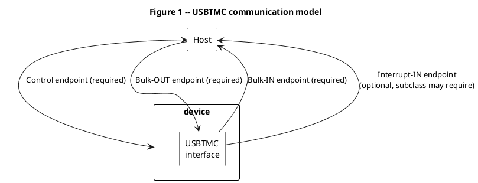

The control endpoint is required by the USB 2.0 specification.

The Bulk-OUT endpoint is required and is used to provide a high performance, guaranteed delivery data path from the Host to the device. The Host must use the Bulk-OUT endpoint to send USBTMC command messages to the device, and the device must process the USBTMC command messages in the order they are received. The Host must also use the Bulk-OUT endpoint to set up all transfers on the Bulk-IN endpoint.

The Bulk-IN endpoint is required and is used to provide a high performance, guaranteed delivery data path from the device to the Host. The Host must use the Bulk-IN endpoint to receive USBTMC response messages from the device.

The Interrupt-IN endpoint is used by the device to send notifications to the Host. A USBTMC subclass specification may require an Interrupt-IN endpoint. If the interface descriptor has bInterfaceProtocol = 0, then no subclass specification applies and the USBTMC interface is not required to have an Interrupt-IN endpoint.

The Host USBTMC driver may optionally support additional endpoints if the endpoints are required by a USBTMC subclass specification.

---

## 3 Interface Endpoints and Characteristics

### 3.1 Default control endpoint

The default control endpoint must support control transfers as required in the USB 2.0 specification. The default control endpoint is used to send standard, class, and vendor-specific requests to the device, interface, or endpoint. The default control endpoint number must be 0.

### 3.2 Bulk-OUT endpoint

The Host uses the Bulk-OUT endpoint to send USBTMC command messages to the device. For all Bulk-OUT USBTMC command messages, whether defined in this specification, a USBTMC subclass specification, or some other specification, the Host must begin the first USB transaction in each Bulk-OUT transfer of command message content with a Bulk-OUT Header. The Bulk-OUT Header is defined below in Table 1.

**Table 1 -- USBTMC message Bulk-OUT Header**

| Offset | Field | Size | Value | Description |
|---|---|---|---|---|
| 0 | MsgID | 1 | Value | Specifies the USBTMC message and the type of the USBTMC message. See Table 2. |
| 1 | bTag | 1 | Value | A transfer identifier. The Host must set bTag different than the bTag used in the previous Bulk-OUT Header. The Host should increment the bTag by 1 each time it sends a new Bulk-OUT Header. The Host must set bTag such that 1<=bTag<=255. |
| 2 | bTagInverse | 1 | Value | The inverse (one's complement) of the bTag. For example, the bTagInverse of 0x5B is 0xA4. |
| 3 | Reserved | 1 | 0x00 | Reserved. Must be 0x00. |
| 4-11 | USBTMC command message specific | 8 | USBTMC command message specific | USBTMC command message specific. See section 3.2.1. |

MsgID values defined in this specification are shown below in Table 2.

**Table 2 -- MsgID values**

| MsgID | Direction (OUT=Host-to-device, IN=Device-to-Host) | MACRO | Description |
|---|---|---|---|
| 0 | Reserved | Reserved | Reserved |
| 1 | OUT | DEV_DEP_MSG_OUT | The USBTMC message is a USBTMC device dependent command message. See section 3.2.1.1. |
| 1 | IN | (no defined response) | There is no defined response for this USBTMC command message. |
| 2 | OUT | REQUEST_DEV_DEP_MSG_IN | The USBTMC message is a USBTMC command message that requests the device to send a USBTMC response message on the Bulk-IN endpoint. See section 3.2.1.2. |
| 2 | IN | DEV_DEP_MSG_IN | The USBTMC message is a USBTMC response message to the REQUEST_DEV_DEP_MSG_IN. See section 3.3.1.1. |
| 3-125 | Reserved | Reserved | Reserved for USBTMC use. |
| 126 | OUT | VENDOR_SPECIFIC_OUT | The USBTMC message is a USBTMC vendor specific command message. See section 3.2.1.3. |
| 126 | IN | (no defined response) | There is no defined response for this USBTMC command message. |
| 127 | OUT | REQUEST_VENDOR_SPECIFIC_IN | The USBTMC message is a USBTMC command message that requests the device to send a vendor specific USBTMC response message on the Bulk-IN endpoint. See section 3.2.1.4 |
| 127 | IN | VENDOR_SPECIFIC_IN | The USBTMC message is a USBTMC response message to the REQUEST_VENDOR_SPECIFIC_IN. See section 3.3.1.2. |
| 128-191 | Reserved | Reserved | Reserved for USBTMC subclass use. |
| 192-255 | Reserved | Reserved | Reserved for VISA specification use. |

The following rules apply to all Bulk-OUT USBTMC command messages. Unless noted, device behavior when a particular rule is violated is shown in Table 7.

1. The Host must send the USBTMC message data bytes (if applicable) immediately after the USBTMC Bulk-OUT Header in the same USB transaction in the same DATA payload, subject to maximum packet size constraints.
2. The total number of bytes in each Bulk-OUT transaction must be a multiple of 4. The Host must add 0 to a maximum of 3 extra alignment bytes to the last transaction payload to achieve 4-byte (32-bit) alignment. The alignment bytes should be 0x00-valued, but this is not required.
3. The Host must not send a new USBTMC Bulk-OUT Header if a previous Bulk-OUT transfer has not yet completed.
4. The Host must consider a Bulk-OUT data transfer complete when it has transferred exactly the amount of data expected (all of the message data bytes and alignment bytes). If the last data payload is wMaxPacketSize, the Host should not send a zero-length packet. The device must consider the transfer complete when it has received and processed exactly the amount of data expected or the device received and processed a packet with payload size less than wMaxPacketSize. See the USB 2.0 specification, section 5.8.3.
5. The Host must send a complete USBTMC command message with a single transfer. This is illustrated below in Figure 2. If the Host fails to do so, the device must Halt the Bulk-OUT endpoint. The only exception is if, in the specification of a particular USBTMC command message, explicit permission is given to send the command message with multiple transfers.

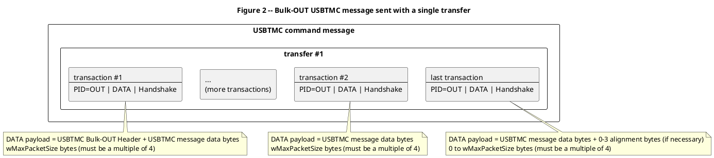

#### 3.2.1 Bulk-OUT USBTMC command messages

##### 3.2.1.1 MsgID = DEV_DEP_MSG_OUT

The Host uses MsgID = DEV_DEP_MSG_OUT to identify a transfer that sends a USBTMC device dependent command message from the Host to a device.

The Bulk-OUT Header command specific content for this command is shown below in Table 3.

**Table 3 -- DEV_DEP_MSG_OUT Bulk-OUT Header with command specific content**

| Offset | Field | Size | Value | Description |
|---|---|---|---|---|
| 0-3 | See Table 1. | 4 | See Table 1. | See Table 1. |
| 4-7 | TransferSize | 4 | Number | Total number of USBTMC message data bytes to be sent in this USB transfer. This does not include the number of bytes in this Bulk-OUT Header or alignment bytes. Sent least significant byte first, most significant byte last. TransferSize must be > 0x00000000. |
| 8 | bmTransferAttributes | 1 | Bitmap | D7…D1 Reserved. All bits must be 0. D0 EOM: 1 - The last USBTMC message data byte in the transfer is the last byte of the USBTMC message. 0 – The last USBTMC message data byte in the transfer is not the last byte of the USBTMC message. |
| 9-11 | Reserved | 3 | 0x000000 | Reserved. Must be 0x000000. |

The following additional rules apply for this USBTMC command message:

1. The Host may send this USBTMC command message with multiple transfers, as the data becomes available. This is illustrated below in Figure 3. This ability is needed because Host applications may not send a complete message all at once. Another benefit of this ability is that some devices may make use of USBTMC message content as it is delivered.

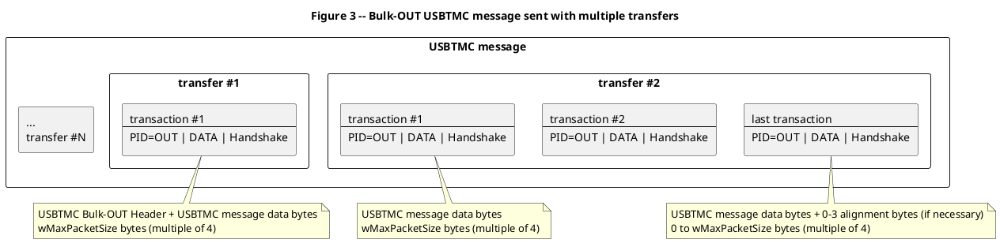

##### 3.2.1.2 MsgID = REQUEST_DEV_DEP_MSG_IN

The Host uses MsgID = REQUEST_DEV_DEP_MSG_IN to identify the transfer as a USBTMC command message to the device, allowing the device to send a USBTMC response message containing device dependent message data bytes.

The REQUEST_DEV_DEP_MSG_IN Bulk-OUT Header and command specific content is shown below in Table 4.

**Table 4 -- REQUEST_DEV_DEP_MSG_IN Bulk-OUT Header with command specific content**

| Offset | Field | Size | Value | Description |
|---|---|---|---|---|
| 0-3 | See Table 1. | 4 | See Table 1. | See Table 1. |
| 4-7 | TransferSize | 4 | Number | Maximum number of USBTMC message data bytes to be sent in response to the command. This does not include the number of bytes in this Bulk-IN Header or alignment bytes. Sent least significant byte first, most significant byte last. TransferSize must be > 0x00000000. |
| 8 | bmTransferAttributes | 1 | Bitmap | D7…D2 Reserved. All bits must be 0. D1 TermCharEnabled: 1 – The Bulk-IN transfer must terminate on the specified TermChar. The Host may only set this bit if the USBTMC interface indicates it supports TermChar in the GET_CAPABILITIES response packet. 0 – The device must ignore TermChar. D0 Must be 0. |
| 9 | TermChar | 1 | Value | If bmTransferAttributes.D1 = 1, TermChar is an 8-bit value representing a termination character. If supported, the device must terminate the Bulk-IN transfer after this character is sent. If bmTransferAttributes.D1 = 0, the device must ignore this field. |
| 10-11 | Reserved | 2 | 0x0000 | Reserved. Must be 0x0000. |

##### 3.2.1.3 MsgID = VENDOR_SPECIFIC_OUT

The Host uses MsgID = VENDOR_SPECIFIC_OUT to identify a transfer that sends a USBTMC vendor specific command message from the Host to a device.

The Bulk-OUT Header command specific content for this command is shown below in Table 5.

**Table 5 -- VENDOR_SPECIFIC_OUT Bulk-OUT Header with command specific content**

| Offset | Field | Size | Value | Description |
|---|---|---|---|---|
| 0-3 | See Table 1. | 4 | See Table 1. | See Table 1. |
| 4-7 | TransferSize | 4 | Number | Total number of USBTMC message data bytes to be sent in this USB transfer. This does not include the number of bytes in this Bulk-OUT Header or alignment bytes. Sent least significant byte first, most significant byte last. TransferSize must be > 0x00000000. |
| 8-11 | Reserved | 4 | 0x00000000 | Reserved. Must be 0x0000000. |

The following additional rules apply for this USBTMC command message:

1. The Host may send this USBTMC command message with multiple transfers, as the data becomes available. This is illustrated in Figure 3. This ability is needed because Host applications may not send a complete message all at once. Another benefit of this ability is that some devices may make use of USBTMC message content as it is delivered.

##### 3.2.1.4 MsgID = REQUEST_VENDOR_SPECIFIC_IN

The Host uses MsgID = REQUEST_VENDOR_SPECIFIC_IN to identify the transfer as a USBTMC command message to the device, allowing the device to send a USBTMC response message containing vendor specific message data bytes.

The REQUEST_VENDOR_SPECIFIC_IN Bulk-OUT Header and command specific content is shown below in Table 6.

**Table 6 -- REQUEST_VENDOR_SPECIFIC_IN Bulk-OUT Header with command specific content**

| Offset | Field | Size | Value | Description |
|---|---|---|---|---|
| 0-3 | See Table 1. | 4 | See Table 1. | See Table 1. |
| 4-7 | TransferSize | 4 | Number | Maximum number of USBTMC message data bytes to be sent in response to the command. This does not include the number of bytes in this Bulk-IN Header or alignment bytes. Sent least significant byte first, most significant byte last. TransferSize must be > 0x00000000. |
| 8-11 | Reserved | 4 | 0x00000000 | Reserved. Must be 0x00000000. |

#### 3.2.2 Maintaining USBTMC Bulk-OUT USBTMC message synchronization

The behaviors described below must be followed to restore USBTMC message synchronization between the Host and the USBTMC Bulk-OUT endpoint if synchronization has been lost.

If a USBTMC interface is "talk-only" and it receives a Bulk-OUT Header with MsgID = DEV_DEP_MSG_OUT, the USBTMC device must behave as specified in Table 7, Index=2.

If a USBTMC interface is "listen-only" and it receives a Bulk-OUT Header with MsgID = REQUEST_DEV_DEP_MSG_IN, the USBTMC device must behave as specified in Table 7, Index=2.

##### 3.2.2.1 Aborting a Bulk-OUT transfer

If the Host must abort a Bulk-OUT transfer before the transfer completes, the Host must send an INITIATE_ABORT_BULK_OUT request. See section 4.2.1.2.

##### 3.2.2.2 Aborting a Bulk-OUT USBTMC message

If the Host must abort a USBTMC message before the USBTMC message completes, the Host must send an INITIATE_CLEAR request. See section 4.2.1.6.

##### 3.2.2.3 Bulk-OUT transfer protocol errors

Table 7 specifies device behavior when certain Bulk-OUT protocol errors occur.

**Table 7 -- Bulk-OUT protocol error handling**

| Index | Error | USB device behavior |
|---|---|---|
| 1 | The device does not receive a complete Bulk-OUT Header in the first transaction of the transfer. | The device, when it has detected the error, must Halt the Bulk-OUT endpoint. The device must discard the header and any other Bulk-OUT DATA received before the endpoint has been Halted. |
| 2 | The device receives a Bulk-OUT Header with an unsupported or unknown MsgID. | (same as Index 1, above) |
| 3 | The device receives a Bulk-OUT Header with an illegal parameter or combination of parameters, such as bTagInverse not equal to the inverse of bTag. | The device must Halt the Bulk-OUT endpoint. The device must forward all USBTMC message data bytes received to the Function Layer and must discard all subsequently received Bulk-OUT DATA (if any) before the endpoint has been Halted. The device must ignore EOM. |
| 4 | The device, after it determines a Bulk-OUT transfer completes, receives less than the expected number of USBTMC message data bytes. | (same as Index 3, above) |
| 5 | The device, after it determines a Bulk-OUT transfer completes, receives the expected number of USBTMC message data bytes but not the expected number of alignment bytes. | The device, if it detects the error, must Halt the Bulk-OUT endpoint. The device must forward the expected number of USBTMC message data bytes received to the Function Layer and must discard all subsequently received Bulk-OUT DATA (if any) before the endpoint has been Halted. |
| 6 | The device, after it determines a Bulk-OUT transfer completes, receives more than the expected number of USBTMC message data bytes and alignment bytes. | The device must Halt the Bulk-OUT endpoint. The device must forward the expected number of USBTMC message data bytes to the Function Layer and must discard all subsequently received Bulk-OUT DATA before the endpoint has been Halted. |

##### 3.2.2.4 Halt

The device must Halt the USBTMC interface Bulk-OUT endpoint if it detects an error described in Table 7. The device may Halt the endpoint for reasons other than those specified in Table 7.

The Host, when it receives a Bulk-OUT STALL handshake packet, must behave as specified in the USB 2.0 specification, sections 5.3.2 and 5.8.5. All Bulk-OUT IRPs to the endpoint must be retired. The Host must send a CLEAR_FEATURE control endpoint request to clear the Halt condition.

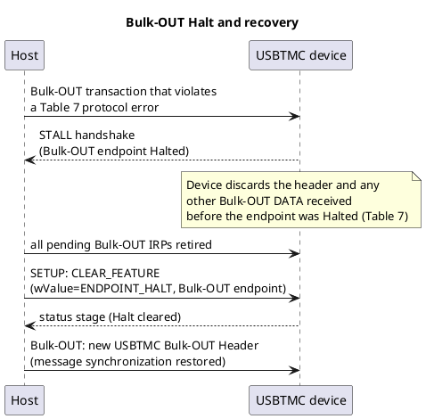

### 3.3 Bulk-IN endpoint

The Host uses the Bulk-IN endpoint to read USBTMC response messages from the device. For all Bulk-IN USBTMC response messages, whether defined in this specification, a USBTMC subclass specification, or some other specification, the device must begin the first USB transaction in each Bulk-IN transfer of USBTMC response message content with a Bulk-IN Header. The Bulk-IN Header is defined below in Table 8.

**Table 8 -- USBTMC Bulk-IN Header**

| Offset | Field | Size | Value | Description |
|---|---|---|---|---|
| 0 | MsgID | 1 | Value | Must match MsgID in the USBTMC command message transfer causing this response. |
| 1 | bTag | 1 | Value | Must match bTag in the USBTMC command message transfer causing this response. |
| 2 | bTagInverse | 1 | Value | Must match bTagInverse in the USBTMC command message transfer causing this response. |
| 3 | Reserved | 1 | 0x00 | Reserved. Must be 0x00. |
| 4-11 | USBTMC response message specific | 8 | USBTMC response message specific | USBTMC response message specific. See section 3.3.1. |

The following rules apply to Bulk-IN USBTMC response messages. Unless noted, behavior when a particular rule is violated is shown in Table 11 and Table 12.

1. USBTMC client software must queue a request to the USB Host Controller to send a USBTMC command message that expects a response before queuing a request to the USB Host Controller that will result in Bulk-IN requests being sent to the USBTMC interface.
2. If a USBTMC interface receives a Bulk-IN request prior to receiving a USBTMC command message that expects a response, the device must NAK the request.
3. The device must not queue any Bulk-IN DATA until it receives a valid USBTMC command message that expects a response.
4. The Host must consider the Bulk-IN transfer to be in progress once the transaction containing the Bulk-OUT Header for the USBTMC command message has been ACKd.
5. The device must consider the Bulk-IN transfer to be in progress when the device parses the MsgID of a valid USBTMC command message that expects a response.
6. The device is not required to respond immediately after receiving a USBTMC command message that expects a response. A device must not send a DATA payload until a termination condition is detected (EOM, TermChar, or the maximum number of USBTMC response message data bytes the Host has specified to send are available) or until the device can not buffer any more data.
7. The first USB transaction in a Bulk-IN transfer must begin with a complete Bulk-IN Header.
8. The USBTMC message data bytes must immediately follow the USBTMC Bulk-IN Header in the same USB transaction in the same DATA payload, subject to maximum packet size constraints.
9. A device may return less than the maximum number of USBTMC response message data bytes the Host specified to send. When the Bulk-IN transfer is completed, if more message data bytes are expected, the Host may send a new USBTMC command message to read the remainder of the message.
10. The device must always terminate a Bulk-IN transfer by sending a short packet. The short packet may be zero-length or non zero-length. The device may send extra alignment bytes (up to wMaxPacketSize – 1) to avoid sending a zero-length packet. The alignment bytes should be 0x00-valued, but this is not required. A device is not required to send any alignment bytes.
11. Once a transfer is terminated, the device must not queue any more Bulk-IN DATA until it receives another USBTMC command message that expects a response.
12. A device may defer the parsing and processing of Bulk-OUT data while a Bulk-IN transfer is in progress.
13. The device may send a Bulk-IN message using multiple transfers, as the data becomes available. This is illustrated below in Figure 4. This ability is needed because some devices may not have enough memory to buffer a complete USBTMC message. Another benefit of this ability is that some Hosts may make use of USBTMC message content as it is delivered.

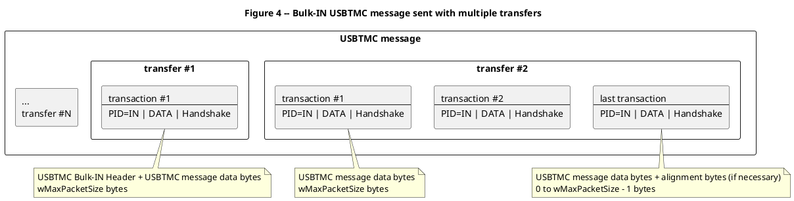

#### Example: basic device command/response exchange

The sequence below illustrates the fundamental USBTMC message exchange used to initialize and drive a device's message stream: the Host sends a device dependent command message, then asks the device to send a response, then reads that response on the Bulk-IN endpoint. This composes rules 1-6 above with the Bulk-OUT rules in section 3.2 and is the base pattern every higher-level USBTMC/USB488 query ("*IDN?", etc.) is built from.

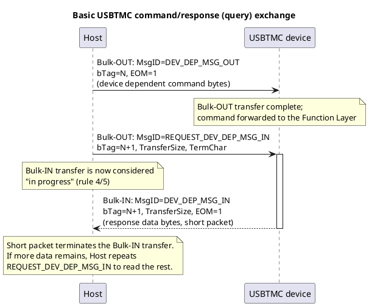

#### 3.3.1 Bulk-IN USBTMC response messages

##### 3.3.1.1 MsgID = DEV_DEP_MSG_IN

The device uses MsgID = DEV_DEP_MSG_IN to identify the transfer as a USBTMC response message to the Host sending a MsgID = REQUEST_DEV_DEP_MSG_IN USBTMC command message. The response specific content is shown in Table 9.

**Table 9 -- DEV_DEP_MSG_IN Bulk-IN Header with response specific content**

| Offset | Field | Size | Value | Description |
|---|---|---|---|---|
| 0-3 | See Table 8. | 4 | See Table 8. | See Table 8. |
| 4-7 | TransferSize | 4 | Number | Total number of message data bytes to be sent in this USB transfer. This does not include the number of bytes in this header or alignment bytes. Sent least significant byte first, most significant byte last. TransferSize must be > 0x00000000. |
| 8 | bmTransferAttributes | 1 | Bitmap | D7…D2 Reserved. All bits must be 0. D1: 1 – All of the following are true: the USBTMC interface supports TermChar; the bmTransferAttributes.TermCharEnabled bit was set in the REQUEST_DEV_DEP_MSG_IN; the last USBTMC message data byte in this transfer matches the TermChar in the REQUEST_DEV_DEP_MSG_IN. 0 – One or more of the above conditions is not met. D0 EOM: 1 - The last USBTMC message data byte in the transfer is the last byte of the USBTMC message. 0 – The last USBTMC message data byte in the transfer is not the last byte of the USBTMC message. |
| 9-11 | Reserved | 3 | 0x000000 | Reserved. Must be 0x000000. |

The following rules apply to this USBTMC response message.

1. A device may set TransferSize larger than the number of message data bytes it can buffer, provided the device knows the exact number of USBTMC message data bytes it will eventually send in the transfer.
2. The Host must ignore EOM if the device does not send TransferSize message data bytes.

##### 3.3.1.2 MsgID = VENDOR_SPECIFIC_IN

The device uses MsgID = VENDOR_SPECIFIC_IN to identify the transfer as a USBTMC response message to the Host sending a MsgID = REQUEST_VENDOR_SPECIFIC_IN USBTMC command message. The response specific content is shown in Table 10.

**Table 10 – VENDOR_SPECIFIC_IN Bulk-IN Header with response specific content**

| Offset | Field | Size | Value | Description |
|---|---|---|---|---|
| 0-3 | See Table 8. | 4 | See Table 8. | See Table 8. |
| 4-7 | TransferSize | 4 | Number | Total number of message data bytes to be sent in this USB transfer. This does not include the number of bytes in this header or alignment bytes. Sent least significant byte first, most significant byte last. TransferSize must be > 0x00000000. |
| 8-11 | Reserved | 4 | 0x00000000 | Reserved. Must be 0x00000000. |

The following rules apply to this USBTMC response message.

1. A device may set TransferSize larger than the number of message data bytes it can buffer, provided the device knows the exact number of USBTMC message data bytes it will eventually send in the transfer.

#### 3.3.2 Maintaining USBTMC Bulk-IN USBTMC message synchronization

The sections below describe behaviors to restore USBTMC message synchronization between the Host and the USBTMC Bulk-IN endpoint if synchronization has been lost.

##### 3.3.2.1 Aborting a Bulk-IN transfer

If the USBTMC client software must abort a Bulk-IN transfer before the transfer completes, the USBTMC client software must send an INITIATE_ABORT_BULK_IN request. See section 4.2.1.4.

##### 3.3.2.2 Aborting a Bulk-IN USBTMC message

If the Host must abort a USBTMC message before the USBTMC message completes, the Host must send an INITIATE_CLEAR request. See section 4.2.1.6 for rules pertaining to INITIATE_CLEAR.

##### 3.3.2.3 Bulk-IN transfer protocol errors

Table 11 specifies USBTMC client software behavior when certain Bulk-IN protocol errors occur.

**Table 11 -- Bulk-IN protocol error handling**

| Index | Error | Host behavior |
|---|---|---|
| 1 | The USBTMC client software does not receive a complete Bulk-IN Header. | The USBTMC client software must discard the header and all subsequently received Bulk-IN bytes. If the USBTMC client software has not received a short packet, it must send an INITIATE_ABORT_BULK_IN request to the device. The USBTMC client software should return an error indicating a protocol error has occurred. |
| 2 | The USBTMC client software receives a Bulk-IN Header with an unsupported or unknown MsgID. | (same as Index 1, above) |
| 3 | The USBTMC client software receives a Bulk-IN Header with an illegal parameter or combination of parameters, such as bTagInverse not equal to the inverse of bTag. | (same as Index 1, above) |
| 4 | The USBTMC client software, after a Bulk-IN transfer completes, determines that the device sent fewer than the expected number of message data bytes. | The USBTMC client software must process the USBTMC message data bytes. The USBTMC client software should return an error indicating a protocol error has occurred. |
| 5 | The USBTMC client software receives more than the expected number of message data bytes and wMaxPacket-1 alignment bytes. | The USBTMC client software must process the expected number of message data bytes and discard all additional bytes. If the USBTMC client software has not received a short packet, it must send an INITIATE_ABORT_BULK_IN request to the device. The USBTMC client software should return an error indicating a protocol error has occurred. |

##### 3.3.2.4 Halt

The device must Halt the USBTMC interface Bulk-IN endpoint if it detects an error described in Table 12. The device may Halt the endpoint for reasons other than those specified in Table 12.

If a USBTMC Bulk-IN endpoint acknowledges a Bulk-IN request with a STALL handshake packet, the Host behavior is as specified in the USB 2.0 specification, section 5.3.2 and 5.8.5. All Bulk-IN IRPs to the endpoint must be retired.

In addition, the Host must process all USBTMC message data bytes received, subject to the rules in Table 11. The Host must send a CLEAR_FEATURE request to clear the Bulk-IN endpoint Halt condition and restore synchronization. See also section 4.1.1.2.

**Table 12 -- Bulk-IN Halt error conditions**

| Index | Error | Device behavior |
|---|---|---|
| 1 | The device receives a USBTMC command message that expects a response while a Bulk-IN transfer is in progress. | The device, if it detects the error, must Halt the Bulk-IN endpoint. |

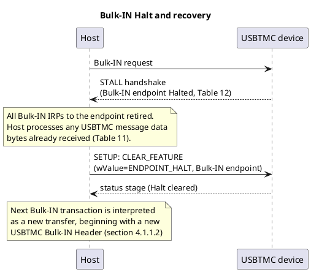

### 3.4 Interrupt-IN

The Interrupt-IN endpoint may be used by the device to send notifications to the Host. The formats of notifications are defined in Table 13 and in USBTMC subclass documents.

**Table 13 -- Interrupt-IN DATA payload format**

| Offset | Field | Size | D7 | D6 | D5 | D4...D0 | Explanation |
|---|---|---|---|---|---|---|---|
| 0 | bNotify1 | 1 | 1 |   | Notification bits |   | Format of D6...D0 and all notification bytes are defined in the applicable subclass specification |
| 0 | bNotify1 | 1 | 0 | 1 | Notification bits |   | Format of D5...D0 and all notification bytes are vendor specific. A Host may ignore vendor specific notifications. |
| 0 | bNotify1 | 1 | 0 | 0 | Notification bits |   | Format of D5...D0 and all notification bytes are reserved for USBTMC use. |
| 1 | bNotify2 | N-1 | Notification bytes | | | | Format specified according to D7...D6 in offset 0. |

This specification places no restriction on N, the number of bytes in the notification.

The Host, after an Interrupt-IN transfer has completed, must interpret the first byte in the next Interrupt-IN DATA payload as a new notification, beginning with bNotify1. Note that the USB 2.0 specification, section 5.7.3, defines when an interrupt transfer must be considered complete. If no subclass specification applies (bInterfaceProtocol = 0, see Table 44), or if the notification is a vendor specific request, the last Interrupt-IN transaction must be a short packet (< wMaxPacketSize).

See the USB 2.0 specification, section 5.7.4, for when a device may send notifications and when Interrupt-IN requests may be NAKd.

---

## 4 Control endpoint requests

### 4.1 Standard requests

Devices must support the standard requests required by the USB 2.0 specification, section 9.4. In addition, devices with USBTMC interfaces must follow the behaviors below.

#### 4.1.1 CLEAR_FEATURE request wValue = ENDPOINT_HALT

The device, if the reason for the Halt no longer exists, must clear the Halt condition on the specified endpoint. See the USB 2.0 Specification, section 9.4.1. Additional behaviors for devices with USBTMC interfaces are described below.

##### 4.1.1.1 USBTMC interface Bulk-OUT endpoints

The Host, after sending a CLEAR_FEATURE request to clear a Halt condition on a USBTMC interface Bulk-OUT endpoint, must begin the next Bulk-OUT transaction with a Bulk-OUT Header.

The device, after receiving the CLEAR_FEATURE request, must interpret the first part of the next Bulk-OUT transaction as a new USBTMC Bulk-OUT Header.

##### 4.1.1.2 USBTMC interface Bulk-IN endpoints

The Host, after sending a CLEAR_FEATURE request to clear a Halt condition on a USBTMC interface Bulk-IN endpoint, must interpret the next Bulk-IN transaction as a new transfer beginning with a new USBTMC Bulk-IN Header.

The device, after receiving the CLEAR_FEATURE request, must not queue any Bulk-IN DATA until it receives a USBTMC command message that expects a response.

### 4.2 USBTMC class specific requests

All USBTMC class specific requests must be sent with a Setup packet as shown below in Table 14.

**Table 14 -- USBTMC class specific request format**

| Offset | Field | Size | Value | Description |
|---|---|---|---|---|
| 0 | bmRequestType | 1 | Bitmap | D7 Data transfer direction (0 - Host-to-device, 1 - Device-to-host). Varies according to request. D6…D5 Type (0 - Standard, 1 - Class, 2 - Vendor, 3 - Reserved). Type = Class for all control endpoint requests specified in this USBTMC specification and for all control endpoint requests specified in USBTMC subclass specifications. D4…D0 Recipient (0 - Device, 1 - Interface, 2 - Endpoint, 3 - Other, 4–31 - Reserved). Varies according to request. |
| 1 | bRequest | 1 | Value | If bmRequestType.Type = Class, see section 4.2.1 |
| 2 | wValue | 2 | Value | Word sized field that varies according to request. See the USB 2.0 specification, section 9.3.3. |
| 4 | wIndex | 2 | Index or Offset | Word sized field that varies according to request, typically used to pass an index or offset. See the USB 2.0 specification, section 9.3.4. |
| 6 | wLength | 2 | Count | Number of bytes to transfer if there is a Data stage. See the USB 2.0 specification, section 9.3.5. Varies according to request. |

#### 4.2.1 USBTMC requests

Table 15 below shows the USBTMC specific requests.

**Table 15 -- USBTMC bRequest values**

| bRequest | Name | Required/Optional | Comment |
|---|---|---|---|
| 0 | Reserved | Reserved | Reserved. |
| 1 | INITIATE_ABORT_BULK_OUT | Required | Aborts a Bulk-OUT transfer. |
| 2 | CHECK_ABORT_BULK_OUT_STATUS | Required | Returns the status of the previously sent INITIATE_ABORT_BULK_OUT request. |
| 3 | INITIATE_ABORT_BULK_IN | Required | Aborts a Bulk-IN transfer. |
| 4 | CHECK_ABORT_BULK_IN_STATUS | Required | Returns the status of the previously sent INITIATE_ABORT_BULK_IN request. |
| 5 | INITIATE_CLEAR | Required | Clears all previously sent pending and unprocessed Bulk-OUT USBTMC message content and clears all pending Bulk-IN transfers from the USBTMC interface. |
| 6 | CHECK_CLEAR_STATUS | Required | Returns the status of the previously sent INITIATE_CLEAR request. |
| 7 | GET_CAPABILITIES | Required | Returns attributes and capabilities of the USBTMC interface. |
| 8-63 | Reserved | Reserved | Reserved for use by the USBTMC specification. |
| 64 | INDICATOR_PULSE | Optional | A mechanism to turn on an activity indicator for identification purposes. The device indicates whether or not it supports this request in the GET_CAPABILITIES response packet. |
| 65-127 | Reserved | Reserved | Reserved for use by the USBTMC specification. |
| 128-191 | Reserved | Reserved | Reserved for use by USBTMC subclass specifications. |
| 192-255 | Reserved | Reserved | Reserved for use by the VISA specification. |

All USBTMC class-specific requests return data to the Host (bmRequestType direction = Device-to-host) and have a data payload that begins with a 1 byte USBTMC_status field. The USBTMC_status values are defined below in Table 16.

**Table 16 -- USBTMC_status values**

| USBTMC_status | MACRO | Recommended interpretation by Host software | Description |
|---|---|---|---|
| 0x00 | Reserved | Reserved | Reserved |
| 0x01 | STATUS_SUCCESS | Success | Success |
| 0x02 | STATUS_PENDING | Warning | This status is valid if a device has received a USBTMC split transaction CHECK_STATUS request and the request is still being processed. See 4.2.1.1. |
| 0x03-0x1F | Reserved | Warning | Reserved for USBTMC use. |
| 0x20-0x3F | Reserved | Warning | Reserved for subclass use. |
| 0x40-0x7F | Reserved | Warning | Reserved for VISA use. |
| 0x80 | STATUS_FAILED | Failure | Failure, unspecified reason, and a more specific USBTMC_status is not defined. |
| 0x81 | STATUS_TRANSFER_NOT_IN_PROGRESS |  | This status is only valid if a device has received an INITIATE_ABORT_BULK_OUT or INITIATE_ABORT_BULK_IN request and the specified transfer to abort is not in progress. |
| 0x82 | STATUS_SPLIT_NOT_IN_PROGRESS | Failure | This status is valid if the device received a CHECK_STATUS request and the device is not processing an INITIATE request. |
| 0x83 | STATUS_SPLIT_IN_PROGRESS | Failure | This status is valid if the device received a new class-specific request and the device is still processing an INITIATE. |
| 0x84-0x9F | Reserved | Failure | Reserved for USBTMC use. |
| 0xA0-0xBF | Reserved | Failure | Reserved for subclass use. |
| 0xC0-0xFF | Reserved | Failure | Reserved for VISA use. |

Processing of all USBTMC requests is subject to the same timing limitations for standard requests as stated in the USB 2.0 Specification, section 9.2.6.4.

A response with USBTMC_status indicating a failure (>= 0x80) must contain all of the required response bytes. The Host must ignore, except where specified otherwise, all response bytes in the response except the USBTMC_status byte. Devices should send the most appropriate and most specific USBTMC_status.

Devices must follow the behavior described in the USB 2.0 Specification, section 9.2.7, when the device receives a request that is not defined for the device, is inappropriate for the current setting of the device, or has values that are not compatible with the request.

If a Host timeout occurs while waiting for a control endpoint response it is recommended that the Host try one or more of the steps below to restore communications with the device:

1. Reset the device by sending a USBTMC device dependent message to the Bulk-OUT endpoint. This is possible only if the device defines a USBTMC device dependent message to reset the device.
2. Reset the device by sending a USBTMC subclass defined USBTMC command message. This is possible only if the relevant subclass for the device defines a USBTMC command message to reset the device.
3. Do a PORT_RESET of the device. See the USB 2.0 specification, section 11.24.2.7.1.5. A Host executes a PORT_RESET by sending a Setup packet to a hub. The Setup packet has bRequest = SET_FEATURE, wValue = PORT_RESET, and wIndex = the port number for the unresponsive device. The USB 2.0 specification, section 9.1.1.3, says the device must transition to the Default state and that "After the device is successfully reset, the device must also respond successfully to device and configuration descriptor requests and return appropriate information."
4. Send another Setup transaction. The USB 2.0 specification, section 5.5.5 says "If a Setup transaction is received by an endpoint before a previously initiated control transfer is completed, the device must abort the current transfer/operation and handle the new control Setup transaction."

##### 4.2.1.1 USBTMC split transactions

USBTMC split transactions are specified for operations that on some test and measurement devices may take a long time. USBTMC split transactions are done with an INITIATE request followed by a CHECK_STATUS request. The following USBTMC requests are example USBTMC split transactions:

- INITIATE_ABORT_BULK_OUT (the INITIATE) and CHECK_ABORT_BULK_OUT_STATUS (the CHECK_STATUS)
- INITIATE_ABORT_BULK_IN (the INITIATE) and CHECK_ABORT_BULK_IN_STATUS (the CHECK_STATUS)
- INITIATE_CLEAR (the INITIATE) and CHECK_CLEAR_STATUS (the CHECK_STATUS)

The rules below apply to USBTMC split transactions:

1. After sending an INITIATE request, the USBTMC client software should not send control endpoint requests other than CHECK_STATUS until a CHECK_STATUS response packet returns USBTMC_status not equal to STATUS_PENDING. Exceptions are if:
   a. The device's INITIATE response packet USBTMC_status indicates a failure (>= 0x80). The USBTMC client software must not send a CHECK_STATUS request.
   b. A Host application specified timeout occurs within the USBTMC client software, control is returned to the Host application, and the Host application then causes an unexpected control endpoint request to be sent.
   c. Some other action has caused the device to abort the INITIATE request.
2. After receiving the INITIATE request, the device must queue the appropriate control endpoint response packet with the most appropriate USBTMC_status:
   a. STATUS_SUCCESS. This is the appropriate USBTMC_status if the device has started to perform the request.
   b. STATUS_FAILED. The device, for some other reason, can not begin to perform the request.
   c. STATUS_TRANSFER_NOT_IN_PROGRESS. Only valid when aborting a Bulk-Out or Bulk-IN transfer. See INITIATE_ABORT_BULK_OUT and INITIATE_ABORT_BULK_IN.

   The device must not return a USBTMC_status that the Host may interpret as a warning (See Table 16). USBTMC client software, if it does receive a warning USBTMC_status, must consider the USBTMC split transaction complete and return an error to the Host application.
3. If a device receives an INITIATE request, sends a control endpoint response packet with USBTMC_status = STATUS_SUCCESS, and then receives a new control endpoint request other than the expected CHECK_STATUS, the device behaviors depend on the request type.
   a. **Class endpoint requests:** If the device has a prepared CHECK_STATUS response packet, the device must discard it. All other actions started by the INITIATE should complete. If all other actions have already completed, the device must handle the new request. If the actions have not completed, the device must send the appropriate response packet (as defined for the newly received class request) with USBTMC_status = STATUS_SPLIT_IN_PROGRESS. Other than sending this response, the device treats the request as a no-operation. A result of the USBTMC client software not reading and processing the CHECK_STATUS response packet is that the device Bulk-IN FIFO may not be empty.
   b. **Standard control endpoint requests:** Whenever possible, all actions started by the INITIATE should complete. If this is not possible, due to a resource conflict between the device resources affected by the standard request and the device resources being used or affected by the INITIATE, the device must abort the INITIATE. Table 17 below specifies device behavior after receiving a valid standard request during an INITIATE.
   c. **Vendor control endpoint requests:** The device must assume the USBTMC client software will never send a CHECK_STATUS request. If the device has a prepared CHECK_STATUS response packet, the device must discard it. All other actions started by the INITIATE should complete. If all other actions have completed, the device must handle the new request. If the actions have not completed, the device must respond with a Request Error.

**Table 17 -- Device behavior after receiving a standard request during INITIATE**

| Standard request received during INITIATE | INITIATE in progress | Device Behavior |
|---|---|---|
| SET_ADDRESS | All | As in the USB 2.0 specification, device behavior is not specified. |
| SET_CONFIGURATION | All | The device must complete the request. The device must abort the INITIATE actions. |
| SET_INTERFACE | All | The device must complete the request. The device must abort the INITIATE actions. |
| All other standard requests | All | Device must complete the request and also complete the INITIATE actions. |

4. The Host must not send a CHECK_STATUS unless the Host has sent an INITIATE.
5. A device must be ready to receive an INITIATE or CHECK_STATUS at any time.
6. If a device receives an unexpected CHECK_STATUS the device must return USBTMC_status = STATUS_SPLIT_NOT_IN_PROGRESS.
7. If the device is Reset, the device must abort INITIATE actions.

The diagram below shows the general split-transaction pattern shared by INITIATE_ABORT_BULK_OUT/CHECK_ABORT_BULK_OUT_STATUS, INITIATE_ABORT_BULK_IN/CHECK_ABORT_BULK_IN_STATUS, and INITIATE_CLEAR/CHECK_CLEAR_STATUS.

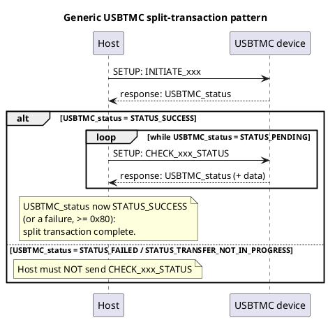

##### 4.2.1.2 INITIATE_ABORT_BULK_OUT

A Host may use the INITIATE_ABORT_BULK_OUT request to abort a Bulk-OUT transfer and restore Bulk-OUT synchronization. A Host should only send an INITIATE_ABORT_BULK_OUT request when re-synchronization is necessary (Note: This is USBTMC Bulk-OUT transfer re-synchronization, not the USB defined DATA0/DATA1 toggle synchronization.)

A Host must not send an INITIATE_ABORT_BULK_OUT request unless all IRPs for Bulk-OUT transactions to the endpoint have been retired.

For this request, the fields in the Setup packet are shown below in Table 18.

**Table 18 -- INITIATE_ABORT_BULK_OUT Setup packet**

| Field | Value |
|---|---|
| bmRequestType | 0xA2 (Dir = IN, Type = Class, Recipient = Endpoint) |
| bRequest | INITIATE_ABORT_BULK_OUT, see Table 15. |
| wValue | D7...D0: The bTag value associated with the transfer to abort. D15...D8: Reserved. Must be 0x00. |
| wIndex | Must specify direction and endpoint number per the USB 2.0 specification, section 9.3.4. |
| wLength | 0x0002. Number of bytes to transfer per the USB 2.0 specification, section 9.3.5. |

After receiving an INITIATE_ABORT_BULK_OUT request, the device must return a control endpoint response packet as shown in Table 19.

**Table 19 -- INITIATE_ABORT_BULK_OUT response packet**

| Offset | Field | Size | Value | Description |
|---|---|---|---|---|
| 0 | USBTMC_status | 1 | Value | Status indication for this request. See Table 20. |
| 1 | bTag | 1 | Value | The bTag for the current Bulk-OUT transfer. If there is no current Bulk-OUT transfer, bTag must be set to the bTag for the most recent bulk-OUT transfer. If no Bulk-OUT transfer has ever been started, bTag must be 0x00. |

**Table 20 -- INITIATE_ABORT_BULK_OUT USBTMC_status values**

| USBTMC_status | Device conditions | Host behavior |
|---|---|---|
| STATUS_SUCCESS | The device returns this status if the specified transfer is in progress. The device must Halt the Bulk-OUT endpoint and then queue the response packet. The device, after the response packet is queued, must abort the specified Bulk-OUT transfer. To abort the transfer, the device should: 1. If an operation is draining bytes from the Bulk-OUT FIFO, stop the operation. If this is not possible, wait for the draining operation to complete. 2. Remove (flush) any bytes that remain in the Bulk-OUT FIFO. | The Host must continue to hold off any new Bulk-OUT IRPs. The Host must send CHECK_ABORT_BULK_OUT_STATUS. |
| STATUS_TRANSFER_NOT_IN_PROGRESS | The device returns this status if either: there is a transfer in progress but the specified bTag does not match; or there is no transfer in progress but the Bulk-OUT FIFO is not empty. The device must not Halt the Bulk-OUT endpoint. | The Host must not send CHECK_ABORT_BULK_OUT_STATUS. The Host may send INITIATE_ABORT_BULK_OUT at a later time. |
| STATUS_FAILED | The device returns this status if there is no transfer in progress and the Bulk-OUT FIFO is empty. The device must not Halt the Bulk-OUT endpoint. | The Host must not send CHECK_ABORT_BULK_OUT_STATUS. |
| All other values, see Table 16. | See Table 16. The device must not Halt the Bulk-OUT endpoint. | |

##### 4.2.1.3 CHECK_ABORT_BULK_OUT_STATUS

The Host uses CHECK_ABORT_BULK_OUT_STATUS to determine if the device has completed all processing associated with a previously received INITIATE_ABORT_BULK_OUT request.

For this request, the fields in the Setup packet are shown below in Table 21.

**Table 21 -- CHECK_ABORT_BULK_OUT_STATUS Setup packet**

| Field | Value |
|---|---|
| bmRequestType | 0xA2 (Dir = IN, Type = Class, Recipient = Endpoint) |
| bRequest | CHECK_ABORT_BULK_OUT_STATUS, see Table 15. |
| wValue | Reserved. Must be 0x0000. |
| wIndex | Must specify direction and endpoint number per the USB 2.0 specification, section 9.3.4. |
| wLength | 0x0008. Number of bytes to transfer per the USB 2.0 specification, section 9.3.5. |

After receiving a CHECK_ABORT_BULK_OUT_STATUS request, the device must return a control endpoint response packet as shown in Table 22.

**Table 22 -- CHECK_ABORT_BULK_OUT_STATUS response format**

| Offset | Field | Size | Value | Description |
|---|---|---|---|---|
| 0 | USBTMC_status | 1 | Value | Status indication for this request. See Table 23. |
| 1-3 | Reserved | 3 | 0x000000 | Reserved. Must be 0x000000. |
| 4 | NBYTES_RXD | 4 | Number | The total number of USBTMC message data bytes (not including Bulk-OUT Header or alignment bytes) in the transfer received, and not discarded, by the device. The device must always send NBYTES_RXD bytes to the Function Layer. Sent least significant byte first, most significant byte last. |

**Table 23 -- CHECK_ABORT_BULK_OUT_STATUS USBTMC_status values**

| USBTMC_status | Device conditions | Host behavior |
|---|---|---|
| STATUS_PENDING | The device has not yet aborted the specified transfer and is unable to calculate NBYTES_RXD. | The Host must continue to hold off any new Bulk-OUT IRPs and must send a new CHECK_ABORT_BULK_OUT_STATUS. |
| STATUS_SUCCESS | The device has aborted the specified transfer. The device must set NBYTES_RXD to the appropriate value. | The Host must send a CLEAR_FEATURE control endpoint request to clear the Bulk-OUT Halt. The Host must not send CHECK_ABORT_BULK_OUT_STATUS. |
| All other values, see Table 16. | See Table 16. | |

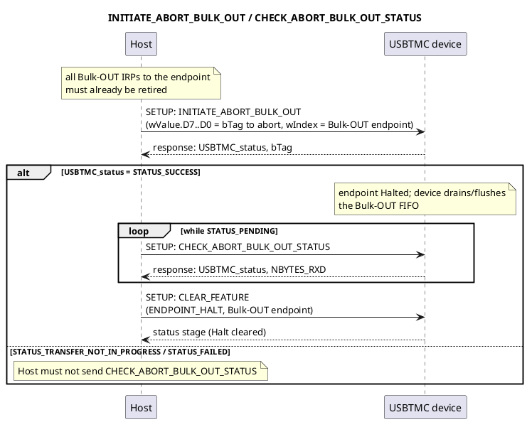

##### 4.2.1.4 INITIATE_ABORT_BULK_IN

A Host may use the INITIATE_ABORT_BULK_IN request to abort a Bulk-IN transfer and restore Bulk-IN synchronization. A Host should only send an INITIATE_ABORT_BULK_IN request when re-synchronization is necessary (Note: This is USBTMC Bulk-IN transfer re-synchronization, not the USB defined DATA0/DATA1 toggle synchronization.)

Prior to sending an INITIATE_ABORT_BULK_IN request, the Host must determine if there is a pending Bulk-OUT IRP for a USBTMC command message that expects a response. If such an IRP is pending, the Host must retire the IRP. The Host must still send an INITIATE_ABORT_BULK_IN.

The Host must not retire IRPs to the Bulk-IN endpoint prior to sending an INITIATE_ABORT_BULK_IN request. This is because a Host may lose Bulk-IN DATA when IRPs are retired.

For this request, the fields in the Setup packet are shown below in Table 24.

**Table 24 -- INITIATE_ABORT_BULK_IN Setup packet**

| Field | Value |
|---|---|
| bmRequestType | 0xA2 (Dir = IN, Type = Class, Recipient = Endpoint) |
| bRequest | INITIATE_ABORT_BULK_IN, see Table 15. |
| wValue | D7...D0: The bTag value associated with the transfer to abort. D15...D8: Reserved. Must be 0x00. |
| wIndex | Must specify direction and endpoint number per the USB 2.0 specification, section 9.3.4. |
| wLength | 0x0002. Number of bytes to transfer per the USB 2.0 specification, section 9.3.5. |

After receiving an INITIATE_ABORT_BULK_IN request, the device must return a control endpoint response packet as shown in Table 25.

**Table 25 -- INITIATE_ABORT_BULK_IN response format**

| Offset | Field | Size | Value | Description |
|---|---|---|---|---|
| 0 | USBTMC_status | 1 | Value | Status indication for this request. See Table 26. |
| 1 | bTag | 1 | Value | The bTag for the current Bulk-IN transfer. If there is no current Bulk-IN transfer, bTag must be set to the bTag for the most recent bulk-IN transfer. If no Bulk-IN transfer has ever been started, bTag must be 0x00. |

**Table 26 -- INITIATE_ABORT_BULK_IN USBTMC_status values**

| USBTMC_status | Device conditions | Host behavior |
|---|---|---|
| STATUS_SUCCESS | The device returns this status if the specified transfer is in progress. The device, after the response packet is queued, must abort the specified Bulk-IN transfer. To abort the transfer, the device should: 1. If an operation is queuing message data bytes to the Bulk-IN FIFO, stop the operation. If this is not possible, wait for the queuing operation to complete. The device should not remove (flush) packets already queued in the Bulk-IN FIFO. 2. If a short packet has not been queued, queue a short packet to terminate the transfer. If a short packet can not yet be queued, wait until a short packet can be queued. | The Host should continue reading from the Bulk-IN endpoint until a short packet is received. The Host, after a short packet is received, must send CHECK_ABORT_BULK_IN_STATUS. |
| STATUS_TRANSFER_NOT_IN_PROGRESS | The device returns this status if either: there is a transfer in progress but the specified bTag does not match; or there is no transfer in progress but the Bulk-OUT FIFO is not empty. | The Host must not send CHECK_ABORT_BULK_IN_STATUS. The Host may send INITIATE_ABORT_BULK_IN at a later time. |
| STATUS_FAILED | The device returns this status if there is no transfer in progress and the Bulk-OUT FIFO is empty. | The Host must not send CHECK_ABORT_BULK_OUT_STATUS. The Host must retire Bulk-IN IRP's. |
| All other values, see Table 16. | See Table 16. | |

##### 4.2.1.5 CHECK_ABORT_BULK_IN_STATUS

The Host uses CHECK_ABORT_BULK_IN_STATUS to determine if the device has completed all processing associated with a previously received INITIATE_ABORT_BULK_IN request. The Host should not send CHECK_ABORT_BULK_IN_STATUS until a short Bulk-IN packet has been received.

For this request, the fields in the Setup packet are shown below in Table 27.

**Table 27 -- CHECK_ABORT_BULK_IN_STATUS Setup packet**

| Field | Value |
|---|---|
| bmRequestType | 0xA2 (Dir = IN, Type = Class, Recipient = Endpoint) |
| bRequest | CHECK_ABORT_BULK_IN_STATUS, see Table 15. |
| wValue | Reserved. Must be 0x0000. |
| wIndex | Must specify direction and endpoint number per the USB 2.0 specification, section 9.3.4. |
| wLength | 0x0008. Number of bytes to transfer per the USB 2.0 specification, section 9.3.5. |

After receiving a CHECK_ABORT_BULK_IN_STATUS request, the device must return a control endpoint response packet as shown in Table 28.

**Table 28 -- CHECK_ABORT_BULK_IN_STATUS response format**

| Offset | Field | Size | Value | Description |
|---|---|---|---|---|
| 0 | USBTMC_status | 1 | Value | Status indication for this request. See Table 29. |
| 1 | bmAbortBulkIn | 1 | Bitmap | D7…D1 Reserved. All bits must be 0. D0 BulkInFifoBytes: 1 - The device either has some queued DATA bytes in the Bulk-IN FIFO or has a short packet that needs to be sent to the Host. The USBTMC_status must not be STATUS_SUCCESS. 0 – The Bulk-IN FIFO is empty. |
| 2-3 | Reserved | 2 | 0x0000 | Reserved. Must be 0x0000. |
| 4-7 | NBYTES_TXD | 4 | Number | The total number of USBTMC message data bytes (not including Bulk-IN Header or alignment bytes) sent in the transfer. Sent least significant byte first, most significant byte last. |

**Table 29 -- CHECK_ABORT_BULK_IN_STATUS USBTMC_status values**

| USBTMC_status | Device conditions | Host behavior |
|---|---|---|
| STATUS_PENDING | The device returns this status if a short packet has not been sent or the device is not ready to receive a USBTMC command message that expects a response. If the device has 1 or more queued packets the Host can read, the device must set bmAbortBulkIn.D0 = 1. If the device does not currently have any packets queued for the Host to read, the device must set bmAbortBulkIn.D0 = 0. The device must set NBYTES_TXD = 0x00000000. | The Host must send CHECK_ABORT_BULK_IN_STATUS at a later time. If bmAbortBulkIn.D0 = 1, the Host should read from the Bulk-IN endpoint until a short packet is received. The Host must ignore NBYTES_TXD. |
| STATUS_SUCCESS | The device returns this status if a short packet has been sent, the Bulk-IN FIFO is empty, and the device is ready to receive a USBTMC command message that expects a response. The device must set NBYTES_TXD to the appropriate value. The device must set bmAbortBulkIn.D0 = 0. | The Host must not send CHECK_ABORT_BULK_IN_STATUS. The Host must send a USBTMC command message that expects a response before sending another Bulk-IN transaction. |
| All other values, see Table 16. | See Table 16. | |

Example of Host and device behaviors for this USBTMC split transaction:

| Host transaction | Device behavior |
|---|---|
| REQUEST_DEV_DEP_MSG_IN USBTMC command message with TransferSize=2048. | Device has 2048 USBTMC message data bytes to send and queues 2 full-speed wMaxPacketSize (=64) DATA payloads to the Bulk-IN endpoint. The first DATA payload has 64-12=52 message data bytes. The second DATA payload has 64 message data bytes. (Device will send 52+64=116 message data bytes.) |
| Bulk-IN request | Device sends first DATA payload with a 12-byte Bulk-IN Header with TransferSize=2048 followed by 52 USBTMC message data bytes. |
| INITIATE_ABORT_BULK_IN request | Device sends an INITIATE_ABORT_BULK_IN response packet, with USBTMC_status = STATUS_SUCCESS. Device begins to abort the transfer. |
| Bulk-IN request | Device sends 64 DATA bytes. This is not a short packet and therefore the transfer is not terminated yet. After sending the packet, the device recognizes that all committed DATA has been sent and also that the transfer is to be aborted. The device sets up a short packet to be sent. |
| Bulk-IN request | Device sends a short packet to terminate the transfer. This may be a zero-length packet or up to a maximum of (wMaxPacketSize – 1) alignment bytes. |
| CHECK_ABORT_BULK_IN_STATUS request | Device sends a CHECK_ABORT_BULK_OUT_STATUS response packet, with USBTMC_status = STATUS_SUCCESS, NBYTES_TXD = 116. |

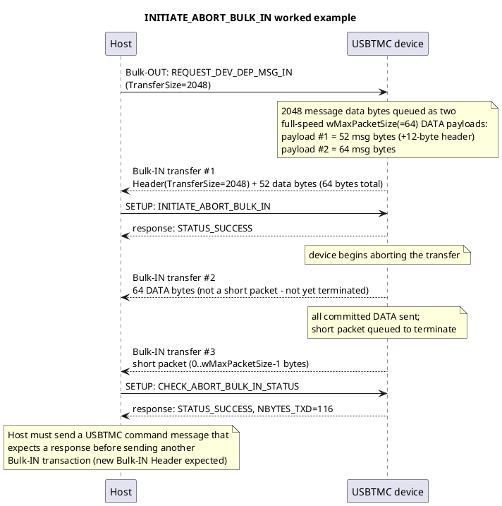

After receiving a short packet, the Host must send a USBTMC command message that expects a response prior to sending additional Bulk-IN transactions. The Host must interpret the next Bulk-IN transaction as a new transfer, beginning with a new USBTMC Bulk-IN Header.

A USBTMC subclass specification may define additional requirements.

##### 4.2.1.6 INITIATE_CLEAR

The Host uses INITIATE_CLEAR to clear all input buffers and output buffers associated with the specified USBTMC interface.

Prior to sending an INITIATE_CLEAR request, a Host must:

1. If a Bulk-OUT transfer is in progress: a. Retire all Bulk-OUT IRPs to the specified USBTMC interface. b. Hold off any new Bulk-OUT IRPs to the specified USBTMC interface.
2. If a Bulk-IN transfer is in progress: a. Retire all Bulk-IN IRPs to the specified USBTMC interface. b. Hold off any new Bulk-IN IRPs to the specified USBTMC interface.

For this request, the fields in the Setup packet are shown below in Table 30.

**Table 30 -- INITIATE_CLEAR Setup packet**

| Field | Value |
|---|---|
| bmRequestType | 0xA1 (Dir = IN, Type = Class, Recipient = Interface) |
| bRequest | INITIATE_CLEAR, see Table 15. |
| wValue | 0x0000 |
| wIndex | Must specify interface number per the USB 2.0 specification, section 9.3.4. |
| wLength | 0x0001. Number of bytes to transfer per the USB 2.0 specification, section 9.3.5. |

After receiving an INITIATE_CLEAR request, the device must Halt the Bulk-OUT endpoint, queue the control endpoint response shown in Table 31, and clear all input buffers and output buffers.

**Table 31 -- INITIATE_CLEAR response format**

| Offset | Field | Size | Value | Description |
|---|---|---|---|---|
| 0 | USBTMC_status | 1 | Value | Status indication for this request. See Table 32. |

**Table 32 -- INITIATE_CLEAR USBTMC_status values**

| USBTMC_status | Device conditions | Host behavior |
|---|---|---|
| STATUS_SUCCESS | The device returns this status if it has set up a Halt condition on the Bulk-OUT endpoint. The device, after the response packet is queued, must clear input and output buffers. To clear input and output buffers, the device should: 1. If an operation is draining bytes from the Bulk-OUT FIFO, stop the operation. If this is not possible, wait for the draining operation to complete. 2. Remove (flush) any bytes that remain in the Bulk-OUT FIFO. 3. If an operation is queuing message data bytes to the Bulk-IN FIFO, stop the operation. If this is not possible, wait for the queuing operation to complete. 4. Remove (flush) packets already queued in the Bulk-IN FIFO. If the device can not remove queued packets: a. Prepare to send a CHECK_CLEAR_STATUS response packet with bmClear.D0 = 1. b. If a short packet has not been queued, queue a short packet to terminate the transfer. If a short packet can not be queued, wait until a short packet can be queued. 5. Notify the Function Layer. | The Host must send CHECK_CLEAR_STATUS. |
| All other values, see Table 16. | See Table 16. The device must not Halt the Bulk-OUT endpoint. | The Host must not send CHECK_CLEAR_STATUS. |

##### 4.2.1.7 CHECK_CLEAR_STATUS

The Host uses CHECK_CLEAR_STATUS to determine if the device has completed all processing associated with a previously received INITIATE_CLEAR request.

For this request, the fields in the Setup packet are shown below in Table 33.

**Table 33 -- CHECK_CLEAR_STATUS Setup packet**

| Field | Value |
|---|---|
| bmRequestType | 0xA1 (Dir = IN, Type = Class, Recipient = Interface) |
| bRequest | CHECK_CLEAR_STATUS, see Table 15. |
| wValue | Reserved. Must be 0x0000. |
| wIndex | Must specify interface number per the USB 2.0 specification, section 9.3.4. |
| wLength | 0x0002. Number of bytes to transfer per the USB 2.0 specification, section 9.3.5. |

Upon receiving the CHECK_CLEAR_STATUS request, the device must determine if it is still processing an INITIATE_CLEAR and then queue the control endpoint response packet shown below in Table 34.

**Table 34 -- CHECK_CLEAR_STATUS response format**

| Offset | Field | Size | Value | Description |
|---|---|---|---|---|
| 0 | USBTMC_status | 1 | Value | Status indication for this request. See Table 35. |
| 1 | bmClear | 1 | Bitmap | D7…D1 Reserved. All bits must be 0. D0 BulkInFifoBytes: 1 - The device either has some queued DATA bytes in the Bulk-IN FIFO that it could not remove, or has a short packet that needs to be sent to the Host. The USBTMC_status must not be STATUS_SUCCESS. 0 – The device has completely removed queued DATA in the Bulk-IN FIFO and the Bulk-IN FIFO is empty. |

**Table 35 -- CHECK_CLEAR_STATUS USBTMC_status values**

| USBTMC_status | Device conditions | Host behavior |
|---|---|---|
| STATUS_PENDING | Either: 1. The device has not yet finished clearing input buffers and output buffers. 2. The Bulk-IN FIFO is not empty. 3. The Function Layer is not ready for Bulk transfers. If the Bulk-IN FIFO is not empty, the device must set bmClear.D0 = 1. If the Bulk-IN FIFO is empty, the device must set bmClear.D0 = 0. | If bmClear.D0 = 1, the Host should read from the Bulk-IN endpoint until a short packet is received. The Host must send CHECK_CLEAR_STATUS at a later time. |
| STATUS_SUCCESS | The device has finished clearing the input and output buffers, the Bulk-IN FIFO is empty, and the Function Layer is ready for Bulk transfers. The device must set bmClear.D0 = 0. | The Host must send a CLEAR_FEATURE request to clear the Bulk-OUT Halt. |
| All other values, see Table 16. | See Table 16. | |

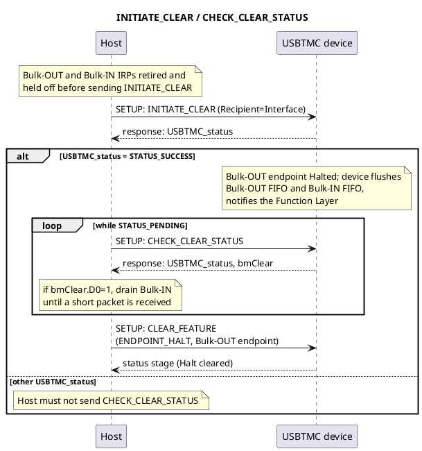

##### 4.2.1.8 GET_CAPABILITIES

The Host uses GET_CAPABILITIES to read additional attributes and capabilities of a USBTMC interface.

For this request, the fields in the Setup packet are shown below in Table 36.

**Table 36 -- GET_CAPABILITIES Setup packet**

| Field | Value |
|---|---|
| bmRequestType | 0xA1 (Dir = IN, Type = Class, Recipient = Interface) |
| bRequest | GET_CAPABILITIES, see Table 15. |
| wValue | 0x0000 |
| wIndex | Must specify interface number per the USB 2.0 specification, section 9.3.4. |
| wLength | 0x0018. Number of bytes to transfer per the USB 2.0 specification, section 9.3.5. |

A device must be ready to receive a GET_CAPABILITIES request at any time.

When a device receives this request, the device must queue the control endpoint response shown below in Table 37. Unless specified otherwise, all device capabilities are static.

**Table 37 -- GET_CAPABILITIES response format**

| Offset | Field | Size | Value | Description |
|---|---|---|---|---|
| 0 | USBTMC_status | 1 | Value | Status indication for this request. See Table 16. |
| 1 | Reserved | 1 | 0x00 | Reserved. Must be 0x00. |
| 2 | bcdUSBTMC | 2 | BCD (0x0100 or greater) | BCD version number of the relevant USBTMC specification for this USBTMC interface. Format is as specified for bcdUSB in the USB 2.0 specification, section 9.6.1. |
| 4 | USBTMC Interface Capabilities | 1 | Bitmap | D7…D3 Reserved. All bits must be 0. D2: 1 – The USBTMC interface accepts the INDICATOR_PULSE request. 0 – The USBTMC interface does not accept the INDICATOR_PULSE request. The device, when an INDICATOR_PULSE request is received, must treat this command as a non-defined command and return a STALL handshake packet. D1: 1 – The USBTMC interface is talk-only. 0 – The USBTMC interface is not talk-only. D0: 1 – The USBTMC interface is listen-only. 0 – The USBTMC interface is not listen-only. |
| 5 | USBTMC Device Capabilities | 1 | Bitmap | D7…D1 Reserved. All bits must be 0. D0: 1 – The device supports ending a Bulk-IN transfer from this USBTMC interface when a byte matches a specified TermChar. 0 – The device does not support ending a Bulk-IN transfer from this USBTMC interface when a byte matches a specified TermChar. |
| 6 | Reserved | 6 | All bytes must be 0x00. | Reserved for USBTMC use. All bytes must be 0x00. |
| 12 | Reserved | 12 | Reserved | Reserved for USBTMC subclass use. If no subclass specification applies, all bytes must be 0x00. |

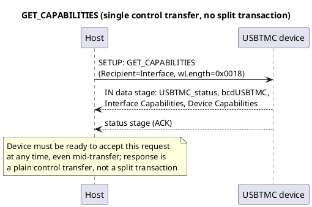

##### 4.2.1.9 INDICATOR_PULSE

This request provides the Host with a mechanism to turn on an activity indicator for identification purposes. A device indicates whether it supports this request in the GET_CAPABILITIES response packet.

For this request, the fields in the Setup packet are shown below in Table 38.

**Table 38 -- INDICATOR_PULSE Setup packet**

| Field | Value |
|---|---|
| bmRequestType | 0xA1 (Dir = IN, Type = Class, Recipient = Interface) |
| bRequest | INDICATOR_PULSE, see Table 15. |
| wValue | 0x0000 |
| wIndex | Must specify interface number per the USB 2.0 specification, section 9.3.4. |
| wLength | 0x0001. Number of bytes to transfer per the USB 2.0 specification, section 9.3.5. |

A device must be ready to receive an INDICATOR_PULSE request at any time. If not implemented, the device must respond with a Request Error.

When a device receives this request, the device must queue the control endpoint response shown below in Table 39. If the device supports the request, the device then turns on an implementation-dependent activity indicator for a human detectable length of time (recommend time is >= 500 milliseconds and <= 1 second). The activity indicator then automatically turns off.

A device may turn on an activity indicator for other reasons.

**Table 39 -- INDICATOR_PULSE response format**

| Offset | Field | Size | Value | Description |
|---|---|---|---|---|
| 0 | USBTMC_status | 1 | Value | Status indication for this request. See Table 16. |

---

## 5 Descriptors

### 5.1 Device Descriptor

**Table 40 -- Device Descriptor**

| Offset | Field | Size | Value | Description |
|---|---|---|---|---|
| 0 | bLength | 1 | 0x12 | Size of this descriptor in bytes. |
| 1 | bDescriptorType | 1 | 0x01 | DEVICE Descriptor Type. See USB 2.0 specification, Table 9-5. |
| 2 | bcdUSB | 2 | BCD (0x0200 or greater) | Binary coded decimal field indicating the USB specification level used in the design of this device. As specified in USB 2.0 specification, section 9.6.1. |
| 4 | bDeviceClass | 1 | 0x00 | Class found in interface descriptor. |
| 5 | bDeviceSubClass | 1 | 0x00 | Subclass found in interface descriptor. |
| 6 | bDeviceProtocol | 1 | 0x00 | Protocol found in interface descriptor. |
| 7 | bMaxPacketSize0 | 1 | Number | As specified in USB 2.0 specification, section 9.6.1. |
| 8 | idVendor | 2 | ID | Required. Vendor ID assigned to IHV by USB-IF |
| 10 | idProduct | 2 | ID | Required. Product ID assigned by IHV |
| 12 | bcdDevice | 2 | BCD | As specified in USB 2.0 specification, section 9.6.1. |
| 14 | iManufacturer | 1 | Index | Index of string descriptor describing manufacturer. Required to be non-zero. Specified in USB 2.0 specification, section 9.6.1 and section 5.7 of this USBTMC document. The bLength for the iManufacturer string descriptor must be >= 4 and <= 128 (1 <= number of Unicode characters <= 63). |
| 15 | iProduct | 1 | Index | Index of string descriptor describing product. Required to be non-zero. Specified in USB 2.0 specification, section 9.6.1 and section 5.7 of this USBTMC document. The bLength for the iProduct string descriptor must be >= 4 and <= 128 (1 <= number of Unicode characters <= 63). |
| 16 | iSerialNumber | 1 | Index | Index of string descriptor describing the device's serial number. Required to be non-zero. Specified in USB 2.0 specification, section 9.6.1 and section 5.7 of this USBTMC document. The combination of idVendor, idProduct, and iSerialNumber must be unique for every instance of a device. The bLength for the iSerialNumber string descriptor must be >= 4 and <= 128 (1 <= number of Unicode characters <= 63). |
| 17 | bNumConfigurations | 1 | Number | As specified in USB 2.0 specification, section 9.6.1. |

The iSerialNumber index is required to be non-zero because there must be no ambiguity when a Host attempts to communicate with a device. The Host may generate a globally unique identifier by concatenating the 16 bit idVendor, the 16-bit idProduct, and the value represented by the string descriptor indexed by iSerialNumber.

All of the string descriptors indexed within the Device Descriptor (iManufacturer, iProduct, and iSerialNumber) may be displayed to the user when a device is first added to a topology. It is recommended that they contain meaningful, human-readable strings.

### 5.2 Device_Qualifier Descriptor

**Table 41 -- Device_Qualifier Descriptor**

| Offset | Field | Size | Value | Description |
|---|---|---|---|---|
| 0 | bLength | 1 | 0x0A | Size of this descriptor in bytes. |
| 1 | bDescriptorType | 1 | 0x06 | DEVICE QUALIFIER Descriptor Type. See USB 2.0 specification, Table 9-5. |
| 2 | bcdUSB | 2 | BCD | USB specification version number (e.g., 0200H for V2.00). |
| 4 | bDeviceClass | 1 | 0x00 | Class found in interface descriptor. |
| 5 | bDeviceSubClass | 1 | 0x00 | Subclass found in interface descriptor. |
| 6 | bDeviceProtocol | 1 | 0x00 | Protocol found in interface descriptor. |
| 7 | bMaxPacketSize0 | 1 | Number | Maximum packet size for other speed. |
| 8 | bNumConfigurations | 1 | Number | Number of Other-speed Configurations. |
| 9 | Reserved | 1 | 0x00 | Reserved for future use, must be zero |

### 5.3 Configuration Descriptor

**Table 42 -- Configuration Descriptor**

| Offset | Field | Size | Value | Description |
|---|---|---|---|---|
| 0 | bLength | 1 | 0x09 | Size of this descriptor in bytes. |
| 1 | bDescriptorType | 1 | 0x02 | CONFIGURATION Descriptor Type. See USB 2.0 specification, Table 9-5. |
| 2 | wTotalLength | 2 | Number | Total length of data returned for this configuration. Includes the combined length of all descriptors (configuration, interface, endpoint, and class-or vendor-specific returned for this configuration. |
| 4 | bNumInterfaces | 1 | Number | Number of interfaces supported by this configuration. A device may have multiple USBTMC interfaces. |
| 5 | bConfigurationValue | 1 | Number | Value to use as an argument to the SetConfiguration() request to select this configuration. |
| 6 | iConfiguration | 1 | Index | Index of string describing this configuration. |
| 7 | bmAttributes | 1 | Bitmap | Configuration characteristics defined by the USB 2.0 specification, section 9.6.3. |
| 8 | bMaxPower | 1 | mA | Maximum power consumption per the USB 2.0 specification, section 9.6.3. |

### 5.4 Other_Speed_Configuration Descriptor

The format of the Other_Speed_Configuration descriptor is specified in the USB 2.0 specification, section 9.6.4.

### 5.5 Interface Descriptor

**Table 43 -- Interface Descriptor**

| Offset | Field | Size | Value | Description |
|---|---|---|---|---|
| 0 | bLength | 1 | 0x09 | Size of this descriptor in bytes. |
| 1 | bDescriptorType | 1 | 0x04 | INTERFACE Descriptor Type. See USB 2.0 specification, Table 9-5. |
| 2 | bInterfaceNumber | 1 | Number | Number of this interface. Zero-based value identifying the index in the array of concurrent interfaces supported by this configuration. |
| 3 | bAlternateSetting | 1 | 0x00 | Value used to select this alternate setting for the interface identified in the prior field. |
| 4 | bNumEndpoints | 1 | Number | Number of endpoints used by this interface (excluding endpoint zero). If this value is zero, this interface only uses the Default Control Pipe. |
| 5 | bInterfaceClass | 1 | Class = 0xFE | "Application-Class" class code, assigned by USB-IF. The Host must not load a USBTMC driver based on just the bInterfaceClass field. |
| 6 | bInterfaceSubClass | 1 | 0x03 | Subclass code, assigned by USB-IF. |
| 7 | bInterfaceProtocol | 1 | Protocol | Protocol code. See Table 44. |
| 8 | iInterface | 1 | Index | Index of string descriptor describing this interface. |

**Table 44 -- USBTMC bInterfaceProtocol values**

| bInterfaceProtocol Value | Description |
|---|---|
| 0 | USBTMC interface. No subclass specification applies. |
| 1 | USBTMC USB488 interface. See the USB488 subclass specification. |
| 2-127 | Reserved |

A USBTMC interface with a bInterfaceProtocol = 0x00 must have exactly one Bulk-OUT endpoint, exactly one Bulk-IN endpoint, and may have at most one Interrupt-IN endpoint. Additional endpoints must be placed in another interface.

### 5.6 Endpoint Descriptors

#### 5.6.1 Bulk-IN Endpoint Descriptor

The format of the Bulk-OUT endpoint descriptor is specified in the USB 2.0 specification, section 9.6.6.

#### 5.6.2 Bulk-OUT Endpoint Descriptor

The format of the Bulk-OUT endpoint descriptor is specified in the USB 2.0 specification, section 9.6.6. For USBTMC interfaces, wMaxPacketSize Bits 10…0 (maximum packet size in bytes) must be a multiple of 4.

#### 5.6.3 Interrupt-IN Endpoint Descriptor

The format of the Interrupt-IN endpoint descriptor is specified in the USB 2.0 specification, section 9.6.6.

### 5.7 String Descriptors

The format of string descriptors are as specified in the USB 2.0 specification, section 9.6.7. All devices with a USBTMC interface must implement string descriptors with LANGID = 0x0409 (English, United States). A device may support additional LANGID values.

All devices containing a USBTMC interface must comply with the restrictions on string descriptors described in section 5 of this specification.

#### 5.7.1 English (USA) character restrictions

The English (USA) characters used in String Descriptors must map to the set of ASCII characters in the following range: 0x20 (' ') to ASCII character 0x7E ('~').

In addition, characters must not map to any of the following ASCII characters:

**Table 45 -- Prohibited ASCII characters in USBTMC string descriptors**

| Hex Value | Character | Comment |
|---|---|---|
| 0x22 | " | double-quote |
| 0x2A | * | asterisk |
| 0x2F | / | forward-slash |
| 0x3A | : | colon |
| 0x3F | ? | question-mark |
| 0x5C | \ | Backslash |

There must not be any leading or trailing characters that map to the ASCII blank space (0x20 = ' ') character.
