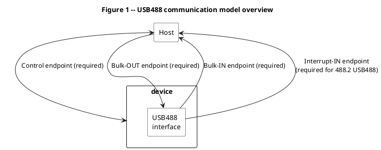
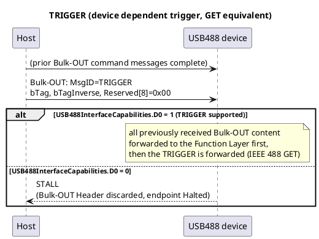
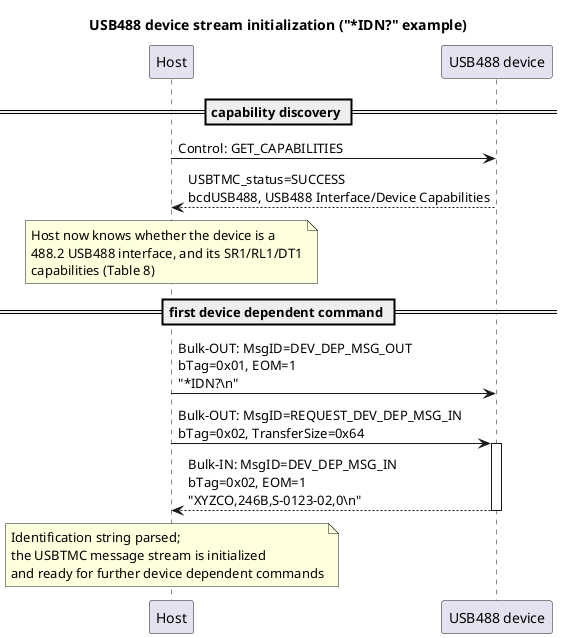
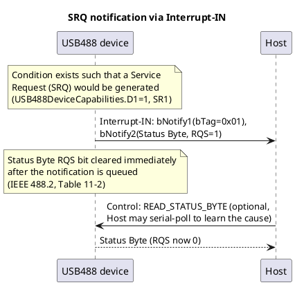
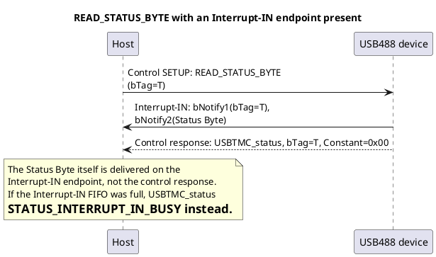
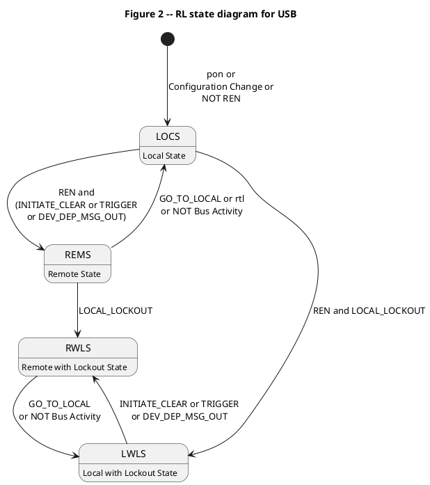
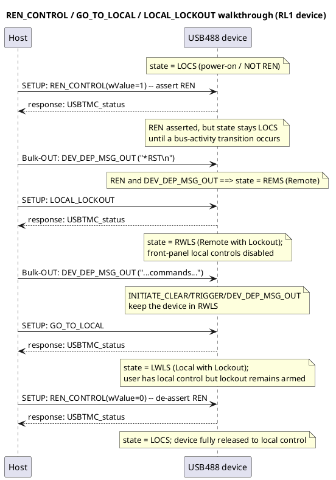

# Universal Serial Bus Test and Measurement Class, Subclass USB488 Specification (USBTMC-USB488)

**Revision 1.0**
**April 14, 2003**

> Converted to Markdown from the original `USBTMC_usb488_subclass_1_00.pdf`. Block diagrams and the state diagram have been redrawn as embedded PlantUML fenced code blocks (language `plantuml`), including sequence diagrams for device stream initialization and the SRQ/status-byte flows.

## Revision History

| Rev | Date | Filename | Comments |
|---|---|---|---|
| 1.0 | April 14, 2003 | USB488_1_00.doc | Copyright notice added. |
| 1.0 | December 22, 2002 | USB488_1_00.doc | 1.0 specification adopted |
| 0.9 | September 17, 2002 | USB488_0_9rc1.doc | Specification moved to 0.9 |
| 0.8 | April 30, 2002 | USB488_0_8a.doc | Specification moved to 0.8 |
| 0.7 | June 26, 2001 | USB488_0_70.doc | Specification effort started in DWG |

Send comments via electronic mail to the DWG chair (pberg@mcci.com).

© Copyright 2003, USB Implementers Forum, Inc. All rights reserved.

**INTELLECTUAL PROPERTY DISCLAIMER**

THIS SPECIFICATION IS PROVIDED "AS IS" WITH NO WARRANTIES WHATSOEVER INCLUDING ANY WARRANTY OF MERCHANTABILITY, FITNESS FOR ANY PARTICULAR PURPOSE, OR ANY WARRANTY OTHERWISE ARISING OUT OF ANY PROPOSAL, SPECIFICATION, OR SAMPLE.

A LICENSE IS HEREBY GRANTED TO REPRODUCE AND DISTRIBUTE THIS SPECIFICATION FOR INTERNAL USE ONLY. NO OTHER LICENSE, EXPRESS OR IMPLIED, BY ESTOPPEL OR OTHERWISE, TO ANY OTHER INTELLECTUAL PROPERTY RIGHTS IS GRANTED OR INTENDED HEREBY.

AUTHORS OF THIS SPECIFICATION DISCLAIM ALL LIABILITY, INCLUDING LIABILITY FOR INFRINGEMENT OF PROPRIETARY RIGHTS, RELATING TO IMPLEMENTATION OF INFORMATION IN THIS SPECIFICATION. AUTHORS OF THIS SPECIFICATION ALSO DO NOT WARRANT OR REPRESENT THAT SUCH IMPLEMENTATION(S) WILL NOT INFRINGE SUCH RIGHTS.

All product names are trademarks, registered trademarks, or servicemarks of their respective owners.

## Contributors

| Name | Company |
|---|---|
| Andy Purcell | Agilent Technologies |
| Kathy Hertzog | Agilent Technologies |
| Steve Schink | Agilent Technologies |
| Jerry Mercola | ICS Electronics |
| Colin White | IFR |
| Makoto Kondo | Kikusui |
| Andrew Thomson | National Instruments |
| Dan Mondrik | National Instruments |
| Eric Singer | National Instruments |
| Geert Knapen | Philips |
| Arnd Diestelhorst | Rohde & Schwarz |
| David Fink | Tektronix |
| Doug Reynolds | Tektronix |

## Table of Contents

- [Revision History](#revision-history)
- [Contributors](#contributors)
- [1 Introduction](#1-introduction)
  - [1.1 Purpose](#1-1-purpose)
  - [1.2 Scope](#1-2-scope)
  - [1.3 Related Documents](#1-3-related-documents)
  - [1.4 Terms and Abbreviations](#1-4-terms-and-abbreviations)
- [2 Overview](#2-overview)
- [3 Interface Endpoints and Characteristics](#3-interface-endpoints-and-characteristics)
  - [3.1 Default control endpoint](#3-1-default-control-endpoint)
  - [3.2 Bulk-OUT](#3-2-bulk-out)
    - [3.2.1 USB488 defined Bulk-OUT command messages](#3-2-1-usb488-defined-bulk-out-command-messages)
      - [3.2.1.1 MsgID = TRIGGER](#3-2-1-1-msgid-trigger)
    - [3.2.2 USB488 Bulk-OUT USBTMC device dependent command message example](#3-2-2-usb488-bulk-out-usbtmc-device-dependent-command-message-example)
    - [3.2.3 Maintaining USB488 Bulk-OUT USBTMC message synchronization](#3-2-3-maintaining-usb488-bulk-out-usbtmc-message-synchronization)
  - [3.3 Bulk-IN](#3-3-bulk-in)
    - [3.3.1 USB488 Bulk-IN example](#3-3-1-usb488-bulk-in-example)
      - [3.3.1.1 Host sends a MsgID = REQUEST_DEV_DEP_MSG_IN command message](#3-3-1-1-host-sends-a-msgid-request-dev-dep-msg-in-command-message)
      - [3.3.1.2 Host reads the Bulk-IN USBTMC message](#3-3-1-2-host-reads-the-bulk-in-usbtmc-message)
    - [Example: USB488 device stream initialization](#example-usb488-device-stream-initialization)
    - [3.3.2 Maintaining USB488 Bulk-IN USBTMC message synchronization](#3-3-2-maintaining-usb488-bulk-in-usbtmc-message-synchronization)
  - [3.4 Interrupt-IN](#3-4-interrupt-in)
    - [3.4.1 Interrupt-IN DATA sent due to an SRQ condition](#3-4-1-interrupt-in-data-sent-due-to-an-srq-condition)
    - [3.4.2 Interrupt-IN DATA sent due to READ_STATUS_BYTE request](#3-4-2-interrupt-in-data-sent-due-to-read-status-byte-request)
- [4 Control endpoint requests](#4-control-endpoint-requests)
  - [4.1 Standard Requests](#4-1-standard-requests)
  - [4.2 USBTMC class specific requests](#4-2-usbtmc-class-specific-requests)
    - [4.2.1 INITIATE_CLEAR](#4-2-1-initiate-clear)
    - [4.2.2 GET_CAPABILITIES](#4-2-2-get-capabilities)
  - [4.3 USB488 subclass specific requests](#4-3-usb488-subclass-specific-requests)
    - [4.3.1 READ_STATUS_BYTE](#4-3-1-read-status-byte)
      - [4.3.1.1 Response format for USB488 interfaces without an Interrupt-IN endpoint](#4-3-1-1-response-format-for-usb488-interfaces-without-an-interrupt-in-endpoint)
      - [4.3.1.2 Response format for USB488 interfaces with an Interrupt-IN endpoint](#4-3-1-2-response-format-for-usb488-interfaces-with-an-interrupt-in-endpoint)
      - [4.3.1.3 Status Byte MAV bit](#4-3-1-3-status-byte-mav-bit)
    - [4.3.2 REN_CONTROL](#4-3-2-ren-control)
    - [4.3.3 GO_TO_LOCAL](#4-3-3-go-to-local)
    - [4.3.4 LOCAL_LOCKOUT](#4-3-4-local-lockout)
    - [Example: local/remote lockout walkthrough](#example-local-remote-lockout-walkthrough)
- [5 Descriptors](#5-descriptors)
  - [5.1 Standard Descriptors](#5-1-standard-descriptors)
    - [5.1.1 Interface descriptor](#5-1-1-interface-descriptor)
    - [5.1.2 USB488 Interrupt-IN endpoint descriptor](#5-1-2-usb488-interrupt-in-endpoint-descriptor)
    - [5.1.3 String Descriptors](#5-1-3-string-descriptors)
- [6 Message Exchange Protocol for USB](#6-message-exchange-protocol-for-usb)
  - [6.1 MEP error processing and USB – clearing the Output Queue](#6-1-mep-error-processing-and-usb-clearing-the-output-queue)
- [Appendix 1: IEEE 488.1 Compatibility (Informative)](#appendix-1-ieee-488-1-compatibility-informative)
  - [IEEE 488.1 bus messages](#ieee-488-1-bus-messages)
    - [Uniline commands](#uniline-commands)
    - [Universal multiline commands](#universal-multiline-commands)
    - [Addressed commands](#addressed-commands)
    - [Secondary commands](#secondary-commands)
  - [Serial Polling](#serial-polling)
  - [Parallel Polling](#parallel-polling)
  - [Interface Function Capabilities](#interface-function-capabilities)
- [Appendix 2: IEEE 488.2 Compatibility](#appendix-2-ieee-488-2-compatibility)
  - [Mandatory IEEE 488.2 common commands and queries](#mandatory-ieee-488-2-common-commands-and-queries)
  - [Optional IEEE 488.2 common commands and queries](#optional-ieee-488-2-common-commands-and-queries)

## Table of Figures

The figures below are embedded PlantUML diagrams; where the diagram redraws a numbered figure from the original PDF, its title keeps that "Figure N" label. Diagrams without a "Figure N" label are sequence/state diagrams added during this conversion to document flows the original spec only described in prose.

1. [Figure 1 -- USB488 communication model overview](#fig-1)
2. [TRIGGER (device dependent trigger, GET equivalent)](#fig-2)
3. [USB488 device stream initialization ("*IDN?" example)](#fig-3)
4. [SRQ notification via Interrupt-IN](#fig-4)
5. [READ_STATUS_BYTE with an Interrupt-IN endpoint present](#fig-5)
6. [Figure 2 -- RL state diagram for USB](#fig-6)
7. [REN_CONTROL / GO_TO_LOCAL / LOCAL_LOCKOUT walkthrough (RL1 device)](#fig-7)

---

## 1 Introduction

### 1.1 Purpose

This subclass document describes requirements for devices with a USB test and measurement class (USBTMC) interface that communicates over USB using USBTMC messages based on the IEEE 488.1 and IEEE 488.2 standards.

This specification assumes familiarity with the USB 2.0 Specification and the USBTMC specification.

### 1.2 Scope

This document specifies the shared attributes, common services, and data formats for devices with a USBTMC USB488 subclass compliant test and measurement interface. Protocol and interoperability requirements are set so that host software can manage multiple implementations based on this USBTMC USB488 Subclass specification.

The definition of Host API's for communication with USB488 interfaces is outside the scope of this specification. USB488 API's and any other specifications needed to achieve USB488 interoperability will be documented in a future VISA specification.

### 1.3 Related Documents

- Universal Serial Bus Specification, Revision 2.0, April 27, 2000, http://www.usb.org
- ANSI X3.4-1986, American National Standard Code for Information Interchange Coded Character Set – 7-bit, http://www.ansi.org
- USB Test and Measurement Class (USBTMC) specification, Revision 1.0, http://www.usb.org
- VISA Specification, http://www.vxipnp.org
- IEEE Std 488.1-1987, IEEE Standard Digital Interface for Programmable Instrumentation, http://www.ieee.org
- IEEE Std 488.2-1992, IEEE Standard Codes, Formats, Protocols, and Common Commands, http://www.ieee.org
- Standard Commands for Programmable Instruments Manual, http://www.scpiconsortium.org

### 1.4 Terms and Abbreviations

| Term | Description |
|---|---|
| 488.2 USB488 interface | A USB488 interface that supports IEEE 488.2 data formats, syntax, mandatory IEEE 488.2 common commands and queries that map to USB (See Table 28) and may support IEEE 488.2 optional commands and queries that map to USB (See Table 30). In addition, a 488.2 USB488 interface must support the Message Exchange Protocol (MEP). A 488.2 USB488 interface must have exactly one Interrupt-IN endpoint. A USB488 interface indicates it is a 488.2 USB488 interface with a bit in the USB488 extensions to the GET_CAPABILITIES response packet. |
| ATN=FALSE message | A GPIB message that is sent with the ATN signal line not-asserted. |
| EOM | End Of (USBTMC) Message |
| GPIB | General Purpose Interface Bus. The IEEE 488.1 and IEEE 488.2 standards specify GPIB. |
| IRP | I/O Request Packet. From the USB 2.0 specification: "An identifiable request by a software client to move data between itself (on the host) and an endpoint of a device in an appropriate direction." |
| MEP | Message Exchange Protocol. See IEEE 488.2, section 6. |
| USB488 interface | A USBTMC interface that further conforms to this subclass specification. |
| VISA | Virtual Instrument Software Architecture |

---

## 2 Overview

The USB488 communication model is shown below in Figure 1.

The control endpoint is required and is used for the required standard USB requests, USBTMC specific requests, and USB488 specific requests.

The Bulk-OUT endpoint is required and is used for sending GPIB ATN=FALSE program messages to a device with a USB488 interface. Example: "*IDN?". The Bulk-OUT endpoint is also used for sending a trigger command message (see 3.2.1.1), since a trigger must be executed synchronously with other Bulk-OUT messages.

The Bulk-IN endpoint is required and is used for receiving GPIB ATN=FALSE response messages from a device with a USB488 interface. Example: the identification string returned after receiving "*IDN?", such as "XYZCO,246B,S000-0123-02,0".

The Interrupt-IN endpoint is required for 488.2 USB488 interfaces and for any USB488 interface that reports SR1 capability in the GET_CAPABILITIES response (See section 4.2.2). Otherwise, the Interrupt-IN endpoint is optional. If present, the Interrupt-IN endpoint must be used to communicate the IEEE 488 defined Status Byte. See section 3.4. The SRQ condition is communicated implicitly whenever a Status Byte is received with RQS = 1.

---

## 3 Interface Endpoints and Characteristics

### 3.1 Default control endpoint

The default control endpoint must support control transfers as defined in the USB 2.0 specification. The default control endpoint is used to send standard, class, and vendor-specific requests to the device, interface, or endpoint. The default control endpoint number must be 0x00.

### 3.2 Bulk-OUT

The Host uses the Bulk-OUT endpoint to send USBTMC command messages to the device. USBTMC device dependent command messages are similar to GPIB ATN=FALSE program messages.

See the USBTMC specification for rules regarding the Bulk-OUT endpoint. In addition, this USB488 subclass specification adds the following rule:

- The Host must not send a new command message with MsgID = DEV_DEP_MSG_OUT or TRIGGER if there is a Bulk-IN transfer that has not yet completed. This rule is consistent with rules from the IEEE 488.2 Message Exchange Protocol (MEP) and enforces the traditional "half-duplex" communication model for IEEE 488 test and measurement devices. If the device parses a USBTMC command message with MsgID = DEV_DEP_MSG_OUT or TRIGGER received on a 488.2 USB488 interface while a Bulk-IN transfer is in progress, the device must perform the IEEE 488.2 defined UNTERMINATED action. See IEEE 488.2 section 6 and this specification, section 6.1.

IEEE 488.2 specifies that a newline character, 0x0A, is one method to send a \<PROGRAM MESSAGE TERMINATOR\>. For USB488 communications, the Host may provide a newline character message terminator as the last USBTMC device dependent command message data byte but is not required to do so. Note that the USBTMC specification requires the Host to indicate the end of a USBTMC message by setting the EOM bit in the Bulk-OUT Header.

#### 3.2.1 USB488 defined Bulk-OUT command messages

The USBTMC specification reserves a range of MsgID values for USBTMC subclasses to define. Table 1 below shows the MsgID definitions for the USB488 subclass.

**Table 1 -- USB488 defined MsgID values**

| MsgID | Direction (OUT=Host-to-device, IN=Device-to-Host) | MACRO | Description |
|---|---|---|---|
| 128 | OUT | TRIGGER | The TRIGGER command message provides a mechanism for the Host to trigger device dependent actions on a device synchronously with other Bulk-OUT messages. Support for this MsgID is optional. See 4.2.2. |
| 128 | IN | (no defined response) | There is no defined response for this command. |
| 129-191 | Reserved | Reserved | Reserved for USBTMC subclass use. |

##### 3.2.1.1 MsgID = TRIGGER

The Host uses MsgID = TRIGGER to identify a transfer that causes a device to trigger and execute device dependent actions synchronously with other Bulk-OUT messages. The device performs actions of an IEEE 488 GET.

The Bulk-OUT Header command specific content for this command is shown below in Table 2.

The Host must not send the TRIGGER request until all Bulk-OUT IRPs to the USB488 interface have completed. The Host must serialize the TRIGGER request with Bulk-OUT and Bulk-IN transfers in order to meet the requirements of IEEE 488.2, section 6.1.4.2.5.

**Table 2 -- TRIGGER Bulk-OUT Header with command specific content**

| Offset | Field | Size | Value | Description |
|---|---|---|---|---|
| 0 | MsgID | 1 | TRIGGER | See Table 1. |
| 1-3 | See the USBTMC specification, Table 1. | 3 | See the USBTMC specification, Table 1. | See the USBTMC specification, Table 1. |
| 4-11 | Reserved | 8 | All bytes must be 0x00. | Reserved. All bytes must be 0x00. |

A device with a USB488 interface must be ready to receive a TRIGGER request at any time.

If GET_CAPABILITES USB488InterfaceCapabilities.D0 = 1, the TRIGGER request (See Table 8), must be forwarded to the Function Layer. To guarantee proper sequencing, all previously received Bulk-OUT USBTMC message content must be forwarded to the Function Layer before the TRIGGER request can be forwarded.

If GET_CAPABILITES USB488InterfaceCapabilities.D0 = 0, the device must remove the Bulk-OUT Header from the Bulk-OUT FIFO and Halt the Bulk-OUT endpoint.

#### 3.2.2 USB488 Bulk-OUT USBTMC device dependent command message example

An example of a USBTMC device dependent command message, "*IDN?\n", is shown below in Table 3.

**Table 3 -- Example "*IDN?" Bulk-OUT USBTMC device dependent command message**

| Offset | Field | Size | Value | Description |
|---|---|---|---|---|
| 0 | MsgID | 1 | DEV_DEP_MSG_OUT | See the USBTMC specification, Table 1. |
| 1 | bTag | 1 | 0x01 (varies with each transfer) | See the USBTMC specification, Table 1. |
| 2 | bTagInverse | 1 | 0xFE | See the USBTMC specification, Table 1. |
| 3 | Reserved | 1 | 0x00 | See the USBTMC specification, Table 1. |
| 4-7 | TransferSize | 4 | 0x00000006 | Command specific content. See the USBTMC specification, Table 3. |
| 8 | bmTransferAttributes | 1 | 0x01 (EOM is set). | Command specific content. See the USBTMC specification, Table 3. |
| 9-11 | Reserved | 3 | 0x000000 | Command specific content. See the USBTMC specification, Table 3. |
| 12 | Device dependent message data bytes | 1 | 0x2A = '*' | USBTMC message data byte 0. |
| 13 | Device dependent message data bytes | 1 | 0x49 = 'I' | USBTMC message data byte 1. |
| 14 | Device dependent message data bytes | 1 | 0x44 = 'D' | USBTMC message data byte 2. |
| 15 | Device dependent message data bytes | 1 | 0x4E = 'N' | USBTMC message data byte 3. |
| 16 | Device dependent message data bytes | 1 | 0x3F = '?' | USBTMC message data byte 4. |
| 17 | Device dependent message data bytes | 1 | 0x0A = '\n' = newline | USBTMC message data byte 5. |
| 18-19 | Alignment bytes (required to make the number of bytes in the transaction a multiple of 4) | 2 | 0x0000 (not required to be 0x0000) | Two alignment bytes are added to bring the number of DATA bytes in the transaction to 20, which is divisible by 4. |

#### 3.2.3 Maintaining USB488 Bulk-OUT USBTMC message synchronization

See the USBTMC specification, section 3.2.2.

### 3.3 Bulk-IN

The Host uses the Bulk-IN endpoint to read USBTMC response messages from the device. The Host must first send a USBTMC command message that expects a response before attempting to read a USBTMC response message.

If the Host sends a USBTMC MsgID = REQUEST_DEV_DEP_MSG_IN, the device may then send a MsgID = DEV_DEP_MSG_IN response message on the Bulk-IN endpoint. USBTMC response messages with MsgID = DEV_DEP_MSG_IN (See USBTMC specification section 3.3.1.1) are similar to GPIB ATN=FALSE response messages.

See the USBTMC specification for rules regarding the Bulk-IN endpoint.

IEEE 488.2 specifies that a newline character, 0x0A, must be sent as a \<RESPONSE MESSAGE TERMINATOR\>. Therefore, a device with a 488.2 USB488 interface must transfer a newline character as the last byte in a USBTMC device dependent message. As stated in the USBTMC specification, the device must indicate the end of the USBTMC message by setting the EOM bit in the Bulk-IN Header.

#### 3.3.1 USB488 Bulk-IN example

Sections 3.3.1.1 and 3.3.1.2 below show an example sequence for reading a USBTMC response message from a device. The example shows the Host first sending a MsgID = REQUEST_DEV_DEP_MSG_IN command message and the device then returning a response to the "*IDN?\n" query shown in Table 3.

##### 3.3.1.1 Host sends a MsgID = REQUEST_DEV_DEP_MSG_IN command message

The Host first sends a MsgID = REQUEST_DEV_DEP_MSG_IN command message. This is shown below in Table 4. In this example the application buffer size is 100 (0x64) bytes.

**Table 4 -- REQUEST_DEV_DEP_MSG_IN example**

| Offset | Field | Size | Value | Description |
|---|---|---|---|---|
| 0 | MsgID | 1 | REQUEST_DEV_DEP_MSG_IN | See the USBTMC specification, Table 1. |
| 1 | bTag | 1 | 0x02 (varies with each transfer) | See the USBTMC specification, Table 1. |
| 2 | bTagInverse | 1 | 0xFD | See the USBTMC specification, Table 1. |
| 3 | Reserved | 1 | 0x00 | See the USBTMC specification, Table 1. |
| 4-7 | TransferSize | 4 | 0x00000064 | Command specific content. See the USBTMC specification, Table 4. |
| 8 | bmTransferAttributes | 1 | 0x00 | Command specific content. See the USBTMC specification, Table 4. |
| 9 | TermChar | 1 | 0x00 | Command specific content. See the USBTMC specification, Table 4. |
| 10-11 | Reserved | 2 | 0x0000 | Command specific content. See the USBTMC specification, Table 4. |

##### 3.3.1.2 Host reads the Bulk-IN USBTMC message

After sending the MsgID = REQUEST_DEV_DEP_MSG_IN command message shown in Table 4, the Host sends a Bulk-IN request. In this example, the USB488 device sends the USBTMC response message "XYZCO,246B,S-0123-02,0\n", shown below in Table 5. Note that the actual response semantics for a "*IDN?\n" response are specified in IEEE 488.2, section 10.14.3.

**Table 5 -- Bulk-IN example, 488.2 compliant response USBTMC message**

| Offset | Field | Size | Value | Description |
|---|---|---|---|---|
| 0 | MsgID | 1 | DEV_DEP_MSG_IN | See the USBTMC specification, Table 8. |
| 1 | bTag | 1 | 0x02 (matches bTag in REQUEST_DEV_DEP_MSG_IN) | See the USBTMC specification, Table 8. |
| 2 | bTagInverse | 1 | 0xFD | See the USBTMC specification, Table 8. |
| 3 | Reserved | 1 | 0x00 | See the USBTMC specification, Table 8. |
| 4-7 | TransferSize | 4 | 0x00000017 | USBTMC response specific content. See the USBTMC specification, Table 9. |
| 8 | bmTransferAttributes | 1 | 0x01 (EOM=1) | USBTMC response specific content. See the USBTMC specification, Table 9. |
| 9-11 | Reserved | 3 | 0x000000 | USBTMC response specific content. See the USBTMC specification, Table 9. |
| 12-33 | Device dependent message data bytes | 22 | `XYZCO,246B,S-0123-02,0` (ASCII) | USBTMC message data bytes 0-21. |
| 34 | Device dependent message data byte | 1 | 0x0A = '\n' = newline | USBTMC message data byte 22. |
| 35 | Alignment byte | 1 | 0x00 (not required to be 0x00) | Alignment byte. |

One alignment byte is shown as an example of a transfer from a device that does 16-bit wide DMA to the Bulk-IN FIFO. The alignment byte brings the total number of bytes to 12 + 23 + 1 = 36, which is a multiple of 2 bytes. As stated in the USBTMC specification, a device is not required to send any alignment bytes.

#### Example: USB488 device stream initialization

The sequence below ties together capability discovery (section 4.2.2) and the "*IDN?" example above (sections 3.2.2, 3.3.1.1, 3.3.1.2) into the sequence a Host typically performs the first time it opens a USB488 device's message stream: read the device's capabilities, then send the first device dependent command message and read its response.

#### 3.3.2 Maintaining USB488 Bulk-IN USBTMC message synchronization

See the USBTMC specification, section 3.3.2.

### 3.4 Interrupt-IN

488.2 USB488 interfaces must include an Interrupt-IN endpoint. In addition, any USB488 interface with service request capability (IEEE 488.1 SR1) must have an Interrupt-IN endpoint.

The Host, after receiving an Interrupt-IN notification, must consider the interrupt transfer complete. The Host must interpret the next Interrupt-IN DATA as a new notification, beginning with bNotify1.

#### 3.4.1 Interrupt-IN DATA sent due to an SRQ condition

If GET_CAPABILITIES USB488DeviceCapabilities.D1 = 1 (SR1), and if conditions exist such that a service request (SRQ) would be generated, the device must send an Interrupt-IN packet with the format shown below in Table 6.

**Table 6 -- USB488 Interrupt-IN packet sent due to an SRQ condition**

| Offset | Field | Size | Value | Description |
|---|---|---|---|---|
| 0 | bNotify1 | 1 | Bitmap | D7 Must be 1. See the USBTMC specification, section 3.4. D6...D0 bTag. The bTag field must be 0x01. |
| 1 | bNotify2 | 1 | StatusByte | For 488.2 USB488 interfaces, the format is the IEEE 488.2 defined Status Byte returned during a serial poll. Otherwise, the format is the IEEE 488.1 defined Status Byte. |

When the response is queued, the Status Byte is modified in the same way an IEEE 488.2 device modifies the Status Byte after an SRQ/serial poll sequence. This means a device must clear the Status Byte RQS bit after a Status Byte (with RQS set) is queued to be sent on the Interrupt-IN pipe. See IEEE 488.2, Table 11-2.

#### 3.4.2 Interrupt-IN DATA sent due to READ_STATUS_BYTE request

If a USB488 interface includes an Interrupt-IN endpoint, and a READ_STATUS_BYTE request is received, the device must send an Interrupt-IN packet with the format shown below in Table 7.

**Table 7 -- USB488 Interrupt-IN packet sent due to READ_STATUS_BYTE request**

| Offset | Field | Size | Value | Description |
|---|---|---|---|---|
| 0 | bNotify1 | 1 | Number | D7 Must be 1. See the USBTMC specification, section 3.4. D6...D0 The bTag value must be the same as the bTag value in the READ_STATUS_BYTE request. See section 4.3.1. |
| 1 | bNotify2 | 1 | StatusByte | For 488.2 USB488 interfaces, the format is the IEEE 488.2 defined Status Byte returned during a serial poll. Otherwise, the format is the IEEE 488.1 defined Status Byte. |

---

## 4 Control endpoint requests

### 4.1 Standard Requests

See USB 2.0 specification, section 9.4.

### 4.2 USBTMC class specific requests

See the USBTMC specification, section 4.2, and sections 4.2.1 and 4.2.2 below.

#### 4.2.1 INITIATE_CLEAR

Upon receiving the INITIATE_CLEAR request, the device performs actions similar to those specified for Selected Device Clear in the IEEE 488 specifications. For 488.2 USB488 interfaces, see IEEE 488.2, section 5.8. Otherwise, see IEEE 488.1, section 2.10.

#### 4.2.2 GET_CAPABILITIES

When a device receives this request, the device must queue the response shown below in Table 8.

**Table 8 -- GET_CAPABILITIES response packet**

| Offset | Field | Size | Value | Description |
|---|---|---|---|---|
| 0-11 | Reserved | 12 | Reserved | See the USBTMC specification, Table 37. 488.2 USB488 interfaces must set USBTMCInterfaceCapabilities.D1 = 0 and USBTMCInterfaceCapabilities.D0 = 0. |
| 12 | bcdUSB488 | 2 | BCD (0x0100 or greater) | BCD version number of the relevant USB488 specification for this USB488 interface. Format is as specified for bcdUSB in the USB 2.0 specification, section 9.6.1. |
| 14 | USB488 Interface Capabilities | 1 | Bitmap | D7…D3 Reserved. All bits must be 0. D2: 1 – The interface is a 488.2 USB488 interface. 0 – The interface is not a 488.2 USB488 interface. D1: 1 – The interface accepts REN_CONTROL, GO_TO_LOCAL, and LOCAL_LOCKOUT requests. 0 – The interface does not accept REN_CONTROL, GO_TO_LOCAL, and LOCAL_LOCKOUT requests. The device, when these requests are received, must treat these commands as a non-defined command and return a STALL handshake packet. D0: 1 – The interface accepts the MsgID = TRIGGER USBTMC command message and forwards TRIGGER requests to the Function Layer. 0 – The interface does not accept the TRIGGER USBTMC command message. The device, when the TRIGGER USBTMC command message is received, must treat it as an unknown MsgID and halt the Bulk-OUT endpoint. |
| 15 | USB488 Device Capabilities | 1 | Bitmap | D7…D4 Reserved. All bits must be 0. D3: 1 – The device understands all mandatory SCPI commands. See SCPI Chapter 4, SCPI Compliance Criteria. 0 – The device may not understand all mandatory SCPI commands. If the parser is dynamic and may not understand SCPI, this bit must = 0. D2: 1 – The device is SR1 capable. The interface must have an Interrupt-IN endpoint. The device must use the Interrupt-IN endpoint as described in 3.4.1 to request service, in addition to the other uses described in this specification. 0 – The device is SR0. If the interface contains an Interrupt-IN endpoint, the device must not use the Interrupt-IN endpoint as described in 3.4.1 to request service. The device must use the endpoint for all other uses described in this specification. See IEEE 488.1, section 2.7. If USB488InterfaceCapabilities.D2 = 1, also see IEEE 488.2, section 5.5. D1: 1 – The device is RL1 capable. The device must implement the state machine shown in Figure 2. 0 – The device is RL0. The device does not implement the state machine shown in Figure 2. See IEEE 488.1, section 2.8. If USB488InterfaceCapabilities.D2 = 1, also see IEEE 488.2, section 5.6. D0: 1 – The device is DT1 capable. 0 – The device is DT0. See IEEE 488.1, section 2.11. If USB488InterfaceCapabilities.D2 = 1, also see IEEE 488.2, section 5.9. |
| 16 | Reserved | 8 | All bytes must be 0x00. | Reserved for USB488 use. All bytes must be 0x00. |

The following rules must be followed:

1. If USB488DeviceCapabilities.D0 = 1 (DT1) then USB488InterfaceCapabilities.D0 must = 1.
2. If USB488DeviceCapabilities.D1 = 1 (RL1) then USB488InterfaceCapabilities.D1 must = 1.
3. If USB488InterfaceCapabilities.D2 = 1 (488.2 USB488 interface) then USB488DeviceCapabilities.D2 must = 1 (SR1).
4. If USB488DeviceCapabilities.D3 = 1 (SCPI) then USB488DeviceCapabilities.D2 must = 1 (SR1) and USB488InterfaceCapabilities.D2 must = 1 (488.2 USB488 interface).

### 4.3 USB488 subclass specific requests

In addition to standard requests and the USBTMC defined class specific requests, there are subclass requests defined for devices with USB488 interfaces. These subclass defined requests are sent with a SETUP packet with bmRequestType.Type = CLASS.

The set of USB488 subclass bRequest values are shown below in Table 9.

**Table 9 -- USB488 defined bRequest values**

| bRequest | Name | Required/Optional | Description |
|---|---|---|---|
| 0-127 | Reserved | Reserved | Reserved for use by USBTMC specification. |
| 128 | READ_STATUS_BYTE | Required. | Returns the IEEE 488 Status Byte. |
| 129-159 | Reserved | Reserved | Reserved by USB488 subclass specification. |
| 160 | REN_CONTROL | Optional. | Mechanism to enable or disable local controls on a device. |
| 161 | GO_TO_LOCAL | Optional. | Mechanism to enable local controls on a device. |
| 162 | LOCAL_LOCKOUT | Optional. | Mechanism to disable local controls on a device. |
| 163-191 | Reserved | Reserved | Reserved by USB488 subclass specification. |
| 192-255 | Reserved | Reserved | Reserved for use by the VISA specification. |

All USB488 subclass specific requests return data to the Host and have a data payload that begins with a 1 byte USBTMC_status field. The USBTMC_status values are defined in the USBTMC specification, Table 13 and below in Table 10.

**Table 10 -- USB488 defined USBTMC_status values**

| USBTMC_status | MACRO | Recommended interpretation by Host software | Description |
|---|---|---|---|
| 0x00-0x1F | Reserved | Reserved | See the USBTMC specification, Table 16. |
| 0x20 | STATUS_INTERRUPT_IN_BUSY | Warning | This status is valid if a device has received a READ_STATUS_BYTE request, the USB488 interface has an Interrupt-IN endpoint, and the device is unable to queue the response packet on the Interrupt-IN endpoint because the FIFO is full. |
| 0x21-0x3F | Reserved | Warning | Reserved for subclass use. |
| 0x40-0x9F | Reserved | Reserved | See the USBTMC specification, Table 16. |
| 0xA0-0xBF | Reserved | Failure | Reserved for subclass use. |
| 0xC0-0xFF | Reserved | Failure | See the USBTMC specification, Table 16. |

#### 4.3.1 READ_STATUS_BYTE

The READ_STATUS_BYTE request provides the ability for a Host to read the IEEE 488 Status Byte on the device.

For this request, the Setup packet fields are as shown below in Table 11.

**Table 11 -- READ_STATUS_BYTE Setup packet**

| Field | Value |
|---|---|
| bmRequestType | 0xA1 (Dir = IN, Type = Class, Recipient = Interface) |
| bRequest | READ_STATUS_BYTE, see Table 9 |
| wValue | D7 Must be 0. D6…D0 The bTag value (2 <= bTag <=127) for this request. The device must return this bTag value along with the Status Byte. The Host should increment the bTag by 1 for each new READ_STATUS_BYTE request to help identify when the response arrives on the Interrupt-IN endpoint. D15...D8 Reserved. Must be 0x00. |
| wIndex | Must specify interface number per the USB 2.0 specification, section 9.3.4. |
| wLength | 0x0003. Number of bytes to transfer per the USB 2.0 specification, section 9.3.5. |

A device with a USB488 interface must be ready to receive a READ_STATUS_BYTE request at any time.

##### 4.3.1.1 Response format for USB488 interfaces without an Interrupt-IN endpoint

When a device receives READ_STATUS_BYTE, and the USB488 interface does not have an Interrupt-IN endpoint, the device must queue the control endpoint response shown below in Table 12.

**Table 12 -- READ_STATUS_BYTE control endpoint response format (no Interrupt-IN endpoint)**

| Offset | Field | Size | Value | Description |
|---|---|---|---|---|
| 0 | USBTMC_status | 1 | Value | Status indication for this request. See the USBTMC specification, Table 16. |
| 1 | bTag | 1 | Value | The bTag value from the READ_STATUS_BYTE request. |
| 2 | Status Byte | 1 | Value | The format is the IEEE 488.1 defined Status Byte. RQS must be 0. (If the USB488 interface does not have an Interrupt-IN endpoint, the device has no service request capability and is SR0. IEEE 488.1 requires SR1 to enter into the APRS state, which is the only state where RQS = True can be sent. See IEEE 488.1, section 2.7.3.3). |

##### 4.3.1.2 Response format for USB488 interfaces with an Interrupt-IN endpoint

When a device receives READ_STATUS_BYTE, and the USB488 interface has an Interrupt-IN endpoint, the device must queue the control endpoint response shown below in Table 13. In addition, the device must return a response on the Interrupt-IN endpoint. The format of the response on the Interrupt-IN endpoint is shown in Table 7. The device must queue the Interrupt-IN endpoint response and then queue this control endpoint response. If the Interrupt-IN endpoint response can not be queued because the Interrupt-IN FIFO is full, the device must set the control endpoint response USBTMC_status = STATUS_INTERRUPT_IN_BUSY.

**Table 13 -- READ_STATUS_BYTE control endpoint response format (Interrupt-IN endpoint present)**

| Offset | Field | Size | Value | Description |
|---|---|---|---|---|
| 0 | USBTMC_status | 1 | Value | Status indication for this request. See the USBTMC specification, Table 16, and this specification, Table 10. |
| 1 | bTag | 1 | Value | The bTag value from the READ_STATUS_BYTE request. |
| 2 | Constant | 1 | 0x00 | Status Byte will be returned on Interrupt-IN endpoint. |

##### 4.3.1.3 Status Byte MAV bit

Devices with a 488.2 USB488 interfaces must set the Status Byte MAV-bit TRUE when the device is ready to send data to the Host. MAV must be set even if the device has not yet received a MsgID = REQUEST_DEV_DEP_MSG_IN. MAV must remain TRUE until the last byte in the Bulk-IN transfer has been sent and there are no more Bulk-IN transfers ready to send. The MAV-bit may remain TRUE until the last byte in the USBTMC message has been sent (See IEEE 488.2, section 11.2.1.2).

#### 4.3.2 REN_CONTROL

The REN_CONTROL request, in combination with GO_TO_LOCAL and LOCAL_LOCKOUT, provides the ability to enable or disable local controls on a device.

Devices with USB488 interfaces that report RL1 capability in the GET_CAPABILITIES response must implement the following state machine. The USB 2.0 specification, Figure 8-17 shows a legend for state machine diagrams. In addition, see Table 14 below.

**Table 14 -- LOCAL REMOTE state machine terminology**

| State Diagram Term | Explanation |
|---|---|
| LOCS | Local State. See IEEE 488.1 section 2.8 and IEEE 488.2 section 5.6 |
| LWLS | Local with Lockout State. See IEEE 488.1 section 2.8 and IEEE 488.2 section 5.6 |
| REMS | Remote State. See IEEE 488.1 section 2.8 and IEEE 488.2 section 5.6. |
| RWLS | Remote with Lockout State. See IEEE 488.1 section 2.8 and IEEE 488.2 section 5.6 |
| pon | "Power on" local message. |
| rtl | "Return to local" local message. |
| (overbar) Bus Activity | The device is detached from the USB or the device is suspended. |
| Configuration Change | This transition occurs when either: the device is in the "Address" state, a SET_CONFIGURATION request is received, and the specified configuration includes a USB488 interface; or the device is in the "Configured" state, the current configuration includes a USB488 interface, and the device receives a SET_CONFIGURATION request with a configuration value of 0 or some other valid configuration value. See the USB 2.0 specification, Figure 9-1 and section 9.4.7. |
| DEV_DEP_MSG_OUT | Device received USBTMC command message with MsgID=DEV_DEP_MSG_OUT and the USB488 interface is not talk-only. |
| TRIGGER | Device received USBTMC command message with MsgID=TRIGGER and the device reports TRIGGER (GET_CAPABILITIES USB488DeviceCapabilities.D0 = 1 (DT1)). |
| INITIATE_CLEAR | Device received INITIATE_CLEAR control endpoint request. |
| LOCAL_LOCKOUT | Device received LOCAL_LOCKOUT control endpoint request. |
| GO_TO_LOCAL | Device received GO_TO_LOCAL control endpoint request. |
| REN | Remote Enable. Device received REN_CONTROL control endpoint request with wValue = 1, asserting REN. |
| (overbar) REN | Not Remote Enable. Device received REN_CONTROL control endpoint with wValue = 0, de-asserting REN. This is the default power-on state for REN. |

For this request, the Setup packet fields are as shown below in Table 15.

**Table 15 -- REN_CONTROL Setup packet**

| Field | Value |
|---|---|
| bmRequestType | 0xA1 (Dir = IN, Type = Class, Recipient = Interface) |
| bRequest | REN_CONTROL, see Table 9 |
| wValue | D7...D0: 1 - Assert REN. REN remains asserted until explicitly de-asserted, a Configuration Change occurs, or a power-on condition occurs. 0 - De-assert REN. Remains de-asserted until explicitly asserted. D15...D8: Reserved. Must be 0x00. |
| wIndex | Must specify interface number per the USB 2.0 specification, section 9.3.4. |
| wLength | 0x0001. Number of bytes to transfer per the USB 2.0 specification, section 9.3.5. |

A device with a USB488 interface must be ready to receive a REN_CONTROL request at any time. If GET_CAPABILITIES USB488InterfaceCapabilities.D1 = 1, then the device must forward REN_CONTROL requests to the Function Layer. If GET_CAPABILITIES USB488InterfaceCapabilities.D1 = 0, then the device must return a STALL handshake packet.

When the actions associated with the request have completed, the device must return the control endpoint response shown in Table 16.

**Table 16 -- REN_CONTROL response format**

| Offset | Field | Size | Value | Description |
|---|---|---|---|---|
| 0 | USBTMC_status | 1 | Value | Status indication for this request. See the USBTMC specification, Table 16. |

#### 4.3.3 GO_TO_LOCAL

The GO_TO_LOCAL request, in combination with REN_CONTROL and LOCAL_LOCKOUT, provides the ability to enable or disable local controls on a device.

For this request, the Setup packet fields are as shown below in Table 17.

**Table 17 -- GO_TO_LOCAL Setup packet**

| Field | Value |
|---|---|
| bmRequestType | 0xA1 (Dir = IN, Type = Class, Recipient = Interface) |
| bRequest | GO_TO_LOCAL, see Table 9 |
| wValue | 0x0000 |
| wIndex | Must specify interface number per the USB 2.0 specification, section 9.3.4. |
| wLength | 0x0001. Number of bytes to transfer per the USB 2.0 specification, section 9.3.5. |

A device with a USB488 interface must be ready to receive a GO_TO_LOCAL request at any time. If GET_CAPABILITIES USB488InterfaceCapabilities.D1 = 1, then the device must forward GO_TO_LOCAL requests to the Function Layer. If GET_CAPABILITIES USB488InterfaceCapabilities.D1 = 0, then the device must return a STALL handshake packet.

For required USB488 device behavior, see the state machine in Figure 2.

When the actions associated with the request have completed, the device must return the control endpoint response shown in Table 18.

**Table 18 -- GO_TO_LOCAL response format**

| Offset | Field | Size | Value | Description |
|---|---|---|---|---|
| 0 | USBTMC_status | 1 | Value | Status indication for this request. See the USBTMC specification, Table 16. |

#### 4.3.4 LOCAL_LOCKOUT

The LOCAL_LOCKOUT request, in combination with REN_CONTROL and GO_TO_LOCAL, provides the ability to enable or disable local controls on a device.

For this request, the Setup packet fields are as shown below in Table 19.

**Table 19 -- LOCAL_LOCKOUT Setup packet**

| Field | Value |
|---|---|
| bmRequestType | 0xA1 (Dir = IN, Type = Class, Recipient = Interface) |
| bRequest | LOCAL_LOCKOUT, see Table 9 |
| wValue | 0x0000 |
| wIndex | Must specify interface number per the USB 2.0 specification, section 9.3.4. |
| wLength | 0x0001. Number of bytes to transfer per the USB 2.0 specification, section 9.3.5. |

A device with a USB488 interface must be ready to receive a LOCAL_LOCKOUT request at any time. If GET_CAPABILITIES USB488InterfaceCapabilities.D1 = 1, then the device must forward LOCAL_LOCKOUT requests to the Function Layer. If GET_CAPABILITIES USB488InterfaceCapabilities.D1 = 0, then the device must return a STALL handshake packet.

For required USB488 device behavior, see the state machine in Figure 2.

When the actions associated with the request have completed, the device must return the control endpoint response shown in Table 20.

**Table 20 -- LOCAL_LOCKOUT response format**

| Offset | Field | Size | Value | Description |
|---|---|---|---|---|
| 0 | USBTMC_status | 1 | Value | Status indication for this request. See the USBTMC specification, Table 16. |

#### Example: local/remote lockout walkthrough

The sequence below walks the RL state diagram (Figure 2, section 4.3.2) through a full cycle a Host driver commonly performs: assert REN to force the device remote, lock out its front panel, drive it with commands, then release it back to local control. Each control request corresponds to the labeled transitions in Figure 2.

---

## 5 Descriptors

### 5.1 Standard Descriptors

The USB Descriptors, except where specified below, are as specified in the USBTMC specification and the USB 2.0 specification.

#### 5.1.1 Interface descriptor

**Table 21 -- USB488 interface descriptor**

| Offset | Field | Size | Value | Description |
|---|---|---|---|---|
| 0 | bLength | 1 | 0x09 | Size of this descriptor in bytes. |
| 1 | bDescriptorType | 1 | 0x04 | INTERFACE Descriptor Type. See USB 2.0 specification, Table 9-5. |
| 2 | bInterfaceNumber | 1 | Number | 0-based number for this interface in this configuration. |
| 3 | bAlternateSetting | 1 | 0x00 | Default setting for this interface. |
| 4 | bNumEndpoints | 1 | Number | Number of endpoints for this interface, not including the default endpoint. |
| 5 | bInterfaceClass | 1 | 0xFE | Class code. See the USBTMC specification, Table 43. |
| 6 | bInterfaceSubClass | 1 | 0x03 | SubClass code. See the USBTMC specification, Table 43. |
| 7 | bInterfaceProtocol | 1 | 0x01 | Protocol code. See the USBTMC specification, Table 44. |
| 8 | iInterface | 1 | Index | Index of string descriptor describing this interface. |

A USB488 interface with a bInterfaceProtocol = 0x01 must have exactly one Bulk-OUT endpoint, exactly one Bulk-IN endpoint, and may have at most one Interrupt-IN endpoint. If GET_CAPABILITIES USB488DeviceCapabilites.D2 = 1 (SR1), the interface must have exactly one Interrupt-IN endpoint. Additional endpoints must be placed in another interface.

#### 5.1.2 USB488 Interrupt-IN endpoint descriptor

For USB488 interfaces with an Interrupt-IN endpoint, Table 22 below specifies the format of the Interrupt-IN endpoint descriptor.

**Table 22 -- Interrupt-IN endpoint descriptor**

| Offset | Field | Size | Value | Description |
|---|---|---|---|---|
| 0 | bLength | 1 | 0x07 | Size of this descriptor in bytes. |
| 1 | bDescriptorType | 1 | 0x05 | ENDPOINT Descriptor Type. See USB 2.0 specification, Table 9-5. |
| 2 | bEndpointAddress | 1 | Endpoint | As specified in the USB 2.0 specification, Table 9-13. |
| 3 | bmAttributes | 1 | Bitmap | As specified in the USB 2.0 specification, Table 9-13. |
| 4 | wMaxPacketSize | 2 | Number | As specified in the USB 2.0 specification, Table 9-13. D15…D13 Reserved. All bits must be 0. D12…D11 Number of additional transaction opportunities per microframe. All bits should be 0. D10…D0 Maximum packet size (in bytes). If the device does not send vendor specific notifications, must be 0x02. |
| 6 | bInterval | 1 | Number | As specified in the USB 2.0 specification, Table 9-13. |

#### 5.1.3 String Descriptors

See the USBTMC specification, section 5.1 and section 5.7 for string descriptor requirements.

If a USB488 device supports "*IDN?", the "*IDN?" response should be such that:

- Field1, the Manufacturer part of the response, is the iManufacturer string descriptor mapped to ASCII.
- Field2, the Model part of the response, is the iProduct string descriptor mapped to ASCII.
- Field3, the Serial number part of the response, if non-zero, is the iSerialNumber string descriptor mapped to ASCII.

Field4, the firmware level part of the response, is vendor specific.

---

## 6 Message Exchange Protocol for USB

Devices with a 488.2 USB488 interfaces must support the Message Exchange Protocol (MEP). All requirements in IEEE 488.2 section 6, "Message Exchange Control Protocol", must be followed with a redefinition of the **bav**, **brq**, **get**, **dcas**, and **RMT-sent** signals shown in Table 23.

**Table 23 -- USB MEP messages**

| Message | Description |
|---|---|
| bav | Byte available message. Is set TRUE when a USBTMC command message with MsgID = DEV_DEP_MSG_OUT has been parsed. Is set FALSE when any of the following are true: 1. The device detects the Bulk-OUT transfer is completed. See the USBTMC specification, section 3.2. 2. An INITIATE_ABORTED_BULK_OUT has been received and the current Bulk-OUT transfer will be aborted. 3. An INITIATE_CLEAR has been received. 4. The device is suspended or detached and all bytes have been transferred out of the Bulk-OUT FIFO. |
| brq | Byte requested message. Is set TRUE when a USBTMC command message with MsgID = REQUEST_DEV_DEP_MSG_IN has been parsed. Is set FALSE when any of the following are true: 1. The Bulk-IN transfer to the Host is completed. The transfer is considered complete if and only if a non-wMaxPacketSize packet has been sent. 2. An ABORTED_BULK_IN has been received and the current Bulk-IN transfer will be aborted. 3. An INITIATE_CLEAR has been received. 4. The device is suspended or detached. |
| get | Group Execute Trigger message. Is set when a USBTMC command message with MsgID = TRIGGER has been parsed and the device reports TRIGGER (GET_CAPABILITIES USB488DeviceCapabilities.D0 = 1 (DT1)). |
| dcas | Device Clear Active State. Is set TRUE when INITIATE_CLEAR request is received. Is set FALSE immediately upon successfully sending a CHECK_CLEAR_STATUS response with USBTMC_STATUS not equal to STATUS_PENDING. |
| RMT-sent | Remote Message Terminator sent. Is set TRUE when the last byte in a Bulk-IN USBTMC response message with MsgID = REQUEST_DEV_DEP_MSG_IN transfer with EOM = 1 has been sent. Is set FALSE by bav or brq. |

### 6.1 MEP error processing and USB – clearing the Output Queue

According to the IEEE 488.2 Message Exchange Protocol, a device must clear the Output Queue when executing INITIALIZE, UNTERMINATED or INTERRUPTED actions. If clearing the Output Queue associated with a 488.2 USB488 interface, the device must Halt the Bulk-IN endpoint only if a Bulk-IN transfer is in progress and response message data bytes have been queued but not sent.

---

## Appendix 1: IEEE 488.1 Compatibility (Informative)

### IEEE 488.1 bus messages

There are four different types of IEEE 488.1 bus messages:

- Uniline,
- Universal multiline,
- Addressed,
- Secondary.

The USB compatibility for each is addressed below.

#### Uniline commands

The definition of uniline commands is found in IEEE 488.1, 2.13.2, "For this standard, a message derived from or sent as a logical state of only one signal line is referred to as a uniline message."

In IEEE 488.1, these commands are broadcast to all attached devices. In USB, there is no broadcast mechanism.

**Table 24 -- IEEE 488.1 compatibility - uniline commands**

| Uniline command | Comment |
|---|---|
| Interface Clear (IFC) | Host software may implement this by retiring all Bulk-OUT and Bulk-IN IRPs to all attached devices with USB488 interfaces. |
| Remote Enable | Host software may implement this by sending REN_CONTROL to all attached devices with USB488 interfaces with RL1 capability. |
| Attention | Does not apply to USB. |
| Identify | Does not apply to USB. |

#### Universal multiline commands

The definition of universal multiline commands is found in IEEE 488.1, 2.13.2, "For this standard, a message derived from or sent as a combination of logical states of two or more signal lines is referred to as a multiline message."

In IEEE 488.1, these commands are broadcast to all attached devices. In USB, there is no broadcast mechanism.

**Table 25 -- IEEE 488.1 compatibility - universal multiline commands**

| Universal multiline command | Comment |
|---|---|
| Device Clear | Host software may implement this by sending individual INITIATE_CLEAR requests to all attached devices with USB488 interfaces. |
| Local Lockout | Host software may implement this by sending a combination of REN_CONTROL and LOCAL_LOCKOUT requests to all attached devices with USB488 interfaces. |
| Serial Poll Enable | Does not apply to USB. |
| Serial Poll Disable | Does not apply to USB. |
| Parallel Poll Unconfigure | Does not apply to USB. |

#### Addressed commands

In IEEE 488.1, these commands are multicast to all attached devices addressed to listen. In USB, there is no multicast mechanism.

**Table 26 -- IEEE 488.1 compatibility - addressed commands**

| Addressed command | Comment |
|---|---|
| Group Execute Trigger (GET) | Host software may implement this by sending individual TRIGGER or "*TRG" commands to the appropriate USB488 interfaces, provided the interface supports this capability (GET_CAPABILITIES USB488DeviceCapabilities.D0 = 1 (DT1)). |
| Selected Device Clear (SDC) | Host software may implement this by sending an INITIATE_CLEAR request to the appropriate USB488 interfaces. |
| Go to local (GTL) | Host software may implement this by sending a combination of REN_CONTROL and GO_TO_LOCAL requests to the appropriate USB488 interfaces. |
| Parallel Poll Configure (PPC) | Does not apply to USB. |
| Take Control (TCT) | Does not apply to USB. |

#### Secondary commands

Secondary commands consist of the ASCII characters 96-127 decimal. They are used for extended talk and listen secondary addresses and secondary parallel poll commands.

The addressing of sub devices in a complex instrument, accomplished in IEEE 488 by using secondary commands, is beyond the scope of this document.

The parallel poll commands Parallel Poll Enable Command (PPE) and Parallel Poll Disable Command (PPD) do not apply to USB.

### Serial Polling

The IEEE 488.1 serial polling method (IEEE 488.1, 6.5.2), in which a device asserts SRQ and the controller must then determine the device that has RQS set, does not apply to USB. However, all devices must maintain a Status Byte and the Host may read the Status Byte at any time with the READ_STATUS_BYTE request.

### Parallel Polling

The IEEE 488.1 parallel polling method (IEEE 488.1, 6.5.4) does not apply to USB.

### Interface Function Capabilities

The IEEE 488.1 specification defines interface functions and allowable subsets. The list of interface functions and subsets for USB488 interfaces are shown in Table 27 below.

**Table 27 -- IEEE 488.1 Interface Functions**

| IEEE 488.1 Interface Function | IEEE 488.1 Subsets | Comments |
|---|---|---|
| Acceptor Handshake | AH1 | IEEE 488.1 defines Acceptor Handshake capability as the capability to guarantee proper reception of remote multiline messages. All USB488 interfaces must have a Bulk-OUT endpoint and all USB devices have a control endpoint. Therefore, USB488 interfaces are AH1. |
| Controller | C0 | The IEEE 488.1 Controller capability does not apply to USB. |
| Device Clear | DC1 | This USBTMC specification requires that all devices with a USBTMC interface or USBTMC subclass interface must support the INITIATE_CLEAR control endpoint request. |
| Device Trigger | DT0 or DT1 | See GET_CAPABILITIES, Table 8. |
| Electrical Interface | N/A | The IEEE 488.1 Electrical Interface does not apply to USB. |
| Listener | L2 | IEEE 488.1 defines listen capability as the ability to receive device dependent data. All devices with a 488.2 USB488 interface must have the ability to receive and parse device dependent data. |
| Listener | L0 | Non 488.2 USB488 interfaces may be talk-only and not have the ability to receive and parse device dependent data. |
| Parallel Poll | PP0 | The IEEE 488.1 Parallel Polling capability does not apply to USB. |
| Remote Local | RL0 or RL1 | See GET_CAPABILITIES, Table 8. |
| Service Request | SR0 or SR1 | See GET_CAPABILITIES, Table 8. |
| Source Handshake | SH1 | IEEE 488.1 defines Source Handshake capability as the capability to guarantee the proper transfer of multiline messages. All USB488 interfaces must have a Bulk-IN endpoint and all devices have a control endpoint. Therefore, USB488 interfaces are SH1. |
| Talker | T6 | IEEE 488.1 defines talker capability as the ability to send device dependent data (including status data during a serial poll sequence). Since all device must implement the READ_STATUS_BYTE control endpoint request and send status data, all USB488 interfaces must be classified as having Talker capability. This USB488 specification requires that a USB488 interface must become a listener when the interface receives a Bulk-OUT Header while a Bulk-IN transfer is in progress. |

---

## Appendix 2: IEEE 488.2 Compatibility

### Mandatory IEEE 488.2 common commands and queries

The table below shows the IEEE488.2 common commands and queries that map to USB. All devices with 488.2 USB488 interfaces must implement the IEEE 488.2 mandatory commands and queries shown below.

**Table 28 -- Mandatory IEEE 488.2 commands and queries that map to USB488**

| Common Commands and Queries | Description | Compliance |
|---|---|---|
| *CLS | Clear status command | Mandatory |
| *ESE | Standard event status enable command | Mandatory |
| *ESE? | Standard event status enable query | Mandatory |
| *ESR? | Standard event status register query | Mandatory |
| *IDN? | Identification query | Mandatory |
| *OPC | Operation complete command | Mandatory |
| *OPC? | Operation complete query | Mandatory |
| *RST | Reset command | Mandatory |
| *SRE | Service request enable command | Mandatory |
| *SRE? | Service request enable query | Mandatory |
| *STB? | Read Status Byte query | Mandatory |
| *TRG | Trigger command | Mandatory if DT1 (device has trigger capability). |
| *TST? | Self-test query | Mandatory |
| *WAI | Wait-to-continue command | Mandatory |

IEEE 488.2 conditionally mandatory (if PP1 or other than C0) commands and queries that do not map to USB are shown below:

**Table 29 -- Mandatory IEEE 488.2 commands and queries that do not map to USB488**

| Common Commands and Queries | Description |
|---|---|
| *IST? | Individual status query |
| *PRE | Parallel poll enable register command |
| *PRE? | Parallel poll enable register query |
| *PCB | Pass control back command |

### Optional IEEE 488.2 common commands and queries

The table below shows the optional common commands and queries for devices with USB488 interfaces.

**Table 30 -- Optional IEEE 488.2 common commands and queries that map to USB488**

| Common Commands and Queries | Description | Compliance |
|---|---|---|
| *CAL? | Calibration query | Optional |
| *DDT | Define device trigger command | Optional. Requires DT1 |
| *DDT? | Define device trigger query | Optional. Requires DT1 |
| *DMC | Define macro command | Optional |
| *EMC | Enable macro command | Optional |
| *EMC? | Enable macro query | Optional |
| *GMC? | Get macro contents query | Optional |
| *LMC? | Learn macro query | Optional |
| *LRN? | Learn device setup query | Optional |
| *PMC | Purge macros command | Optional |
| *PSC | Power on status clear command | Optional |
| *PSC? | Power-on status clear query | Optional |
| *PUD | Protected user data command | Optional |
| *RCL | Recall command | Optional |
| *RDT | Resource description transfer command | Optional |
| *RDT? | Resource description transfer query | Optional |
| *RMC | Remove individual macro command | Optional. Implementation of this command requires implementation of the Macro group commands defined in IEEE 488.2 Table 10-2. |
| *SAV | Save command | Optional |
| *SDS | Save default device setting command | Optional. Implementation of this command requires implementation of the Stored Settings group commands defined in IEEE 488.2 Table 10-2. |

IEEE 488.2 optional commands and queries that do not map to USB are shown below:

**Table 31 -- Optional IEEE 488.2 common commands and queries that do not map to USB488**

| Common Commands and Queries | Description |
|---|---|
| *AAD | Accept address command |
| *DLF | Disable listener function command |
