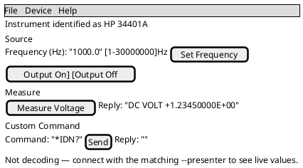
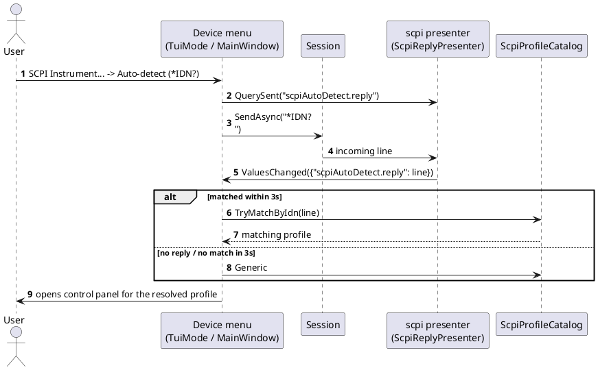

# Device Control Panel

## Purpose

A generic renderer (`DevTerm.Console.ControlPanelMode` for the TUI, `DevTerm.Wpf.ControlPanelWindow`
for WPF) that turns any `DevTerm.UiDefinitions.UiDefinition` into real, wired controls against any
`DevTerm.Core.Control.IControlSurface` — one implementation shared by every device control module,
not one screen per device. Opened from each front end's **Device** menu, next to **File**, once a
session is connected. Three menu items use it today:

- **K8055 Control Panel...** — `DevTerm.Devices.K8055`'s fixed `UiDefinition`/`K8055ControlSurface`,
  opens immediately (no picker).
- **Busylight Control Panel...** — `DevTerm.Devices.Busylight`'s fixed `UiDefinition`/
  `BusylightControlSurface`, opens immediately (no picker).
- **SCPI Instrument...** — opens an instrument picker first (see below), then builds the panel from
  whichever `DevTerm.Devices.Scpi.ScpiInstrumentProfile` was chosen
  (`ScpiUiDefinitionBuilder.Build`/`ScpiControlSurface`).

The menu item itself doesn't check the connected transport/presenter against the device — picking
K8055 Control Panel against a TCP connection to something else just won't do anything useful; nothing
stops you from opening it. See [`docs/design/ui-definitions.md`](../design/ui-definitions.md) and
[`docs/design/device-control-modules.md`](../design/device-control-modules.md) for the design intent
behind this being generic, and
[`docs/design/proposals/scpi-instrument-control.md`](../design/proposals/scpi-instrument-control.md)
for the SCPI module specifically.

## Fields

The control set is data-driven (one row per `UiControl` in the definition), not a fixed list — see
`DevTerm.UiDefinitions.UiControl`'s subtypes for the full set. Per subtype:

| Control kind | TUI widget | WPF widget | Notes |
|---|---|---|---|
| `ButtonControl` | `Button` | `Button` | Sends `CommandId ?? Id` with a `null` value on click, unless one of the two variants below applies |
| `ButtonControl` with `ColorPickerTargetCommandId` | `Button` that opens a nested RGB/HSV color-picker `Dialog` | `Button` that opens `ColorPickerWindow` | Sends the picked color as `"{r},{g},{b}"` to the *target* command id, not the button's own id |
| `ButtonControl` with `ParameterFieldIds` | `Button` | `Button` | On click, reads each named sibling control's *current* value (see below), joins with `,`, sends that as one value to `CommandId ?? Id` — this is how a command with parameters (e.g. a SCPI command taking a frequency) gets a "fill in fields, press one button" flow without a bespoke form per command |
| `ToggleControl` | `CheckBox` | `CheckBox` | Sends `"1"`/`"0"` on every change |
| `SliderControl` | Bounded `TextField` (no drag widget in the installed Terminal.Gui) + a `[min-max]unit` hint label | Real `Slider` + a live value label | Commits on Enter (TUI) / on every drag (WPF); TUI clamps to `[Minimum, Maximum]` on commit |
| `NumericControl` | Bounded `TextField` + a `[min-max]unit` hint label | `TextBox` | Commits on Enter (TUI) / on Enter or losing focus (WPF); both clamp to `[Minimum, Maximum]`, falling back to `DefaultValue` on unparsable input |
| `ChoiceControl` | `OptionSelector` (horizontal) regardless of `ChoiceStyle` — no radio-group/combo-box widget in the installed Terminal.Gui | `RadioButton` group when `ChoiceStyle.RadioGroup`, otherwise `ComboBox` | Sends the selected option string on change |
| `TextFieldControl` | `TextField` | `TextBox` (`MaxLength` set directly when `TextFieldControl.MaxLength` is set) | Commits on Enter (TUI) / on Enter or losing focus (WPF); TUI truncates to `MaxLength` on commit |
| `IndicatorControl` | Read-only `Label` | Read-only, bold `TextBlock` | Never sends anything; updated only by a live `IStructuredPresenter.ValuesChanged` event keyed by the control's id — see States |

"Current value" for `ParameterFieldIds` (both front ends): a text field/box's text, a choice
control's selected option string, a toggle's `"1"`/`"0"`, or an indicator's displayed text — read at
click time, not cached.

A definition-level `Description` (if set — e.g. a SCPI profile's `Notes`) renders as a label/
`TextBlock` above the sections. A status line at the bottom reads "Not decoding — connect with the
matching `--presenter` to see live values." whenever the presenter passed in isn't an
`IStructuredPresenter` (K8055/Busylight always are; SCPI needs the `scpi` presenter selected on the
connection — see Open items).

Rough layout (a SCPI panel, since it exercises the most control kinds — numeric field with a
parameter button, a query button with an indicator, and the always-present Custom Command section):

## Actions

| Action | Behavior | Preconditions | On failure |
|---|---|---|---|
| **Device > K8055 Control Panel...** / **Busylight Control Panel...** | Opens the panel immediately, built from that device's fixed `UiDefinition` and a fresh `IControlSurface` over the current session | None checked | n/a |
| **Device > SCPI Instrument...** | Resolves a profile choice, then opens the panel built from it (see "Picking a SCPI profile" below) | None checked | n/a |
| **Interacting with a control** (button click, toggle, commit a field, move a slider, pick a choice) | Calls `IControlSurface.InvokeAsync(id, value)`, which — for the SCPI surface — formats the command's template, appends the profile's terminator, and sends it over the live session; for K8055/Busylight, drives the device directly over HID reports | Session must actually be open for the send to succeed | An I/O failure surfaces the same way a plain send failure does elsewhere (see `ConnectionErrorMessages`) — not specially handled by the panel itself |
| **Scrolling the form (TUI only)** | PageUp/PageDown (global, works regardless of focus) or mouse wheel scroll the form when it's taller than the window; moving focus to a control below the fold scrolls it into view automatically | Form taller than the visible window | n/a |
| **Closing the panel** | TUI: a nested `Application.Run` — closing the window ends that loop and returns to the parent screen. WPF: an ordinary (non-modal) `Window` — closing it just closes it | None | n/a |

### Picking a SCPI profile

Opening **SCPI Instrument...** first resolves a choice, in this order:

1. If the connected profile has a saved `CliOptions.ScpiProfile` that still resolves to a real choice
   (a loaded profile's name, `"Auto-detect (*IDN?)"`, or `"Generic (manual)"`), that's used directly —
   **no picker shown**.
2. Otherwise, a picker lists every `ScpiProfileCatalog.All` profile name plus the two synthetic
   choices, "Auto-detect (*IDN?)" and "Generic (manual)" (TUI: a `PickFromList` modal `Dialog`
   wrapping a `ListView`, mirroring `ConfigureMode`'s own list-picker pattern; WPF:
   `ScpiInstrumentPickerWindow`, a small `ListBox` + Select button, or double-click a row). Cancelling
   either does nothing — no panel opens.

Choosing a named profile opens the panel immediately. Choosing **Generic (manual)** opens the panel
built from `ScpiProfileCatalog.Generic` (`*IDN?`, `*RST`, `*CLS`, `*OPC?`, plus the always-present
Custom Command section — see below). Choosing **Auto-detect (*IDN?)** sends `*IDN?` over the live
session and regex-matches the reply against every loaded profile's `IdnPattern`
(`ScpiProfileCatalog.TryMatchByIdn`); this is a real async round-trip (up to a 3-second wait), so it
can't finish synchronously inside the menu click — the panel opens once a reply arrives or the
3-second wait elapses with no match, falling back to `Generic` in that case. Auto-detect needs the
`scpi` presenter selected on the connection to correlate the reply at all; with it not selected, the
`*IDN?` is sent but nothing can be matched, and the fallback is `Generic`.

Every SCPI profile — named, generic, or auto-detected — also gets an always-present **Custom
Command** section: a text field, a Send button (`ParameterFieldIds`-driven, sends the typed text
verbatim with no template substitution), and an indicator showing the reply — the escape hatch for
any command not in the curated list.

## States

- **Live reply indicators**: when the `IPresenter` passed in also implements
  `DevTerm.Core.Presenters.IStructuredPresenter` (true for K8055/Busylight always; true for SCPI only
  when the `scpi` presenter is selected on the connection), the panel subscribes to its
  `ValuesChanged` event for its own lifetime and updates any `IndicatorControl` whose id is a key in
  the published dictionary. Unsubscribed on close/disposal in both front ends.
- **SCPI query correlation**: `ScpiControlSurface` calls `IScpiReplyTracker.QuerySent("{commandId}.reply")`
  before sending a query command; `ScpiReplyPresenter` (the `scpi` presenter) FIFO-matches the next
  complete line it receives to the oldest pending query id and publishes it as that indicator's value.
  An unsolicited line with nothing pending still renders as ordinary output text, just with no
  indicator update — this is a synchronous, one-command-at-a-time correlation, not built for
  concurrent overlapping queries (SCPI itself doesn't really support that either).

## Per-front-end notes

- **TUI has no native slider, combo box, or radio-group widget** (checked directly against the
  installed Terminal.Gui v2.5.0) — `SliderControl`/`NumericControl` both render as a bounded
  `TextField`, and every `ChoiceControl` (regardless of `ChoiceStyle`) renders as a horizontal
  `OptionSelector`, unlike WPF's real `Slider`/`RadioButton`/`ComboBox`. See
  `ControlPanelMode`'s own class remarks.
- **TUI's form scrolls the same way `ConfigureMode`'s does** — PageUp/PageDown wired via the global
  `Application.KeyDown` event (not a per-view handler), plus auto-scroll-into-view on focus change.
  WPF needs none of this; its `StackPanel`/`ScrollViewer`-based layout (via the containing `Window`)
  grows and lets the OS scroll naturally.
- **WPF's control-panel windows are non-modal** (`ControlPanelWindow.Show()`, not `ShowDialog()`) —
  the main window stays usable while a control panel is open; the TUI's is a nested
  `Application.Run`, which blocks the parent screen (same trade-off `ConfigureMode` already makes for
  Device Profiles).
- **The SCPI picker is two separate small UIs** (`TuiMode.PickFromList`,
  `DevTerm.Wpf.ScpiInstrumentPickerWindow`) rather than one shared component, mirroring this
  codebase's general pattern of front-end-specific screens over the same shared
  catalog/profile/builder logic.

## Open items

- **No automated screenshot coverage** — unlike every other screen in
  [`docs/specs/`](README.md)/[`docs/user-guide/`](../user-guide/README.md), none of `ScreenshotTests`
  (TUI) or its WPF equivalent currently captures a K8055/Busylight/SCPI control panel, so this spec
  and [the matching user-guide page](../user-guide/device-control-panels.md) have no real captured
  images to show, unlike every other page in that guide.
- **No menu-item state check against the actual connection** — the three Device menu items are always
  enabled and don't verify the connected transport/presenter actually matches the device before
  opening.
- **SCPI auto-detect's 3-second wait is fixed**, not configurable, and not visibly indicated as
  in-progress in either front end (see `docs/changes/2026-09-23.md`'s still-open Measure-button
  report, suspected to be related to the `scpi` presenter not being active for a given connection).
- **`DeviceManifest`'s own `UiDefinition` isn't wired to this renderer yet** — a manifest can declare
  a `UiDefinition` today, but nothing yet resolves a loaded manifest into a live `IControlSurface`/
  panel the way K8055/Busylight/SCPI do (see
  [`docs/design/device-manifests.md`](../design/device-manifests.md)).
