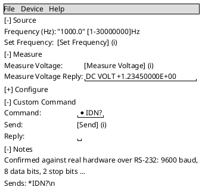
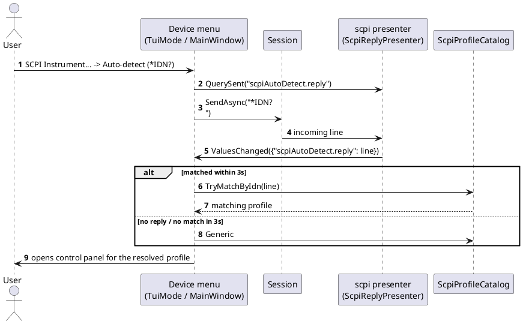

# Device Control Panel

## Purpose

A generic renderer (`DevTerm.Console.ControlPanelMode` for the TUI, `DevTerm.Wpf.ControlPanelWindow`
for WPF) that turns any `DevTerm.UiDefinitions.UiDefinition` into real, wired controls against any
`DevTerm.Core.Control.IControlSurface` — one implementation shared by every device control module,
not one screen per device. Opened from each front end's **Device** menu, next to **File**, once a
session is connected. Four menu items use it today:

- **K8055 Control Panel...** — `DevTerm.Devices.K8055`'s fixed `UiDefinition`/`K8055ControlSurface`,
  opens immediately (no picker).
- **Busylight Control Panel...** — `DevTerm.Devices.Busylight`'s fixed `UiDefinition`/
  `BusylightControlSurface`, opens immediately (no picker).
- **SCPI Instrument...** — opens an instrument picker first (see below), then builds the panel from
  whichever `DevTerm.Devices.Scpi.ScpiInstrumentProfile` was chosen
  (`ScpiUiDefinitionBuilder.Build`/`ScpiControlSurface`).
- **Device Manifest...** — opens a manifest picker first (see "Picking a device manifest" below),
  then builds the panel from the loaded `DevTerm.DeviceManifests.DeviceManifest`
  (`ManifestPanel`: `ManifestUiBuilder.Build`/`ManifestControlSurface`/`ManifestReplyPresenter`).

Each menu item is **enabled only when the current connection could be that device**
(`DevTerm.Configuration.DevicePanels.IsAvailable`), and all four are disabled while disconnected:

| Item | Enabled when connected over |
|---|---|
| K8055 Control Panel... | HID, vendor `0x10CF`, product `0x5500`–`0x5503` (the four board-address jumper settings) |
| Busylight Control Panel... | HID, `0x04D8:0xF848` (the bench unit, real-hardware confirmed) or any Plenom `0x27BB` device |
| SCPI Instrument... | any transport except HID (SCPI is text over a byte stream; HID is fixed-size binary reports) |
| Device Manifest... | any transport (`DevicePanel.Manifest`) — a manifest names its own transport, so which one fits is the user's pick |

The items follow the connection live: they're recomputed on every connect, disconnect, self-disconnect
and profile switch, the same pass that refreshes the main window's title and status bar. See [`docs/design/ui-definitions.md`](../design/ui-definitions.md) and
[`docs/design/device-control-modules.md`](../design/device-control-modules.md) for the design intent
behind this being generic, and
[`docs/design/features/scpi-instrument-control.md`](../design/features/scpi-instrument-control.md)
for the SCPI module specifically.

## Fields

The control set is data-driven (one row per `UiControl` in the definition), not a fixed list — see
`DevTerm.UiDefinitions.UiControl`'s subtypes for the full set. Per subtype:

| Control kind | TUI widget | WPF widget | Notes |
|---|---|---|---|
| `ButtonControl` | `Button` (shadowless in the TUI: every row is one line, and a shadow drawn on the line below covered the next row - the "... Reply:" values of a SCPI panel) | `Button` | Sends `CommandId ?? Id` with a `null` value on click, unless one of the two variants below applies |
| `ButtonControl` with `ColorPickerTargetCommandId` | `Button` that opens a nested RGB/HSV color-picker `Dialog` | `Button` that opens `ColorPickerWindow` | Sends the picked color as `"{r},{g},{b}"` to the *target* command id, not the button's own id. The picker opens on the color last picked for that button (`LastPickedColors`, keyed by the button's control id), including after closing and reopening the panel. It starts on white until a color has been picked, and it's kept only for the life of the process. Next to the button, a swatch shows that color's `#RRGGBB` hex value, with the color as its background and black or white text by luminance. It's hidden until a color has been set; WPF uses a `Border` (`ColorSwatches`), the TUI a `Label` registered as `"{id}.swatch"` in `ControlViews`. With `ColorPickerChoiceOption` set (the Busylight: `"Custom"`), the button is linked to that option of its target choice (`CustomColorChoices`): a pick selects the option without resending, and selecting the option sends the last picked `"r,g,b"` instead of the option text, opening the picker if none has been picked yet. The WPF picker opens sized to its content, is resizable, and scrolls its controls, with OK/Cancel always visible |
| `ButtonControl` with `ParameterFieldIds` | `Button` | `Button` | On click, reads each named sibling control's *current* value (see below), joins with `,`, sends that as one value to `CommandId ?? Id` — this is how a command with parameters (e.g. a SCPI command taking a frequency) gets a "fill in fields, press one button" flow without a bespoke form per command |
| `ToggleControl` | `CheckBox` | `CheckBox` | Sends `"1"`/`"0"` on every change |
| `SliderControl` | Bounded `TextField` (no drag widget in the installed Terminal.Gui) + a `[min-max]unit` hint label | Real `Slider` + a live value label | Commits on Enter (TUI) / on every drag (WPF). TUI: validated on commit (see Validation) — a number is clamped to `[Minimum, Maximum]`, anything else is rejected and not sent |
| `NumericControl` | Bounded `TextField` + a `[min-max]unit` hint label | `TextBox` | Commits on Enter (TUI) / on Enter or losing focus (WPF). Validated on commit in both: a number is clamped to `[Minimum, Maximum]` and written back normalized; unparsable input is rejected and not sent (it used to silently send `DefaultValue` instead) |
| `ChoiceControl` | `OptionSelector` (horizontal) regardless of `ChoiceStyle` — no radio-group/combo-box widget in the installed Terminal.Gui | `RadioButton` group when `ChoiceStyle.RadioGroup`, otherwise `ComboBox` (including `ChoiceStyle.CheckList`, a multi-select only the form renderers draw as check boxes) | Sends the selected option string on change. A section's or control's `VisibleWhen` (a form-renderer feature, see [ui-definitions.md](../design/ui-definitions.md#forms-from-one-definition)) isn't evaluated here: panels show every control |
| `TextFieldControl` | `TextField` | `TextBox` (`MaxLength` set directly when `TextFieldControl.MaxLength` is set) | Commits on Enter (TUI) / on Enter or losing focus (WPF); TUI truncates to `MaxLength` on commit. With a `Constraint` (`ValueConstraint`: `Text`/`Integer`/`Number`, optional `Minimum`/`Maximum`), the typed value is validated on commit — rejected and not sent when invalid or (by default) out of range, normalized when valid (`" 3.0 "` → `"3"`) |
| `IndicatorControl` | Read-only `Label` | Read-only, bold `TextBlock` | Never sends anything; updated only by a live `IStructuredPresenter.ValuesChanged` event keyed by the control's id — see States |
| `BarGraphControl` | `CellCanvasView`: one row per channel — label, a 30-cell bar of block characters (eighth-block resolution: `▏▎▍▌▋▊▉█`) in the channel's color between `▕`/`▏`, then the value and unit (`—` before any) | `BarGraphElement`: one 220 px rounded bar per channel on a light track, label left, value right | Display-only. Each channel (`ChartChannel.Id`) is a `ValuesChanged` key; the bar fills `(value − Minimum) / (Maximum − Minimum)`, clamped to [0, 1]; the value text is unclamped |
| `StripChartControl` | `CellCanvasView`: a 40×8-cell braille plot (80×32 dots), a value axis with its top/bottom labels on the left, and a legend row (`■ A 28.54`) | `StripChartElement`: a 320×120 px line plot, quarter gridlines, top/middle/bottom axis labels, a legend of swatch + name + latest value | Display-only. Keeps the last `HistoryLength` (default 60) samples per channel, newest at the right edge; the value axis is [`Minimum`, `Maximum`] when both are set, else auto-scaled to the visible history (a declared bound still wins for its end) |
| `VectorControl` | `CellCanvasView`: a 21×9-cell braille plot on `─`/`│`/`┼` axes (polar: plus a ring at `Range`; x/y/z: plus an oblique z axis), the point as a 2×2 dot block, its trail in muted dots, a readout row (`x=0.8 y=-0.25`, `r=0.28 θ=240°`) | `VectorElement`: a 150 px plot with axes (polar: rings; x/y/z: a dashed z axis), the point as a 10 px dot with a surface ring, a fading trail, the same readout | Display-only. `Coordinates`: `XY` (`XId`/`YId`), `XYZ` (+`ZId`, oblique projection), `Polar` (`RadiusId`/`AngleId`, `AngleUnit` degrees/radians). Axes span ±`Range`. The trail keeps `TrailLength` (default 20) earlier points, one per `ValuesChanged` batch. Optional `HueId`/`SaturationId`/`BrightnessId` color the point (hue in degrees; s/v 0–1, or 0–100 read as percent) |

A display control's value is read from the published text with `ChartValue.TryParse`: the whole
text as an invariant number, else the first number in it (`"DC VOLT 1.25 V"` → 1.25); text with no
finite number changes nothing. Chart colors come from each `ChartChannel.Color` (`#RRGGBB`) or, when
unset, `ChartPalette`'s fixed eight-slot categorical order by channel position (a ninth-or-later
channel gets neutral gray, never a repeated hue) — the same colors in both front ends.

"Current value" for `ParameterFieldIds` (both front ends): a text field/box's text, a choice
control's selected option string, a toggle's `"1"`/`"0"`, a WPF slider's position, or an
indicator's displayed text — read at click time, not cached, and validated first (see Validation):
if any field is invalid, nothing is sent.

### Layout

- **Sections are collapsible, and remember how they were left.** WPF: one `Expander` per labeled
  section (`SectionExpanders`). TUI (no expander widget): a focusable header button reading `[-] Name`
  (expanded) or `[+] Name` (collapsed) — Enter/Space or a click toggles it (`SectionHeaders`,
  `SectionBodies` in `ControlPanelWindowParts`); every section below moves up or down to match, so a
  collapsed section leaves just its header line, no gap. An **unlabeled** section (Busylight's lone
  Apply button) has nothing to name a header with, so it has no header and is always shown. Every
  toggle is recorded in `DevTerm.Configuration.SectionExpansionState`, keyed by the definition's
  `Name` plus the section's label (Notes included), and a panel opens each section as last left —
  expanded the first time. Shared by both front ends, kept for the life of the process, not
  persisted (the same in-process pattern as `LastPickedColors`).
- **Labels are aligned per section and never wrap.** WPF: a two-column `Grid` per section — an
  auto-sized, `NoWrap` label column, then the controls (a chart's label sits at its top). TUI: every
  control in a section starts at the section's longest `Label:` plus one space; a chart takes as many
  rows as it draws, the rows below it following.
- **TUI rows never run off the right edge — the form scrolls sideways.** After every layout pass the
  form measures its widest shown row (each section's indent plus its widest view's laid-out right
  edge, headers included) and sets that as its content width (never less than the visible width),
  with a horizontal scroll bar when it's wider. Focusing a control scrolls its row horizontally so the
  control and its `(i)` marker are visible (the marker's end if it fits, never past the control's
  start); focusing a section header scrolls back to column 0. Ctrl+PageDown/Ctrl+PageUp (global)
  scroll by half the visible width, and a sideways mouse wheel by two columns — for a wide end that
  isn't focusable (a long indicator value). Section bodies are laid out at a fixed 1000-column width,
  not `Dim.Fill`, so a wide row keeps its natural width instead of being squeezed. Why this rather
  than truncating labels: it covers every widget kind (a button whose text is its long label, a
  choice with many options, a chart), hides nothing permanently, and needs no per-widget width rules.
- **Notes come last.** A definition-level `Description` (if set — e.g. a SCPI profile's `Notes`, a
  manifest's `Description`) renders as a collapsible **Notes** section after all the others, text
  wrapped (WPF: a wrapping `TextBlock`, the scroll area has no horizontal scrolling so it wraps to the
  window; TUI: word-wrapped to the form's visible width minus 3, at least 20 columns
  (`NotesWrapWidth`) — first to the screen width at build time, then again after any layout pass that
  changed the visible width, so resizing the terminal re-wraps them and reflows the form). It used to
  be one line above the sections (cut off in the TUI).
- A status line at the bottom reads "Not decoding — connect with the matching `--presenter` to see
  live values." whenever the presenter passed in isn't an `IStructuredPresenter` (K8055/Busylight
  always are; SCPI needs the `scpi` presenter selected on the connection — see Open items). TUI: at
  the end of the scrolling form. WPF: the red `StatusText` line, below the scroll area.

### Command preview

A control that sends a command shows exactly what it would send, when the panel's
`IControlSurface` also implements the optional `DevTerm.Core.Control.ICommandPreview`
(`PreviewCommand(commandId, value)`, which never sends or changes state). The preview uses the
control's **current** value: the slider position, the typed text (validated first — an invalid value
shows `Won't send: <reason>`), the selected choice, a parameter button's joined, validated
parameter fields — and for a toggle, the state toggling it would send. A control gets a preview only
when the surface returns one for it; a parameter field that only feeds a button (a SCPI command's
parameter, the Custom Command text field) shows none itself — its button does.

| Surface | Preview |
|---|---|
| `ScpiControlSurface` | The command text with the profile's terminator appended and control characters escaped (`MEAS:VOLT:DC? DEF\n`, `VSET1:05.00` for a terminator-less Korad) — built by the same code path `InvokeAsync` sends through |
| `K8055ControlSurface` | The 9-byte HID report as hex (`00 05 01 00 00 00 00 00 00`), including the output state the change would produce, without committing it |
| `BusylightControlSurface` | Only **Apply** sends anything, so only it has a preview: the frame as hex. Color/blink/sound controls only change state, so they have none |
| `ManifestControlSurface` | The command's formatted template plus the manifest's `Terminator`, control characters escaped (`MEAS?\n`, `Samples: 40\n`) — built by the same `Resolve` path `InvokeAsync` sends through. Parameter fields and display controls preview as nothing |

- **WPF**: an "ⓘ" icon after the control (`InfoIcons`); its tooltip is recomputed each time it opens.
- **TUI** (no hover): a `(i)` marker after the control (`InfoMarkers`), and a footer line pinned
  below the scrolling form (`PreviewLabel`) reading `Sends: MEAS:VOLT:DC? DEF\n` while that control —
  or a parameter field feeding it — has focus. It updates as the value changes and clears when focus
  moves to a control that sends nothing.

### Validation

Every typed value is checked by the one shared `DevTerm.UiDefinitions.ValueValidator` before it's
sent — on a field's own commit and when a parameter button reads it. The constraint comes from
`ValueValidator.ConstraintFor(control)`: a `TextFieldControl`'s declared `Constraint`, or the
clamped `[Minimum, Maximum]` number range a `SliderControl`/`NumericControl` implies. An invalid value
is **not sent**, and the reason is shown as `<Label>: <reason> Not sent.` (e.g.
`Channel: 9 is out of range (1 to 4). Not sent.`) — TUI: the footer's second line (`MessageLabel`);
WPF: the red `StatusText` line (never a modal). The next valid commit clears it. A valid number is
normalized (invariant culture, `1e3` → `1000`) and, for a field's own commit, written back into it.

Rough layout (a SCPI panel, since it exercises the most control kinds — numeric field with a
parameter button, a query button with an indicator, and the always-present Custom Command section):

## Actions

| Action | Behavior | Preconditions | On failure |
|---|---|---|---|
| **Device > K8055 Control Panel...** / **Busylight Control Panel...** | Opens the panel immediately, built from that device's fixed `UiDefinition` and a fresh `IControlSurface` over the current session | None checked | n/a |
| **Device > SCPI Instrument...** | Binds the `scpi` presenter into the session's live pipeline if it wasn't already part of it (`Session.AddPresenter` — see below), resolves a profile choice, then opens the panel built from it (see "Picking a SCPI profile" below) | None checked | n/a |
| **Device > Device Manifest...** | Opens the manifest picker, loads the choice, binds a fresh `ManifestReplyPresenter` into the live pipeline (`Session.AddPresenter`), and opens the panel; closing the panel unbinds it again (`Session.RemovePresenter`), so reopening never stacks presenters. See "Picking a device manifest" below | None checked | A manifest that fails to load: WPF shows why in the picker's red error line and keeps it open (no modal); the TUI's menu guard shows an error dialog ("dev-term — error") |
| **Interacting with a control** (button click, toggle, commit a field, move a slider, pick a choice) | Calls `IControlSurface.InvokeAsync(id, value)`, which — for the SCPI surface — formats the command's template, appends the profile's terminator, and sends it over the live session; for K8055/Busylight, drives the device directly over HID reports | Session must actually be open for the send to succeed | A value the surface rejects, or a device-side failure, is shown in the panel and never escapes. The TUI shows an error dialog ("dev-term — command failed"), since the modal panel hides the main output pane. WPF shows `Command failed: …` in the panel's red status line; it uses no modal so the panel stays testable. A device-side failure has also disconnected the session (`Session.Disconnected`), and the main window reports that too |
| **Committing an invalid value** (a field's Enter/blur, or a parameter button) | Nothing is sent; the reason appears in the panel (see Validation) | n/a | n/a |
| **Expanding/collapsing a section** | WPF: click the `Expander` header. TUI: focus the `[-]`/`[+]` header and press Enter/Space, or click it; the sections below reflow | Section has a label | n/a |
| **Seeing what a control sends** | WPF: hover its "ⓘ" icon. TUI: move focus to it (or to a parameter field feeding it); the footer shows `Sends: …` | Surface implements `ICommandPreview` and sends something for that control | n/a |
| **Scrolling the form (TUI only)** | PageUp/PageDown (global, works regardless of focus) or mouse wheel scroll the form when it's taller than the window; moving focus to a control below the fold scrolls it into view automatically. Sideways: Ctrl+PageDown/Ctrl+PageUp (half the visible width) or a sideways wheel, and focusing a control on a wide row scrolls it and its `(i)` into view | Form taller/wider than the visible window | n/a |
| **Closing the panel** | TUI: a nested `Application.Run` — closing the window ends that loop and returns to the parent screen. WPF: an ordinary (non-modal) `Window` — closing it just closes it | None | n/a |

### Picking a SCPI profile

Opening **SCPI Instrument...** first resolves a choice, in this order:

1. If the connected profile has a saved `CliOptions.ScpiProfile` that still resolves to a real choice
   (a loaded profile's name, `"Auto-detect (*IDN?)"`, or `"Generic (manual)"`), that's used directly —
   **no picker shown**.
2. Otherwise, a picker lists every `ScpiProfileCatalog.All` profile name plus the two synthetic
   choices, "Auto-detect (*IDN?)" and "Generic (manual)" (TUI: a `PickFromList` modal `Dialog`
   wrapping a `ListView`, mirroring `ConfigureMode`'s own list-picker pattern; WPF:
   `ScpiInstrumentPickerWindow`, a small `ListBox` + Select button, or double-click a row). Cancelling
   either does nothing — no panel opens.

Choosing a named profile opens the panel immediately. Choosing **Generic (manual)** opens the panel
built from `ScpiProfileCatalog.Generic` (`*IDN?`, `*RST`, `*CLS`, `*OPC?`, plus the always-present
Custom Command section — see below). Choosing **Auto-detect (*IDN?)** sends `*IDN?` over the live
session and regex-matches the reply against every loaded profile's `IdnPattern`
(`ScpiProfileCatalog.TryMatchByIdn`, via the shared `DevTerm.Devices.Scpi.ScpiAutoDetect`). This is a
real async round-trip, so it can't finish synchronously inside the menu click. The wait is
`CliOptions.ScpiAutoDetectTimeoutMs`: 3000 ms by default, 100–60000, `--scpiautodetecttimeoutms`, saved
in a profile only when changed. Progress is shown while it waits:
- The main window's output gets `Auto-detecting the SCPI instrument: sent *IDN?, waiting up to 3 s…`
  (WPF also shows a wait cursor).
- Afterward it names the outcome: `Detected {profile} (*IDN? replied "…")`,
  `No loaded SCPI profile recognizes *IDN? reply "…" — opening the Generic panel.`, or
  `No *IDN? reply within 3 s — opening the Generic panel.`

The panel opens once a reply arrives or the wait elapses, falling back to `Generic` when nothing matched. Correlating the reply
needs the `scpi` presenter active in the session's pipeline; opening **SCPI Instrument...** always
binds it in first (`Session.AddPresenter`, see Actions above) regardless of whether it was selected
when the connection was made, so auto-detect (and every command's reply afterward) works either way.

### Picking a device manifest

Opening **Device Manifest...** shows a picker (TUI: `ManifestPanelMode`'s modal `Dialog` — a
`ListView`, a path `TextField`, Open/Cancel; WPF: `ManifestPickerWindow` — a `ListBox`, a path
`TextBox` with **File...**/**Folder...** browse buttons, Open/Cancel, double-click a row to open):

- The list is `DevTerm.Configuration.InstalledManifests.Discover()`: the user's
  `DevTermUserDataPaths.UserManifestsDirectory` (`~/.dev-term/manifests`) first, then the app's
  `AppManifestsDirectory` (`manifests\` next to the executable). In each: every subfolder holding a
  `device.json`, every `*.zip`, and every other `*.json` (`ManifestCatalog`). Rows read
  `{name} ({user|installed})`; a folder/JSON entry's name is its manifest's own `Name` (its file or
  folder name when it doesn't load), a zip's is its file name (listing never extracts anything).
- A typed path (file, folder, or `.zip`) wins over the list selection.
- The choice loads through `DeviceManifestLoader.Load`; WPF also compiles its response patterns
  there, so a bad regex is reported in the picker rather than on open.

dev-term installs one: **Loopback Sensor Demo** (`src/DevTerm.DeviceManifests/Manifests/loopback-sensor-demo/device.json`,
copied to `manifests\loopback-sensor-demo\` in every front end's output), which answers over the
loopback transport's simulated sensor (`MEAS?`, `Samples: N`) and exercises every chart control.

A manifest's panel is `ManifestUiBuilder.Build(manifest)`: the manifest's own `Ui`, or — when it has
none — one generated section with, per outbound command, a `TextFieldControl` per parameter
(`{commandId}.{parameter}`, a `Number`/`Integer` constraint over its range when numeric), a button
(`{commandId}.send`, reading those fields), and a `{commandId}.reply` indicator for a query. The
manifest's `Description` fills in the Notes when the UI has no description of its own.

Every SCPI profile — named, generic, or auto-detected — also gets an always-present **Custom
Command** section: a text field, a Send button (`ParameterFieldIds`-driven, sends the typed text
verbatim with no template substitution), and an indicator showing the reply — the escape hatch for
any command not in the curated list.

## States

- **Live reply indicators**: when the `IPresenter` passed in also implements
  `DevTerm.Core.Presenters.IStructuredPresenter` (true for K8055/Busylight always; true for SCPI only
  when the `scpi` presenter is selected on the connection), the panel subscribes to its
  `ValuesChanged` event for its own lifetime and updates any `IndicatorControl` whose id is a key in
  the published dictionary, and feeds the whole dictionary to every display control's shared
  `LiveDisplayState` (`BarGraphState`/`StripChartState`/`VectorState`), redrawing a chart only when
  the batch changed something it plots (TUI: `CellCanvasView.Apply`; WPF: `LiveDisplayElement.Apply`).
  Unsubscribed on close/disposal in both front ends.
- **Manifest reply correlation and response patterns**: `ManifestReplyPresenter` shares
  `DevTerm.Core.Presenters.LineReplyPresenter`'s CR/LF/CRLF line buffering and FIFO correlation with
  the SCPI presenter: a command with `IsQuery` (or an explicit `ReplyId`) registers
  `{commandId}.reply` before sending, and the next complete line lands there. Every complete line —
  a correlated reply or unsolicited streamed telemetry — is also matched against each
  `InboundProtocol.Patterns` regex: on a match the pattern's `Name` gets the first capture group
  (the whole match with none) and every named group its own value under its group name. That's what
  drives a manifest panel's charts. The presenter renders no text itself (the connection's own
  presenters already print every line), and `Inbound.LineTerminated: false` switches it to
  one-reply-per-read for a terminator-less device.
- **SCPI query correlation**: `ScpiControlSurface` calls `IScpiReplyTracker.QuerySent("{commandId}.reply")`
  before sending a query command; `ScpiReplyPresenter` (the `scpi` presenter) FIFO-matches the next
  complete line it receives to the oldest pending query id and publishes it as that indicator's value.
  An unsolicited line with nothing pending still renders as ordinary output text, just with no
  indicator update — this is a synchronous, one-command-at-a-time correlation, not built for
  concurrent overlapping queries (SCPI itself doesn't really support that either).

## Per-front-end notes

- **TUI has no native slider, combo box, or radio-group widget** (checked directly against the
  installed Terminal.Gui v2.5.0) — `SliderControl`/`NumericControl` both render as a bounded
  `TextField`, and every `ChoiceControl` (regardless of `ChoiceStyle`) renders as a horizontal
  `OptionSelector`, unlike WPF's real `Slider`/`RadioButton`/`ComboBox`. See
  `ControlPanelMode`'s own class remarks.
- **TUI's form scrolls the same way `ConfigureMode`'s does** — PageUp/PageDown wired via the global
  `Application.KeyDown` event (not a per-view handler), plus auto-scroll-into-view on focus change
  (per row, using the positions the last expand/collapse computed rather than `Frame`, which lags
  until the next layout pass). The two footer lines (preview, validation message) sit below the
  scrolling form, so they're always visible. WPF needs none of this; its `StackPanel`/`ScrollViewer`-
  based layout (via the containing `Window`) grows and lets the OS scroll naturally.
- **TUI has no expander, tooltip, or hover** — hence the `[-]`/`[+]` header buttons and the focus-driven
  `Sends:` footer instead of WPF's `Expander` and "ⓘ" tooltip.
- **WPF's control-panel windows are non-modal** (`ControlPanelWindow.Show()`, not `ShowDialog()`) —
  the main window stays usable while a control panel is open; the TUI's is a nested
  `Application.Run`, which blocks the parent screen (same trade-off `ConfigureMode` already makes for
  Device Profiles).
- **The SCPI picker is two separate small UIs** (`TuiMode.PickFromList`,
  `DevTerm.Wpf.ScpiInstrumentPickerWindow`) rather than one shared component, mirroring this
  codebase's general pattern of front-end-specific screens over the same shared
  catalog/profile/builder logic.

- **The TUI draws charts in character cells** — block characters for bars, braille dots (U+2800–
  U+28FF) for plots, each cell in its channel's color (`CellCanvasView` paints a `CellGrid` cell by
  cell; one `Label` can only have one color). WPF draws them for real (`OnRender`). Both render the
  same `LiveDisplayState`, so they plot identical data identically.

## Open items

- **Expand/collapse state lasts only for the process** — it isn't saved across restarts (same as
  the last picked colors).
- **A connection profile's `ManifestName` doesn't open that manifest's panel** — the picker is the
  only way in; a profile could preselect it the way `ScpiProfile` preselects a SCPI profile.
- **Charts have no hover readout or table view** — the WPF charts show the latest values in their
  legend/labels but no per-point tooltip, and neither front end exports the history.
- **Chart sizes are fixed per front end** (not declared in the model) — fine for the controls so
  far; a `Width`/`Height` hint could come later if a device needs a bigger plot.
