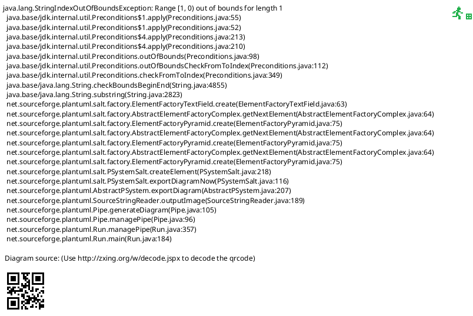

# Manifest Editor

## Purpose

Create, open, edit and save a [device manifest](../design/device-manifests.md) — its identity,
transport hint, outbound commands (templates, parameters, query/reply ids), response patterns, and
its control panel (`UiDefinition` sections and controls) — with a live preview of the panel it
produces. Reached from **Device > Edit Device Manifest...** in both front ends, always enabled (no
connection needed, unlike **Device > Device Manifest...**, which opens a manifest's panel on the
live session). Shared logic lives in `DevTerm.DeviceManifests.Editing.ManifestEditorViewModel`;
rendered by:

- **TUI**: `DevTerm.Console.ManifestEditorMode` — a nested Terminal.Gui `Window`.
- **WPF**: `DevTerm.Wpf.ManifestEditorWindow` — a non-modal window owned by the main window.

**Built with the forms engine** ([ui-definitions.md](../design/ui-definitions.md#forms-from-one-definition)):
every part's form is generated by `FormDefinitionGenerator` from a small annotated form model
(`EditorForm` subclasses: `ManifestIdentityForm`, `CommandForm`, `ParameterForm`, `PatternForm`,
`PanelForm`, `SectionForm`, `ControlForm`) and drawn by the same `FormRenderer` the Connection Editor
uses — no hand-built field lists. The preview is the real control-panel renderer
(`ControlPanelMode`/`ControlPanelWindow`), exactly as the panel would open.

## Layout

WPF shows the outline, the form and the preview side by side (splitters between them); the TUI shows
the outline and one pane that holds either the form or, with **Preview**, the panel.

## Outline

| Entry | Form | Add adds |
|---|---|---|
| Identity | `ManifestIdentityForm` | — |
| Commands (n) | none — a hint | a command |
| a command | `CommandForm` | a parameter |
| a parameter (`name (type)`) | `ParameterForm` | a parameter (to the same command) |
| Response patterns (n) | none — a hint | a pattern |
| a pattern | `PatternForm` | a pattern |
| Panel | `PanelForm` (a declared panel), or a hint and **Create panel from commands** (none declared) | a section (declares a panel if there was none) |
| `[section]` | `SectionForm` | a control |
| `kind: label` | `ControlForm` | a control (to the same section) |

## Fields

| Form | Field | Maps to | Notes |
|---|---|---|---|
| Identity | Name, Vendor, Version, Description, Panel file | `Name`, `Vendor`, `Version`, `Description`, `UiFile` | A blank optional field stays unset (left out of the JSON) |
| | Transport hint | `Transport.Type` (`serial`/`tcp`/`hid`/`usbtmc`/`loopback`, blank for none) | Blank removes the hint |
| | Transport options | `Transport.Options`, as `Key=Value, ...` | Shown only while there's a hint |
| | Command terminator | `Terminator` | Edited with escapes: `\n`, `\r`, `\t`, `\xHH`, `\\` (`EditorForm.Escape`/`Unescape`, which round-trip exactly) |
| | Replies end in CR/LF, Kaitai layout file | `Inbound.LineTerminated`, `Inbound.KaitaiFile` | |
| Command | Name, Id, Template (escapes), Is a query, Reply id | `OutboundCommand` | **Sends** (read-only) shows the wire text with default parameter values and the terminator, and the reply id a query lands in |
| Parameter | Name, Type (`string`/`number`/`integer`), Minimum, Maximum, Unit, Default value, Number format | `CommandParameter` | Minimum/Maximum/Number format shown only for a numeric type |
| Pattern | Name, Regex | `ResponsePattern` | **Try it**: a *Sample line* (not saved) and **Publishes** — the values a match would publish (`name=… chA=…`), `no match`, or the regex error |
| Panel | Panel name, Notes | `Ui.Name`, `Ui.Description` | |
| Section | Label | `UiSection.Label` | Blank: a headerless, always-open section |
| Control | Kind | the control's type (`button`, `toggle`, `slider`, `numeric`, `choice`, `textField`, `indicator`, `barGraph`, `stripChart`, `vector`) | Changing it replaces the control with one of the new kind, keeping Id, Label and Help |
| | Id, Label, Help | `Id`, `Label`, `Description` | |
| | Command id, Parameter fields, Color picker target | a button's `CommandId`, `ParameterFieldIds` (comma-separated), `ColorPickerTargetCommandId` | button only |
| | Starts on / Default value | `DefaultValue` | per kind |
| | Options, Style | a choice's `Options` (comma-separated), `Style` | choice only |
| | Value type, Max length | a text field's `Constraint.Kind`, `MaxLength` | text field only |
| | Minimum, Maximum, Step, Unit | per kind (a text field's constraint bounds when it's a number) | slider/numeric/bar graph/strip chart; Step slider only |
| | Channels | a chart's `Channels` as `id[:label[:#RRGGBB]], ...` | bar graph/strip chart |
| | History length | `HistoryLength` | strip chart |
| | Coordinates, X/Y/Z/Radius/Angle value ids, Angle unit, Range, Trail length, Hue/Saturation/Brightness value ids | the vector's fields | vector; X/Y for XY/XYZ, Z for XYZ, Radius/Angle/unit for Polar |

Every "shown only for" is a generated visibility condition (`[FormField(VisibleWhen = ...)]`), the
same mechanism that shows the Connection Editor's Serial fields only for the serial transport.

## Actions

| Action | Behavior | On failure |
|---|---|---|
| **New** | A new manifest named `New Device` (asks first if there are unsaved edits) | Declining keeps the current one |
| **Open...** | Picks a discovered manifest (the user's and installed ones) or a typed/browsed path — a file, a folder with `device.json`, or a `.zip` — and opens it **unvalidated**, so a broken manifest can be opened to be fixed (asks first if there are unsaved edits) | "Couldn't open '…': …" in the status line |
| **Save** | Validates with `DeviceManifestValidator` — the checks `DeviceManifestLoader.Load` runs — then writes (`DeviceManifestWriter`) and reloads what it wrote to prove it loads; clears the unsaved mark. Where: a new manifest, one opened from the installed manifests, or one opened from a `.zip`, saves as the user's own copy, `~/.dev-term/manifests/{folder}/device.json` (the folder the manifest came from, else its name lower-cased with dashes), which overrides an installed one of the same name; asks before overwriting a manifest already there. One opened from anywhere else saves back in place | "Not saved: {errors}" — nothing is written / "Couldn't save to '…': …" |
| **Save As...** | Saves to a chosen `.json` file (or a folder, as its `device.json`), and keeps saving there | as Save |
| **Check** | Runs the validator and shows the result without saving | — |
| **Add** (label follows the selection) | Adds the entry the Outline table names, and selects it | — |
| **Remove** | Removes the selected entry; on **Panel**, removes the declared panel (the generated one is used again) | Disabled on Identity and the headings |
| **Up** / **Down** | Moves the selected entry within its list | Disabled on Identity and the headings |
| **Create panel from commands** | For a manifest with no declared panel: declares the one it would get from its commands, to edit from there | — |
| **Preview** (TUI; WPF always shows it) | Shows the panel as it would open, drawn by the control-panel renderer against a surface that sends nothing: invoking a control shows *what it would send* in the status line (TUI) / under the preview (WPF), and the ⓘ/(i) command previews work as on a live panel. The TUI's button toggles back to the form (**Edit**) | — |
| **Close** | Closes (asks first if there are unsaved edits) | Declining keeps it open |

## States

- **Unsaved edits** (`IsDirty`): any field change, add, remove or move; the title ends in ` *`.
  Cleared by a successful Save, New, or Open.
- **Validation**: *errors* (a blank name; a command with no name or template; two commands with the
  same id; a parameter with no name or a duplicate one; a response pattern with no name, no regex, or
  a regex that doesn't compile; a panel control with no id) block Save and make the loader reject the
  file. *Warnings* (a button or field whose command id no command declares, a button reading a
  parameter field the panel lacks, a template placeholder no parameter fills) are shown after Open,
  Check and Save but don't block anything.
- **Preview**: rebuilt from a copy of the manifest after every edit (WPF, coalesced to one rebuild per
  burst of keystrokes) or each time it's shown (TUI). Building a panel can fill in its Notes from the
  manifest's description — done on the copy, so the edited manifest (and what Save writes) isn't
  changed by previewing.
- **Round trip**: what Save writes is camelCase JSON with unset values left out, like the bundled
  manifests are written by hand; the bundled `loopback-sensor-demo` opens, saves and reloads to an
  identical manifest (`ManifestEditorTests.BundledDemo_LoadsEditsSavesAndReloadsUnchanged`). A
  package-mode manifest (`Panel file` set) keeps its panel in that file, and a referenced Kaitai file
  is copied beside a manifest saved to a new place, so the saved copy still loads.

## Per-front-end notes

- **Layout**: WPF shows outline, form and preview at once; the TUI (80×24 by default) shows outline
  plus one pane, switching the pane between form and preview. The TUI's toolbar buttons have no
  shadow so all seven fit on one line of an 80-column terminal.
- **The preview is the real renderer in both**: the TUI adds the `Window` `ControlPanelMode.BuildWindow`
  returns as a subview of its pane (a Terminal.Gui `Window` embeds like any view; its PageUp/PageDown
  handler is unhooked when the preview is replaced, since disposing the window does that). WPF builds
  a `ControlPanelWindow`, never shows it, and moves its content into the editor's preview area — so
  a color-picker button in the preview parents its dialog to the window actually showing the content.
- **Open**: the TUI reuses the Device Manifest picker's list-or-path dialog; WPF reuses
  `ManifestPickerWindow` in a path-only mode (it doesn't load, so a broken manifest can be chosen).
- **Save As**: a Terminal.Gui `SaveDialog` / a native `SaveFileDialog`.
- **Kind** in the TUI: ten kinds are too many for one line, so it's a text field with **Pick...**
  (the form renderer's long-choice widget); WPF shows a dropdown.

## Open items

- No undo; Close/New/Open ask before discarding unsaved edits instead.
- A control's own `VisibleWhen` (honored by the form renderers, not by control panels) isn't editable
  here, and neither is a panel's XML file form — a manifest whose Panel file is `.xml` is written back
  as XML, but edited like any other.
- The editor edits the text-protocol schema; a binary manifest's `.ksy` layout is referenced, not
  edited.
