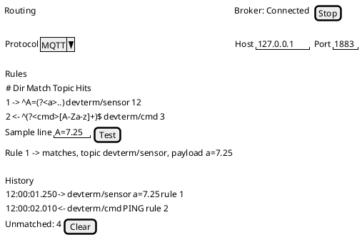
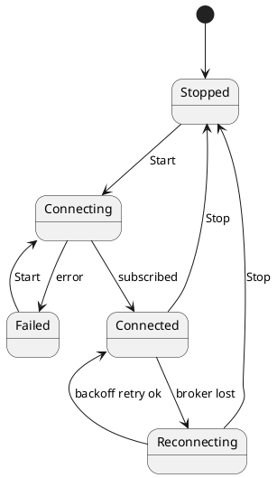

# Routing Window

**Status: built 2026-10-03 in WPF (`RoutingWindow`, Device menu > Routing...) and the TUI (`RoutingMode`, Device > Routing...), both over the
shared `RoutingViewModel`.** Verified with unit tests, real screenshots and a fake broker link, and `RoutingService` (the engine both windows drive) round-trips through the real Mosquitto (MQTT) and RabbitMQ (AMQP, STOMP) containers (`RoutingBrokerIntegrationTests`); the windows themselves have not been driven by hand against a broker. The engine is `MessageRouter`, `MqttRouterBridge` and `BrokerRouterBridge` (see
[message-broker-protocols](../design/proposals/message-broker-protocols.md)); walkthrough: [routing](../user-guide/routing.md).

## Purpose

A bench engineer has one instrument attached and wants its readings on an MQTT, AMQP or STOMP broker, and to command it from
the broker, set up in minutes. The routing **rules and broker settings are saved in the connection profile**, so connecting the
device can also start routing; the **Routing window** edits those rules, tests them against sample lines, runs and stops routing,
and shows what flowed. It acts on the active session and never changes the device connection itself.

## Decisions (from the 2026-10-03 interview)

| Question | Decision |
|---|---|
| Primary user | Bench engineer bridging one device |
| Where configuration lives | Both: the profile holds broker + rules; a window runs them |
| Rule authoring | A form per rule with a live test box (paste a sample line, see the match, topic and payload it would produce) |
| Feedback while running | Live message history (both directions), broker connection state, unmatched-lines counter, per-rule hit counts |
| Broker details | Stored in the profile alongside the rules |
| Broker drops or a publish fails | Auto-reconnect with backoff; the device session keeps running; device-to-broker messages during an outage are dropped and counted |
| Start | Automatic when the profile has rules and the device connects |
| Safety for broker-to-device sends | Per-rule **Confirm** flag: the first matching message asks before it reaches the device |
| First-release front ends | WPF and TUI (no CLI flags yet) |

## Fields

| Name | Type | Default | Validation | Notes |
|---|---|---|---|---|
| Protocol | choice: MQTT / AMQP / STOMP | MQTT | required | Picks `MqttRouterBridge` or `BrokerRouterBridge` with the matching connection factory |
| Host / Port | text / int | blank / protocol default | host required, port 1-65535 | Same options as the matching transport |
| Username / Password | text / masked | blank | none | Saved in the profile as plain text; `DEVTERM_ROUTING__PASSWORD` overrides it when set |
| Rule: Direction | choice | DeviceToBroker | required | DeviceToBroker or BrokerToDevice |
| Rule: Match | regex | blank | must compile; named groups listed beside the field | Applies to the device line (DeviceToBroker) or the payload (BrokerToDevice) |
| Rule: Topic | text | blank | required; BrokerToDevice allows a trailing `#`; `${name}` allowed for DeviceToBroker | |
| Rule: Payload / Send | text | whole line / required for BrokerToDevice | `${name}` must name a group in Match | "Payload" for DeviceToBroker, "Send" for BrokerToDevice |
| Rule: Confirm | checkbox | off | BrokerToDevice only | Asks before the first matching send each session |
| Test: Sample line | text | blank | none | Shows match yes/no, captured groups, resulting topic and payload or send text, per rule, without touching the broker or the device |
| Start / Stop | button | Stopped, then auto-started on connect when the profile has rules | needs a connected session and a valid rule set | Routing starts by itself when the session connects; Stop opts out for the session |

## Actions

| Action | What it does | Preconditions | Result |
|---|---|---|---|
| Add / Remove / Reorder rule | Edits the rule list (first matching DeviceToBroker rule wins, so order matters) | none | List and test box refresh |
| Test | Runs the sample line through every rule | none | Per-rule outcome, no side effects |
| Start | Builds the router on the live session, connects the bridge, subscribes to BrokerToDevice topics | Session open, rules valid, broker details present | State becomes Connected; failure shows the reason and stays Stopped |
| Stop | Disconnects the bridge and removes the router | Running | State Stopped; history kept until cleared |
| Confirm prompt | Modal on the first matching confirm-flagged message: Send once / Always this session / Drop | A confirm rule matched | Dropped messages are counted as such in the history |
| Clear history | Empties the history and counters | none | |

## States

- **Stopped:** form editable; history and counters retained from the last run.
- **Connecting / Connected / Reconnecting (n s) / Failed (reason):** shown in the window and the main status line. Rules can be edited while running; edits apply on the next Start (the window says so).
- **Device disconnected while routing:** routing keeps its broker connection; sends to the device fail visibly in the history instead of tearing routing down.

## Live view

History rows: time (the shared router timecode), direction arrow, topic, payload, rule number or "no rule". Footer: `Unmatched: N`; each rule shows `Hits: N`. A message that matches no rule is counted, not listed, unless "Show unmatched" is ticked.

## Per-front-end notes

- **WPF:** a tool window opened from the main menu (like the Stream Monitor), history in a grid, rules in a list with a detail form.
- **TUI:** a dialog with the same sections stacked; history in a scrolling pane; the Confirm prompt is a modal dialog. Keep each label shorter than its width (a wrapping label drops its tail).

## As built

- Both windows edit a draft copy of the tab's routing section; **Apply** validates it and hands it to the tab (routing restarts if the device is connected), **Save to profile** writes it into the saved profile the connection came from.
- The main window's status line shows `Broker: <state>` while the profile has rules or routing has run; the WPF indicator refreshes once a second.
- The confirm prompt is a modal (WPF dialog, TUI message box) with Send once / Always this session / Drop.
- TUI: the sample-test result is one line, so with several rules its tail is cut off; WPF shows one line per rule.

## Web

`/routing` in `DevTerm.Web` has the same fields and actions over the same `RoutingViewModel` (data attributes `data-host`, `data-addrule`, `data-test`, `data-apply`, `data-start`, `data-stop`, `data-save`). The confirm prompt appears inline under Run for every browser; the first answer wins. Read-only viewers cannot edit or answer.

## Open items

- ~~Passwords in the profile~~ Decided 2026-10-03: the password is saved in the profile as plain text (this is a development tool; dev passwords such as `DevPass1` are fine to commit), and an environment variable overrides it when set (`DEVTERM_ROUTING__PASSWORD`, via the normal `DEVTERM_` layering).
- Bounded queue/replay after an outage was rejected for now; dropped messages are only counted.
- No CLI flags (`--routing <rules.json>`) in the first release.
- ~~Auto-start on connect~~ Decided 2026-10-03: connecting a profile that has routing rules starts routing automatically. A failed start (broker unreachable) is reported in the Routing state and the status line, and never blocks or closes the device connection; the user can still press Stop to opt out for the session.
