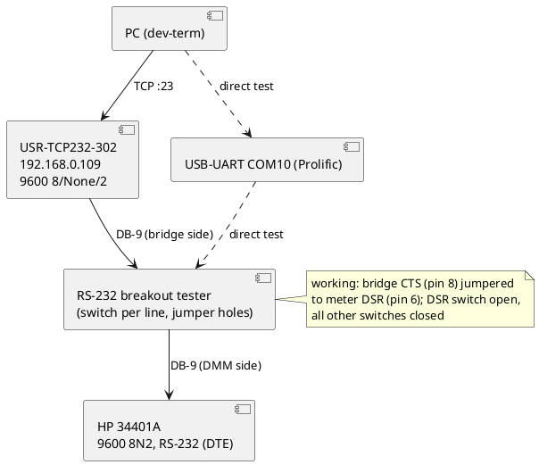

# 2026-10-02: HP 34401A through bridge 192.168.0.109 (DTR/DSR handshake)

Chasing why the HP 34401A behind the USR-TCP232-302 at 192.168.0.109 never answered, though it answers on a PC serial
port. Result: the bridge UART baud was one problem (1200 vs 9600, fixed by the bench operator); the second, and the one
that kept it silent, was the meter's DSR input never being driven true. Wiring the bridge's CTS output to the meter's DSR
input made it answer. No dev-term code change.

## Bench topology



Scopes were used as handshake monitors during the chase (TDS2024 .110: CH1 RXD, CH2 TXD, CH3 DTR, CH4 DSR; DS1102E:
CH1 CTS, CH2 RTS) and were removed for the final run.

## Device configuration matrix

| Path | Wiring | Result |
| --- | --- | --- |
| PC COM10, 9600 8N2 | tester, only RXD/TXD/GND switches on | meter beeps (receives), no reply |
| PC COM10, 9600 8N2 | tester, all switches on, dev-term asserts DTR/RTS | **works**: `HEWLETT-PACKARD,34401A,0,5-1-1` |
| Bridge .109 | straight through, DTR/DSR switches closed, jumper meter DTR to its own DSR | no reply (deadlock) |
| Bridge .109 | DTR/DSR switches open, jumper removed | no reply (DSR driven false, flat about -7 V on TDS2024 CH4) |
| Bridge .109 | bridge CTS jumpered to meter DSR, DSR switch open, others closed | **works** (3 runs) |

## Commands tested and responses

Failing runs (each printed only the two banner lines, no `[ascii]` reply):

```bash
(sleep 2; echo 'SYST:REM'; sleep 3; echo '*IDN?'; sleep 5; echo 'SYST:ERR?'; sleep 5) | timeout 35 dotnet run --no-build --project src/DevTerm.Console -- --transport tcp --host 192.168.0.109 --port 23 --presenter ascii --parser ascii --lineending Lf --writebytedelayms 50 --cli true
```

The same command with `--presenter hex` was also silent (no byte at all).

Working run, bridge CTS wired to meter DSR (run 1 and 2, scopes attached):

```bash
(sleep 2; echo 'SYST:REM'; sleep 3; echo '*IDN?'; sleep 5; echo 'SYST:ERR?'; sleep 5) | timeout 35 dotnet run --no-build --project src/DevTerm.Console -- --transport tcp --host 192.168.0.109 --port 23 --presenter ascii --parser ascii --lineending Lf --writebytedelayms 50 --cli true
```

| Sent | Received | Notes |
| --- | --- | --- |
| `*IDN?` | `HEWLETT-PACKARD,34401A,0,5-1-1` | run 1 and 2 |
| `SYST:ERR?` | `-410,"Query INTERRUPTED"` | queue left over from the earlier blocked runs |
| `MEAS:VOLT:DC?` | `+1.26283000E-04` | run 2; leads plugged in, no source |

Run 3, scope probes removed (tester: DSR switch open, all others closed, jumper as above):

```bash
(sleep 2; echo 'SYST:REM'; sleep 3; echo '*IDN?'; sleep 5; echo 'SYST:ERR?'; sleep 5; echo 'MEAS:VOLT:DC?'; sleep 5) | timeout 45 dotnet run --no-build --project src/DevTerm.Console -- --transport tcp --host 192.168.0.109 --port 23 --presenter ascii --parser ascii --lineending Lf --writebytedelayms 50 --cli true
```

| Sent | Received | Notes |
| --- | --- | --- |
| `*IDN?` | `HEWLETT-PACKARD,34401A,0,5-1-1` | |
| `SYST:ERR?` | `+0,"No error"` | queue clean |
| `MEAS:VOLT:DC?` | `+6.28130000E-05` | front panel showed `0.0628 mV DC`, Rmt lit, ERROR dark |

Direct COM10 run (all tester switches on):

```bash
dotnet run --project src/DevTerm.Console -- --transport serial --port COM10 --baud 9600 --databits 8 --parity None --stopbits Two --presenter ascii --lineending Lf --cli true
```

`*IDN?` returned `HEWLETT-PACKARD,34401A,0,5-1-1`.

## Findings

- The 34401A is a DTE. Per its programming manual it drops DTR after a query's newline until the reply is read and
  sends nothing while DSR is false. The bridge never drives DSR true (COM10-to-bridge test: DSR false for every DTR/RTS
  combination), so a meter-side DTR-to-DSR loopback deadlocks and an open DSR floats low.
- The bridge's CTS output feeding the meter's DSR is the working arrangement. That the bridge drives CTS is the bench
  operator's statement; the handshake-line scope captures never triggered, so its level was **not measured**. In the
  COM10-to-bridge test CTS (at COM10) followed the inverse of our DTR, so it may not be constant; the fix is empirical.
- A `-410 Query INTERRUPTED` is queue residue from runs where a query was blocked, not a fault of the working setup.
- Writing `--writebytedelayms 50` was used on every run; whether it is needed on the working path was not isolated.
- DS1102E over USBTMC sends no terminator (`hex` presenter needed) and its remote mode locks the front panel
  (`:KEY:FORC` releases it); see its known-configuration doc.

## Summary

Nothing changed in dev-term. Docs updated: `docs/devices/hp-34401a/`, `docs/devices/usr-tcp232-302/`,
`docs/devices/rigol-ds1102e/`, `docs/changes/2026-10-02.md`.
