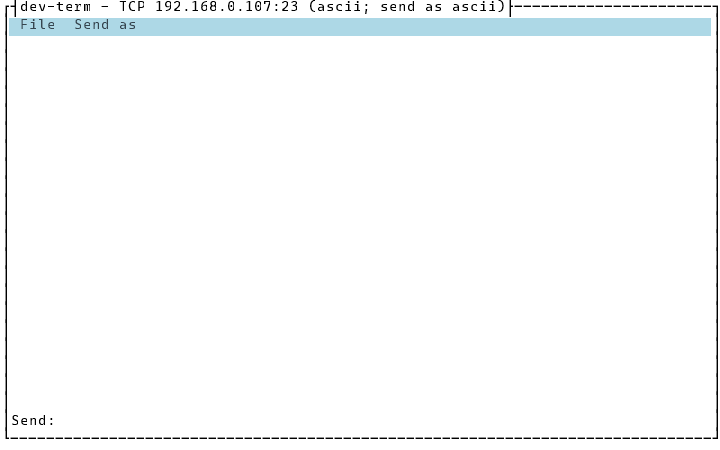
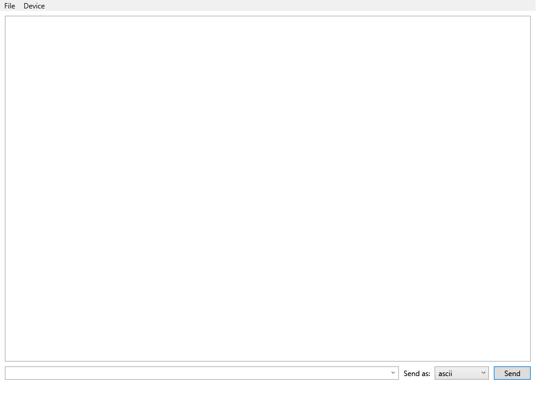

# Connecting and disconnecting without restarting

**File > Connect/Disconnect** in the TUI and WPF toggles the *same* session/transport open or
closed, without touching which profile is loaded — different from
[Managing connection profiles](managing-profiles.md)'s Device Profiles menu, which switches to a
*different* saved connection entirely (also live, also no restart, just a different transport/
device instead of the same one). The CLI has no equivalent: it's a single session for the life of
the process, Ctrl+C to end it.

## TUI

Connected — the menu item reads "Disconnect":

After **File > Disconnect**: the send field is disabled, and the menu item flips back to "Connect":

Selecting "Connect" again reopens the same transport with the same settings.

## WPF

The same toggle — connected:

Disconnected — the send box disables and a line is appended to the output list:

## Trying to send while disconnected

Both front ends guard against sending on a closed session — typing and pressing Enter/Send while
disconnected reports "Not connected" in the output instead of throwing or silently doing nothing.
