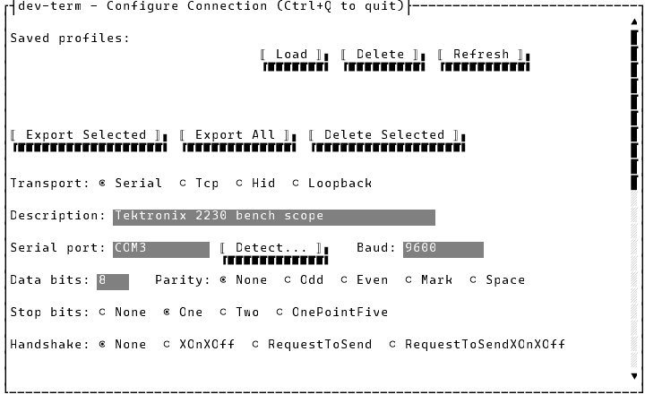
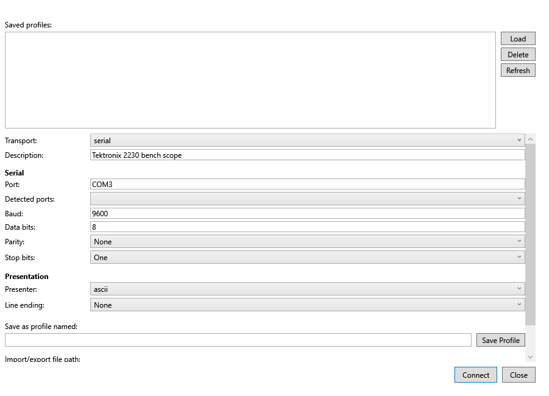
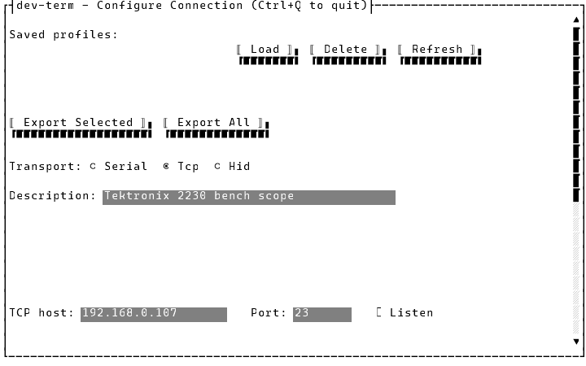
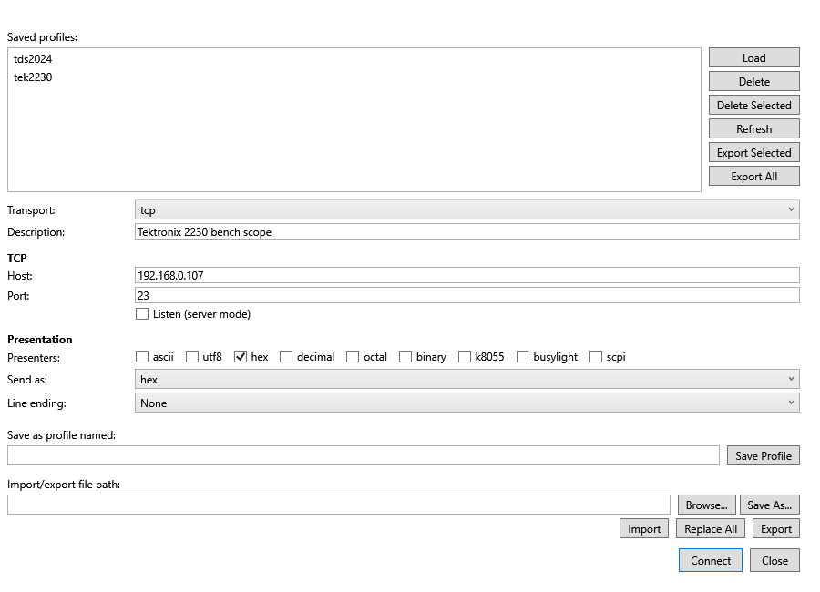
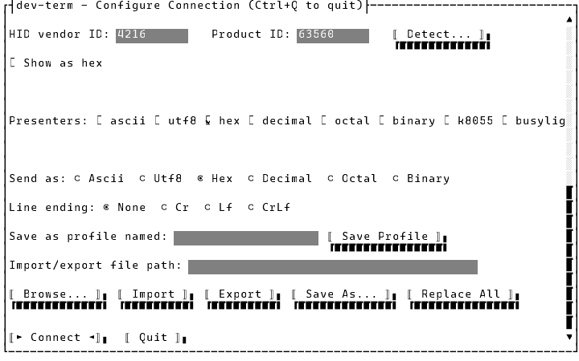
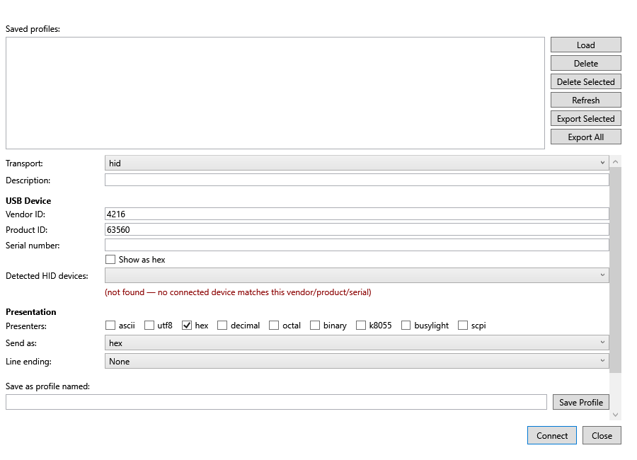
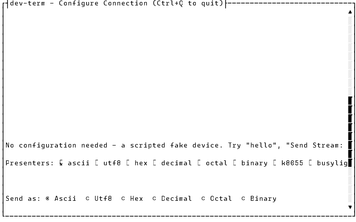
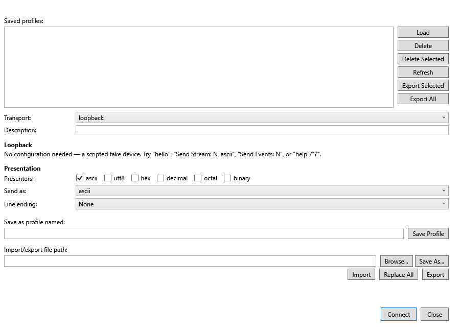
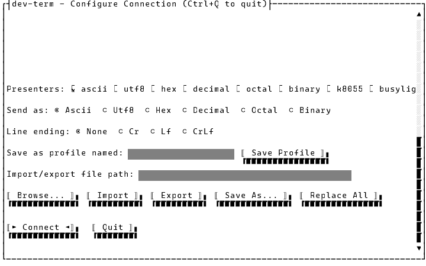

# Connecting to a device

How you get from "just started dev-term" to "connected, ready to send" — three ways in: command-line
flags (CLI), or the shared Connection Editor screen (TUI/WPF), which also opens automatically at
startup when no valid connection is configured. See
[Managing connection profiles](managing-profiles.md) for saving/loading/deleting/importing/exporting
what you set up here, and [`docs/specs/connection-editor.md`](../specs/connection-editor.md) for the
full field-by-field reference. Screenshots below are real, automated captures — see this folder's
[README](README.md) for how.

## CLI: flags

```
$ dotnet DevTerm.Console.dll --transport tcp --host 192.168.0.107 --port 23 --presenter ascii --lineending Cr --cli true
Connected to TCP 192.168.0.107:23 using 'ascii'.
Type a line and press Enter to send; Ctrl+C to exit.
```

No editor screen in CLI mode — settings come from flags, environment variables (`DEVTERM_*`), or a
saved `appsettings.Local.json` profile, in that precedence order (flags win). See `CLAUDE.md`'s
Commands section for the full flag list per transport.

### Discovering hardware first

`--listports true` lists serial ports; `--listhiddevices true` lists USB HID devices;
`--listusbtmcdevices true` lists USBTMC instruments. All three exit immediately, no connection
made — real output from a development machine:

```
$ dotnet DevTerm.Console.dll --listports true
(no output — no serial ports currently attached)

$ dotnet DevTerm.Console.dll --listhiddevices true
046D:C08B  G502 HERO Gaming Mouse  SN:0E6A395F3531
0951:16DD  HyperX Alloy Core RGB
10CF:5502
046D:C08B  HID VHF Driver  SN:1.0
1462:7D25  MYSTIC LIGHT   SN:A02021081203
04D8:F848  BLL Lamp
```

`--listhiddevices`/`--listusbtmcdevices` both take the same optional `--vendorid <n>`/
`--productid <n>` filter the Connection Editor's detected-devices picker uses — `0` (the default)
means "any", a non-zero value narrows the list to just matching devices:

```
$ dotnet DevTerm.Console.dll --listhiddevices true --vendorid 1133
046D:C08B  G502 HERO Gaming Mouse  SN:0E6A395F3531
046D:C08B  HID VHF Driver  SN:1.0
```

The list is whatever's actually plugged in (`10CF:5502` is a Velleman K8055 I/O board; `04D8:F848`
is a Kuando Busylight sold under the generic "BLL Lamp" HID product string — see
[`docs/design/features/velleman-k8055-protocol.md`](../design/features/velleman-k8055-protocol.md)
and
[`docs/design/features/kuando-busylight-protocol.md`](../design/features/kuando-busylight-protocol.md)).
Pass a listed vendor/product ID to `--transport hid --vendorid <n> --productid <n>` to connect.

### Errors

An unrecognized transport, or missing required arguments, print usage text to stderr and exit 1
rather than hanging:

```
$ dotnet DevTerm.Console.dll --transport carrier-pigeon --cli true
Unknown transport 'carrier-pigeon'. Expected 'serial', 'tcp', 'hid', 'usbtmc', or 'loopback'.
Usage: dev-term --transport serial --port <name> [--baud <rate>] [--databits <5-8>] [--parity <name>] [--stopbits <name>] [--handshake <name>] [--dtr <bool>] [--rts <bool>] [--presenter <name[,name...]>] [--parser <name>] [--lineending <None|Cr|Lf|CrLf>] [--asciimaxlinelength <n>] [--cli <bool>]
   or: dev-term --transport tcp (--host <host> | --listen true) --port <port> [--presenter <name[,name...]>] [--parser <name>] [--lineending <None|Cr|Lf|CrLf>] [--asciimaxlinelength <n>] [--cli <bool>]
   or: dev-term --transport hid --vendorid <n> --productid <n> [--serialnumber <sn>] [--presenter <name[,name...]>] [--parser <name>] [--lineending <None|Cr|Lf|CrLf>] [--asciimaxlinelength <n>] [--cli <bool>]
   or: dev-term --transport usbtmc --vendorid <n> --productid <n> [--serialnumber <sn>] [--presenter <name[,name...]>] [--parser <name>] [--lineending <None|Cr|Lf|CrLf>] [--asciimaxlinelength <n>] [--cli <bool>]
   or: dev-term --listports true
   or: dev-term --listhiddevices true
   or: dev-term --listusbtmcdevices true
```

A real connection failure (device offline, wrong host/port, wrong serial port) is reported the same
way — see `ConnectionErrorMessages` in [`docs/design/platform.md`](../design/platform.md).

## TUI and WPF: the Connection Editor

Both front ends open the same Connection Editor screen at startup whenever no valid connection is
configured — no flags, no saved profile, or an invalid one. It's also reachable any time from
**File > Device Profiles...**. Selecting a Transport shows only that transport's fields.

**Serial** (TUI, then WPF):





**TCP**:





**USB HID**:





**Loopback** — a zero-configuration, in-process fake device for exercising the UI without any real
hardware attached (see [`docs/design/transports.md`](../design/transports.md)); no fields to fill
in, just Connect:





Filling in the fields and pressing **Connect** validates them and connects immediately — no need to
save a profile first (Save is for reusing the setup later; see
[Managing connection profiles](managing-profiles.md)).

### Picking a detected serial port, HID device, or USBTMC device

The Serial port field and the Vendor/Product ID fields — shared by the HID and USBTMC transports,
since both identify a device the same way — stay freely typable, but next to each is a way to pick
from what's actually plugged in right now. WPF shows a second "Detected ports"/"Detected HID
devices"/"Detected USBTMC devices" dropdown (whichever matches the selected transport); the TUI
shows a "Detect..." button (serial) or a "Detect HID..."/"Detect USBTMC..." button (one per
transport, since HID and USBTMC devices come from separate discovery sources) that opens a small
list to pick from. Picking a device fills in both Vendor ID and Product ID together, since they
identify one device. The list is filtered by the ID fields: type a Vendor ID and only that vendor's
devices are listed, add a Product ID and only the matching device is; `0` means "any", so leaving
both at `0` lists everything detected. (That also means that after picking a device the list shrinks
to just it — set an ID back to `0` to see the others again.) The list is the same enumeration
`--listports`/`--listhiddevices`/`--listusbtmcdevices` use, captured once when the editor opens —
nothing plugged in afterward shows up without reopening the editor.

On Windows each detected serial port is listed with the name Device Manager gives it — for example
"COM3 — Prolific USB-to-Serial Comm Port" — which makes it much easier to tell adapters apart;
picking one still fills in just `COM3`. A port Windows has no name for, and every port on Linux and
macOS, is listed by its short name alone. (`--listports` still prints short names only.)

### Viewing Vendor/Product ID as hex

Check **Show as hex** next to the Vendor/Product ID fields (HID and USBTMC transports both use it)
to switch Vendor ID/Product ID between plain decimal and 4-digit hex (e.g. `04D2` instead of `1234`)
— the same no-`0x`-prefix format `--listhiddevices`/`--listusbtmcdevices`/the detected-devices
picker above already use. Toggling it reformats whatever's already entered rather than clearing the
fields; it's purely a display/typing preference, not saved as part of a profile.

### A TUI-specific limitation to know about

Notice the TUI's TCP/HID captures above have blank rows where the Serial fields used to be:
Terminal.Gui's absolute `Pos.Bottom(view)` positioning is computed from a view's frame regardless of
its `Visible` state, so hiding a field group doesn't let anything below it move up to fill the gap
(WPF's `Grid`/`StackPanel` does this automatically).

### Scrolling to see the rest of the TUI form

None of the three captures above show the Line ending/Save/Import-export controls or the
Connect/Quit buttons — the default window is tall enough for the fields shown but not the whole
form (~33 rows). **Press Page Up/Page Down, or use the mouse wheel, to scroll** — a real scrollbar
appears on the right edge. Here's the same serial-transport screen scrolled down (TCP fields shown
instead, to demonstrate a different starting point):



Scrolling is skipped while the saved-profiles list has focus, so Page Up/Page Down/the arrow keys
still navigate that list normally instead of scrolling the form out from under it. (The list has
focus when the editor opens, so Tab off it first.) **Tab also scrolls on its own**: moving focus to a
field or button below the visible area brings it into view.
