# Connecting to a device

How you get from "just started dev-term" to "connected, ready to send" — three ways in: command-line
flags (CLI), or the shared Connection Editor screen (TUI/WPF), which also opens automatically at
startup when no valid connection is configured. See
[Managing connection profiles](managing-profiles.md) for saving/loading/deleting/importing/exporting
what you set up here, and [`docs/specs/connection-editor.md`](../specs/connection-editor.md) for the
full field-by-field reference. Screenshots below are real, automated captures — see this folder's
[README](README.md) for how.

## CLI: flags

```
$ dotnet DevTerm.Console.dll --transport tcp --host 192.168.0.107 --port 23 --presenter ascii --lineending Cr --cli true
Connected to TCP 192.168.0.107:23 using 'ascii'.
Type a line and press Enter to send; Ctrl+C to exit.
```

No editor screen in CLI mode — settings come from flags, environment variables (`DEVTERM_*`), or a
saved `appsettings.Local.json` profile, in that precedence order (flags win). See `CLAUDE.md`'s
Commands section for the full flag list per transport.

`rfc2217` connects to a remote serial port over the network (e.g. a `ser2net` or pyserial
`rfc2217_server.py` bridge) — same baud/parity/data-bits/stop-bits/DTR/RTS fields as `serial`, plus
`--host`/`--port` like `tcp`:

```
$ dotnet DevTerm.Console.dll --transport rfc2217 --host 192.168.0.50 --port 2217 --baud 9600 --presenter ascii --cli true
Connected to RFC 2217 192.168.0.50:2217 using 'ascii'.
Type a line and press Enter to send; Ctrl+C to exit.
```

If the remote end doesn't actually speak RFC 2217 option negotiation (some vendor serial-to-TCP
bridges advertise "RFC2217" without fully implementing it — see
[`docs/design/rfc2217.md`](../design/rfc2217.md)'s vendor-variant warning), dev-term falls back to
plain data pass-through with no baud/DTR/RTS control rather than failing the connection, unless the
peer explicitly refuses the option (`WONT`/`DONT`), which is reported as a connection error.

### Discovering hardware first

`--listports true` lists serial ports; `--listhiddevices true` lists USB HID devices;
`--listusbtmcdevices true` lists USBTMC instruments; `--listbledevices true` lists already-*paired*
BLE peripherals (Windows only today — see [`docs/design/transports.md`](../design/transports.md)'s
BLE section for why paired-only, not a live scan). All four exit immediately, no connection made —
real output from a development machine:

```
$ dotnet DevTerm.Console.dll --listports true
(no output — no serial ports currently attached)

$ dotnet DevTerm.Console.dll --listhiddevices true
046D:C08B  G502 HERO Gaming Mouse  SN:0E6A395F3531
0951:16DD  HyperX Alloy Core RGB
10CF:5502
046D:C08B  HID VHF Driver  SN:1.0
1462:7D25  MYSTIC LIGHT   SN:A02021081203
04D8:F848  BLL Lamp

$ dotnet DevTerm.Console.dll --listbledevices true
(no output — no BLE peripherals currently paired)
```

Each `--listusbtmcdevices` line also ends with the instrument's physical USB location, e.g.
`at usb:1-4.2` (bus 1, root port 4, port 2 of the hub on it). That's the value a USBTMC profile's
`DevicePath` holds. It tells two identical instruments apart when neither reports a usable serial
number, and it's only consulted when the serial number is blank. The Connection Editor fills it in
when you pick a detected USBTMC device.

`--listhiddevices`/`--listusbtmcdevices` both take the same optional `--vendorid <n>`/
`--productid <n>` filter the Connection Editor's detected-devices picker uses — `0` (the default)
means "any", a non-zero value narrows the list to just matching devices:

```
$ dotnet DevTerm.Console.dll --listhiddevices true --vendorid 1133
046D:C08B  G502 HERO Gaming Mouse  SN:0E6A395F3531
046D:C08B  HID VHF Driver  SN:1.0
```

The list is whatever's actually plugged in (`10CF:5502` is a Velleman K8055 I/O board; `04D8:F848`
is a Kuando Busylight sold under the generic "BLL Lamp" HID product string — see
[`docs/design/features/velleman-k8055-protocol.md`](../design/features/velleman-k8055-protocol.md)
and
[`docs/design/features/kuando-busylight-protocol.md`](../design/features/kuando-busylight-protocol.md)).
Pass a listed vendor/product ID to `--transport hid --vendorid <n> --productid <n>` to connect.

**Sending a fixed-length HID report by hand:** add `--lineending None`. The CLI appends a line ending to every typed line
(default `Cr`), which makes a 9-byte report 10 bytes, and Windows rejects it with "Operation failed early: The parameter is
incorrect." For example, the K8055: `--transport hid --vendorid 4303 --productid 21760 --presenter hex --parser hex
--lineending None --cli true`, then `00 05 01 00 00 00 00 00 00` (digital output 1 on). The same applies to a serial device
that expects exact bytes (the Zoom H4n remote port).

### MQTT broker

`--transport mqtt` subscribes to topics and publishes lines. Each message that arrives is shown as one
`topic<TAB>payload` line; a typed line goes to `--publish`, or type `topic<TAB>payload` to choose the topic.
Real capture against the `containers/` Mosquitto broker (`docker compose -f containers/docker-compose.yml up -d mosquitto`),
having typed `smoke/out<TAB>hello from devterm`:

```
dotnet run --project src/DevTerm.Console -- --transport mqtt --host 127.0.0.1 --port 1883 --subscribe "smoke/#" --publish smoke/out --presenter ascii --cli true
Connected to MQTT 127.0.0.1:1883 subscribed to smoke/# publishing to smoke/out using 'ascii' (send as 'ascii').
Type a line and press Enter to send; Ctrl+C to exit.
[ascii] smoke/out	hello from devterm
```

Add `--username` and `--password` for an authenticated broker. In the Connection Editor, pick `mqtt`: Host and Port
come from the TCP group, plus an MQTT group for the topics and user name. The password is never saved.

### AMQP and STOMP (RabbitMQ)

`--transport amqp` (AMQP 0-9-1, port 5672) and `--transport stomp` (STOMP 1.2, port 61613) work like `mqtt`: the same
`--subscribe`, `--publish`, `--username` and `--password`, and each message is shown as one `address<TAB>payload` line.
For AMQP the address is a routing key on the `amq.topic` exchange (`sensors.#`); for STOMP it is a destination
(`/topic/sensors`). Against the `containers/` RabbitMQ (user/password `devterm`; STOMP is mapped to 21613):

```
dotnet run --project src/DevTerm.Console -- --transport amqp --host 127.0.0.1 --port 5672 --username devterm --password devterm --subscribe "cli.#" --publish cli.out --presenter ascii --cli true
[ascii] cli.out	hi amqp
```

For an encrypted connection add `--tls true` (AMQPS on 5671, STOMP over TLS on the broker's TLS port); the broker's
certificate must be trusted by the system, or by `--cacertificate <file>` for a private CA. A certificate that does not
validate is refused. `containers/make-test-certs.sh` makes a throwaway CA for the test RabbitMQ.

The Connection Editor offers both under Transport, with the same MQTT group of fields; `Tls` and `CaCertificate` are
kept in a saved profile and preserved when the editor saves it, but are not editor fields yet.

### Errors

An unrecognized transport, or missing required arguments, print usage text to stderr and exit 1
rather than hanging:

```
$ dotnet DevTerm.Console.dll --transport carrier-pigeon --cli true
Unknown transport 'carrier-pigeon'. Expected 'serial', 'tcp', 'hid', 'usbtmc', 'ble', 'rfc2217', or 'loopback'.
Usage: dev-term --transport serial --port <name> [--baud <rate>] [--databits <5-8>] [--parity <name>] [--stopbits <name>] [--handshake <name>] [--dtr <bool>] [--rts <bool>] [--presenter <name[,name...]>] [--parser <name>] [--lineending <None|Cr|Lf|CrLf>] [--asciimaxlinelength <n>] [--cli <bool>]
   or: dev-term --transport tcp (--host <host> | --listen true) --port <port> [--presenter <name[,name...]>] [--parser <name>] [--lineending <None|Cr|Lf|CrLf>] [--asciimaxlinelength <n>] [--cli <bool>]
   or: dev-term --transport hid --vendorid <n> --productid <n> [--serialnumber <sn>] [--presenter <name[,name...]>] [--parser <name>] [--lineending <None|Cr|Lf|CrLf>] [--asciimaxlinelength <n>] [--cli <bool>]
   or: dev-term --transport usbtmc --vendorid <n> --productid <n> [--serialnumber <sn>] [--presenter <name[,name...]>] [--parser <name>] [--lineending <None|Cr|Lf|CrLf>] [--asciimaxlinelength <n>] [--cli <bool>]
   or: dev-term --transport ble --bledeviceid <id> [--bleserviceuuid <uuid>] [--blewritecharacteristicuuid <uuid>] [--blenotifycharacteristicuuid <uuid>] [--presenter <name[,name...]>] [--parser <name>] [--lineending <None|Cr|Lf|CrLf>] [--asciimaxlinelength <n>] [--cli <bool>]
   or: dev-term --transport rfc2217 --host <host> --port <port> [--baud <rate>] [--databits <5-8>] [--parity <name>] [--stopbits <name>] [--dtr <bool>] [--rts <bool>] [--presenter <name[,name...]>] [--parser <name>] [--lineending <None|Cr|Lf|CrLf>] [--asciimaxlinelength <n>] [--cli <bool>]
   or: dev-term --playback <log.jsonl> [--presenter <name[,name...]>] [--playbackspeed <rate, 0 = as fast as possible>]
   or: dev-term --listports true
   or: dev-term --listhiddevices true [--vendorid <n>] [--productid <n>]
   or: dev-term --listusbtmcdevices true [--vendorid <n>] [--productid <n>]
   or: dev-term --listbledevices true
The full-screen TUI is the default mode; pass --cli true for the plain scriptable loop instead
(e.g. for automation/CI), or --tui false, equivalently.
Add --log <file.jsonl> (or --log true for a timestamped file under ~/.dev-term/logs) to any
connection to record everything sent and received.
...
```

Recording a session (`--log`) and replaying one (`--playback`) are covered in
[Logging and playing back a session](logging-and-playback.md).

A real connection failure (device offline, wrong host/port, wrong serial port) is reported the same
way — see `ConnectionErrorMessages` in [`docs/design/platform.md`](../design/platform.md).

## TUI and WPF: the Connection Editor

Both front ends open the same Connection Editor screen at startup whenever no valid connection is
configured — no flags, no saved profile, or an invalid one. It's also reachable any time from
**File > Device Profiles...**. Selecting a Transport shows only that transport's fields, under a
heading for its group (Serial, TCP, USB Device, Loopback), followed by the Presentation fields. The
fields are the same in both front ends because both draw them from one definition (see
[the Connection Editor spec](../specs/connection-editor.md)); a value that isn't what the field
expects (a Baud rate that isn't a whole number, say) is flagged right under or beside the field as
you type.

**Serial** (TUI, then WPF):

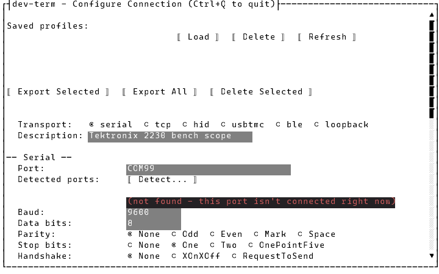

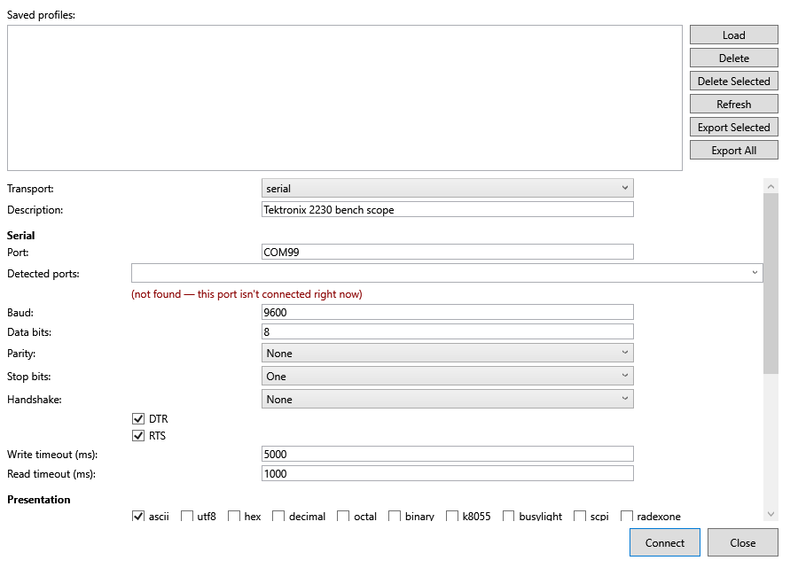

These captures use a saved port (COM99) that isn't attached. The "(not found — …)" line (red in WPF)
is how both front ends flag a saved port or USB device that isn't connected right now. It's only a
hint: Connect still tries, and reports the error if the connection fails.

**TCP**:

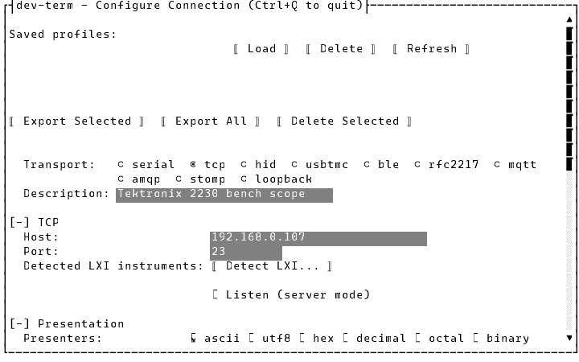

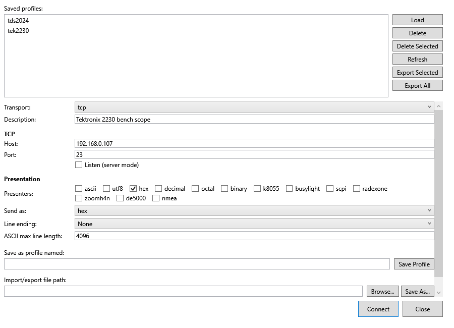

**RFC 2217** (connect to a remote serial port over the network) has no screen of its own — selecting
it shows the Serial and TCP field groups together (Host/Port from TCP, Baud/Data bits/Parity/Stop
bits/DTR/RTS from Serial), minus the three fields that don't apply to it (Listen, Handshake, Read
timeout (ms)) — see [the Connection Editor spec](../specs/connection-editor.md)'s States section for
exactly which fields that is.

**Timing** is a separate section shown below Serial/TCP/RFC 2217's own fields (not for HID, USBTMC,
BLE, or Loopback): **Write byte delay (ms)**, for a slow device without a FIFO buffer that can't
absorb a burst write. Leave it at `-1` (the default) for normal unpaced writes; `0` writes and
flushes one byte at a time with no added delay; a positive value adds that many milliseconds between
bytes. See [`docs/design/transports.md`](../design/transports.md)'s "Write pacing" section for how it
works under the hood.

**USB HID** (the TUI capture is scrolled so the USB Device section starts at the top):

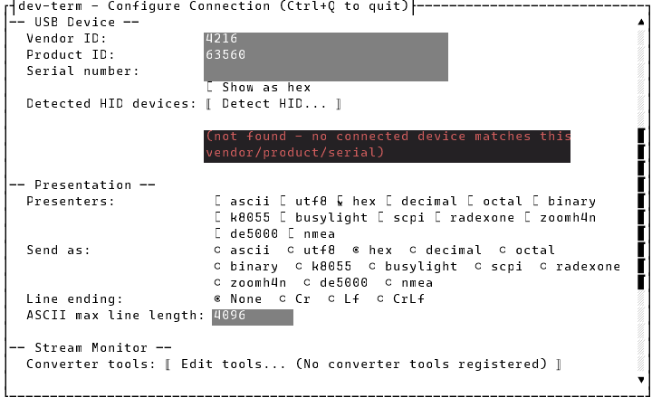

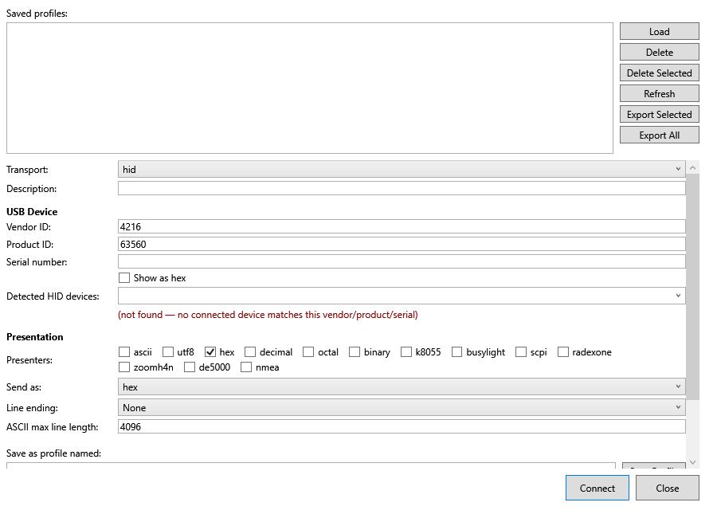

**Loopback** — a zero-configuration, in-process fake device for exercising the UI without any real
hardware attached (see [`docs/design/transports.md`](../design/transports.md)); the only field is
an optional **Sample interval (ms)** (default `0`, instant delivery) that paces a scripted streaming
response (`Samples: N`, `Send Events: N`) one line at a time instead of delivering it all at once —
useful for demoing or verifying a strip chart or Stream Monitor capture at a believable cadence. No
other fields to fill in beyond that, just Connect:

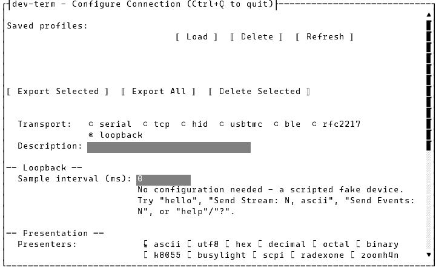

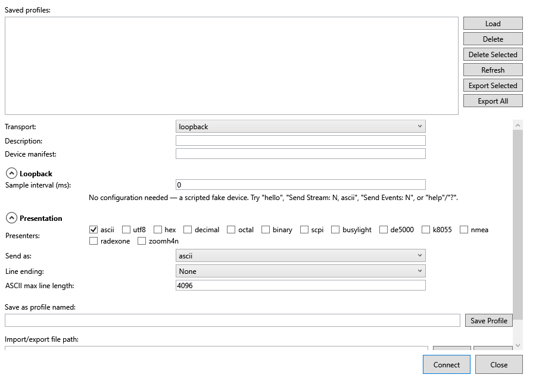

To watch a paced stream arrive, set **Sample interval (ms)** to `400`, connect, and send `Samples: 6`
(or `dotnet run --project src/DevTerm.Console -- --transport loopback --loopbacksampleintervalms 400`).
Each simulated sample appears on its own line, about 0.4 s after the one before, instead of all at once:


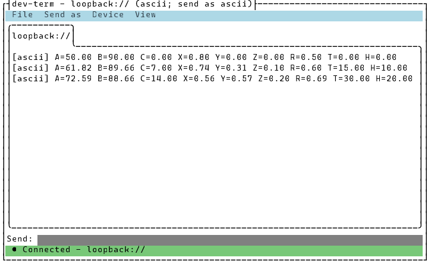

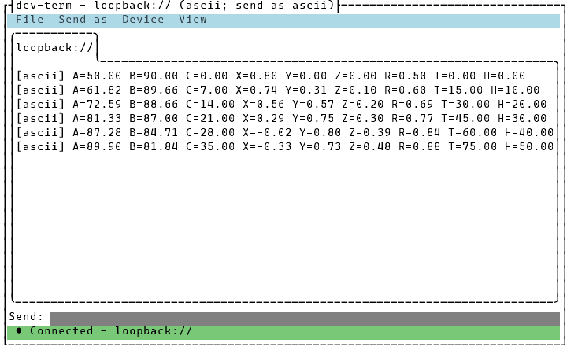

The same capture as an animation (one frame per arrived sample):

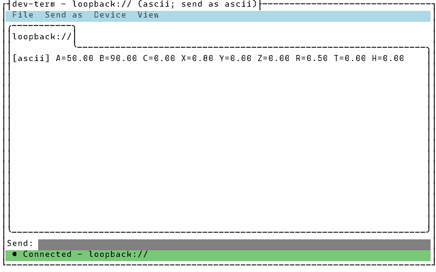

The WPF window, same stream:

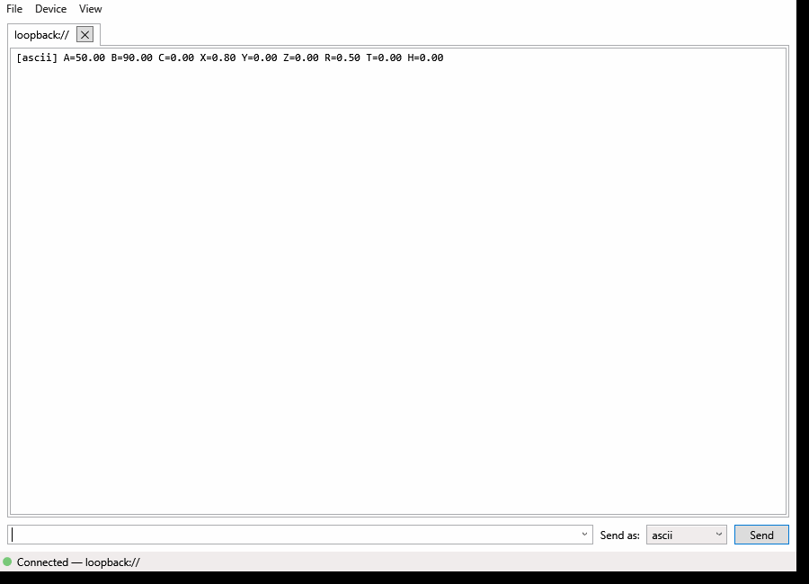

To watch the charts fill, open the bundled sensor manifest (**Device > Device Manifest...**, "Loopback Sensor Demo")
and press **Stream Samples**. Its bar graph, strip chart and vector displays update as each paced sample arrives
(one frame per four samples here):

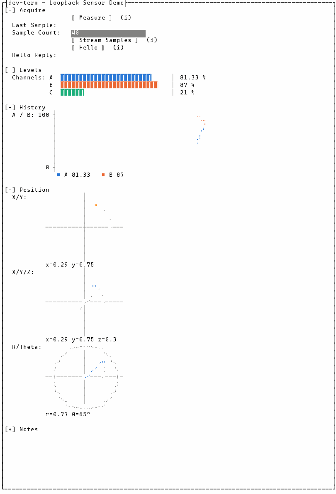

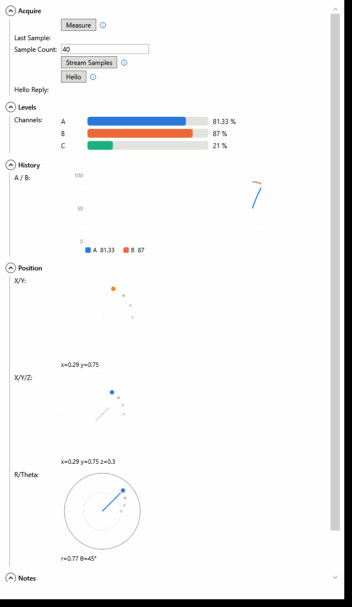

The stills are real captures from the `LoopbackSampleStreamScreenshotTests` and `LoopbackChartsScreenshotTests`
classes (Console and Wpf test projects); `scripts/make_loopback_gif.py` assembles each front end's stills into its GIF.

**BLE** (Windows only today — see [`docs/design/transports.md`](../design/transports.md)'s BLE
section): device id plus the three GATT UUIDs (service/write/notify — blank uses the Nordic UART
Service defaults). No live "Detect..." picker yet, unlike Serial/HID/USBTMC — copy the device id from
a `--listbledevices true` run:

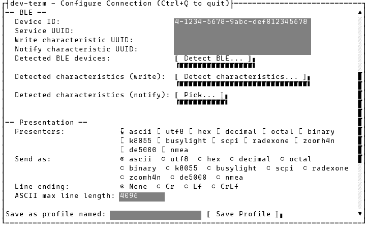

Filling in the fields and pressing **Connect** validates them and connects immediately — no need to
save a profile first (Save is for reusing the setup later; see
[Managing connection profiles](managing-profiles.md)).

### Accepting your changes: Connect

**Connect** is how you accept what's in the form. There's no separate OK or Apply. Connect:

1. checks the fields; if one is wrong, it says why and the editor stays open (at the top of the TUI
   form, in red at the top of the WPF window);
2. closes the editor and connects with those settings.

Opened from **File > Device Profiles...** while running, Connect also saves the settings as your
default connection (the one dev-term uses next time you start it with no arguments), then drops the
current connection and connects with the new settings in place, with no restart. The editor that
opens at startup, when nothing valid is configured, only connects; it doesn't change the saved
default.

You don't need to save a named profile first. **Save Profile** is only for reusing the setup later
(see [Managing connection profiles](managing-profiles.md)), and it doesn't close the editor.

How to press it:

- **TUI**: Connect and Quit are the last row of the form, below Import/Export. **Tab** to Connect
  (the form scrolls to follow focus; **Page Down** jumps there faster) and press **Enter** or
  **Space**, or click it. Connect is the default button, so **Enter** in a text field (or on a
  check box) presses it too; Enter in the saved-profiles list loads the selected profile instead.
  **Quit**, next to it, or **Ctrl+Q**, leaves without connecting; at startup that exits dev-term.
- **WPF**: **Connect** and **Close** are at the bottom right of the window. Connect is the default button, so
  **Enter** in a field presses it. **Close** (or Esc) leaves without connecting.

Either way, if you've changed a field without saving or connecting, Quit/Close asks before throwing the
changes away.

### Finding a LAN device (LXI, mDNS, SSDP)

For a device on the network, choose the `tcp` transport and press **Detect network devices...** (a dropdown plus button in WPF, a
button opening a list in the TUI). The scan takes about three seconds and runs three probes at once: the LXI instrument
scan (with its `*IDN?` and raw SCPI port), mDNS service discovery and SSDP/UPnP. Each device appears once; picking one fills
Host and Port. The mDNS and SSDP probes have only been tried against what happens to be on one home LAN (printers, a NAS);
an LXI unit such as the DG1062Z answers the LXI probe only. From a script, `--listlxidevices true` lists just the LXI
instruments and `--listnetworkdevices true` lists everything:

```
> dotnet run --project src/DevTerm.Console -- --listlxidevices true
192.168.0.87:5555  Rigol Technologies,DG1062Z,DG1ZA232603118,03.01.12  (192.168.0.87:5555)
```

```
> dotnet run --project src/DevTerm.Console -- --listnetworkdevices true
192.168.0.48:80  tcp  Brother HL-3170CDW series  (unknown, mdns)
192.168.0.127:5555  tcp  Rigol Technologies,DG1062Z,DG1ZA232603118,03.01.12  (lxi, lxi)
```

(Real output from the bench LAN; the DG1062Z moved from .87 to .127 between captures. mDNS answers are not guaranteed: a
NAS that appeared in one run was absent from this one, so a missing device means "try again", not "not there".)

(Real output from the bench Rigol DG1062Z for the first capture.) An instrument that only speaks VXI-11, with no raw SCPI port on 5025 or 5555,
is listed as "VXI-11 only" and falls back to port 5025, which will not work for it; connect with `--transport vxi11 --host <ip>` instead (the portmapper finds the port, no `--port` needed). The same works for the DG1062Z: `--transport vxi11 --host 192.168.0.87 --presenter ascii --lineending Lf --cli true`, then `*IDN?`.

### Picking a detected serial port, HID device, or USBTMC device

The Serial port field and the Vendor/Product ID fields — shared by the HID and USBTMC transports,
since both identify a device the same way — stay freely typable, but next to each is a way to pick
from what's actually plugged in right now: a "Detected ports"/"Detected HID devices"/"Detected
USBTMC devices" row (whichever matches the selected transport, since HID and USBTMC devices come
from separate discovery sources). WPF shows a dropdown there; the TUI a "Detect..."/"Detect
HID..."/"Detect USBTMC..." button that opens a small list to pick from. Picking a device fills in both Vendor ID and Product ID together, since they
identify one device. The list is filtered by the ID fields: type a Vendor ID and only that vendor's
devices are listed, add a Product ID and only the matching device is; `0` means "any", so leaving
both at `0` lists everything detected. (That also means that after picking a device the list shrinks
to just it — set an ID back to `0` to see the others again.) The list is the same enumeration
`--listports`/`--listhiddevices`/`--listusbtmcdevices` use, captured once when the editor opens —
nothing plugged in afterward shows up without reopening the editor.

On Windows each detected serial port is listed with the name Device Manager gives it — for example
"COM3 — Prolific USB-to-Serial Comm Port" — which makes it much easier to tell adapters apart;
picking one still fills in just `COM3`. On Linux and macOS a USB serial adapter is listed with the
manufacturer, product, vendor/product ID and serial number the device itself reports — for example
"/dev/ttyUSB0 — FTDI FT232R USB UART (0403:6001, serial A50285BI)" — and picking it fills in just
`/dev/ttyUSB0`. (The Linux/macOS descriptions have so far only been checked against sample data, not
on a real Linux or macOS machine.) A port the OS has nothing to say about — a built-in `ttyS0`, a
Bluetooth port — is listed by its short name alone. (`--listports` still prints short names only.)

### Viewing Vendor/Product ID as hex

Check **Show as hex** under the Vendor/Product ID fields (HID and USBTMC transports both use it)
to switch Vendor ID/Product ID between plain decimal and 4-digit hex (e.g. `04D2` instead of `1234`)
— the same no-`0x`-prefix format `--listhiddevices`/`--listusbtmcdevices`/the detected-devices
picker above already use. Toggling it reformats whatever's already entered rather than clearing the
fields; it's purely a display/typing preference, not saved as part of a profile.

### Scrolling to see the rest of the TUI form

The serial and TCP captures above don't show the Save/Import-export controls or the Connect/Quit
buttons — the default window is tall enough for the fields shown but not the whole form. (Switching
transports never leaves a gap: the fields below move up into the space a hidden group leaves.)
**Press Page Up/Page Down, or use the mouse wheel, to scroll** — a real scrollbar appears on the
right edge. Here's the TCP screen scrolled down:

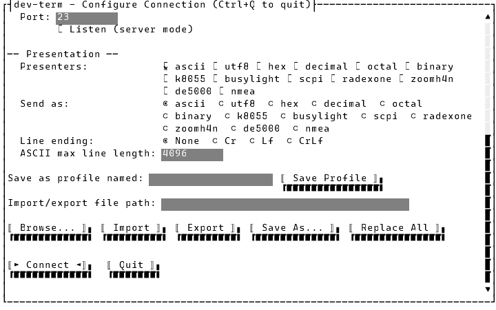

Scrolling is skipped while the saved-profiles list has focus, so Page Up/Page Down/the arrow keys
still navigate that list normally instead of scrolling the form out from under it. (The list has
focus when the editor opens, so Tab off it first.) **Tab also scrolls on its own**: moving focus to a
field or button below the visible area brings it into view.
