# Controlling a device from a panel, not just typed commands

Some devices get a real control panel instead of typing raw bytes — buttons, sliders, toggles, and
fields generated from that device's own declared layout. Once connected (see
[Connecting to a device](connecting.md)), open **Device** in the menu bar (TUI and WPF both) to see
what's available. Full field-by-field/action-by-action reference:
[`docs/specs/device-control-panel.md`](../specs/device-control-panel.md).

## Finding your way around a panel

Every panel works the same way, whichever device it's for:

- **Sections fold away.** Each named section can be collapsed to just its heading, and the
  sections below move up to fill the space. In WPF, click the section heading (the round arrow
  button). In the TUI, each heading reads `[-] Name`; Tab to it and press Enter or Space (or click
  it) and it becomes `[+] Name` with its rows hidden. Sections start expanded the first time; after
  that, a panel reopens with each section the way you left it (collapse the 34401A's **Measure**
  section once and it stays collapsed every time you open that panel, until you quit dev-term).
- **Labels line up.** Within a section, every control starts in the same column, just past the
  longest label, and labels stay on one line.
- **Wide rows scroll sideways (TUI).** A row wider than the terminal (a long button name, a choice
  with many options) never gets cut off: the form scrolls sideways instead, with a scroll bar along
  its bottom edge. Moving focus to a control scrolls it, and its `(i)` marker, into view by itself;
  a section heading scrolls back to the left edge. **Ctrl+PageDown**/**Ctrl+PageUp** (or a sideways
  mouse wheel) scroll by half a screen, for the end of a row you can't focus, like a long reply.
- **Notes are at the bottom.** A device's descriptive notes (for a SCPI instrument, its profile's
  notes: required connection settings, a command you must send first, known quirks) are in a
  **Notes** section after all the others, wrapped to fit the window. In the TUI they re-wrap when
  you resize the terminal.
- **See exactly what a control sends before you send it.** A control that sends a command has a
  small info marker next to it: "ⓘ" in WPF, `(i)` in the TUI. In WPF, hover the icon: the tooltip
  shows the command for the control's current value (the slider's position, what's typed in the
  field, the selected option). In the TUI, move focus to the control, or to a field that feeds its
  button, and the line at the bottom of the panel reads, say, `Sends: CONF:VOLT:DC DEF\n`. Line
  endings and other control characters are shown escaped (`\n`, `\r`). For the K8055 and Busylight,
  which talk in binary HID reports, it shows the report bytes in hex.
- **Bad values are caught before they're sent.** Type something a field can't take (letters in a
  number field, a value outside the allowed range) and nothing is sent; the panel says why, e.g.
  `Channel: 9 is out of range (1 to 4). Not sent.` In the TUI that's the panel's bottom line; in WPF,
  the red line at the bottom of the window. A number you type is tidied up (`1e3` becomes `1000`),
  and a number field with a fixed range pulls an out-of-range value back into that range.

Here the 34401A panel's **Common** and **Measure** sections are collapsed, and focus is on the
**Configure DC Voltage Range** button, so the bottom line shows the exact command it sends:

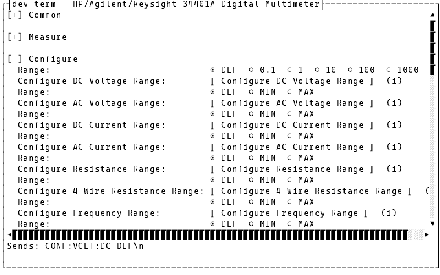

And here focus has moved to **Configure 4-Wire Resistance Range**, the 34401A's widest row: the form
has scrolled sideways so the whole button and its `(i)` marker are on screen (the scroll bar above
the bottom line shows where you are):

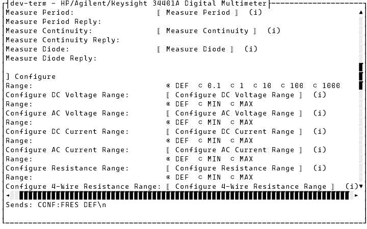

## K8055 and Busylight: open and go

**Device > K8055 Control Panel...** and **Device > Busylight Control Panel...** each open
immediately — no setup, no picker. These two devices have one fixed, built-in layout apiece:

- **K8055** (a generic USB HID digital/analog I/O board): digital output toggles, analog output
  sliders, and digital-input/analog-input indicators that update live as the device reports them.

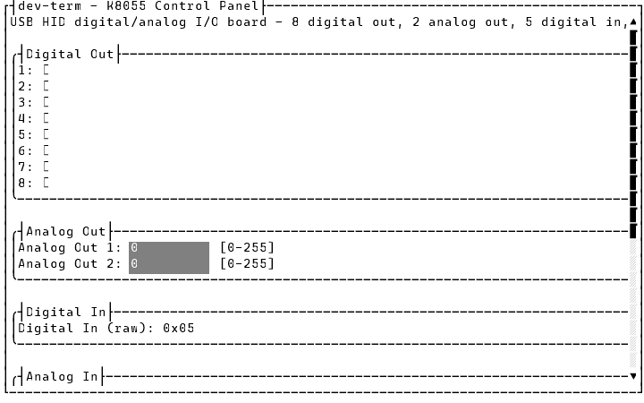

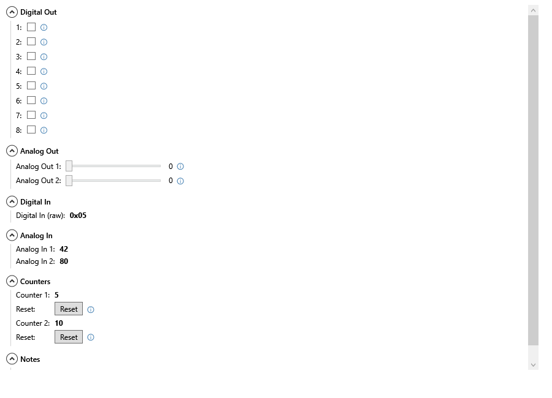

- **Busylight** (a USB HID RGB status light): color, blink, and sound settings (including a custom
  RGB/HSV color picker), sent to the light together when you press **Apply**. Since only **Apply**
  sends anything, it's the only control with an info marker. Its long "On (unit unconfirmed)" label
  now sits on one line, with the fields lined up after it.

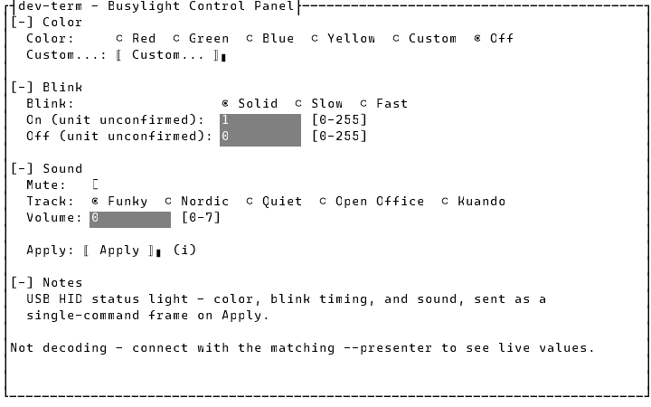

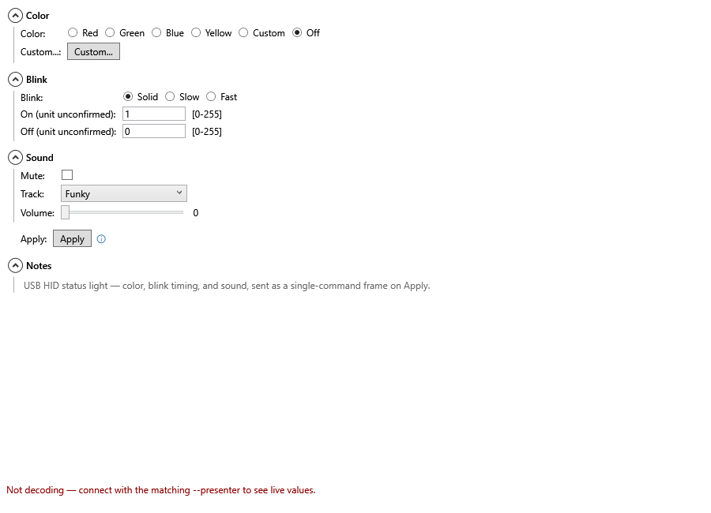

**Custom...** opens the RGB/HSV picker. It opens on the last color you picked, even if you've closed
and reopened the panel since; before any pick it starts on white. Once a custom color has been set,
a swatch next to the button shows its hex value on a background of that color.

The Color radios include **Custom**, which stands for that picked color:
- Picking a color in **Custom...** selects the Custom radio.
- Choosing a preset (Red, Green, ...) and then selecting **Custom** again puts your custom color back,
  with no need to reopen the picker.
- If no custom color has been picked yet, selecting **Custom** opens the picker.

As with every color change, it takes effect when you press **Apply**. Here the custom color is
`#FF6600`:

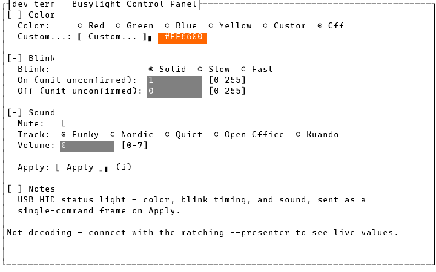

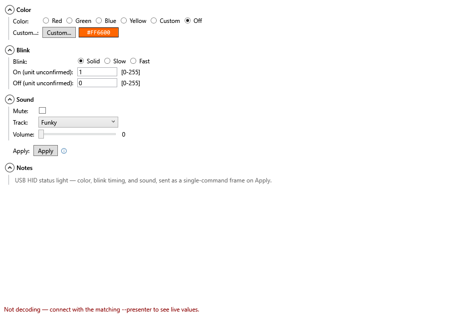

The WPF picker opens sized to fit its controls and can be resized. If you make it shorter than its
controls they scroll, and OK/Cancel stay pinned at the bottom (they used to be cut off, with no way
to resize the window to reach them):

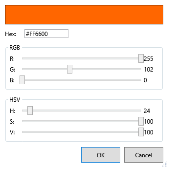

The chosen color is remembered only while the app is running, not across restarts.

Both only make sense connected to that actual device over HID, so their **Device** menu items are
greyed out otherwise. The K8055 item needs vendor `10CF`, products `5500`–`5503`; the Busylight item
needs `04D8:F848` or a Plenom `27BB` device. **SCPI Instrument...** is available on any connection
except HID, and **Device Manifest...** (below) on any connection at all. All four are greyed out
while disconnected.

## SCPI instruments: pick a profile first

**Device > SCPI Instrument...** is for SCPI-compatible bench equipment (multimeters, power supplies,
scopes, function generators). Unlike the two panels above, one menu item covers many different
instruments, so it needs to know which one you're talking to before it can build a panel:

- If the connection you're using already has a saved instrument choice (see
  [Managing connection profiles](managing-profiles.md) — it's part of a saved profile, same as the
  transport settings), the panel opens straight away with no extra step.
- Otherwise, a small picker appears listing every built-in instrument profile plus two extra
  choices:
  - **Auto-detect (*IDN?)** — sends the standard SCPI `*IDN?` identification query and matches the
    reply against each profile automatically. This is a real round-trip to the device. While it
    waits, the main window's output shows
    `Auto-detecting the SCPI instrument: sent *IDN?, waiting up to 3 s…` (WPF also shows a busy
    cursor). Afterward it says what happened:
    - `Detected {profile} (*IDN? replied "…")`
    - `No loaded SCPI profile recognizes *IDN? reply "…" — opening the Generic panel.`
    - `No *IDN? reply within 3 s — opening the Generic panel.`

    In the last two cases you get the Generic panel. The wait is 3 s unless the connection sets
    `--scpiautodetecttimeoutms` (100–60000); a slow instrument may need longer.
  - **Generic (manual)** — a minimal panel (`*IDN?`, `*RST`, `*CLS`, `*OPC?`) that works against any
    SCPI device, curated profile or not.

Whichever way you get there, every SCPI panel also has a **Custom Command** section at the bottom: a
text field and a Send button that sends exactly what you type, verbatim, with the reply shown right
there — so you're never limited to what's in the curated command list.

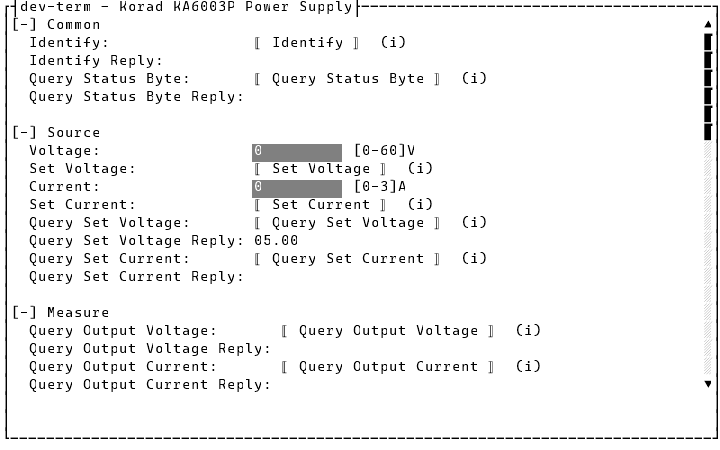

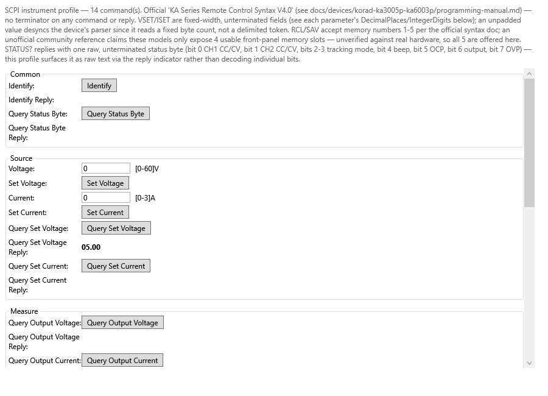

### Sending a command with parameters

A curated command that needs a value (say, a frequency) shows as one or more fields above a single
button. Fill in the field(s), then press the button — it reads whatever's currently in those fields
and sends the fully-formed command in one action. If a field holds something it can't take, the
button sends nothing and the panel says which field and why. While you're in one of those fields,
the TUI's bottom line already shows the command the button would send with what you've typed. Query-type commands (anything ending in `?`) show
their reply in a read-only field right next to the button, as soon as it arrives — but only if the
`scpi` presenter is selected for the connection (see
[Connecting to a device](connecting.md)'s Presenters field); without it, commands still send fine,
you just won't see replies show up in the panel itself (they still appear in the main output as
plain text).

## Device manifests: a panel from a file

**Device > Device Manifest...** opens a panel for any device described by a
[device manifest](../design/device-manifests.md) — a JSON file (or a folder with a `device.json`, or
a `.zip` of one) that lists the device's commands, how to read its replies, and the panel's layout.
No code, and nothing built into dev-term for that device.

1. Connect to the device as usual.
2. Choose **Device > Device Manifest...**. A picker lists the manifests dev-term found: your own,
   in `~/.dev-term/manifests/` (each one a folder with a `device.json`, a single `.json` file, or a
   `.zip`), then the ones installed with dev-term. To use one from anywhere else, type or paste its
   path into the path field (WPF also has **File...** and **Folder...** buttons to browse for it).
3. Choose **Open**. If the manifest can't be loaded (a typo in the JSON, a missing file it refers
   to), the picker says why: in WPF, in red under the path field, and the picker stays open; in the
   TUI, in an error box.

The panel works like every other one (sections, `(i)`/ⓘ previews, validation), and each command's
button sends exactly what the manifest's template says. A query's reply shows in its reply field,
and any line the device sends — a reply or data it streams on its own — is matched against the
manifest's reply patterns to drive live displays:

- **Bar graphs**: one bar per channel, filled to its latest value, with the value beside it.
- **Strip charts**: a scrolling trace per channel, newest on the right, with its latest value in
  the legend.
- **Vector displays**: a point plotted from x/y, x/y/z, or radius/angle values, with a short fading
  trail of where it's been, optionally colored from live hue/saturation/brightness values.

dev-term installs one example, **Loopback Sensor Demo**, that needs no hardware: connect with the
loopback transport (`--transport loopback`, or pick **loopback** in the connection editor), open
**Device > Device Manifest...**, and pick it. **Measure** asks the simulated sensor for one reading;
**Stream Samples** asks for the next 40 (or however many you type), and the charts fill in as they
arrive:

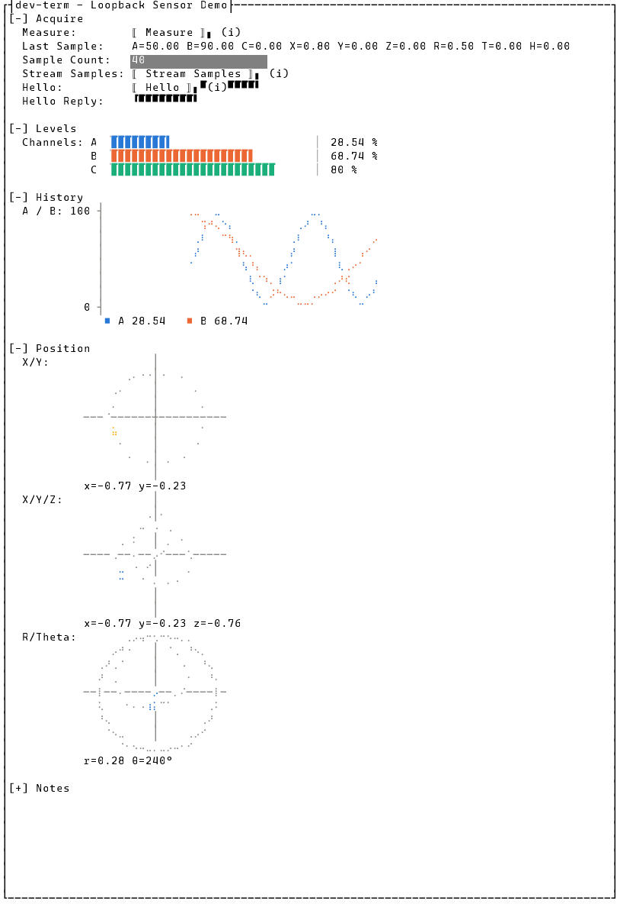

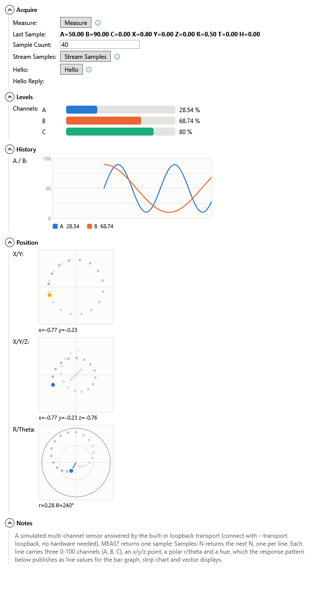

The TUI draws bars with block characters and plots with braille dots, so they need a font with
those characters (Cascadia Mono, Consolas, and most modern terminal fonts have them).

## What's not built yet

- A manifest can only describe text commands and replies; one that references a binary Kaitai
  Struct (`.ksy`) layout loads, but nothing decodes that layout yet.
- A saved connection profile's manifest name doesn't open that manifest's panel by itself yet —
  pick it from **Device > Device Manifest...**.
