# Expressions and the expression picker

An **expression** lets a panel field derive its value from other values instead of showing a raw
decoder value verbatim: millivolts shown as volts, a temperature converted to Fahrenheit, a status
text turned into a 0/100 gauge, a computed value sent as a command parameter. You write one in the
[manifest editor](manifest-editor.md); the **expression picker** (a **Pick...** button next to the
field) helps you build it and checks it as you type.

This page is the full manual. The exact field/action reference is
[`docs/specs/expression-picker.md`](../specs/expression-picker.md); the design is
[`docs/design/features/manifest-editor-expression-builder.md`](../design/features/manifest-editor-expression-builder.md)
and [`expression-picker-paths-and-cel.md`](../design/features/expression-picker-paths-and-cel.md).

## Where an expression goes

| Field | Control | What the expression produces |
|---|---|---|
| **Expression** | Indicator | The value the indicator shows. |
| **Channels** | Bar graph, strip chart | One entry per channel: `id[:label[:#RRGGBB[:expression]]]`, entries separated by `;`. The last part is an expression for that channel. |
| **Parameter expressions** | Button | One expression per parameter field, separated by `;`, in the same order as the parameter fields. Each is evaluated when the button is pressed and the result is sent. |
| **Visible when** and the coordinate/hue/saturation/brightness id fields | Various | Not expressions: a single value id. They have a **Pick...** button too, which just picks from the manifest's values. |

A value is referred to as `{id}`, where `id` is a name the manifest publishes: a control's id, a
response pattern's name or one of its named groups, a binary frame field, or a query reply's id.

## The language

Numbers (`4.2`), text in single or double quotes (`'READY'`), the values `{id}`, and these operators
and functions:

| You want | Write | Example | Result |
|---|---|---|---|
| Arithmetic | `+ - * /` | `{raw_mv} / 1000` | `4.213` |
| Rounding | `round(x, places)` | `round({voltage} * {current}, 2)` | `1.76` |
| Unit conversion | arithmetic | `round({temp_c} * 9 / 5 + 32, 1)` | `70.7` |
| Smallest / largest | `min(a, b)`, `max(a, b)` | `min({voltage}, 5)` | `5` |
| Absolute value | `abs(x)` | `abs({temp_c} - 25)` | `3.5` |
| A choice | `if(c, a, b)` or `c ? a : b` | `if({mode} == 2, 1, 0)` | `1` |
| Comparing | `== != < <= > >=` | `{sats} >= 4 ? 100 : 0` | `100` |
| And / or / not | `&& \|\| !` | `{sats} >= 4 && {mode} == 2` | `1` |
| Text matches a pattern | `matches(text, 'regex')` | `matches({status}, 'READY')` | `1` |
| Text contains / starts / ends | `contains`, `startsWith`, `endsWith` | `contains({status}, 'OK')` | `1` |
| Length of text or a list | `size(x)` | `size({status})` | `8` |
| Text to a number | `number(text)` | `number({reading})` | `12.5` |
| Anything to text | `string(x)` | `string({sats})` | `7` |
| Does the value exist yet? | `has({id})` | `has({voltage})` | `1` |
| Split text into a list | `split(text, sep)` | `split({frame}, ',')[1]` | `14` |
| Join a list into text | `join(list, sep)` | `join(split({frame}, ','), '-')` | `3-14-15-9` |
| A list, indexing, membership | `[1,2,3]`, `x[i]`, `a in list` | `{mode} in [1, 2]` | `1` |

(The results above come from a session where `raw_mv=4213`, `voltage=5.02`, `current=0.35`,
`temp_c=21.5`, `mode=2`, `sats=7`, `reading="12.5 V"`, `frame="3,14,15,9"`, `status="OK READY"`.)
A comparison or `matches` gives `1` or `0`, so it can drive a gauge directly. Text that begins with a
number is read as that number in arithmetic: `{reading} * 2` is `25`.

### What happens with bad input

Evaluating an expression never fails at run time, so a panel never breaks over a bad reading:

- A value that hasn't arrived yet counts as `0`: `{missing} + 1` is `1`. Use `has({id})` to tell
  "absent" from "zero".
- Dividing by zero gives `Infinity`: `{raw_mv} / 0`.

A *malformed* expression is different: it can't be saved as meaningful, and the picker says why (below).

## The picker, step by step

Open it with **Pick...** next to an Expression, Channels or Parameter expressions field (or any field
that names a value). It opens on whatever is already in the field.

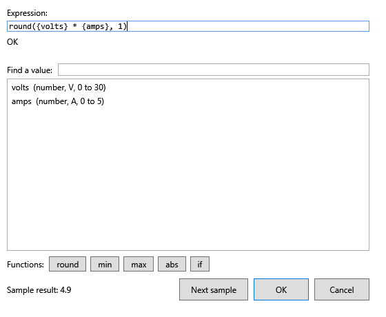

1. **Expression** is the text you are editing. Type directly, or use the buttons below to insert.
2. The line under it is the **diagnostic**: `OK`, `OK, with warnings: ...`, or `Error: ...`.
3. **Find a value** filters the list of values the manifest publishes; each row shows the id and,
   where known, its type, unit and range (`volts  (number, V, 0 to 30)`). Choose one to insert
   `{id}` at the caret. Typing `amp` narrows the list to `amps`:

   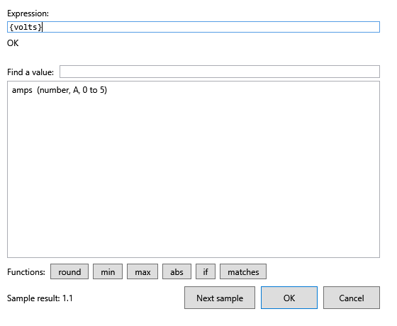

   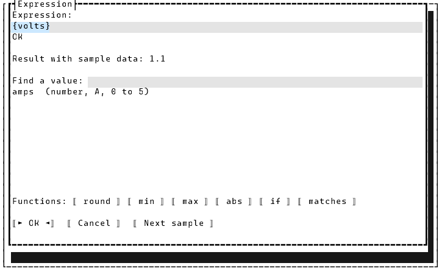

4. **Functions** inserts a function with the caret in the first argument. The buttons offered are
   `round`, `min`, `max`, `abs`, `if` and `matches` (which leaves the caret on the text argument); every other function in the table above can
   be typed by hand and is checked just the same.
5. **Result with sample data** (WPF: **Sample result**) evaluates your expression against made-up
   values that respect each value's type and range. **Next sample** draws another set, so you can see
   the expression over several inputs. The samples are repeatable, not random from run to run.
6. **OK** puts the expression back in the field; **Cancel** leaves it alone.

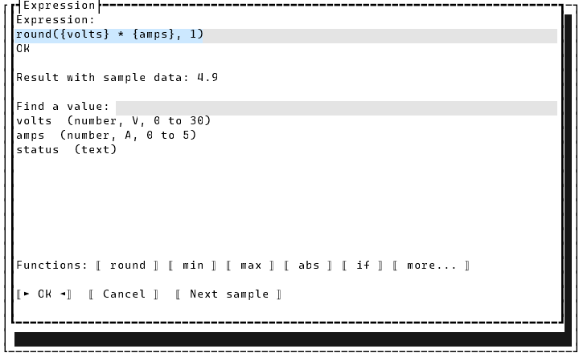

The TUI picker is the same dialog. **Next sample** sits on the OK/Cancel row.

### Text expressions

An expression may produce text. The picker shows a text result in quotes, and the same
syntax works: `matches({status}, 'READY') ? 100 : 0` turns a status line into a number.

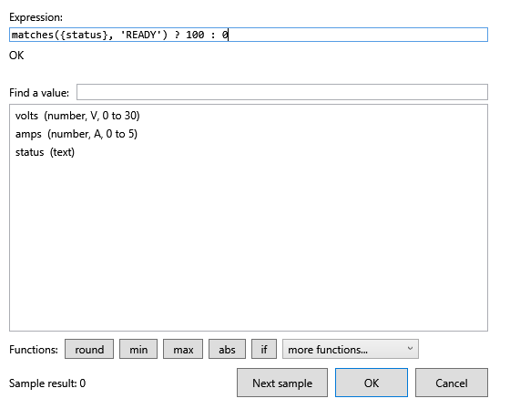

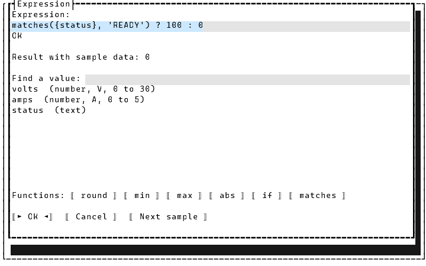

Here `status` is a text value, so the list shows `status  (text)` with no unit or range. A text
value's sample is placeholder text (`sample-xxxx-N`), so this expression shows `0` until you give it real
data with a recording (below).

### Errors

An expression that doesn't parse shows `Error: ...` in the error color and its result is `-`. The common ones:

| You typed | The picker says |
|---|---|
| `round({a}` | `expected ')', found ''.` |
| `{a} +` | `expected a number, string, '{variable}', a name, '[', '(' or a function, found ''.` |
| `round()` | `'round' was given 0 argument(s), which isn't valid for it.` |

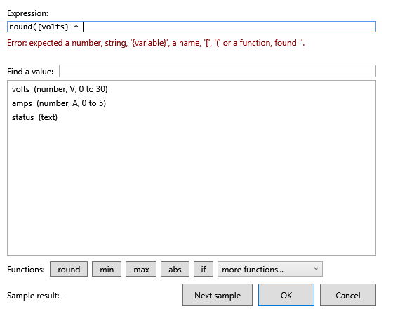

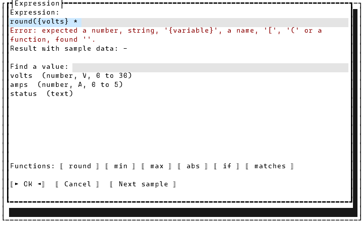

Fix the text and the diagnostic updates on every keystroke.

### Warnings

A warning means the expression is valid but probably not what you meant. The usual one is a value
nothing in the manifest publishes: `{volts} * {watts}` gives
`OK, with warnings: 'watts' is not published by anything in this manifest.` A warning never blocks
**OK** (the value may come from something the manifest doesn't describe), and until it arrives `watts`
counts as `0`.

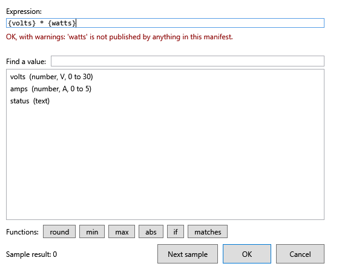

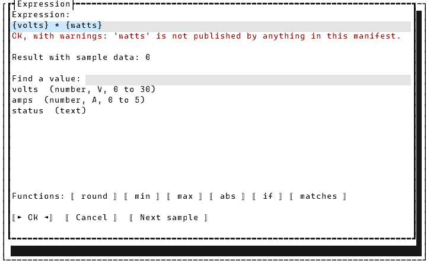

## Channels (bar graph and strip chart)

For **Channels** the field holds a list, not a single expression: one entry per channel, `;`-separated,
each `id[:label[:#RRGGBB[:expression]]]`. `volts:Volts:#FF6600; amps` draws `volts` in orange labelled
"Volts" and `amps` with the defaults. Choosing a value in the picker **appends a channel** for it. Add a
fourth part to chart something derived: `power:Watts:#3366CC:{volts} * {amps}`. This mode has no
function buttons, sample result or **Next sample**; its diagnostics check each channel's id against the
manifest (a warning for an unknown id) and report a channel expression that doesn't parse as an error.

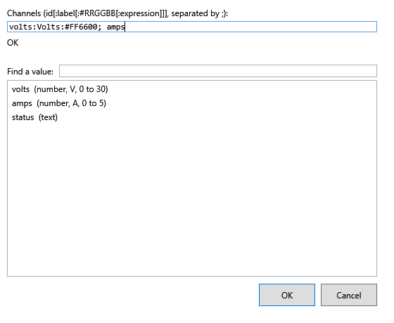

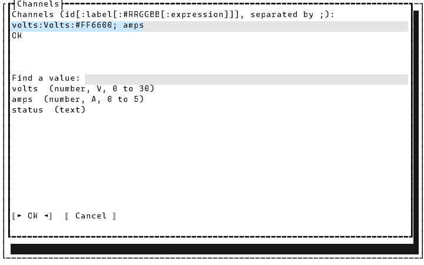

## Parameter expressions (buttons)

A button with parameter fields (a setpoint to type in, say) can send a computed value instead. In
**Parameter expressions**, write one expression per parameter field, `;`-separated, in field order:
`round({volts} * 100, 0); {amps}`. The picker keeps the function buttons here; choosing a value inserts `{id}` at the caret, blank
entries are allowed, and a bad one is reported as `Item N: ...`.

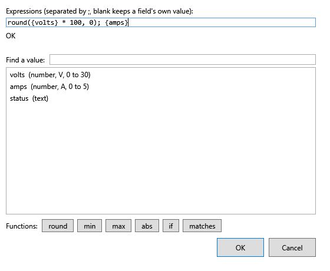

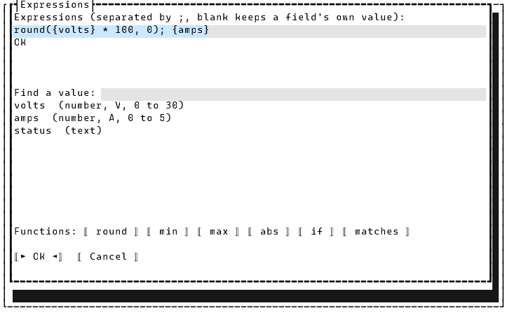

## Sample data from a real recording

By default the samples are generated from each value's type, range and choices. To check an expression
against what your device really sends, press **Use recording...** (WPF) or **Log** (TUI) in the manifest
editor and pick a session log. The pickers then draw their samples from that log's received replies, and
**Next sample** steps through them.

## TUI and WPF

Both front ends use the same engine, so an expression behaves identically in each; only the chrome
differs. WPF shows **Sample result** at the bottom left with **Next sample** beside OK/Cancel; the TUI shows
"Result with sample data" under the diagnostic and puts **Next sample** on the button row.

## See also

- [Editing a device manifest](manifest-editor.md): where the fields live.
- [`docs/specs/expression-picker.md`](../specs/expression-picker.md): every field, action and state.
