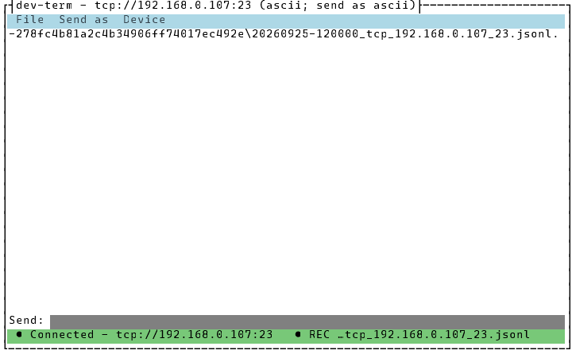
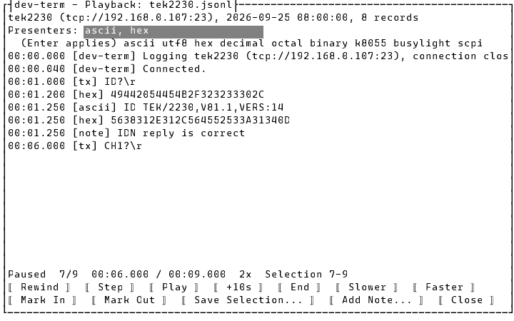
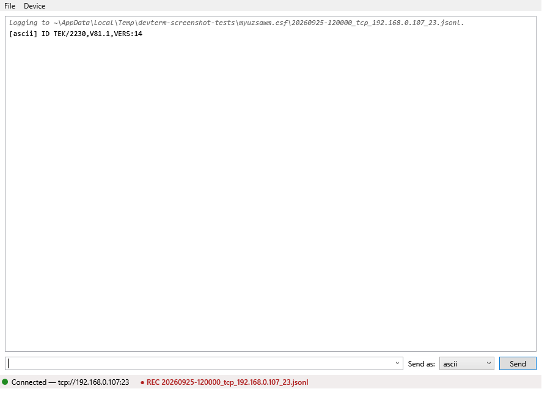
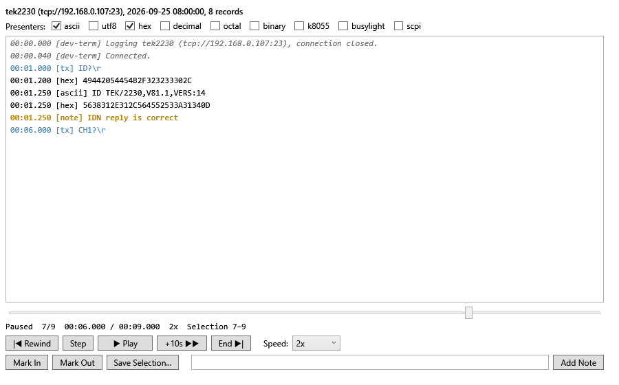

# Logging and playing back a session

**Logger mode** records everything a session sends and receives, plus each connect and disconnect,
to a session-log file (`.jsonl`). **Playback** replays a log later through any presenters. It never
connects to anything, so it works with no device attached. Use it to review a conversation after
the fact, send one to someone without the hardware, or re-decode a capture with a different
presenter.

Logs go to `~/.dev-term/logs` by default, named `{yyyyMMdd-HHmmss}_{profile or connection}.jsonl`.
The format is documented in [`docs/design/session-logging.md`](../design/session-logging.md).

## CLI

Add `--log <file>` to any connection, or `--log true` for the default, timestamped name. This
transcript is from a real run against the loopback transport, run from a scratch folder, with
`hello` and `world` piped in on stdin (so they aren't echoed):

```
$ dev-term --transport loopback --cli true --presenter ascii --lineending Cr --log capture.jsonl
Logging to ~\AppData\Local\Temp\claude\c--repos-github-dev-term\beb626e3-b3cf-404b-8c52-cc245e4e849e\scratchpad\capture.jsonl.
Connected to Loopback using 'ascii' (send as 'ascii').
Type a line and press Enter to send; Ctrl+C to exit.
[ascii] From Loopback test
[ascii] ? Unrecognized: world
```

The file then holds one line per event. Received and sent bytes are base64, so nothing is lost:

```
{"type":"header","format":"dev-term-session-log","version":1,"created":"2026-09-26T01:19:23.1576070Z","application":"dev-term 1.0.0 (cli)","connection":"loopback://","transport":"loopback","presenters":["ascii"],"parser":"ascii"}
{"type":"session","seq":1,"t":"2026-09-26T01:19:23.1626744Z","connection":"loopback://","state":"closed"}
{"type":"open","seq":2,"t":"2026-09-26T01:19:23.1678826Z"}
{"type":"tx","seq":3,"t":"2026-09-26T01:19:23.1734528Z","data":"aGVsbG8N"}
{"type":"rx","seq":4,"t":"2026-09-26T01:19:23.1778678Z","data":"RnJvbSBMb29wYmFjayB0ZXN0DQo="}
{"type":"tx","seq":5,"t":"2026-09-26T01:19:23.8122960Z","data":"d29ybGQN"}
{"type":"rx","seq":6,"t":"2026-09-26T01:19:23.8131546Z","data":"PyBVbnJlY29nbml6ZWQ6IHdvcmxkDQo="}
{"type":"close","seq":7,"t":"2026-09-26T01:19:24.8593463Z"}
```

`--playback <file>` prints it back, decoded, and exits. By default it uses the presenters the log
was captured with, as fast as possible:

```
$ dev-term --playback capture.jsonl
Playing capture.jsonl (loopback://, 2026-09-25 21:19:23, 7 records) through 'ascii'.
00:00.000 [dev-term] Logging loopback://, connection closed.
00:00.005 [dev-term] Connected.
00:00.010 [tx] hello\r
00:00.015 [ascii] From Loopback test
00:00.649 [tx] world\r
00:00.650 [ascii] ? Unrecognized: world
00:01.696 [dev-term] Disconnected.
```

The first line goes to stderr and the decoded lines to stdout, so `> decoded.txt` keeps only the
decoded output. `--presenter hex` (or `ascii,hex`, …) re-decodes it with other presenters.
`--playbackspeed 1` replays in real time, `0.5` at half speed, `10` ten times faster. At 4x, this
1.7 s capture takes about 0.4 s:

```
$ dev-term --playback capture.jsonl --presenter hex --playbackspeed 4
Playing capture.jsonl (loopback://, 2026-09-25 21:19:23, 7 records) through 'hex'.
00:00.000 [dev-term] Logging loopback://, connection closed.
00:00.005 [dev-term] Connected.
00:00.010 [tx] hello\r
00:00.015 [hex] 46726F6D204C6F6F706261636B20746573740D0A
00:00.649 [tx] world\r
00:00.650 [hex] 3F20556E7265636F676E697A65643A20776F726C640D0A
00:01.696 [dev-term] Disconnected.
```

Offsets are log time from the first record. `[tx]` is what was sent, with control bytes escaped
(`\r`, `\n`, `\xNN`). Sent bytes are never fed to a presenter, just as they weren't live.

## TUI

**File > Start Logging...** asks for a file name (the default path is already filled in) and starts
recording. The status line shows `● REC` and the file name until **File > Stop Logging**:



Logging keeps going across **File > Device Profiles...**: switching to another connection continues
the same file, marked with a new `session` line. Quitting ends the log. `--log` on the command line
starts logging as soon as the TUI opens.

**File > Open Log for Playback...** asks for a log (the newest one in `~/.dev-term/logs` is
pre-filled) and opens the Playback window:



- **Presenters:** type one or more names (comma or space separated) and press Enter. The log
  replays up to where you are through the new set. The installed presenters are listed underneath.
- **Play/Pause**, **Step** (one record), **Rewind** (back to the start with a clear screen), **+10s**
  (skip ahead 10 seconds of log time), **End**. **Slower**/**Faster** step through 0.25x, 0.5x, 1x,
  2x, 10x and Max.
- The line above the buttons is the position: state, records played / total, time / duration,
  speed, and the trim selection.
- **Mark In** / **Mark Out** set the trim selection at the current position. **Save Selection...**
  writes just those records to a new log (by default `{name}.trim-{in}-{out}.jsonl`).
- **Add Note...** adds a note at the current position. It's saved into the log file straight away
  and shows as `[note] …` every time the log is played.
- **Close** returns to the main screen.

Every button has an Alt+letter hotkey: the underlined letter.

## WPF

The same two **File** menu items. Start Logging opens a Save dialog in `~/.dev-term/logs`, and the
status bar shows `● REC {file}` while it runs:



**File > Open Log for Playback...** opens a log in a separate Playback window. You can keep working in
the main window, or have several logs open at once:



It works like the TUI's, with these differences:

- Presenters are check boxes. Ticking or unticking one replays up to the current position through
  the new set.
- The slider under the output seeks: drag it anywhere in the log.
- Speed is a drop-down.
- Type a note in the box next to **Add Note** and press Enter or click it.
- Sent lines are blue, connection events grey italic, errors red, and notes bold gold.

## Things to know

- Logging doesn't change what you see live, and a log that can't be written (a full disk, a
  read-only folder) never disconnects the device. Starting one that can't be created just reports why.
- A capture cut short (the app killed mid-session) still opens. Its last, incomplete line is
  skipped with a warning.
- You can't add a note to a log that this same dev-term is still recording. Stop logging first.
- Logs made by a newer dev-term with a different format version are refused with a message rather
  than misread.
