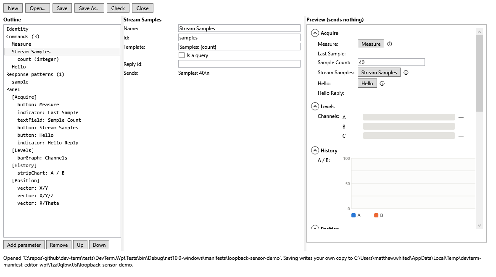
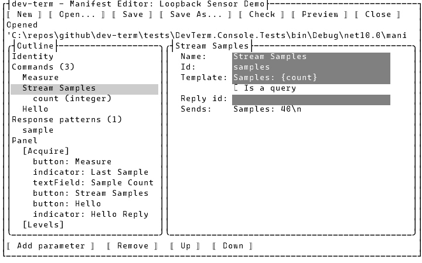
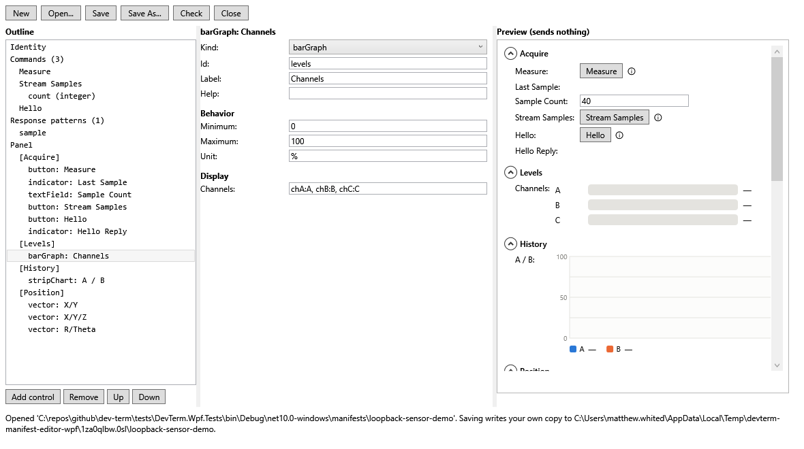
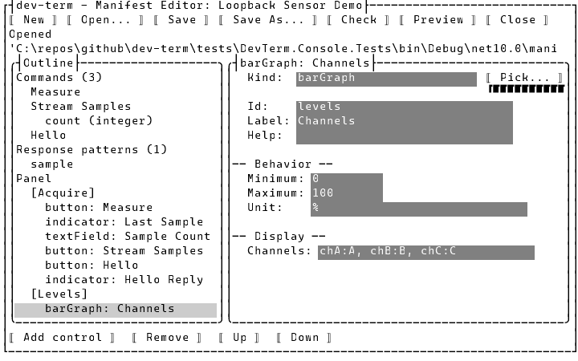
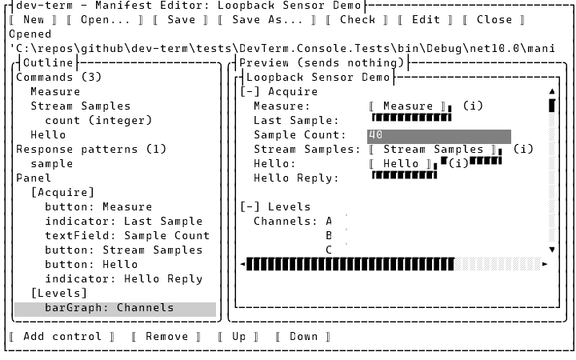

# Editing a device manifest

A [device manifest](../design/device-manifests.md) describes a device with no code: its commands,
how to read its replies, and the control panel **Device > Device Manifest...** opens for it. The
manifest editor lets you build one, or change an existing one, without hand-editing JSON — and shows
the resulting panel as you go. Full field/action reference:
[`docs/specs/manifest-editor.md`](../specs/manifest-editor.md).

Open it from **Device > Edit Device Manifest...** in the TUI or WPF. It doesn't need a connection.

## The editor

The **outline** on the left lists every part of the manifest: its identity, each command (and each
command's parameters), each response pattern, and the panel's sections and controls. Selecting one
shows its form. WPF, with the Loopback Sensor Demo open and its **Stream Samples** command selected:

The same in the TUI, which has room for the outline and one pane:

A command's form shows what it will send (**Sends**, with each parameter's default value and the
manifest's terminator filled in). Templates and the terminator are typed with escapes — `\n`, `\r`,
`\t`, `\x03`, `\\` — so a line ending is visible and editable in a one-line field.

A panel control's form only shows the fields that control's **Kind** has — a bar graph's channels
and range, a slider's step, a vector display's coordinate ids. Changing the Kind turns the control
into the new kind, keeping its id, label and help text:

A response pattern's form has a **Sample line** box: paste a reply line there and **Publishes** shows
the values the pattern's regex would publish from it (or `no match`, or the regex's error). The
sample isn't saved.

**Add** (its label follows the selection: *Add command*, *Add parameter*, *Add pattern*, *Add
section*, *Add control*), **Remove**, **Up** and **Down** sit under the outline. A manifest with no
panel of its own uses one generated from its commands (a button per command, a field per parameter,
a reply line per query); select **Panel (generated)** and press **Create panel from commands** to
start from that and design your own.

## Previewing the panel

WPF shows the panel on the right the whole time, rebuilt after every edit. In the TUI, press
**Preview** to swap the form for the panel (and **Edit** to swap back):

It's the real panel, drawn the way **Device > Device Manifest...** draws it, but it sends nothing:
pressing a button or committing a field shows *what it would send* (the TUI's status line, under the
WPF preview), and the ⓘ/(i) previews work as they do on a live panel.

## Saving

**Save** checks the manifest first, with the same checks dev-term runs whenever it loads one, and
only writes it if they pass — so what you save always loads. Problems that would stop it loading
(a command with no template, two commands with the same id, a regex that doesn't compile, ...) are
listed in the status line and nothing is written; warnings (a button whose command doesn't exist, a
template placeholder no parameter fills) are listed but don't stop the save. **Check** runs the same
checks without saving.

Where it saves:

- A **new** manifest, or one you opened from the manifests that come with dev-term (or from a
  `.zip`), is saved as your own copy in `~/.dev-term/manifests/<folder>/device.json`. The folder is
  the one the manifest came from (so your copy of the bundled `loopback-sensor-demo` replaces it by
  name for your profiles), or else the manifest's name in lower case with dashes. You're asked before
  it overwrites a manifest already there.
- One you opened from anywhere else is saved back where it came from.
- **Save As...** saves to a `.json` file (or a folder, as its `device.json`) of your choice, and keeps
  saving there.

**Open...** takes a manifest from the same list **Device > Device Manifest...** offers, or any path to
a manifest file, folder, or `.zip`. It opens a manifest even if it has errors, so you can fix it.
**New**, **Open...** and **Close** ask before throwing away unsaved changes; the title bar ends in
` *` while there are some.
