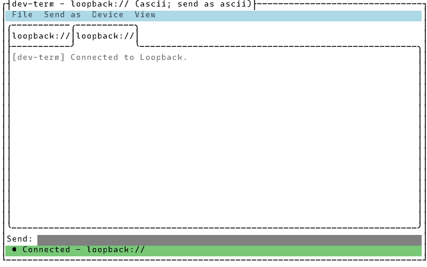

# Running multiple sessions at once

**File > New Session...** opens a second (or third, ...) connection alongside the ones already
open, each in its own tab — so you can, say, watch a serial device and a TCP instrument side by
side without running two copies of dev-term. **File > Close Session** closes whichever tab is
active. This is distinct from [Connecting and disconnecting without restarting](connect-disconnect.md)
(which toggles one tab's own connection) and [Managing connection profiles](managing-profiles.md)
(which switches one tab to a *different* saved connection) — those both still act on a single tab;
this is about how many tabs exist. The CLI has no equivalent: it's always a single session for the
life of the process.

## TUI

Starting from one connected tab, **File > New Session...** opens the same Connection Editor used for
[Connecting to a device](connecting.md) and [Managing connection profiles](managing-profiles.md).
Picking a connection there (rather than cancelling) adds it as a new tab, switches to it, and
connects it — the tab you started from is left exactly as it was:

Each tab keeps its own output pane, its own `Send:` field and history, and its own connection state
— the shared status line, title bar, and Device menu always describe whichever tab is currently
active, switching the instant you click a different tab or move focus to it.

**File > Close Session** closes the active tab: its connection closes (along with that tab's own
logging and Stream Monitor, if either was running), its output pane and tab header disappear, and
the tab strip switches to a remaining tab. Closing the last tab doesn't exit dev-term — the window
stays open with no tabs at all (see [Zero tabs](#zero-tabs) below).

## WPF

`DevTerm.Wpf.MainWindow` has the same **File > New Session...**/**File > Close Session** menu items
over a `TabControl`, added alongside the TUI's in the same feature (see
[`docs/design/multi-session-ui.md`](../design/multi-session-ui.md)): each tab is its own connection
with its own output list, send box and history, and the window's shared chrome follows whichever tab
is active, the same way.

## Keyboard shortcuts

Both front ends bind the same four shortcuts: **Ctrl+T** (or **Ctrl+Shift+T**) opens New Session, **Ctrl+W** (or **Ctrl+Shift+W**) closes the
active tab (File > Close Session), and **Ctrl+Tab** / **Ctrl+Shift+Tab** switch to the next/previous
tab, wrapping around at either end (a no-op with fewer than two tabs open).

## Logging and the Stream Monitor are per-tab

**Session logging** ([Logging and playing back a session](logging-and-playback.md)) and the
**[Stream Monitor](stream-monitor.md)** each belong to the tab that was active when you started or
opened them. Two tabs can log to two different files, or have two Stream Monitor windows open, at
the same time, independently — switching tabs switches which log/monitor the File/Device menu items
say is running, and closing a tab stops that tab's own log/monitor without touching any other tab's.

## All Sessions Log

**View > All Sessions Log...** (both front ends) shows one time-ordered log of every open tab's raw traffic: a line per
chunk, `HH:mm:ss.fff [device] > received` or `< sent`, with control bytes shown as `\r`, `\n`, `\xNN`, plus a
`-- connected --` / `-- disconnected --` note when a tab's connection changes. Recording starts the first time you open it
(it keeps the last 5,000 lines, across all tabs, and follows tabs opened, closed or re-pointed after that). WPF's window
follows the log live and has Copy and Clear; the TUI dialog is a snapshot with Refresh, Clear and Close. This is separate from
per-tab file logging, which is unchanged. The [Stream Monitor](stream-monitor.md) already lists captures from every tab in one list.

## Zero tabs

Closing the last open tab (File > Close Session, or its "✕") leaves the window open rather than
exiting dev-term. Everything connection- and device-dependent disables — the `Send:` field, Device
Profiles, Stream Monitor, every Device menu item — and the status line reads something like "No
sessions open — use File > New Session... to start one." **File > New Session...** is the only way
back to a tab; it reopens the Connection Editor seeded from whichever tab's connection was last
active, rather than a blank form. Once a tab exists again, everything re-enables the normal way.

## One thing that doesn't (yet) follow the active tab

The TUI's **Send as** parser choice is set on whichever tab is active at the time you pick it, but
the menu itself isn't rebuilt per tab — switching tabs in the TUI doesn't show you the newly active
tab's own parser selection. (The WPF front end doesn't have this gap — its parser picker already
updates per tab.)
