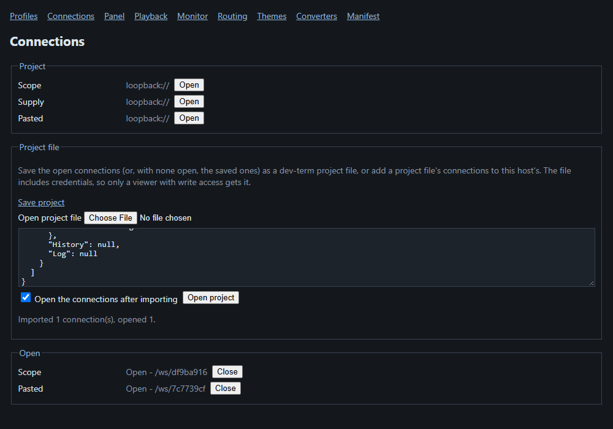

# Saving and reopening a set of connections (projects)

A project file remembers connections (transport settings plus presenter choices) so one command brings a bench back.
It is only read when you ask: dev-term never reopens the last project by itself.

Save the connection you describe on the command line, without connecting:

```
dev-term --transport tcp --host 192.168.0.110 --port 23 --presenter ascii --saveproject bench.json
Saved project bench.json
```

Open it again (any front end; the first connection unless you name one):

```
dev-term --project bench.json
dev-term --project bench.json --projectconnection Scope
```

A flag still wins over the project, so `--project bench.json --baud 9600` changes just the baud rate. Add more
connections by editing the file: each entry is a `Name` and a `Profile` in the same shape as a saved profile
(see [managing-profiles.md](managing-profiles.md)). Design: [project-state](../design/proposals/project-state.md).

In the TUI and WPF, **File > Save Project...** writes every open tab's connection to a file you pick, and
**File > Open Project...** opens one new tab per connection in a file and connects each. Nothing is opened
unless you choose it.

The TUI and WPF save more than the connection: each tab's send history (Up/Down recall) and whether it was logging are saved too (a logging tab reopens logging to a fresh automatic file, or to its explicit `--log` path), and the tab that was in front is selected again on open. The file shape adds `Active` (a connection name) at the top and optional `History` and `Log` beside each `Profile`. The command-line `--saveproject` still writes connections only.

## On the web

The Connections page (`/connections`) has a **Project file** section. **Save project** downloads the open connections as a
project file; **Open project file** (or pasting its text) then **Open project** adds its connections to the host's, opening
them too unless you untick the box. Unlike the desktop apps it does not restore a window layout or send history, since a web
host has neither. A read-only token cannot use it, because the file carries credentials.


