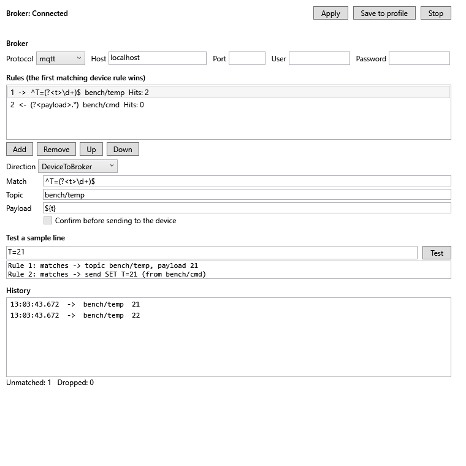
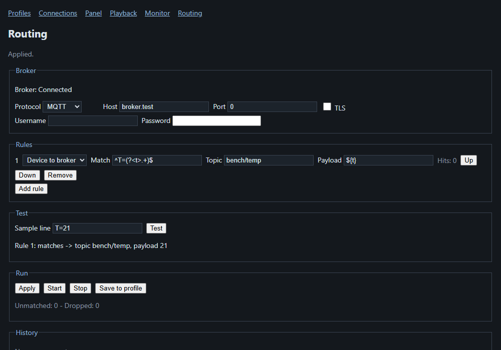

# Routing device messages to a broker

Routing bridges one device to a message broker (MQTT, AMQP or STOMP) while the device session keeps
running: a device line that matches a rule is published to a broker topic, and a broker message on a
rule's topic is sent to the device. Rules and broker live in the connection profile; the **Routing**
window edits and runs them. The exact fields and states are in
[`docs/specs/routing-window.md`](../specs/routing-window.md).

## Connecting starts routing

A profile with a broker host and at least one rule starts routing by itself once the device connects.
The status line shows `Broker: Connected` (or `Reconnecting (reason)` while the broker is away; the
device keeps working, and device lines published during the outage are dropped and counted). A broker
that cannot be reached never blocks or closes the device connection.

## Editing the rules

Pick **Device > Routing...** (WPF or TUI).

1. Fill in the broker: protocol, host, port (blank uses the protocol default), user and password. The
   password is saved in the profile as plain text; `DEVTERM_ROUTING__PASSWORD` overrides it.
2. **Add** a rule. *Direction* says which way it routes. *Match* is a regular expression on the line
   (device to broker) or on the broker payload (broker to device); named groups such as `(?<t>\d+)` can
   be used as `${t}` in *Topic*, *Payload* and *Send*.
3. Type a line in **Sample** and press **Test**: each rule reports the topic and payload it would
   produce, or "no match", without sending anything.
4. **Apply** to use the draft (routing restarts when the device is connected), **Save to profile** to
   keep it. **Start** / **Stop** control routing for this session; Stop ends routing now; it starts again
   the next time the device connects.

Tick **Confirm** on a broker-to-device rule to be asked before each message reaches the device: *Send
once*, *Always this session* or *Drop*.

## What the window shows

The history lists messages in both directions with their time, each rule shows how many times it hit,
and the footer counts lines no rule matched (*Unmatched*) and messages not delivered (*Dropped*).

WPF:



TUI:

```text
┌┤dev-term — Routing├──────────────────────────────────────────────────────────┐
│ Broker: Connected                                                            │
│                                                                              │
│⟦ mqtt ⟧  Host: localhost              Port:                                  │
│                                                                              │
│User:                  Password:                                              │
│1 -> ^T=(?<t>\d+)$ bench/temp hits 2                                          │
│2 <- (?<payload>.*) bench/cmd hits 0                                          │
│                                                                              │
│⟦ Add ⟧ ⟦ Remove ⟧ ⟦ Up ⟧ ⟦ Down ⟧                                            │
│                                                                              │
│⟦ device->broker ⟧   ☐ Confirm sends                                          │
│                                                                              │
│Match:   ^T=(?<t>\d+)$                                                        │
│Topic:   bench/temp                                                           │
│Payload: ${t}                                                                 │
│Sample:  T=21                                                       ⟦ Test ⟧  │
│Rule 1: matches -> topic bench/temp, payload 21; Rule 2: matches -> send SET T│
│12:00:00 -> bench/temp 21                                                     │
│12:00:00 -> bench/temp 22                                                     │
│                                                                              │
│Unmatched: 1   Dropped: 0                                                     │
│⟦ Apply ⟧ ⟦ Stop ⟧ ⟦ Save ⟧ ⟦► Close ◄⟧                                       │
│                                                                              │
└──────────────────────────────────────────────────────────────────────────────┘
```

## On the web

Open **Routing** in the web page's menu. It has the same broker fields, rule list, sample test, Apply / Start / Stop / Save to profile and history as the desktop windows; confirm-flagged broker messages show a Send once / Always this session / Drop prompt on the page.


