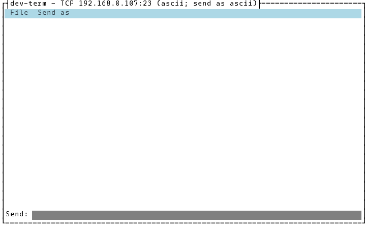
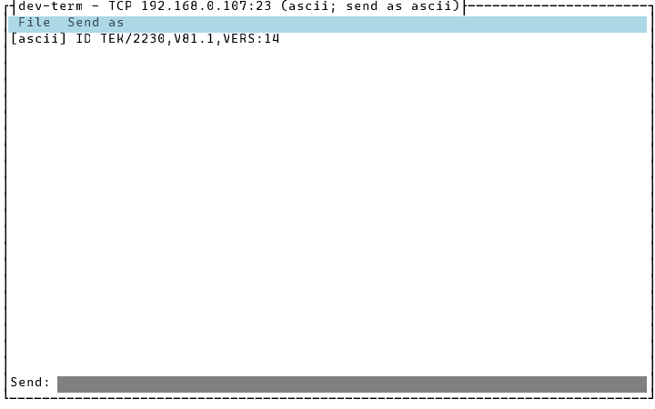
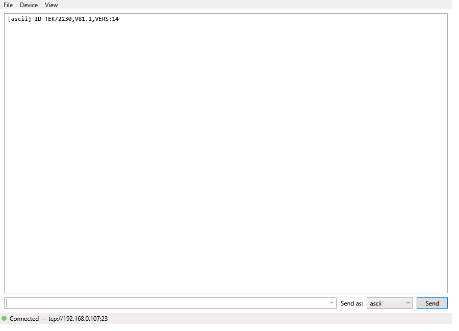

# Sending commands and viewing replies

Once connected (see [Connecting to a device](connecting.md)), all three front ends do the same
thing: type a line, press Enter (or Send), see the decoded reply appear. Screenshots/transcripts
below are real captured output from the actual built app — see this folder's [README](README.md).

## CLI

```
$ dotnet DevTerm.Console.dll --transport tcp --host 192.168.0.107 --port 23 --presenter ascii --lineending Cr --cli true
Connected to TCP 192.168.0.107:23 using 'ascii' (send as 'ascii').
Type a line and press Enter to send; Ctrl+C to exit.
ID?
[ascii] ID TEK/2230,V81.1,VERS:14
```

The banner and the `[ascii] ID TEK/2230,V81.1,VERS:14` line are real captured stdout (against a
small throwaway TCP stand-in that answers `ID?` exactly like the project's real Tektronix 2230 test
device does); `ID?` is what you'd type — a real terminal echoes your own keystrokes, which a piped
capture doesn't show. Every line gets the configured line ending appended (`--lineending Cr` above)
before it's sent. Ctrl+C exits; the session closes cleanly.

The banner names two things: the **presenters** (how incoming bytes are shown — one or several, e.g.
`--presenter ascii,hex` prints each reply once per presenter, tagged `[ascii]`/`[hex]`) and the
**send format** (how the line you type is turned into bytes — `--parser`, defaulting to the first
presenter). They're independent: `--presenter ascii,hex --parser hex` shows replies both ways but
sends what you type as hex. The CLI fixes the send format for the whole run; a per-line choice
lives in the TUI and WPF (below).

## TUI

Connected, nothing sent yet:



Typed text lands in `Send:` as you type; nothing is sent until Enter:


Pressing Enter sends the line (with the configured line ending appended) and clears `Send:`
immediately; the reply appears in the output pane as soon as the device answers — no polling:



The **Send as** menu in the menu bar picks how typed text is encoded (ASCII, UTF-8, hex, decimal,
octal, binary) — it starts as the profile's saved send format and can be changed at any time, even
mid-session, without reconnecting. The title bar shows the current one
(`dev-term — tcp://127.0.0.1:52311 (ascii; send as ascii)`) and names what you're connected to: the
**profile's name** if the connection is exactly one of your saved profiles
(`dev-term — tek2230 (ascii; send as ascii)`), otherwise its connection string (`tcp://host:port`,
`serial://COM3:4800,8,n,1`, `hid://vendor.product.serial`). It updates as soon as you switch
profiles from Device Profiles.

Ctrl+Q quits and closes the session cleanly.

Pressing **Up** in `Send:` recalls the last line you sent (press it again for the one before that);
**Down** steps back toward the most recent. Up to the last 100 lines sent this run are kept — not
saved across restarts. Editing and pressing Enter sends the edited version as a new entry, same as
typing it fresh.

## WPF

The same flow, after a reply has arrived. The **Send as:** drop-down beside the Send button is the
WPF equivalent of the TUI's Send as menu — it starts at the profile's saved send format and can be
changed per line:



`ID TEK/2230,V81.1,VERS:14` is the same real Tektronix 2230 reply text used above, captured here
against a `FakeTransport` that answers the same way rather than the real device.

The send box is an editable drop-down: click its arrow to see recently sent lines, or, with the
field focused, press **Up**/**Down** the same way the TUI does — the same 100-line, this-run-only
history.

## If something goes wrong

No front end crashes or exits over an error once it's running. It tells you what happened, and you
carry on from there.

**A line the send format can't encode is rejected, not sent**, and the connection is left alone.
Here the send format is hex and the first line isn't hex. This is a real capture against the
built-in loopback device (the rejection goes to stderr):

```text
$ dotnet DevTerm.Console.dll --transport loopback --presenter ascii --parser hex --cli true
Connected to Loopback using 'ascii' (send as 'hex').
Type a line and press Enter to send; Ctrl+C to exit.
OUTPut?
Not sent: 'OUTPut?' isn't valid hex input (The input is not a valid hex string as its length is not a multiple of 2.)
68656C6C6F0A
[ascii] From Loopback test
```

**A lost connection disconnects cleanly and can be resumed.** Causes include a read or send failure
(an unplugged cable, a reset socket, a device that stopped answering) and the device hanging up.
The session closes, the reason is reported once, and:

- **CLI**: the next line you type reconnects first, then sends. Here is a real capture against a
  local TCP stand-in that hangs up about a second after connecting, then accepts the reconnect and
  answers like the Tektronix 2230 above:

  ```text
  $ dotnet DevTerm.Console.dll --transport tcp --host 127.0.0.1 --port 5599 --presenter ascii --lineending Cr --cli true
  Connected to TCP 127.0.0.1:5599 using 'ascii' (send as 'ascii').
  Type a line and press Enter to send; Ctrl+C to exit.
  The device closed the connection. The next line you send will reconnect.
  ID?
  Reconnecting to TCP 127.0.0.1:5599...
  Reconnected to TCP 127.0.0.1:5599.
  [ascii] ID TEK/2230,V81.1,VERS:14
  ```

  If the reconnect fails, you get the error and the line isn't sent; the next line tries again. The
  CLI still exits (code 1) only when the *first* connection fails, so a script sees that.
- **TUI and WPF**: the output shows `Connection lost: {reason} Use File > Connect to reconnect.`
  (or `The device closed the connection. …`), the send field is disabled, and the menu item switches
  to **Connect**. Use it to reconnect, or **File > Device Profiles...** to pick another connection.
  If the connection fails at startup, the window opens anyway, disconnected, showing the error. It
  used to exit (TUI) or show a message box and close (WPF).

A serial timeout adds a hint about hardware flow control (CTS / `--handshake`); other transports
don't, since CTS has nothing to do with them. See `Session.Disconnected`, `TypedInput` and
`ConnectionErrorMessages` in [`docs/design/architecture.md`](../design/architecture.md).
