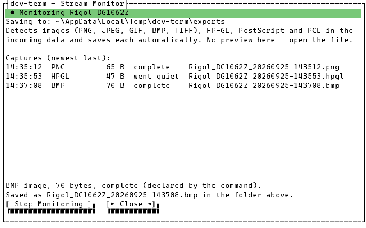
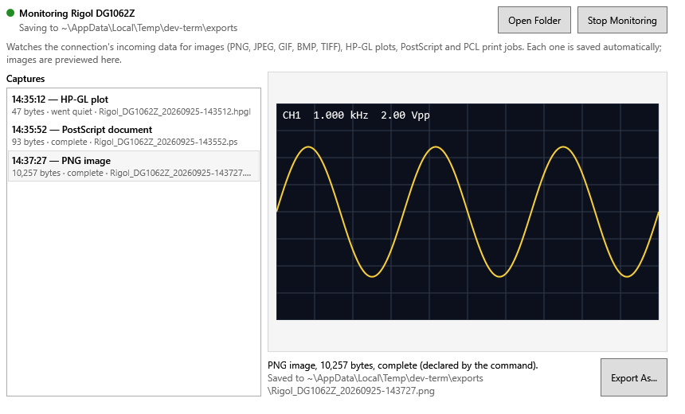
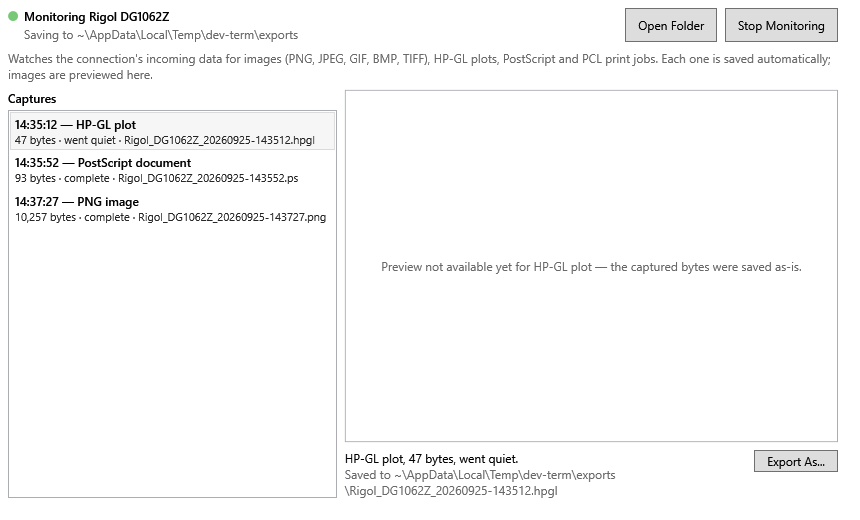

# Capturing screen dumps, plots and print jobs (Stream Monitor)

Some devices answer with something other than a line of text: an oscilloscope or function
generator's screen capture, a plotter's HP-GL, a hard copy in PostScript or PCL. In the main window
those just look like garbage. The **Stream Monitor** watches the connection for them and saves each
one as a file, automatically, the moment it has arrived.

The exact behavior (what's detected, how a capture ends, file naming) is in
[`docs/specs/stream-monitor.md`](../specs/stream-monitor.md).

## Turning it on

Connect as usual, then pick **Device > Stream Monitor...**. Opening it starts monitoring the current
connection. It keeps running after you close its window, so you can close it and go back to the main
window to send the command that produces the image. Each capture then adds a status line to the
main window's output. In the TUI it looks like this (WPF shows the same text as a dimmed status
line):

```text
[dev-term] Captured 10,257 bytes of PNG image to C:\Users\you\.dev-term\exports\Rigol_DG1062Z_20260925-143727.png.
```

Use **Stop Monitoring** in the window to turn it off. Switching to another connection with **File >
Device Profiles...** moves the monitor to the new connection.

## What gets captured

- **Images**: PNG, JPEG, GIF, BMP and TIFF, recognized from their own header bytes.
- **HP-GL** plots, at the start of a reply (for example `IN;SP1;PU0,0;PD…`).
- **PostScript** (`%!PS…`) and **PCL** print jobs.
- Any of those wrapped the way SCPI instruments return binary data (`#9000230456<data>`). The
  `#…` header is stripped, so the saved file is the image itself.

A SCPI command can also say what its reply is. The bundled **Rigol DG1062Z** profile's **Screen
Capture (Bitmap)?** button, under **Device > SCPI Instrument...**, does this. Its reply is captured
even if its bytes aren't recognized. With the Stream Monitor running, press that button and the
screen dump lands in the export folder.

Files are saved as `{device}_{date}-{time}.{ext}` in the connection's export folder
(`~/.dev-term/exports` unless the profile sets another). For example:
`Rigol_DG1062Z_20260925-143708.bmp`. The device name is the saved profile's name, or the connection
(for example `tcp_192.168.0.5_5025`).

Anything the monitor doesn't recognize is not captured. It still shows in the main window's text/hex
output as before. The monitor never changes that output.

## TUI

The terminal can't show images, so the TUI window lists what was captured and where it went. Open
the saved file in any viewer.



Each row shows the time, type, size, how the capture ended, and the file name:

- **complete**: the data said it was finished.
- **went quiet**: the device stopped sending for 2 seconds. This is normal for HP-GL and TIFF,
  which have no end marker.
- **stopped**: monitoring was stopped part-way through.

The two lines under the list describe the selected capture. **Close** returns to the main window
and leaves monitoring running.

## WPF

WPF shows the same list, plus a live preview of the selected capture for the image formats Windows
decodes itself (PNG, JPEG, GIF, BMP, TIFF):



HP-GL, PostScript and PCL are captured and saved, but can't be previewed yet:



The WPF window also has:

- **Open Folder**: opens the export folder in Explorer.
- **Export As...**: saves a copy of the selected capture somewhere else. The automatic file stays
  where it is.

## Not yet

- Previewing or converting HP-GL/PostScript/PCL to an image.
- Stream Monitor in the plain CLI (`--cli true`) mode.
- Automatic cleanup of old files in the export folder.
