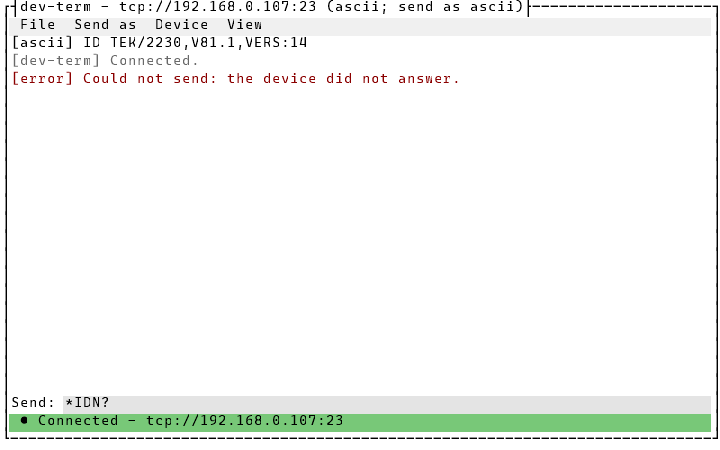
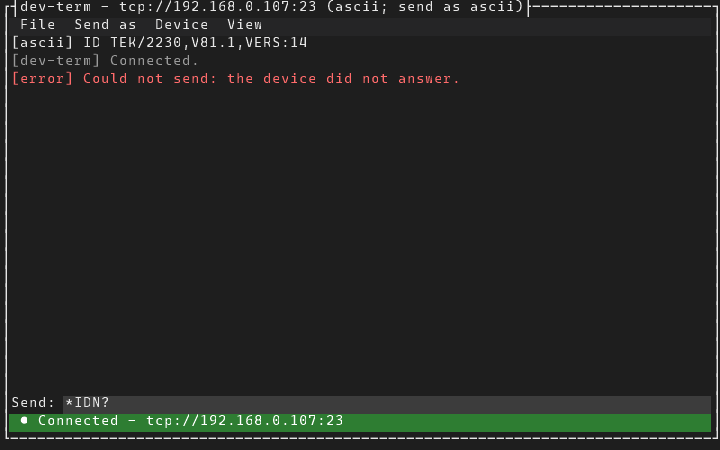
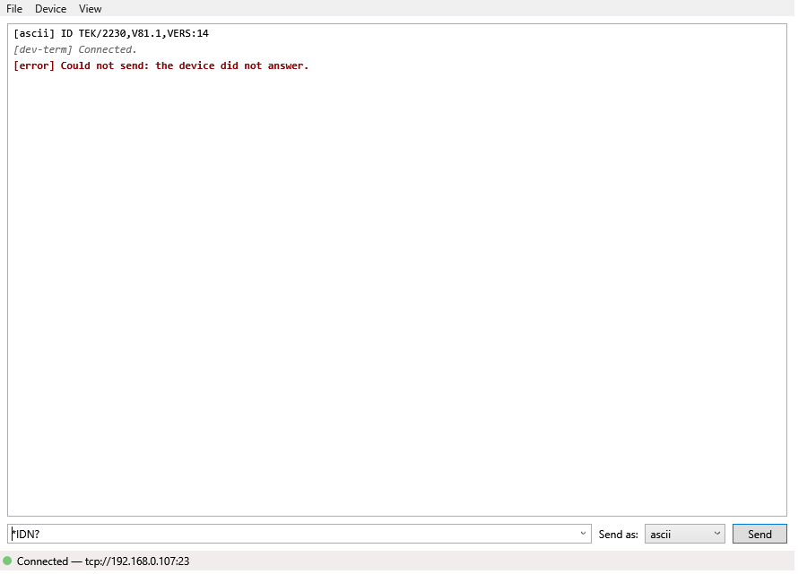
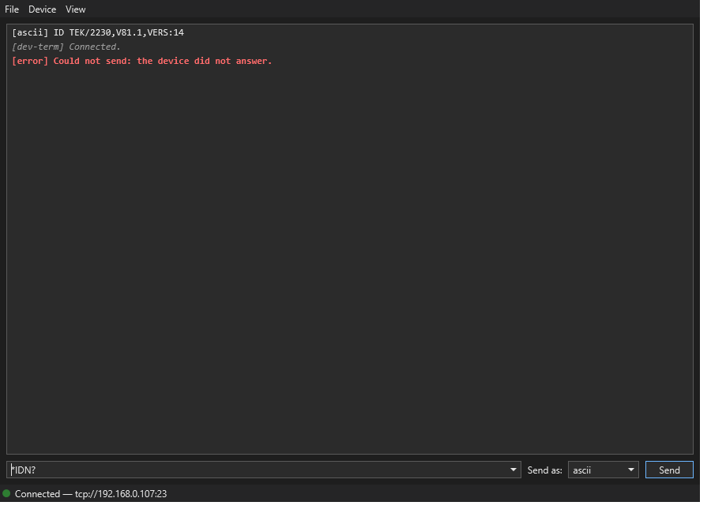
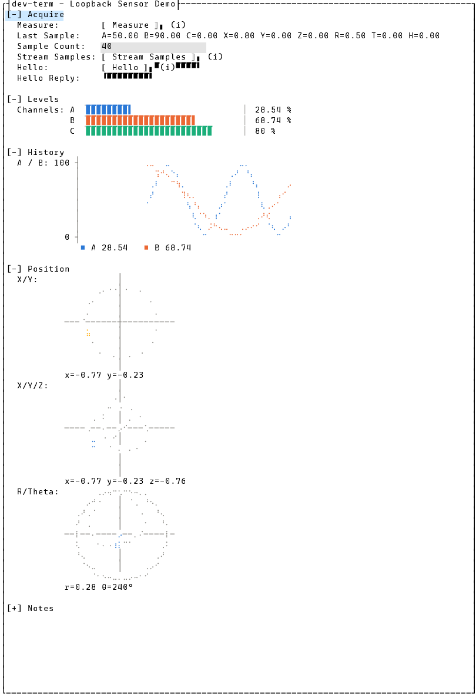
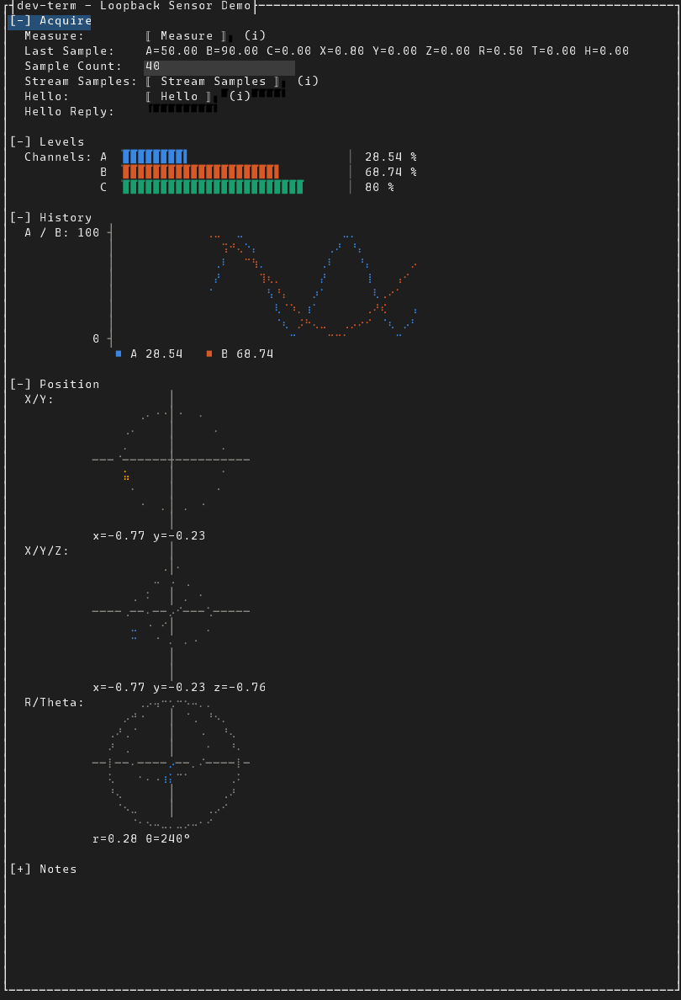
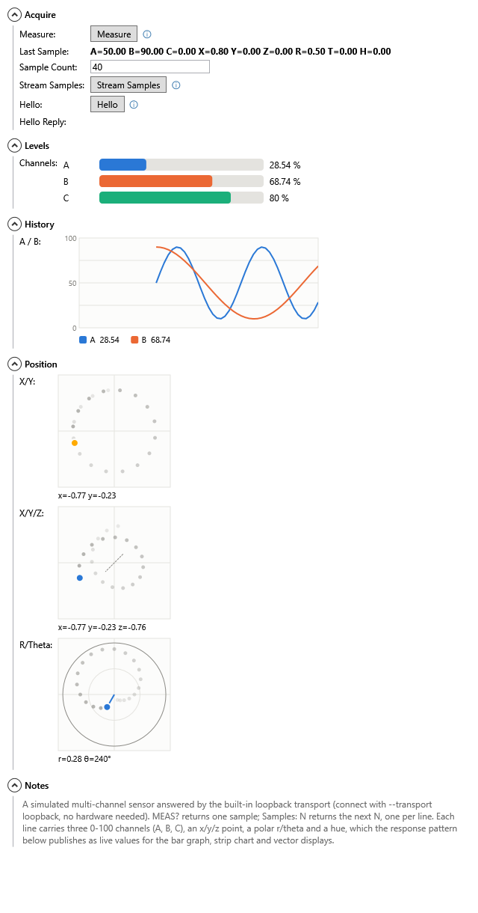
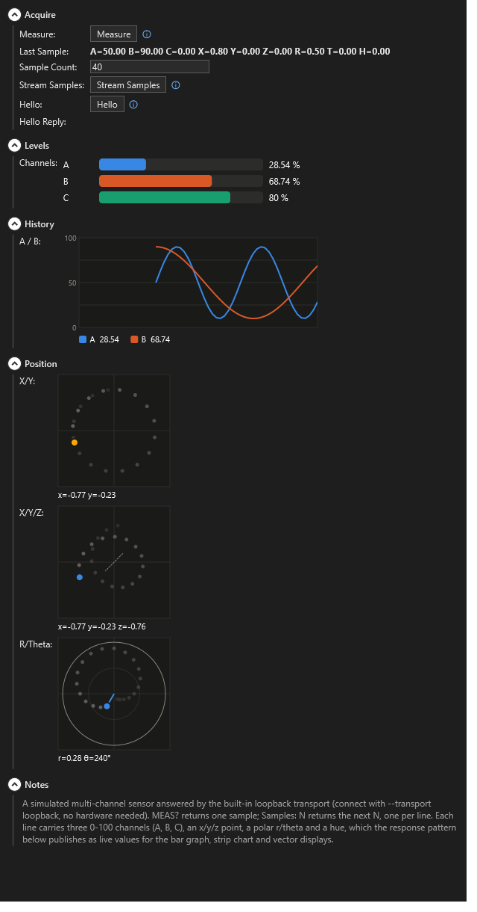
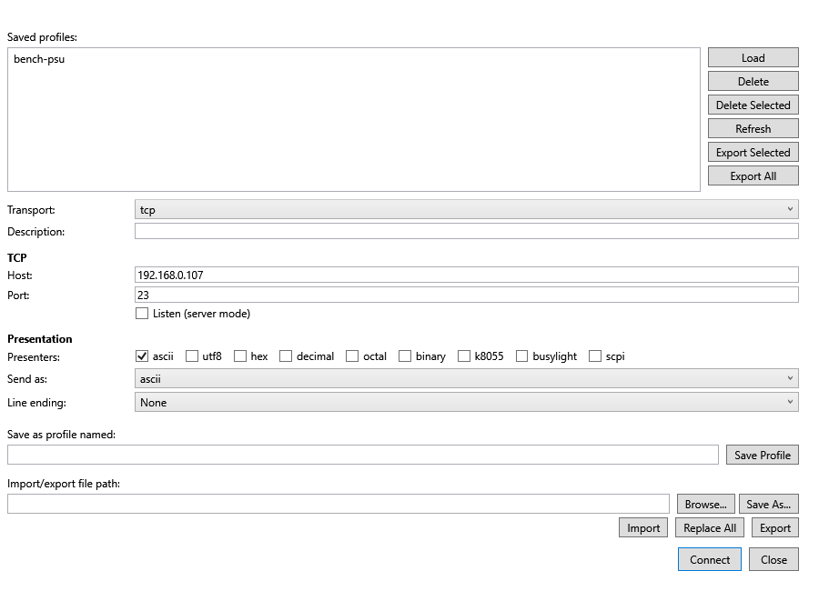
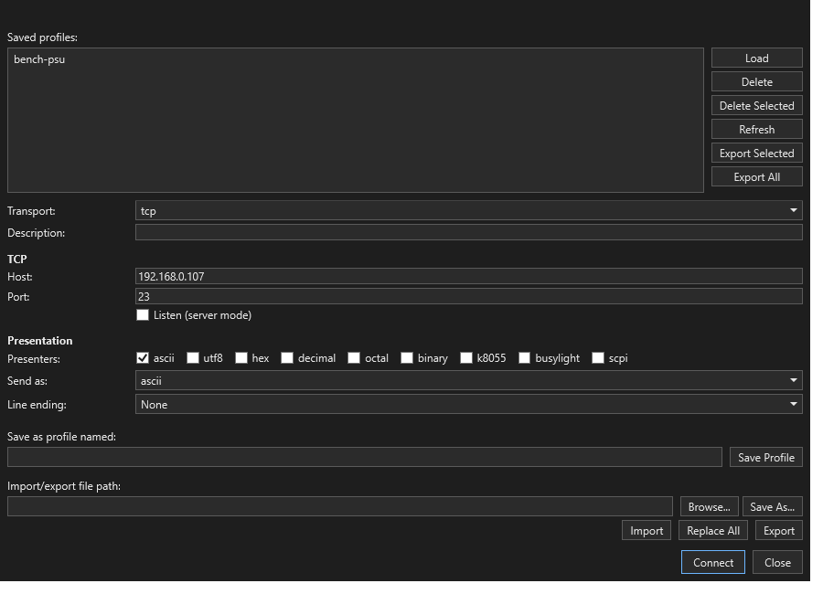

# Choosing a theme (light, dark, or your own)

Both the TUI and the WPF app come in **Light** and **Dark**, and can follow your operating system
(**System**). You can also add your own themes as small JSON files. The CLI has no colors to theme.

The precise behavior is in [`docs/specs/tui-main-screen.md`](../specs/tui-main-screen.md) and
[`docs/specs/wpf-main-window.md`](../specs/wpf-main-window.md) (**View > Theme**). How it works is in
[`docs/design/theming.md`](../design/theming.md).

## Switching theme

Pick **View > Theme** in the main window, then a theme. Everything switches straight away, with no
restart: open control panels, the Stream Monitor, and playback windows too (in WPF, where those
windows stay open). The current theme is marked with `●` in the TUI and a check mark in WPF.

Your choice is saved, and both apps start with it next time. It's stored in
`~/.dev-term/preferences.json`, separate from your connection profiles, so loading a different
profile never changes the theme.

**System** follows Windows' "Choose your app mode" setting (Settings > Personalization > Colors).
WPF follows it live if you change it while dev-term is running. The TUI checks it when it starts
and when you pick System. Off Windows, the TUI goes by the terminal's `COLORFGBG` hint if there is
one, and uses Light otherwise.

To use a theme for one run without changing the saved choice, pass `--theme`:

```text
dev-term --transport loopback --theme dark
DevTerm.Wpf.exe --transport loopback --theme light
```

`--theme` takes `light`, `dark`, `system`, or the name of one of your own themes. The
`DEVTERM_THEME` environment variable works the same way.

## What it looks like

The TUI main window, Light and Dark:





The WPF main window, Light and Dark:





Control panels follow the theme too. Chart colors keep the same colorblind-safe order in both
themes; Dark uses the same hues stepped for a dark background. Here is the bundled Loopback Sensor
Demo manifest panel in each:









And the WPF Device Profiles window, Light and Dark:





## Making your own theme

Put a `.json` file in `~/.dev-term/themes` (`C:\Users\you\.dev-term\themes` on Windows). Start
from Light or Dark and change only the colors you want:

```json
{
  "name": "Solarized Dark",
  "basedOn": "dark",
  "colors": {
    "background": "#002B36",
    "foreground": "#EEE8D5",
    "controlBackground": "#073642",
    "fieldBackground": "#0A4A5C",
    "outputError": "#DC322F",
    "accent": "#268BD2"
  }
}
```

- **`name`**: what View > Theme shows, and what `--theme` accepts. It defaults to the file name.
  `light`, `dark` and `system` are taken.
- **`basedOn`**: `light` (the default) or `dark`. Any color you leave out comes from this theme.
- **`chartPalette`**: `light` or `dark`. It picks which version of the chart colors to use, and
  defaults to the `basedOn` theme's. The colors and their order never change.
- **`colors`**: any of these, each as `#RRGGBB`:

| Color | Used for |
|---|---|
| `background`, `foreground`, `mutedForeground` | Window background, ordinary text, secondary text (notes, hints) |
| `controlBackground`, `controlForeground`, `controlBorder`, `controlHoverBackground` | Text boxes, lists, combo boxes and buttons |
| `fieldBackground` | TUI text fields (they have no border, so they need their own background) |
| `selectionBackground`, `selectionForeground` | The selected item or focused control |
| `menuBackground`, `menuForeground` | Menus and the status bar |
| `accent` | Focus borders, the control panels' ⓘ icons, sent lines in playback |
| `error`, `warning` | Error text in forms and panels; playback notes |
| `outputStatus`, `outputError` | `[dev-term] …` and `[error] …` lines in the output |
| `statusConnected`, `statusConnecting`, `statusDisconnected` | The connection dot (WPF) or status line (TUI) |
| `statusConnectedText`, `statusConnectingText`, `statusDisconnectedText` | Text on the TUI status line |
| `recording` | The `● REC` indicator while logging |
| `swatchBorder` | The border around a picked-color swatch |
| `chartSurface`, `chartGrid`, `chartText`, `chartMuted` | Chart backgrounds, gridlines, labels, axes |

New and changed files are picked up the next time dev-term starts.

**If a theme file has a mistake,** dev-term still starts. It skips that file and prints what's wrong
as a `[dev-term] …` line in the main window's output, for example:

```text
[dev-term] solarized.json: unknown color role "backgroud". Known roles: background, foreground, …
```

It also warns, without skipping the file, if two colors that need to be read against each other
are too close. For example:

```text
[dev-term] Theme 'murky': foreground on background has contrast 1.2:1 (needs 4.5:1) and may be hard to read.
```

An unknown `--theme` name is reported the same way, and dev-term uses System instead.

In WPF, a theme based on `light` recolors the window, text, lists and menus, but buttons and combo
boxes keep Windows' standard light look. A theme based on `dark` recolors those too.
