# Choosing a theme (light, dark, or your own)

Both the TUI and the WPF app come in **Light** and **Dark**, and can follow your operating system
(**System**). You can also add your own themes as small JSON files. The CLI has no colors to theme.

The precise behavior is in [`docs/specs/tui-main-screen.md`](../specs/tui-main-screen.md) and
[`docs/specs/wpf-main-window.md`](../specs/wpf-main-window.md) (**View > Theme**). How it works is in
[`docs/design/theming.md`](../design/theming.md).

## Switching theme

Pick **View > Theme** in the main window, then a theme. Everything switches straight away, with no
restart: open control panels, the Stream Monitor, and playback windows too (in WPF, where those
windows stay open). The current theme is marked with `●` in the TUI and a check mark in WPF.

Your choice is saved, and both apps start with it next time. It's stored in
`~/.dev-term/preferences.json`, separate from your connection profiles, so loading a different
profile never changes the theme.

**System** follows Windows' "Choose your app mode" setting (Settings > Personalization > Colors).
Both front ends follow it live if you change it while dev-term is running (the TUI checks every couple of seconds). Off Windows, the TUI goes by the terminal's `COLORFGBG` hint if there is
one, and uses Light otherwise.

In the TUI only, **Terminal** (View > Theme > Terminal, or `--theme terminal`) applies no colors of its own, so the
terminal's own palette shows through, as it did before themes existed. dev-term's status line and charts use Light or Dark
according to the terminal's `COLORFGBG` hint.

To use a theme for one run without changing the saved choice, pass `--theme`:

```text
dev-term --transport loopback --theme dark
DevTerm.Wpf.exe --transport loopback --theme light
```

`--theme` takes `light`, `dark`, `system`, or the name of one of your own themes. The
`DEVTERM_THEME` environment variable works the same way.

## What it looks like

The TUI main window, Light and Dark:

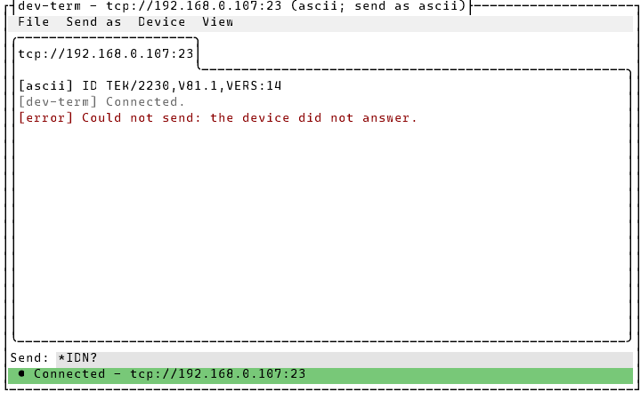

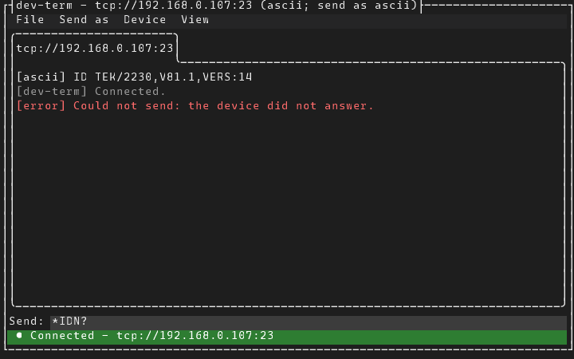

The WPF main window, Light and Dark:

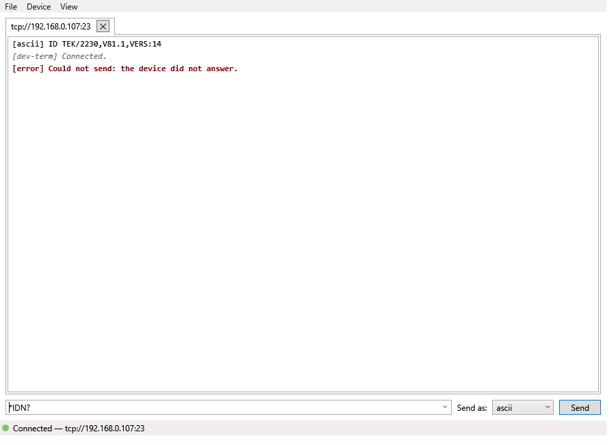

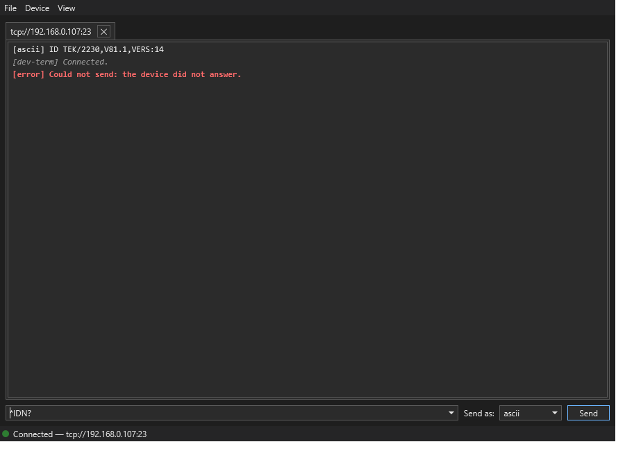

Control panels follow the theme too. Chart colors keep the same colorblind-safe order in both
themes; Dark uses the same hues stepped for a dark background. Here is the bundled Loopback Sensor
Demo manifest panel in each:

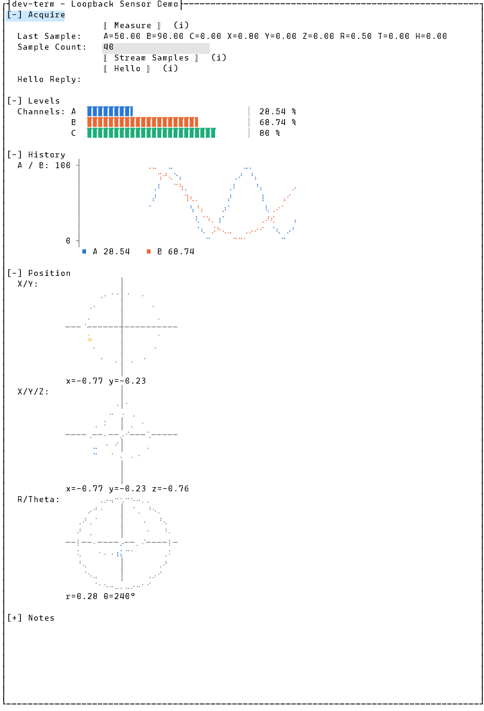

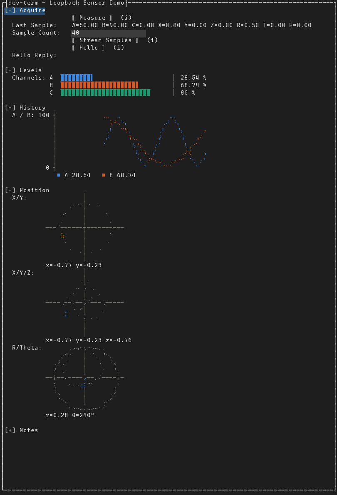

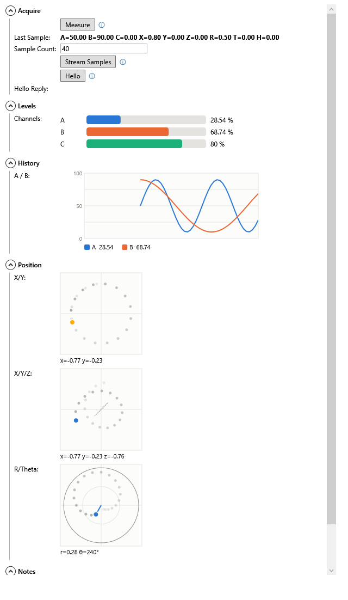

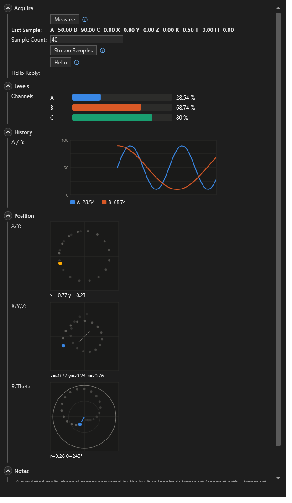

And the WPF Device Profiles window, Light and Dark:

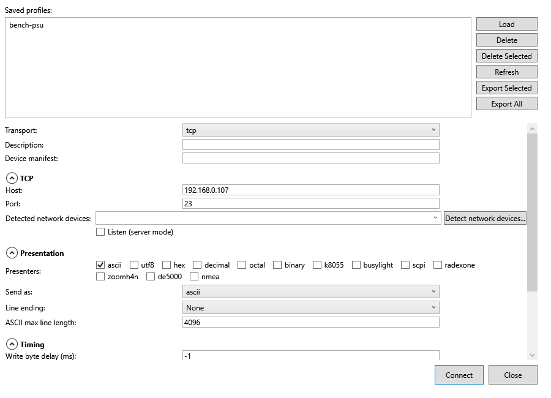

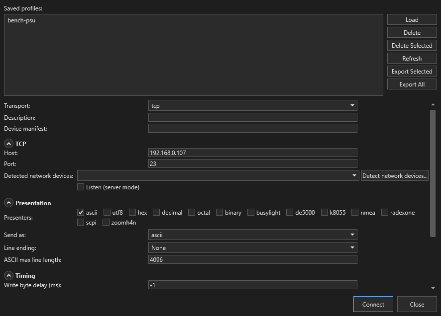

## Building a theme in the app

You don't have to hand-write JSON (see "Making your own theme" below) to create a theme — **View >
Build/Edit Theme...** opens an in-app builder in both front ends, with live preview as you
go: the whole app re-skins immediately with every edit, so what you see while building is exactly
what the saved theme will look like.

1. Pick **View > Build/Edit Theme...**. A small picker opens first: choose a starting point
   (Light, Dark, System, or one of your own existing themes) and a name for the new theme — it
   defaults to `"{starting point} copy"`, e.g. `"Light copy"`.
2. Click **Create**. The builder window opens, already previewing the new theme everywhere — the
   main window behind it, any other open window — live.
3. The builder lists every color role, one per row, with its current value. A row marked with a dot
   (`●`) has already been changed from the starting point; an unmarked row still shows that theme's
   own color.
4. Select a row and click **Edit...** to change it:
   - **In WPF**, this opens the same RGB/HSV/hex color picker the Busylight panel uses.
   - **In the TUI**, you type a `#RRGGBB` hex value directly (there's no color-picker widget in the
     terminal).
   Accepting a new color updates the row, re-checks contrast, and re-previews immediately.
5. Changed your mind about one row? Select it and click **Reset to Seed** to go back to the
   starting point's own color for just that role.
6. A line under the role list reports any contrast problems (text too close in color to its
   background) found by the same check `ThemeFile` already runs when loading a theme from disk. A
   warning here doesn't stop you from saving — it's a heads-up, not a blocker.
7. You can also rename the theme or switch its chart palette (Light/Dark — which set of chart colors
   a strip chart or bar graph uses) at any point; both re-preview immediately too.
8. Click **Save**. If you typed an empty name, or one of the reserved names (`light`/`dark`/
   `system`), you'll be asked to fix it. If a theme with that name already exists, you'll be asked
   to confirm overwriting it. Once saved, the new theme is written to `~/.dev-term/themes/` (exactly
   where "Making your own theme" below puts a hand-written one) and is selected immediately — it's
   now your active theme, and also shows up in **View > Theme**'s own list from now on.
9. Click **Cancel**, or close the window, to discard your changes instead — the preview reverts to
   whatever theme was actually selected before you opened the builder.

The builder never edits Light or Dark themselves, no matter which one you started from — it always
creates (or overwrites) a separate user theme file, so the built-in themes are always there to start
from again later. The exact fields, behavior, and front-end differences are documented in
[`docs/specs/theme-builder.md`](../specs/theme-builder.md).

## Making your own theme

Put a `.json` file in `~/.dev-term/themes` (`C:\Users\you\.dev-term\themes` on Windows). Start
from Light or Dark and change only the colors you want:

```json
{
  "name": "Solarized Dark",
  "basedOn": "dark",
  "colors": {
    "background": "#002B36",
    "foreground": "#EEE8D5",
    "controlBackground": "#073642",
    "fieldBackground": "#0A4A5C",
    "outputError": "#DC322F",
    "accent": "#268BD2"
  }
}
```

- **`name`**: what View > Theme shows, and what `--theme` accepts. It defaults to the file name.
  `light`, `dark` and `system` are taken.
- **`basedOn`**: `light` (the default) or `dark`. Any color you leave out comes from this theme.
- **`chartPalette`**: `light` or `dark`. It picks which version of the chart colors to use, and
  defaults to the `basedOn` theme's. The colors and their order never change.
- **`colors`**: any of these, each as `#RRGGBB`:

| Color | Used for |
|---|---|
| `background`, `foreground`, `mutedForeground` | Window background, ordinary text, secondary text (notes, hints) |
| `controlBackground`, `controlForeground`, `controlBorder`, `controlHoverBackground` | Text boxes, lists, combo boxes and buttons |
| `fieldBackground` | TUI text fields (they have no border, so they need their own background) |
| `selectionBackground`, `selectionForeground` | The selected item or focused control |
| `menuBackground`, `menuForeground` | Menus and the status bar |
| `accent` | Focus borders, the control panels' ⓘ icons, sent lines in playback |
| `error`, `warning` | Error text in forms and panels; playback notes |
| `outputStatus`, `outputError` | `[dev-term] …` and `[error] …` lines in the output |
| `statusConnected`, `statusConnecting`, `statusDisconnected` | The connection dot (WPF) or status line (TUI) |
| `statusConnectedText`, `statusConnectingText`, `statusDisconnectedText` | Text on the TUI status line |
| `recording` | The `● REC` indicator while logging |
| `swatchBorder` | The border around a picked-color swatch |
| `chartSurface`, `chartGrid`, `chartText`, `chartMuted` | Chart backgrounds, gridlines, labels, axes |

New and changed files are picked up the next time dev-term starts.

**If a theme file has a mistake,** dev-term still starts. It skips that file and prints what's wrong
as a `[dev-term] …` line in the main window's output, for example:

```text
[dev-term] solarized.json: unknown color role "backgroud". Known roles: background, foreground, …
```

It also warns, without skipping the file, if two colors that need to be read against each other
are too close. For example:

```text
[dev-term] Theme 'murky': foreground on background has contrast 1.2:1 (needs 4.5:1) and may be hard to read.
```

An unknown `--theme` name is reported the same way, and dev-term uses System instead.

In WPF, a theme based on `light` recolors the window, text, lists and menus, but buttons and combo
boxes keep Windows' standard light look. A theme based on `dark` recolors those too.

## On the web

The terminal page's **Theme** dropdown offers Light, Dark and System and remembers the choice in the browser. The **Themes** page is the Theme builder: pick a seed (Light, Dark, System or a saved theme), name the new theme, change any role's color, and Save. The preview pane shows the colors live, contrast warnings appear as you edit, and the saved file goes in the same themes folder the desktop apps list from View > Theme.

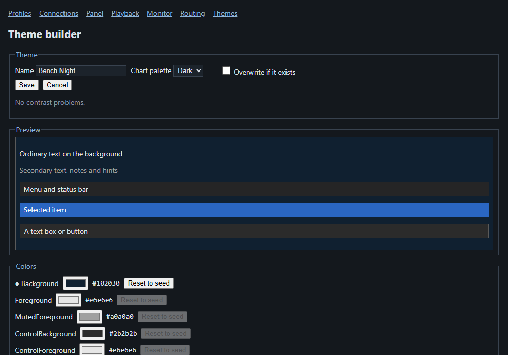
