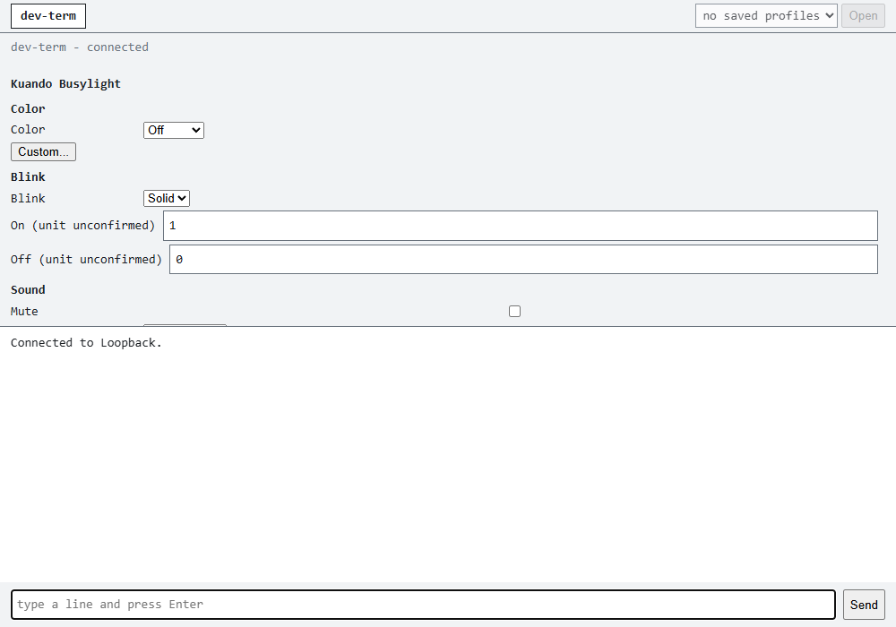
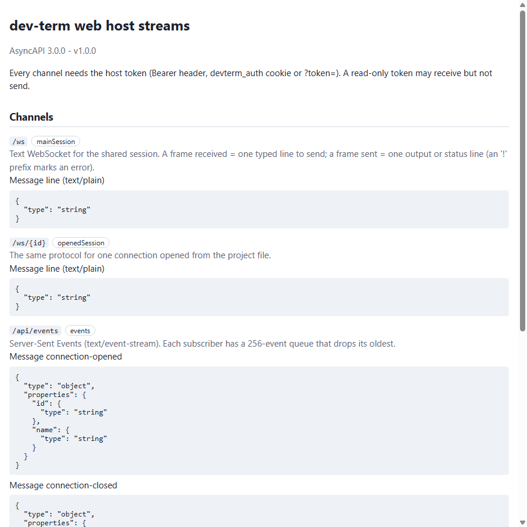
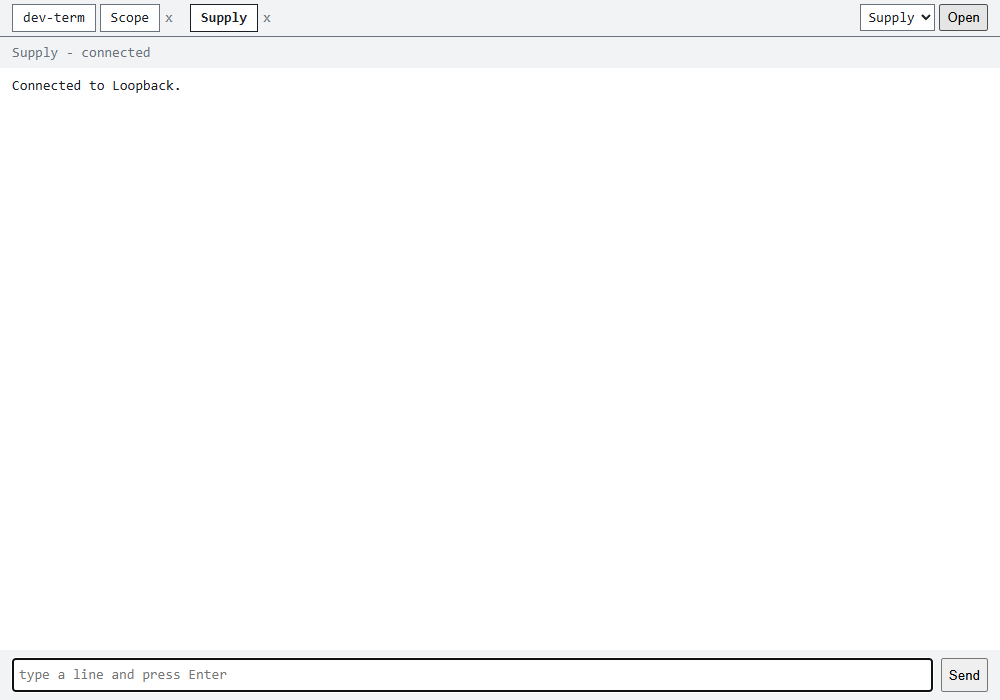
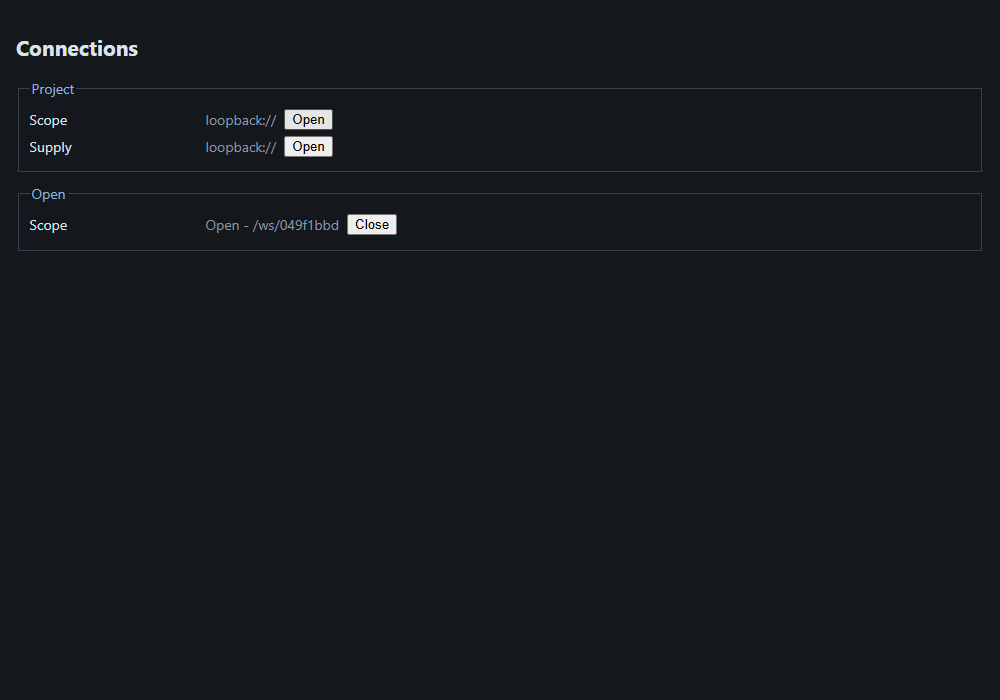
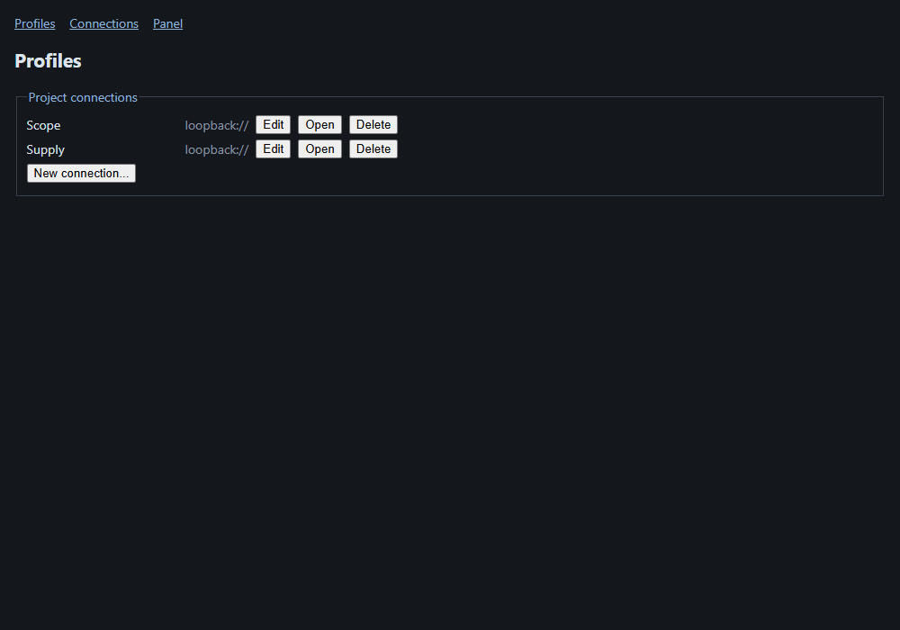
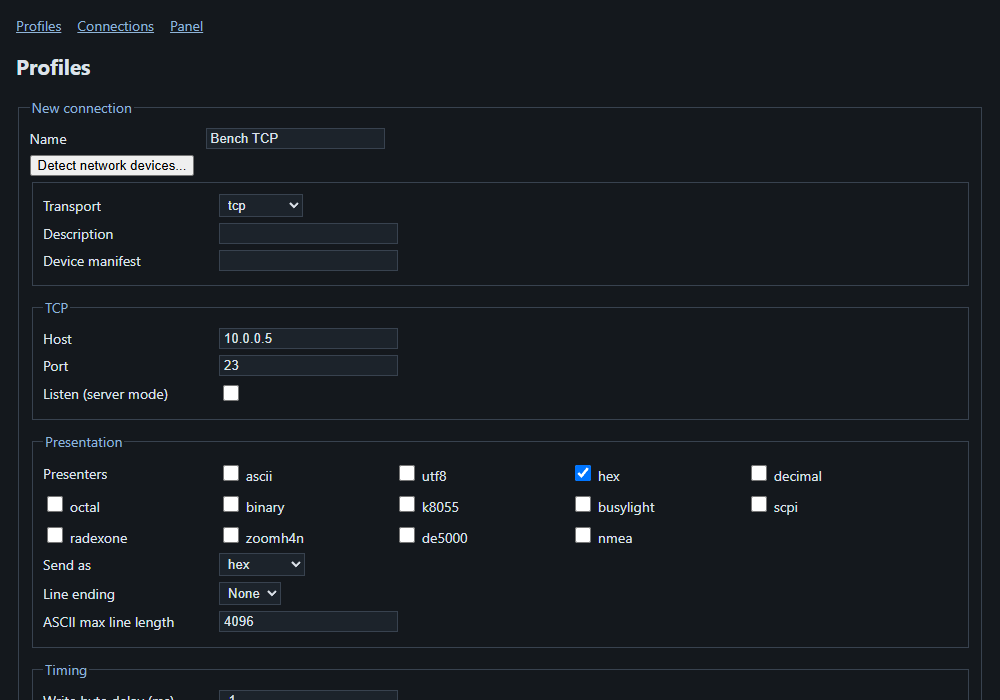
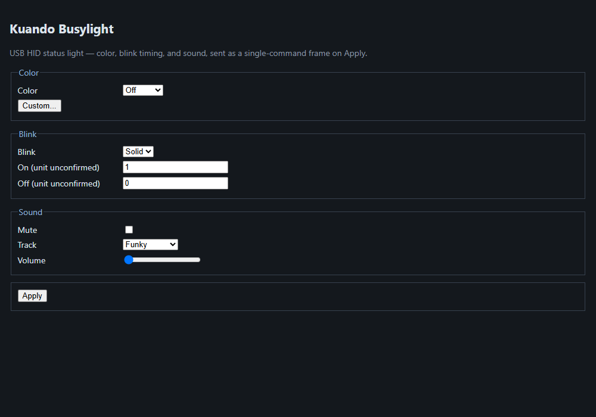
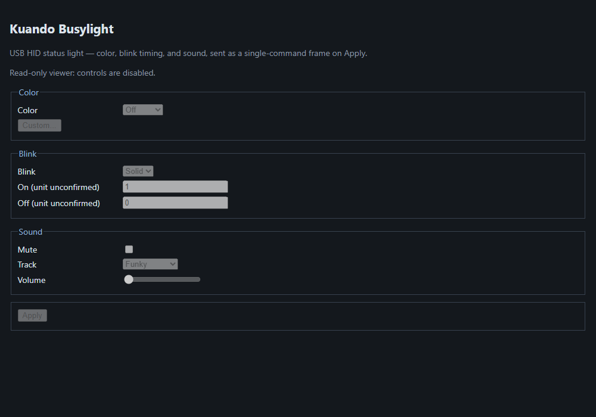

# Using dev-term from a browser

Run the web host with the same connection flags as the console app:

```
dotnet run --project src/DevTerm.Web -- --transport loopback --presenter ascii --Web:Token demo-token
dev-term web: http://127.0.0.1:5080/?token=demo-token
```

Open that URL. The token is exchanged for a cookie and you land on the terminal page; type `hello` and the reply
appears. Real captured checks of the access rules (see `WebHostTests`):

```
GET /                      (no token)            -> 401
GET /api/status            (Bearer demo-token)   -> {"state":"Open","connection":"Loopback"}
GET /?token=demo-token                           -> 302 to /, cookie set
--Web:Urls http://0.0.0.0:5081                   -> 'http://0.0.0.0:5081' is not loopback, so it must use https.
```

Set `Web:Panel` to `k8055` or `busylight` and the page shows that device's control panel above the output, rendered from its
`UiDefinition` (buttons, toggles, sliders, numeric, choice and text fields; indicators show live values when the panel's presenter is selected; bar graphs and charts are listed as not
shown yet). Give a colleague `Web:ReadOnlyToken` and they see the same page with every control disabled, and typed lines are refused.



It listens on loopback only unless you set `Web:AllowRemote`, `Web:Token`, `Web:CertificatePath` and an `https` URL.
Every browser tab shares the one session. Field reference: [web terminal spec](../specs/web-terminal.md).

## Opening project connections, devices and events

With `--project <file>` the host can open the project's other connections as extra sessions. Real output from a run with a
one-connection project (`Sim`, loopback), every call sent with `Authorization: Bearer demo-token`:

```
GET    /api/project                 -> [{"name":"Sim","description":"loopback://"}]
POST   /api/connections?name=Sim    -> {"id":"5dea72d2","name":"Sim"}
GET    /api/connections             -> [{"id":"5dea72d2","name":"Sim","state":"Open"}]
DELETE /api/connections/5dea72d2    -> 204
GET    /api/devices                 -> {"serial":[],"hid":[{"id":"046D:C08B","vendorId":1133,"productId":49291,"name":"G502 HERO Gaming Mouse",...}],...}
```

Each opened connection is its own session at `/ws/<id>`. `GET /api/events` stays open and pushes what happens, so a page
does not have to poll (a read-only viewer can watch it but cannot open or close connections):

```
: connected

event: connection-closed
data: {"id":"5dea72d2"}
```

### Editing the project

A host started with `--project <file>` can also add, replace and remove the project's connections. Real output, same host and token
(the second call is a profile that fails validation, and nothing is written for it):

```
PUT    /api/project/connections/Lab  {"Transport":"tcp","Host":"10.0.0.5","Port":23}  -> 204
PUT    /api/project/connections/Bad  {"Transport":"tcp"}  -> 400 {"error":"Missing or invalid '--port' for the TCP transport (expected 1-65535)."}
GET    /api/project                  -> [{"name":"Sim","description":"loopback://"},{"name":"Lab","description":"tcp://10.0.0.5:23"}]
DELETE /api/project/connections/Lab  -> 204
GET    /api/project                  -> [{"name":"Sim","description":"loopback://"}]
```

A new connection can then be opened with `POST /api/connections?name=Lab`.

### Browsing the API

`/scalar/v1` is an interactive reference for the REST endpoints (try a call from the page), `/openapi/v1.json` is the same
document for tooling, and `/asyncapi.json` describes the WebSocket and event-stream channels that OpenAPI cannot. `/asyncapi` shows that document as a page:



 They need
the same token as everything else, so open them after `?token=` has set the cookie.

### Several sessions in tabs

The main page works like the desktop apps: the host's own session is the **dev-term** tab, and picking a saved profile and pressing **Open** adds a tab for it. Tabs keep their own output, so you can switch between a scope and a supply without losing either; **x** closes one. Opening or closing one elsewhere (another browser tab, `/connections`, the REST calls) shows up here too.



### The /connections page

Open `/connections` for the same thing as buttons: **Open** starts a project connection as its own session, **Close** ends it.
Opening one over the REST call or in another tab updates the list live. A read-only token sees the page with the buttons disabled.



### The /profiles page

Open `/profiles` to add, change and remove the project's connections without writing JSON. **New connection...** opens the same
form the desktop Connection Editor uses (pick a Transport and only its fields appear); **Detect network devices...** lists
instruments and services found on the LAN and fills in the address when you pick one. **Save** checks the profile and writes it
into the project file, or shows what is wrong (for example a missing port). **Delete** asks once more on the row before removing.
**Open** starts the connection, as on `/connections`. A read-only token sees the list but cannot change anything. Without `--project` the list is your saved profiles, the same ones the TUI and WPF show, so a profile made in any of them appears in all.





### Sending commands from a script

`--controlhttp 5090 --controltoken ctl` adds a second, command-only door on the shared session, with a token of its own:

```
POST http://127.0.0.1:5090/command  (Bearer ctl)  body "ping"  -> ok
GET  http://127.0.0.1:5090/ping     (no token)                  -> 401
```

## The Blazor panel page

With `--Web:Panel busylight` (or `k8055`), open `/panel` for a server-rendered control panel; it is the same panel the main page shows, using the same token. A read-only token shows it with the controls disabled.





These are real browser captures taken by `WebScreenshotTests`, which drives the installed Microsoft Edge through Playwright (Integration; Inconclusive without Edge), so re-run that class when the page changes.
